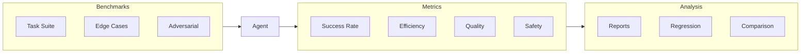

# Agent Evaluation

Build comprehensive testing and evaluation frameworks for AI agents

## What You'll Learn

- Designing agent evaluation benchmarks
- Measuring task completion and quality
- Testing agent robustness and safety
- Continuous evaluation in production

## Tech Stack

| Component | Technology |
|-----------|------------|
| Testing | pytest + custom |
| Metrics | Custom framework |
| Tracing | LangSmith |
| Monitoring | Prometheus |

## Evaluation Framework



## Project Structure

```
agent-evaluation/
├── src/
│   ├── __init__.py
│   ├── benchmarks/
│   │   ├── __init__.py
│   │   ├── task_suite.py      # Standard tasks
│   │   ├── edge_cases.py      # Edge case tests
│   │   └── adversarial.py     # Adversarial tests
│   ├── metrics/
│   │   ├── __init__.py
│   │   ├── success.py         # Success metrics
│   │   ├── efficiency.py      # Cost/time metrics
│   │   └── quality.py         # Output quality
│   ├── evaluator.py           # Main evaluator
│   └── reporter.py            # Results reporting
├── tests/
├── benchmarks/                 # Benchmark data
└── requirements.txt
```

## Implementation

### Step 1: Setup

```python title="requirements.txt"
openai>=1.0.0
langchain>=0.1.0
pytest>=7.0.0
pandas>=2.0.0
numpy>=1.24.0
langsmith>=0.0.60
pydantic>=2.0.0
rich>=13.0.0
```

### Step 2: Benchmark Definition

```python title="src/benchmarks/__init__.py"
"""
Benchmark definitions for agent evaluation.
"""

from dataclasses import dataclass, field
from typing import Optional, Callable, Any
from enum import Enum


class Difficulty(Enum):
    EASY = "easy"
    MEDIUM = "medium"
    HARD = "hard"


class Category(Enum):
    RESEARCH = "research"
    REASONING = "reasoning"
    CODING = "coding"
    WRITING = "writing"
    MATH = "math"
    MULTI_STEP = "multi_step"


@dataclass
class BenchmarkTask:
    """A single evaluation task."""
    id: str
    name: str
    description: str
    input: str
    expected_output: Optional[str] = None
    validation_fn: Optional[Callable[[str], bool]] = None
    category: Category = Category.REASONING
    difficulty: Difficulty = Difficulty.MEDIUM
    max_time_seconds: int = 60
    required_tools: list[str] = field(default_factory=list)
    metadata: dict = field(default_factory=dict)


@dataclass
class BenchmarkResult:
    """Result of running a benchmark task."""
    task_id: str
    success: bool
    output: str
    time_seconds: float
    tokens_used: int
    tool_calls: int
    error: Optional[str] = None
    score: float = 0.0  # 0-1 quality score


class BenchmarkSuite:
    """Collection of benchmark tasks."""
    
    def __init__(self, name: str):
        self.name = name
        self.tasks: list[BenchmarkTask] = []
    
    def add_task(self, task: BenchmarkTask) -> None:
        self.tasks.append(task)
    
    def get_by_category(self, category: Category) -> list[BenchmarkTask]:
        return [t for t in self.tasks if t.category == category]
    
    def get_by_difficulty(self, difficulty: Difficulty) -> list[BenchmarkTask]:
        return [t for t in self.tasks if t.difficulty == difficulty]
```

### Step 3: Task Suite

```python title="src/benchmarks/task_suite.py"
"""
Standard benchmark tasks for agent evaluation.
"""

from . import BenchmarkTask, BenchmarkSuite, Category, Difficulty


def create_standard_suite() -> BenchmarkSuite:
    """Create the standard evaluation benchmark suite."""
    suite = BenchmarkSuite("standard")
    
    # Research tasks
    suite.add_task(BenchmarkTask(
        id="research_001",
        name="Simple Fact Lookup",
        description="Find a simple factual answer",
        input="What is the capital of France?",
        expected_output="Paris",
        validation_fn=lambda x: "paris" in x.lower(),
        category=Category.RESEARCH,
        difficulty=Difficulty.EASY,
        max_time_seconds=30
    ))
    
    suite.add_task(BenchmarkTask(
        id="research_002",
        name="Multi-fact Research",
        description="Combine multiple facts",
        input="Who created Python and what year was it first released?",
        validation_fn=lambda x: "guido" in x.lower() and ("1991" in x or "1989" in x),
        category=Category.RESEARCH,
        difficulty=Difficulty.MEDIUM,
        max_time_seconds=60
    ))
    
    # Reasoning tasks
    suite.add_task(BenchmarkTask(
        id="reasoning_001",
        name="Simple Logic",
        description="Basic logical reasoning",
        input="If all cats are mammals, and Whiskers is a cat, is Whiskers a mammal?",
        validation_fn=lambda x: "yes" in x.lower() or "mammal" in x.lower(),
        category=Category.REASONING,
        difficulty=Difficulty.EASY
    ))
    
    suite.add_task(BenchmarkTask(
        id="reasoning_002",
        name="Multi-step Reasoning",
        description="Chain of reasoning steps",
        input="""
        Alice is taller than Bob.
        Bob is taller than Charlie.
        David is shorter than Charlie.
        Who is the tallest?
        """,
        validation_fn=lambda x: "alice" in x.lower(),
        category=Category.REASONING,
        difficulty=Difficulty.MEDIUM
    ))
    
    # Math tasks
    suite.add_task(BenchmarkTask(
        id="math_001",
        name="Basic Calculation",
        description="Simple arithmetic",
        input="What is 247 + 589?",
        expected_output="836",
        validation_fn=lambda x: "836" in x,
        category=Category.MATH,
        difficulty=Difficulty.EASY,
        required_tools=["calculate"]
    ))
    
    suite.add_task(BenchmarkTask(
        id="math_002",
        name="Word Problem",
        description="Math word problem",
        input="A store sells apples for $2 each. If I buy 15 apples and pay with $50, how much change do I get?",
        validation_fn=lambda x: "20" in x or "twenty" in x.lower(),
        category=Category.MATH,
        difficulty=Difficulty.MEDIUM
    ))
    
    # Multi-step tasks
    suite.add_task(BenchmarkTask(
        id="multi_001",
        name="Research and Calculate",
        description="Combine research with calculation",
        input="How many years ago was Python first released? (Current year is 2024)",
        validation_fn=lambda x: "33" in x or "35" in x,  # 1991 or 1989
        category=Category.MULTI_STEP,
        difficulty=Difficulty.MEDIUM,
        required_tools=["search", "calculate"]
    ))
    
    suite.add_task(BenchmarkTask(
        id="multi_002",
        name="Complex Research Task",
        description="Multi-step research and synthesis",
        input="Compare the population of Tokyo and New York City. Which is larger and by approximately how much?",
        validation_fn=lambda x: "tokyo" in x.lower() and any(c.isdigit() for c in x),
        category=Category.MULTI_STEP,
        difficulty=Difficulty.HARD,
        max_time_seconds=120
    ))
    
    return suite
```

### Step 4: Metrics

```python title="src/metrics/__init__.py"
"""
Evaluation metrics for agents.
"""

from dataclasses import dataclass
from typing import Optional
import numpy as np


@dataclass
class EvaluationMetrics:
    """Comprehensive evaluation metrics."""
    # Success metrics
    success_rate: float
    task_completion_rate: float
    
    # Efficiency metrics
    avg_time_seconds: float
    avg_tokens: int
    avg_tool_calls: float
    
    # Quality metrics
    avg_quality_score: float
    
    # Breakdown by category
    category_scores: dict[str, float]
    difficulty_scores: dict[str, float]
    
    # Failure analysis
    failure_reasons: dict[str, int]


def calculate_metrics(results: list) -> EvaluationMetrics:
    """Calculate comprehensive metrics from results."""
    if not results:
        return EvaluationMetrics(
            success_rate=0, task_completion_rate=0,
            avg_time_seconds=0, avg_tokens=0, avg_tool_calls=0,
            avg_quality_score=0, category_scores={}, 
            difficulty_scores={}, failure_reasons={}
        )
    
    successes = [r for r in results if r.success]
    
    # Success metrics
    success_rate = len(successes) / len(results)
    
    # Efficiency
    times = [r.time_seconds for r in results]
    tokens = [r.tokens_used for r in results]
    tools = [r.tool_calls for r in results]
    
    # Quality
    quality_scores = [r.score for r in results if r.score > 0]
    
    # Category breakdown
    category_scores = {}
    for r in results:
        cat = r.task_id.split("_")[0]
        if cat not in category_scores:
            category_scores[cat] = []
        category_scores[cat].append(1 if r.success else 0)
    
    category_scores = {k: np.mean(v) for k, v in category_scores.items()}
    
    # Failure analysis
    failure_reasons = {}
    for r in results:
        if not r.success and r.error:
            reason = r.error[:50]
            failure_reasons[reason] = failure_reasons.get(reason, 0) + 1
    
    return EvaluationMetrics(
        success_rate=success_rate,
        task_completion_rate=success_rate,
        avg_time_seconds=np.mean(times),
        avg_tokens=int(np.mean(tokens)),
        avg_tool_calls=np.mean(tools),
        avg_quality_score=np.mean(quality_scores) if quality_scores else 0,
        category_scores=category_scores,
        difficulty_scores={},
        failure_reasons=failure_reasons
    )
```

### Step 5: Evaluator

```python title="src/evaluator.py"
"""
Main agent evaluator.
"""

import time
from typing import Callable, Any
from dataclasses import dataclass

from .benchmarks import BenchmarkSuite, BenchmarkTask, BenchmarkResult
from .metrics import calculate_metrics, EvaluationMetrics


@dataclass
class EvaluationConfig:
    """Configuration for evaluation run."""
    timeout_per_task: int = 120
    retry_failed: bool = False
    max_retries: int = 1
    parallel: bool = False
    verbose: bool = True


class AgentEvaluator:
    """
    Evaluates agent performance on benchmark suites.
    """
    
    def __init__(
        self,
        agent_fn: Callable[[str], str],
        config: EvaluationConfig = None
    ):
        """
        Initialize evaluator.
        
        Args:
            agent_fn: Function that takes input string and returns output
            config: Evaluation configuration
        """
        self.agent_fn = agent_fn
        self.config = config or EvaluationConfig()
        self.results: list[BenchmarkResult] = []
    
    def evaluate(self, suite: BenchmarkSuite) -> EvaluationMetrics:
        """
        Run evaluation on a benchmark suite.
        
        Args:
            suite: The benchmark suite to evaluate
            
        Returns:
            Comprehensive evaluation metrics
        """
        self.results = []
        
        if self.config.verbose:
            print(f"\n📊 Evaluating on {suite.name} ({len(suite.tasks)} tasks)")
            print("=" * 50)
        
        for task in suite.tasks:
            result = self._evaluate_task(task)
            self.results.append(result)
            
            if self.config.verbose:
                status = "✅" if result.success else "❌"
                print(f"{status} {task.name}: {result.score:.2f}")
        
        metrics = calculate_metrics(self.results)
        
        if self.config.verbose:
            self._print_summary(metrics)
        
        return metrics
    
    def _evaluate_task(self, task: BenchmarkTask) -> BenchmarkResult:
        """Evaluate a single task."""
        start_time = time.time()
        
        try:
            # Run the agent
            output = self.agent_fn(task.input)
            elapsed = time.time() - start_time
            
            # Validate output
            success = False
            score = 0.0
            
            if task.validation_fn:
                success = task.validation_fn(output)
                score = 1.0 if success else 0.0
            elif task.expected_output:
                success = task.expected_output.lower() in output.lower()
                score = 1.0 if success else 0.0
            else:
                # No validation - assume success if we got output
                success = len(output) > 0
                score = 0.5
            
            return BenchmarkResult(
                task_id=task.id,
                success=success,
                output=output,
                time_seconds=elapsed,
                tokens_used=0,  # Would need agent to report this
                tool_calls=0,
                score=score
            )
            
        except Exception as e:
            return BenchmarkResult(
                task_id=task.id,
                success=False,
                output="",
                time_seconds=time.time() - start_time,
                tokens_used=0,
                tool_calls=0,
                error=str(e),
                score=0.0
            )
    
    def _print_summary(self, metrics: EvaluationMetrics) -> None:
        """Print evaluation summary."""
        print("\n" + "=" * 50)
        print("📈 EVALUATION SUMMARY")
        print("=" * 50)
        print(f"Success Rate: {metrics.success_rate:.1%}")
        print(f"Avg Time: {metrics.avg_time_seconds:.2f}s")
        print(f"Avg Quality: {metrics.avg_quality_score:.2f}")
        
        if metrics.category_scores:
            print("\nBy Category:")
            for cat, score in metrics.category_scores.items():
                print(f"  {cat}: {score:.1%}")
        
        if metrics.failure_reasons:
            print("\nTop Failure Reasons:")
            sorted_failures = sorted(
                metrics.failure_reasons.items(),
                key=lambda x: x[1],
                reverse=True
            )[:3]
            for reason, count in sorted_failures:
                print(f"  {reason}: {count}")
```

### Step 6: Reporter

```python title="src/reporter.py"
"""
Generate evaluation reports.
"""

from dataclasses import dataclass
from typing import Optional
import json
from datetime import datetime

from .metrics import EvaluationMetrics
from .benchmarks import BenchmarkResult


@dataclass
class EvaluationReport:
    """Complete evaluation report."""
    agent_name: str
    timestamp: str
    metrics: EvaluationMetrics
    results: list[BenchmarkResult]
    config: dict


class ReportGenerator:
    """Generate various report formats."""
    
    def __init__(self, agent_name: str):
        self.agent_name = agent_name
    
    def generate(
        self,
        metrics: EvaluationMetrics,
        results: list[BenchmarkResult],
        config: dict = None
    ) -> EvaluationReport:
        """Generate a complete evaluation report."""
        return EvaluationReport(
            agent_name=self.agent_name,
            timestamp=datetime.now().isoformat(),
            metrics=metrics,
            results=results,
            config=config or {}
        )
    
    def to_markdown(self, report: EvaluationReport) -> str:
        """Generate markdown report."""
        md = f"""# Agent Evaluation Report

**Agent:** {report.agent_name}
**Date:** {report.timestamp}

## Summary Metrics

| Metric | Value |
|--------|-------|
| Success Rate | {report.metrics.success_rate:.1%} |
| Avg Time | {report.metrics.avg_time_seconds:.2f}s |
| Avg Quality | {report.metrics.avg_quality_score:.2f} |

## Category Breakdown

| Category | Success Rate |
|----------|--------------|
"""
        for cat, score in report.metrics.category_scores.items():
            md += f"| {cat} | {score:.1%} |\n"
        
        md += "\n## Individual Results\n\n"
        
        for r in report.results:
            status = "✅" if r.success else "❌"
            md += f"- {status} **{r.task_id}**: {r.score:.2f} ({r.time_seconds:.1f}s)\n"
        
        return md
    
    def to_json(self, report: EvaluationReport) -> str:
        """Generate JSON report."""
        return json.dumps({
            "agent_name": report.agent_name,
            "timestamp": report.timestamp,
            "metrics": {
                "success_rate": report.metrics.success_rate,
                "avg_time": report.metrics.avg_time_seconds,
                "avg_quality": report.metrics.avg_quality_score,
                "category_scores": report.metrics.category_scores
            },
            "results": [
                {
                    "task_id": r.task_id,
                    "success": r.success,
                    "score": r.score,
                    "time": r.time_seconds
                }
                for r in report.results
            ]
        }, indent=2)
```

## Running Evaluations

```python
from src.evaluator import AgentEvaluator, EvaluationConfig
from src.benchmarks.task_suite import create_standard_suite
from src.reporter import ReportGenerator

# Your agent function
def my_agent(input_text: str) -> str:
    # Your agent implementation
    return agent.run(input_text)

# Create evaluator
evaluator = AgentEvaluator(
    agent_fn=my_agent,
    config=EvaluationConfig(verbose=True)
)

# Run evaluation
suite = create_standard_suite()
metrics = evaluator.evaluate(suite)

# Generate report
reporter = ReportGenerator("MyAgent v1.0")
report = reporter.generate(metrics, evaluator.results)
print(reporter.to_markdown(report))
```

## Key Metrics

| Metric | Description | Target |
|--------|-------------|--------|
| Success Rate | Tasks completed correctly | > 80% |
| Avg Time | Time per task | < 30s |
| Quality Score | Output quality rating | > 0.8 |
| Tool Efficiency | Tools used per task | < 5 |

## Summary

You've built a comprehensive agent evaluation framework that:

- Defines standardized benchmark tasks
- Measures success, efficiency, and quality
- Generates detailed reports
- Enables regression testing across agent versions
