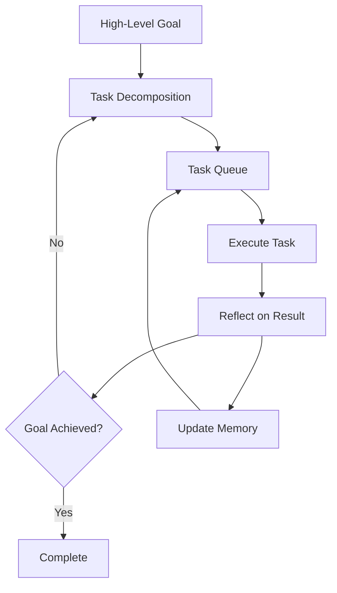

# Autonomous Agent

Create agents that autonomously decompose and pursue complex goals

## What You'll Learn

- Goal decomposition and task generation
- Self-reflection and progress evaluation
- Long-running autonomous execution
- Safety controls and human oversight

## Tech Stack

| Component | Technology |
|-----------|------------|
| LLM | OpenAI GPT-4 |
| Framework | Custom / LangGraph |
| Memory | Vector Store + Redis |
| Execution | Sandboxed tools |

## Autonomous Agent Architecture



## Project Structure

```
autonomous-agent/
├── src/
│   ├── __init__.py
│   ├── agent.py           # Main autonomous agent
│   ├── decomposer.py      # Goal decomposition
│   ├── executor.py        # Task execution
│   ├── reflector.py       # Self-reflection
│   ├── memory.py          # Long-term memory
│   ├── tools.py           # Available tools
│   └── api.py
├── tests/
└── requirements.txt
```

## Implementation

### Step 1: Goal Decomposer

```python title="src/decomposer.py"
"""
Goal decomposition - breaks high-level goals into tasks.
"""

from dataclasses import dataclass, field
from typing import Optional
from openai import OpenAI
import json


@dataclass
class Task:
    """A single task to accomplish."""
    id: str
    description: str
    priority: int  # 1 = highest
    status: str = "pending"
    result: Optional[str] = None
    subtasks: list["Task"] = field(default_factory=list)


class GoalDecomposer:
    """
    Breaks down high-level goals into actionable tasks.
    
    Uses recursive decomposition for complex goals.
    """
    
    def __init__(self, model: str = "gpt-4-turbo-preview"):
        self.client = OpenAI()
        self.model = model
        self.task_counter = 0
    
    def decompose(
        self,
        goal: str,
        context: str = "",
        max_tasks: int = 10
    ) -> list[Task]:
        """
        Decompose a goal into tasks.
        
        Args:
            goal: The goal to achieve
            context: Additional context about progress
            max_tasks: Maximum number of tasks to generate
        """
        prompt = f"""Break down this goal into actionable tasks.

Goal: {goal}

Context/Progress so far:
{context or "Starting fresh - no progress yet."}

Rules:
1. Each task should be concrete and actionable
2. Tasks should be ordered by priority/dependency
3. Each task should be completable with available tools
4. Maximum {max_tasks} tasks

Available tools: search, calculate, write_file, read_file, code_execute, browse_web

Return JSON:
{{
  "tasks": [
    {{"description": "task description", "priority": 1}},
    ...
  ]
}}"""
        
        response = self.client.chat.completions.create(
            model=self.model,
            messages=[{"role": "user", "content": prompt}],
            response_format={"type": "json_object"}
        )
        
        data = json.loads(response.choices[0].message.content)
        
        tasks = []
        for t in data.get("tasks", []):
            self.task_counter += 1
            tasks.append(Task(
                id=f"task_{self.task_counter}",
                description=t["description"],
                priority=t.get("priority", len(tasks) + 1)
            ))
        
        return sorted(tasks, key=lambda x: x.priority)
    
    def should_decompose_further(self, task: Task) -> bool:
        """Check if a task needs further decomposition."""
        prompt = f"""Is this task simple enough to execute directly, or should it be broken into subtasks?

Task: {task.description}

Respond with just "SIMPLE" or "COMPLEX"."""
        
        response = self.client.chat.completions.create(
            model=self.model,
            messages=[{"role": "user", "content": prompt}],
            temperature=0
        )
        
        return "COMPLEX" in response.choices[0].message.content.upper()
```

### Step 2: Self-Reflection Module

```python title="src/reflector.py"
"""
Self-reflection - evaluates progress and adjusts strategy.
"""

from dataclasses import dataclass
from typing import Optional
from openai import OpenAI


@dataclass
class Reflection:
    """Result of self-reflection."""
    progress_summary: str
    goal_achieved: bool
    confidence: float  # 0-1
    next_steps: list[str]
    blockers: list[str]
    should_continue: bool


class Reflector:
    """
    Evaluates agent progress and provides strategic guidance.
    """
    
    def __init__(self, model: str = "gpt-4-turbo-preview"):
        self.client = OpenAI()
        self.model = model
    
    def reflect(
        self,
        goal: str,
        completed_tasks: list[dict],
        pending_tasks: list[str],
        recent_results: list[str]
    ) -> Reflection:
        """
        Reflect on progress toward the goal.
        """
        completed_summary = "\n".join([
            f"- {t['description']}: {t['result'][:100]}..."
            for t in completed_tasks[-5:]  # Last 5 tasks
        ]) or "No tasks completed yet."
        
        pending_summary = "\n".join([f"- {t}" for t in pending_tasks[:5]])
        
        prompt = f"""Evaluate progress toward this goal:

GOAL: {goal}

COMPLETED TASKS:
{completed_summary}

PENDING TASKS:
{pending_summary}

RECENT RESULTS:
{chr(10).join(recent_results[-3:]) if recent_results else "None yet"}

Analyze:
1. What progress has been made?
2. Is the goal achieved? (be conservative)
3. What are the next most important steps?
4. Are there any blockers?
5. Should we continue or stop?

Respond in this format:
PROGRESS: [summary]
GOAL_ACHIEVED: [YES/NO]
CONFIDENCE: [0.0-1.0]
NEXT_STEPS: [comma-separated list]
BLOCKERS: [comma-separated list or "none"]
CONTINUE: [YES/NO]"""
        
        response = self.client.chat.completions.create(
            model=self.model,
            messages=[{"role": "user", "content": prompt}],
            temperature=0.3
        )
        
        return self._parse_reflection(response.choices[0].message.content)
    
    def _parse_reflection(self, text: str) -> Reflection:
        """Parse reflection response."""
        lines = text.strip().split("\n")
        result = {}
        
        for line in lines:
            if ":" in line:
                key, value = line.split(":", 1)
                result[key.strip().upper()] = value.strip()
        
        return Reflection(
            progress_summary=result.get("PROGRESS", ""),
            goal_achieved=result.get("GOAL_ACHIEVED", "NO").upper() == "YES",
            confidence=float(result.get("CONFIDENCE", "0.5")),
            next_steps=[s.strip() for s in result.get("NEXT_STEPS", "").split(",") if s.strip()],
            blockers=[b.strip() for b in result.get("BLOCKERS", "none").split(",") if b.strip() and b.lower() != "none"],
            should_continue=result.get("CONTINUE", "YES").upper() == "YES"
        )
```

### Step 3: Autonomous Agent

```python title="src/agent.py"
"""
Autonomous agent that pursues goals independently.
"""

from dataclasses import dataclass, field
from typing import Optional, Callable
from datetime import datetime
import time

from .decomposer import GoalDecomposer, Task
from .reflector import Reflector, Reflection
from .executor import TaskExecutor


@dataclass
class AgentState:
    """Current state of the autonomous agent."""
    goal: str
    tasks: list[Task] = field(default_factory=list)
    completed_tasks: list[dict] = field(default_factory=list)
    reflections: list[Reflection] = field(default_factory=list)
    iterations: int = 0
    start_time: float = field(default_factory=time.time)
    status: str = "running"


@dataclass
class AutonomousResult:
    """Final result from autonomous execution."""
    goal: str
    achieved: bool
    summary: str
    tasks_completed: int
    iterations: int
    duration_seconds: float


class AutonomousAgent:
    """
    An agent that autonomously works toward a goal.
    
    The agent:
    1. Decomposes the goal into tasks
    2. Executes tasks one by one
    3. Reflects on progress periodically
    4. Adjusts strategy based on reflection
    5. Continues until goal is achieved or limits reached
    """
    
    def __init__(
        self,
        max_iterations: int = 50,
        max_time_seconds: int = 600,  # 10 minutes
        reflection_interval: int = 5,  # Reflect every N tasks
        human_approval_callback: Optional[Callable] = None
    ):
        self.decomposer = GoalDecomposer()
        self.executor = TaskExecutor()
        self.reflector = Reflector()
        
        self.max_iterations = max_iterations
        self.max_time_seconds = max_time_seconds
        self.reflection_interval = reflection_interval
        self.human_approval = human_approval_callback
    
    def run(self, goal: str) -> AutonomousResult:
        """
        Autonomously pursue a goal.
        
        Args:
            goal: The high-level goal to achieve
            
        Returns:
            Result with achievement status and summary
        """
        state = AgentState(goal=goal)
        
        # Initial task decomposition
        state.tasks = self.decomposer.decompose(goal)
        
        print(f"\n🎯 Goal: {goal}")
        print(f"📋 Initial tasks: {len(state.tasks)}")
        
        while self._should_continue(state):
            state.iterations += 1
            
            # Get next task
            task = self._get_next_task(state)
            if not task:
                # No more tasks - check if we need more
                reflection = self._reflect(state)
                if reflection.goal_achieved:
                    state.status = "achieved"
                    break
                elif reflection.next_steps:
                    # Generate new tasks from reflection
                    new_tasks = self.decomposer.decompose(
                        goal,
                        context=self._get_context(state)
                    )
                    state.tasks.extend(new_tasks)
                else:
                    state.status = "stuck"
                    break
                continue
            
            # Execute task
            print(f"\n▶️ [{state.iterations}] {task.description}")
            result = self.executor.execute(task)
            
            task.status = "completed" if result.success else "failed"
            task.result = result.output
            
            state.completed_tasks.append({
                "description": task.description,
                "result": result.output,
                "success": result.success
            })
            
            print(f"   {'✅' if result.success else '❌'} {result.output[:100]}...")
            
            # Periodic reflection
            if state.iterations % self.reflection_interval == 0:
                reflection = self._reflect(state)
                state.reflections.append(reflection)
                
                if reflection.goal_achieved:
                    state.status = "achieved"
                    break
                
                # Check for human approval if configured
                if self.human_approval and not self.human_approval(state, reflection):
                    state.status = "stopped_by_human"
                    break
        
        # Final reflection
        final_reflection = self._reflect(state)
        
        return AutonomousResult(
            goal=goal,
            achieved=final_reflection.goal_achieved,
            summary=final_reflection.progress_summary,
            tasks_completed=len(state.completed_tasks),
            iterations=state.iterations,
            duration_seconds=time.time() - state.start_time
        )
    
    def _should_continue(self, state: AgentState) -> bool:
        """Check if agent should continue running."""
        if state.status != "running":
            return False
        if state.iterations >= self.max_iterations:
            state.status = "max_iterations"
            return False
        if time.time() - state.start_time > self.max_time_seconds:
            state.status = "timeout"
            return False
        return True
    
    def _get_next_task(self, state: AgentState) -> Optional[Task]:
        """Get the next pending task."""
        for task in state.tasks:
            if task.status == "pending":
                return task
        return None
    
    def _reflect(self, state: AgentState) -> Reflection:
        """Trigger reflection on current progress."""
        pending = [t.description for t in state.tasks if t.status == "pending"]
        recent = [t["result"] for t in state.completed_tasks[-3:]]
        
        return self.reflector.reflect(
            goal=state.goal,
            completed_tasks=state.completed_tasks,
            pending_tasks=pending,
            recent_results=recent
        )
    
    def _get_context(self, state: AgentState) -> str:
        """Build context string from current state."""
        completed = "\n".join([
            f"- {t['description']}: {t['result'][:50]}..."
            for t in state.completed_tasks[-5:]
        ])
        return f"Completed tasks:\n{completed}"
```

### Step 4: Task Executor

```python title="src/executor.py"
"""Task execution with sandboxed tools."""

from dataclasses import dataclass
from typing import Optional
import httpx


@dataclass
class ExecutionResult:
    success: bool
    output: str


class TaskExecutor:
    """Execute tasks using available tools."""
    
    def __init__(self):
        self.tools = {
            "search": self._search,
            "calculate": self._calculate,
            "write": self._write,
            "analyze": self._analyze
        }
    
    def execute(self, task) -> ExecutionResult:
        """Execute a task by selecting and running appropriate tool."""
        # Determine which tool to use based on task description
        tool_name = self._select_tool(task.description)
        
        if tool_name and tool_name in self.tools:
            try:
                result = self.tools[tool_name](task.description)
                return ExecutionResult(success=True, output=result)
            except Exception as e:
                return ExecutionResult(success=False, output=str(e))
        
        return ExecutionResult(
            success=True,
            output=f"Completed: {task.description}"
        )
    
    def _select_tool(self, description: str) -> Optional[str]:
        """Select appropriate tool for task."""
        desc_lower = description.lower()
        if any(w in desc_lower for w in ["search", "find", "research", "look up"]):
            return "search"
        if any(w in desc_lower for w in ["calculate", "compute", "math"]):
            return "calculate"
        if any(w in desc_lower for w in ["write", "create", "draft"]):
            return "write"
        if any(w in desc_lower for w in ["analyze", "review", "evaluate"]):
            return "analyze"
        return None
    
    def _search(self, query: str) -> str:
        try:
            words = query.split()[:3]
            search_term = "_".join(words)
            url = f"https://en.wikipedia.org/api/rest_v1/page/summary/{search_term}"
            response = httpx.get(url, timeout=10.0)
            if response.status_code == 200:
                return response.json().get("extract", "No results")[:300]
            return "No search results found"
        except Exception as e:
            return f"Search completed with notes: {query[:100]}"
    
    def _calculate(self, expression: str) -> str:
        import re
        numbers = re.findall(r'\d+', expression)
        if numbers:
            return f"Calculation result: {sum(int(n) for n in numbers)}"
        return "Calculation completed"
    
    def _write(self, content: str) -> str:
        return f"Content drafted: {content[:100]}..."
    
    def _analyze(self, subject: str) -> str:
        return f"Analysis completed for: {subject[:100]}..."
```

## Safety Controls

```python
# Human-in-the-loop approval
def require_approval(state, reflection):
    """Prompt human for approval to continue."""
    print(f"\n🔔 Agent requesting approval to continue")
    print(f"   Progress: {reflection.progress_summary}")
    print(f"   Confidence: {reflection.confidence:.0%}")
    
    response = input("Continue? (y/n): ")
    return response.lower() == 'y'

# Use with agent
agent = AutonomousAgent(
    max_iterations=20,
    human_approval_callback=require_approval
)
```

## Next Steps

- **[Agent Evaluation](/docs/agents/advanced/agent-evaluation)** - Test and evaluate agents
