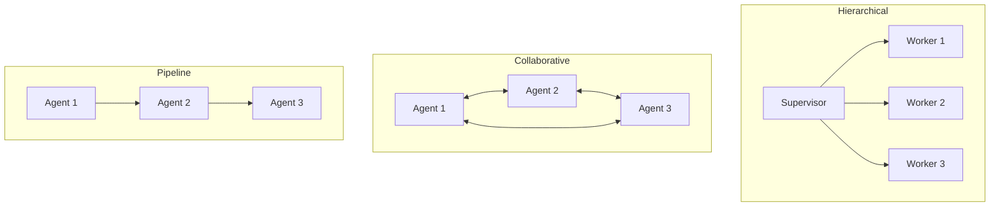

# Multi-Agent System

Orchestrate multiple AI agents that work together on complex tasks

## What You'll Learn

- Multi-agent architectures and patterns
- Agent specialization and role assignment
- Inter-agent communication protocols
- Supervisor and worker patterns with LangGraph

## Tech Stack

| Component | Technology |
|-----------|------------|
| Framework | LangGraph |
| LLM | OpenAI GPT-4 |
| Orchestration | Custom supervisor |
| Communication | Message passing |

## Multi-Agent Patterns



## Project Structure

```
multi-agent-system/
├── src/
│   ├── __init__.py
│   ├── agents/
│   │   ├── __init__.py
│   │   ├── researcher.py      # Research agent
│   │   ├── writer.py          # Writing agent
│   │   ├── critic.py          # Review agent
│   │   └── coder.py           # Coding agent
│   ├── supervisor.py          # Agent orchestration
│   ├── graph.py               # LangGraph workflow
│   └── api.py
├── tests/
└── requirements.txt
```

## Implementation

### Step 1: Setup

```python title="requirements.txt"
openai>=1.0.0
langchain>=0.1.0
langchain-openai>=0.0.5
langgraph>=0.0.40
pydantic>=2.0.0
fastapi>=0.100.0
uvicorn>=0.23.0
```

### Step 2: Base Agent Class

```python title="src/agents/__init__.py"
"""
Base agent class and shared utilities.
"""

from abc import ABC, abstractmethod
from dataclasses import dataclass
from typing import Optional, Any
from openai import OpenAI


@dataclass
class AgentMessage:
    """Message passed between agents."""
    sender: str
    content: str
    metadata: dict = None
    
    def __post_init__(self):
        if self.metadata is None:
            self.metadata = {}


@dataclass
class AgentResponse:
    """Response from an agent."""
    agent_name: str
    content: str
    status: str  # "complete", "needs_help", "error"
    next_agent: Optional[str] = None


class BaseAgent(ABC):
    """Base class for all agents in the system."""
    
    def __init__(
        self,
        name: str,
        model: str = "gpt-4-turbo-preview",
        temperature: float = 0.7
    ):
        self.name = name
        self.model = model
        self.temperature = temperature
        self.client = OpenAI()
        self.system_prompt = self._get_system_prompt()
    
    @abstractmethod
    def _get_system_prompt(self) -> str:
        """Return the agent's system prompt."""
        pass
    
    @abstractmethod
    def process(self, message: AgentMessage, context: dict) -> AgentResponse:
        """Process a message and return a response."""
        pass
    
    def _call_llm(self, messages: list[dict]) -> str:
        """Call the LLM with messages."""
        response = self.client.chat.completions.create(
            model=self.model,
            messages=[
                {"role": "system", "content": self.system_prompt},
                *messages
            ],
            temperature=self.temperature
        )
        return response.choices[0].message.content
```

### Step 3: Specialized Agents

```python title="src/agents/researcher.py"
"""Research agent - gathers information."""

from . import BaseAgent, AgentMessage, AgentResponse
import httpx


class ResearcherAgent(BaseAgent):
    """Agent specialized in research and information gathering."""
    
    def __init__(self):
        super().__init__(name="researcher")
    
    def _get_system_prompt(self) -> str:
        return """You are a Research Agent specialized in gathering information.

Your responsibilities:
1. Analyze research requests and identify key topics
2. Search for relevant information
3. Summarize findings clearly and accurately
4. Cite sources when possible

When you need more specific research, indicate what's needed.
When research is complete, summarize your findings."""

    def process(self, message: AgentMessage, context: dict) -> AgentResponse:
        # Extract research query
        query = message.content
        
        # Perform search (simplified - use real search API in production)
        search_results = self._search(query)
        
        # Have LLM synthesize findings
        synthesis_prompt = f"""Research request: {query}

Search results:
{search_results}

Provide a comprehensive research summary. If more research is needed, specify what."""
        
        response = self._call_llm([{"role": "user", "content": synthesis_prompt}])
        
        # Determine if research is complete
        needs_more = "need more" in response.lower() or "further research" in response.lower()
        
        return AgentResponse(
            agent_name=self.name,
            content=response,
            status="needs_help" if needs_more else "complete",
            next_agent="supervisor" if needs_more else None
        )
    
    def _search(self, query: str) -> str:
        """Search for information."""
        try:
            url = f"https://en.wikipedia.org/api/rest_v1/page/summary/{query.replace(' ', '_')}"
            response = httpx.get(url, timeout=10.0)
            if response.status_code == 200:
                data = response.json()
                return f"Wikipedia: {data.get('extract', 'No results')}"
            return "No search results found."
        except Exception as e:
            return f"Search error: {e}"
```

```python title="src/agents/writer.py"
"""Writer agent - creates content."""

from . import BaseAgent, AgentMessage, AgentResponse


class WriterAgent(BaseAgent):
    """Agent specialized in writing and content creation."""
    
    def __init__(self):
        super().__init__(name="writer")
    
    def _get_system_prompt(self) -> str:
        return """You are a Writer Agent specialized in creating content.

Your responsibilities:
1. Transform research and information into well-written content
2. Adapt tone and style to the requested format
3. Structure content logically with clear sections
4. Request clarification or more research if needed

Output formats you support:
- Blog posts
- Technical documentation
- Reports
- Summaries"""

    def process(self, message: AgentMessage, context: dict) -> AgentResponse:
        # Get research context if available
        research = context.get("research", "")
        format_type = context.get("format", "article")
        
        writing_prompt = f"""Task: {message.content}

Research/Context provided:
{research}

Write a {format_type} based on this information.
If you need more information or research, specify what's missing."""
        
        response = self._call_llm([{"role": "user", "content": writing_prompt}])
        
        needs_more = "need more" in response.lower() or "missing" in response.lower()
        
        return AgentResponse(
            agent_name=self.name,
            content=response,
            status="needs_help" if needs_more else "complete",
            next_agent="researcher" if needs_more else "critic"
        )
```

```python title="src/agents/critic.py"
"""Critic agent - reviews and improves content."""

from . import BaseAgent, AgentMessage, AgentResponse


class CriticAgent(BaseAgent):
    """Agent specialized in reviewing and critiquing work."""
    
    def __init__(self):
        super().__init__(name="critic", temperature=0.3)
    
    def _get_system_prompt(self) -> str:
        return """You are a Critic Agent specialized in reviewing content.

Your responsibilities:
1. Review content for accuracy, clarity, and completeness
2. Identify factual errors or inconsistencies
3. Suggest specific improvements
4. Approve content when it meets quality standards

Provide structured feedback with:
- Overall assessment (approve/needs_revision)
- Specific issues found
- Suggested improvements"""

    def process(self, message: AgentMessage, context: dict) -> AgentResponse:
        content_to_review = context.get("draft", message.content)
        original_request = context.get("original_request", "")
        
        review_prompt = f"""Review this content:

Original request: {original_request}

Content to review:
{content_to_review}

Provide your assessment. If approved, say "APPROVED". 
If revisions needed, specify exactly what to fix."""
        
        response = self._call_llm([{"role": "user", "content": review_prompt}])
        
        is_approved = "APPROVED" in response.upper()
        
        return AgentResponse(
            agent_name=self.name,
            content=response,
            status="complete" if is_approved else "needs_help",
            next_agent=None if is_approved else "writer"
        )
```

### Step 4: Supervisor Agent

```python title="src/supervisor.py"
"""
Supervisor that orchestrates multiple agents.
"""

from dataclasses import dataclass, field
from typing import Optional
from openai import OpenAI

from .agents import AgentMessage, AgentResponse
from .agents.researcher import ResearcherAgent
from .agents.writer import WriterAgent
from .agents.critic import CriticAgent


@dataclass
class WorkflowState:
    """Current state of the multi-agent workflow."""
    task: str
    current_agent: str
    messages: list[AgentMessage] = field(default_factory=list)
    context: dict = field(default_factory=dict)
    iterations: int = 0
    max_iterations: int = 10
    status: str = "running"


class Supervisor:
    """
    Orchestrates multiple agents to complete complex tasks.
    
    The supervisor:
    1. Analyzes the task and selects initial agent
    2. Routes messages between agents
    3. Maintains shared context
    4. Determines when task is complete
    """
    
    def __init__(self, model: str = "gpt-4-turbo-preview"):
        self.client = OpenAI()
        self.model = model
        
        # Initialize agents
        self.agents = {
            "researcher": ResearcherAgent(),
            "writer": WriterAgent(),
            "critic": CriticAgent()
        }
        
        self.routing_prompt = """You are a supervisor coordinating a team of AI agents.

Available agents:
- researcher: Gathers information and does research
- writer: Creates written content
- critic: Reviews and improves content

Given a task, decide which agent should handle it first.
Respond with just the agent name: researcher, writer, or critic"""

    def run(self, task: str) -> dict:
        """
        Run the multi-agent workflow on a task.
        
        Args:
            task: The task to complete
            
        Returns:
            Final result and workflow history
        """
        state = WorkflowState(
            task=task,
            current_agent=self._select_initial_agent(task),
            context={"original_request": task}
        )
        
        while state.status == "running" and state.iterations < state.max_iterations:
            state.iterations += 1
            
            # Get current agent
            agent = self.agents.get(state.current_agent)
            if not agent:
                state.status = "error"
                break
            
            # Create message for agent
            message = AgentMessage(
                sender="supervisor",
                content=state.task if state.iterations == 1 else self._get_latest_content(state)
            )
            
            # Process with agent
            response = agent.process(message, state.context)
            
            # Record the exchange
            state.messages.append(message)
            state.messages.append(AgentMessage(
                sender=response.agent_name,
                content=response.content
            ))
            
            # Update context based on agent
            self._update_context(state, response)
            
            # Check if complete
            if response.status == "complete" and response.next_agent is None:
                state.status = "complete"
            elif response.status == "complete" and response.next_agent == "critic":
                # Writer done, send to critic
                state.current_agent = "critic"
            elif response.next_agent:
                state.current_agent = response.next_agent
            else:
                state.status = "complete"
        
        return {
            "task": task,
            "status": state.status,
            "result": self._get_final_result(state),
            "iterations": state.iterations,
            "agents_used": list(set(m.sender for m in state.messages if m.sender != "supervisor"))
        }
    
    def _select_initial_agent(self, task: str) -> str:
        """Select the first agent to handle the task."""
        response = self.client.chat.completions.create(
            model=self.model,
            messages=[
                {"role": "system", "content": self.routing_prompt},
                {"role": "user", "content": f"Task: {task}"}
            ],
            temperature=0
        )
        
        agent_name = response.choices[0].message.content.strip().lower()
        return agent_name if agent_name in self.agents else "researcher"
    
    def _update_context(self, state: WorkflowState, response: AgentResponse) -> None:
        """Update shared context based on agent response."""
        if response.agent_name == "researcher":
            state.context["research"] = response.content
        elif response.agent_name == "writer":
            state.context["draft"] = response.content
        elif response.agent_name == "critic":
            state.context["review"] = response.content
    
    def _get_latest_content(self, state: WorkflowState) -> str:
        """Get the most recent content for the next agent."""
        if state.messages:
            return state.messages[-1].content
        return state.task
    
    def _get_final_result(self, state: WorkflowState) -> str:
        """Extract final result from state."""
        # Prefer approved draft, otherwise latest content
        if "draft" in state.context and "APPROVED" in state.context.get("review", "").upper():
            return state.context["draft"]
        return self._get_latest_content(state)
```

### Step 5: LangGraph Workflow

```python title="src/graph.py"
"""
LangGraph-based multi-agent workflow.
"""

from typing import TypedDict, Annotated, Sequence
from langgraph.graph import StateGraph, END
from langchain_core.messages import BaseMessage, HumanMessage, AIMessage
from langchain_openai import ChatOpenAI
import operator


class AgentState(TypedDict):
    """State shared across all agents."""
    messages: Annotated[Sequence[BaseMessage], operator.add]
    task: str
    research: str
    draft: str
    review: str
    next_agent: str
    iterations: int


def create_agent_graph():
    """Create a LangGraph workflow for multi-agent collaboration."""
    
    llm = ChatOpenAI(model="gpt-4-turbo-preview")
    
    def researcher_node(state: AgentState) -> dict:
        """Research agent node."""
        prompt = f"""You are a researcher. Research this topic and provide findings:
        
Task: {state['task']}

Provide comprehensive research findings."""
        
        response = llm.invoke([HumanMessage(content=prompt)])
        
        return {
            "messages": [AIMessage(content=f"[Researcher]: {response.content}")],
            "research": response.content,
            "next_agent": "writer",
            "iterations": state["iterations"] + 1
        }
    
    def writer_node(state: AgentState) -> dict:
        """Writer agent node."""
        prompt = f"""You are a writer. Create content based on this research:

Task: {state['task']}

Research:
{state['research']}

Write a well-structured article."""
        
        response = llm.invoke([HumanMessage(content=prompt)])
        
        return {
            "messages": [AIMessage(content=f"[Writer]: {response.content}")],
            "draft": response.content,
            "next_agent": "critic",
            "iterations": state["iterations"] + 1
        }
    
    def critic_node(state: AgentState) -> dict:
        """Critic agent node."""
        prompt = f"""You are a critic. Review this draft:

Original task: {state['task']}

Draft:
{state['draft']}

If the draft is good, respond with "APPROVED: [brief praise]"
If it needs work, provide specific feedback."""
        
        response = llm.invoke([HumanMessage(content=prompt)])
        
        is_approved = "APPROVED" in response.content.upper()
        
        return {
            "messages": [AIMessage(content=f"[Critic]: {response.content}")],
            "review": response.content,
            "next_agent": "end" if is_approved else "writer",
            "iterations": state["iterations"] + 1
        }
    
    def should_continue(state: AgentState) -> str:
        """Determine next node or end."""
        if state["iterations"] >= 6:
            return "end"
        return state["next_agent"]
    
    # Build the graph
    workflow = StateGraph(AgentState)
    
    workflow.add_node("researcher", researcher_node)
    workflow.add_node("writer", writer_node)
    workflow.add_node("critic", critic_node)
    
    workflow.set_entry_point("researcher")
    
    workflow.add_conditional_edges(
        "researcher",
        should_continue,
        {"writer": "writer", "end": END}
    )
    workflow.add_conditional_edges(
        "writer",
        should_continue,
        {"critic": "critic", "end": END}
    )
    workflow.add_conditional_edges(
        "critic",
        should_continue,
        {"writer": "writer", "end": END}
    )
    
    return workflow.compile()
```

### Step 6: API

```python title="src/api.py"
"""FastAPI application for multi-agent system."""

from fastapi import FastAPI
from pydantic import BaseModel

from .supervisor import Supervisor
from .graph import create_agent_graph


app = FastAPI(title="Multi-Agent System API")
supervisor = Supervisor()
agent_graph = create_agent_graph()


class TaskRequest(BaseModel):
    task: str
    use_langgraph: bool = False


class TaskResponse(BaseModel):
    task: str
    status: str
    result: str
    iterations: int
    agents_used: list[str]


@app.post("/execute", response_model=TaskResponse)
async def execute_task(request: TaskRequest):
    if request.use_langgraph:
        # Use LangGraph workflow
        result = agent_graph.invoke({
            "messages": [],
            "task": request.task,
            "research": "",
            "draft": "",
            "review": "",
            "next_agent": "researcher",
            "iterations": 0
        })
        
        return TaskResponse(
            task=request.task,
            status="complete",
            result=result["draft"],
            iterations=result["iterations"],
            agents_used=["researcher", "writer", "critic"]
        )
    else:
        # Use custom supervisor
        result = supervisor.run(request.task)
        
        return TaskResponse(
            task=request.task,
            status=result["status"],
            result=result["result"],
            iterations=result["iterations"],
            agents_used=result["agents_used"]
        )
```

## Running the System

```bash
export OPENAI_API_KEY="your-key"
uvicorn src.api:app --reload --port 8000
```

```bash
# Execute a multi-agent task
curl -X POST http://localhost:8000/execute \
  -H "Content-Type: application/json" \
  -d '{"task": "Write a blog post about the benefits of meditation"}'
```

## Multi-Agent Patterns

| Pattern | Use Case | Complexity |
|---------|----------|------------|
| **Supervisor** | Central coordination | Medium |
| **Pipeline** | Sequential processing | Low |
| **Collaborative** | Peer discussion | High |
| **Hierarchical** | Complex organizations | High |

## Next Steps

- **[Autonomous Agent](/docs/agents/advanced/autonomous-agent)** - Self-directed agents
- **[Agent Evaluation](/docs/agents/advanced/agent-evaluation)** - Test agent systems
