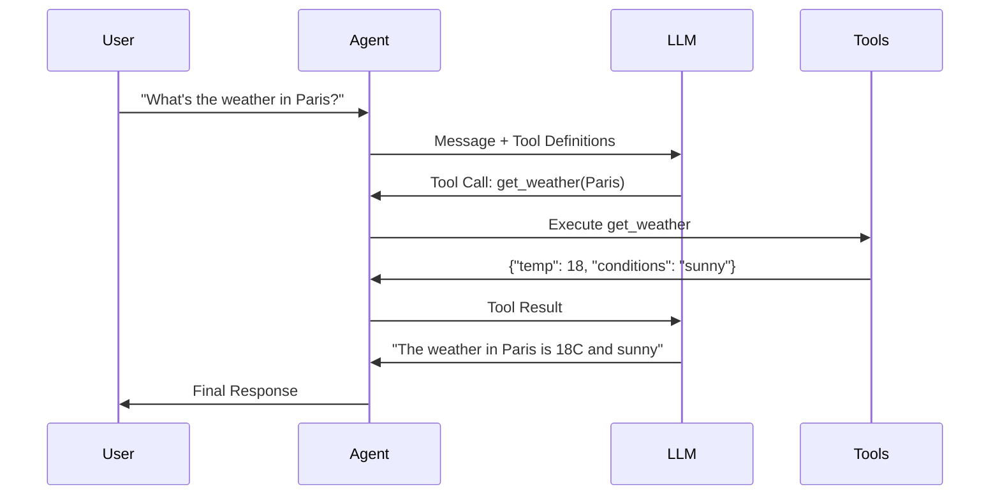
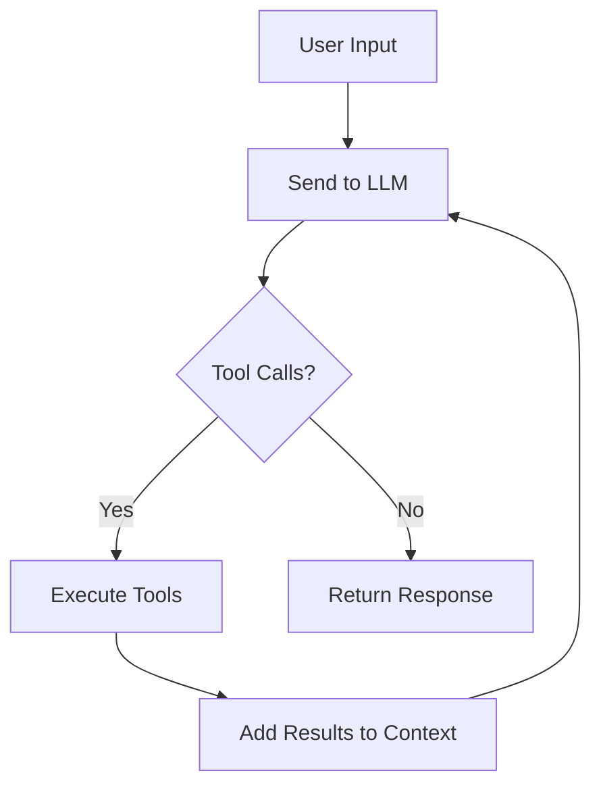

# Tool Calling Agent

Build an agent that extends LLM capabilities with external tools and APIs

## What You'll Learn

- How function calling works with LLMs
- Defining tool schemas for the model
- Executing tools and returning results
- Building a complete tool-using agent

## Tech Stack

| Component | Technology |
|-----------|------------|
| LLM | OpenAI GPT-4 / Anthropic Claude |
| Framework | LangChain |
| Tools | Custom Python functions |
| API | FastAPI |

## How Tool Calling Works



## Project Structure

```
tool-calling-agent/
├── src/
│   ├── __init__.py
│   ├── agent.py          # Main agent logic
│   ├── tools.py          # Tool definitions
│   ├── schemas.py        # Pydantic models
│   └── api.py            # FastAPI application
├── tests/
│   └── test_agent.py
├── requirements.txt
└── README.md
```

## Implementation

### Step 1: Project Setup

```bash
mkdir tool-calling-agent && cd tool-calling-agent
python -m venv venv
source venv/bin/activate  # On Windows: venv\Scripts\activate
```

```python title="requirements.txt"
openai>=1.0.0
langchain>=0.1.0
langchain-openai>=0.0.5
fastapi>=0.100.0
uvicorn>=0.23.0
pydantic>=2.0.0
httpx>=0.25.0
python-dotenv>=1.0.0
```

```bash
pip install -r requirements.txt
```

### Step 2: Define Tools

Tools are functions that the LLM can call. Each tool needs a clear description and typed parameters.

```python title="src/tools.py"
"""
Tool definitions for the agent.

Each tool is a Python function with:
- Type hints for parameters
- A docstring describing what it does
- Return type annotation
"""

import httpx
from datetime import datetime
from typing import Optional
import json


def get_current_time(timezone: str = "UTC") -> str:
    """
    Get the current time in a specified timezone.
    
    Args:
        timezone: The timezone name (e.g., "UTC", "US/Eastern", "Europe/London")
    
    Returns:
        Current time as a formatted string
    """
    from zoneinfo import ZoneInfo
    
    try:
        tz = ZoneInfo(timezone)
        now = datetime.now(tz)
        return now.strftime("%Y-%m-%d %H:%M:%S %Z")
    except Exception as e:
        return f"Error: Invalid timezone '{timezone}'"


def get_weather(city: str, units: str = "celsius") -> dict:
    """
    Get current weather for a city.
    
    Args:
        city: The city name to get weather for
        units: Temperature units - "celsius" or "fahrenheit"
    
    Returns:
        Weather data including temperature, conditions, humidity
    """
    # Simulated weather data (replace with real API in production)
    weather_data = {
        "paris": {"temp_c": 18, "conditions": "sunny", "humidity": 65},
        "london": {"temp_c": 14, "conditions": "cloudy", "humidity": 78},
        "new york": {"temp_c": 22, "conditions": "partly cloudy", "humidity": 55},
        "tokyo": {"temp_c": 26, "conditions": "humid", "humidity": 80},
    }
    
    city_lower = city.lower()
    if city_lower not in weather_data:
        return {"error": f"Weather data not available for {city}"}
    
    data = weather_data[city_lower]
    temp = data["temp_c"]
    
    if units == "fahrenheit":
        temp = (temp * 9/5) + 32
        unit_symbol = "F"
    else:
        unit_symbol = "C"
    
    return {
        "city": city,
        "temperature": f"{temp}{unit_symbol}",
        "conditions": data["conditions"],
        "humidity": f"{data['humidity']}%"
    }


def calculate(expression: str) -> str:
    """
    Evaluate a mathematical expression safely.
    
    Args:
        expression: A mathematical expression like "2 + 2" or "sqrt(16)"
    
    Returns:
        The result of the calculation
    """
    import math
    
    # Safe evaluation with limited namespace
    allowed_names = {
        "abs": abs, "round": round, "min": min, "max": max,
        "sum": sum, "pow": pow,
        "sqrt": math.sqrt, "sin": math.sin, "cos": math.cos,
        "tan": math.tan, "log": math.log, "log10": math.log10,
        "pi": math.pi, "e": math.e
    }
    
    try:
        # Remove dangerous characters
        safe_expr = expression.replace("__", "")
        result = eval(safe_expr, {"__builtins__": {}}, allowed_names)
        return str(result)
    except Exception as e:
        return f"Error: Could not evaluate '{expression}' - {str(e)}"


def search_wikipedia(query: str, sentences: int = 3) -> str:
    """
    Search Wikipedia and return a summary.
    
    Args:
        query: The search term
        sentences: Number of sentences to return (1-10)
    
    Returns:
        Wikipedia summary text
    """
    sentences = max(1, min(10, sentences))
    
    try:
        url = f"https://en.wikipedia.org/api/rest_v1/page/summary/{query}"
        response = httpx.get(url, timeout=10.0)
        
        if response.status_code == 200:
            data = response.json()
            extract = data.get("extract", "No information found.")
            # Limit to requested sentences
            sentences_list = extract.split(". ")
            return ". ".join(sentences_list[:sentences]) + "."
        else:
            return f"Could not find Wikipedia article for '{query}'"
    except Exception as e:
        return f"Error searching Wikipedia: {str(e)}"


# Tool registry for easy access
TOOLS = {
    "get_current_time": get_current_time,
    "get_weather": get_weather,
    "calculate": calculate,
    "search_wikipedia": search_wikipedia,
}
```

### Step 3: Create Tool Schemas

OpenAI and other LLMs need tools defined in a specific JSON schema format.

```python title="src/schemas.py"
"""
Tool schemas for LLM function calling.

These schemas tell the model what tools are available
and how to use them.
"""

from typing import Any

TOOL_SCHEMAS = [
    {
        "type": "function",
        "function": {
            "name": "get_current_time",
            "description": "Get the current time in a specified timezone",
            "parameters": {
                "type": "object",
                "properties": {
                    "timezone": {
                        "type": "string",
                        "description": "The timezone (e.g., 'UTC', 'US/Eastern', 'Europe/Paris')",
                        "default": "UTC"
                    }
                },
                "required": []
            }
        }
    },
    {
        "type": "function",
        "function": {
            "name": "get_weather",
            "description": "Get current weather for a city",
            "parameters": {
                "type": "object",
                "properties": {
                    "city": {
                        "type": "string",
                        "description": "The city name (e.g., 'Paris', 'London', 'New York')"
                    },
                    "units": {
                        "type": "string",
                        "enum": ["celsius", "fahrenheit"],
                        "description": "Temperature units",
                        "default": "celsius"
                    }
                },
                "required": ["city"]
            }
        }
    },
    {
        "type": "function",
        "function": {
            "name": "calculate",
            "description": "Evaluate a mathematical expression. Supports basic math, sqrt, sin, cos, log, etc.",
            "parameters": {
                "type": "object",
                "properties": {
                    "expression": {
                        "type": "string",
                        "description": "The math expression to evaluate (e.g., '2 + 2', 'sqrt(16)', 'sin(pi/2)')"
                    }
                },
                "required": ["expression"]
            }
        }
    },
    {
        "type": "function",
        "function": {
            "name": "search_wikipedia",
            "description": "Search Wikipedia and get a summary of the topic",
            "parameters": {
                "type": "object",
                "properties": {
                    "query": {
                        "type": "string",
                        "description": "The search term or topic"
                    },
                    "sentences": {
                        "type": "integer",
                        "description": "Number of sentences to return (1-10)",
                        "default": 3
                    }
                },
                "required": ["query"]
            }
        }
    }
]


def get_tool_schemas() -> list[dict[str, Any]]:
    """Return all tool schemas."""
    return TOOL_SCHEMAS
```

### Step 4: Build the Agent

The agent orchestrates the conversation between the user, LLM, and tools.

```python title="src/agent.py"
"""
Tool-calling agent implementation.

This agent:
1. Receives user messages
2. Sends them to the LLM with tool definitions
3. Executes any tool calls the LLM requests
4. Returns tool results to the LLM
5. Repeats until the LLM provides a final response
"""

import json
from typing import Optional
from dataclasses import dataclass, field
from openai import OpenAI

from .tools import TOOLS
from .schemas import get_tool_schemas


@dataclass
class Message:
    """A message in the conversation."""
    role: str
    content: str
    tool_calls: Optional[list] = None
    tool_call_id: Optional[str] = None
    name: Optional[str] = None


@dataclass
class AgentResponse:
    """Response from the agent."""
    content: str
    tool_calls_made: list[dict] = field(default_factory=list)
    total_tokens: int = 0


class ToolCallingAgent:
    """
    An agent that uses tools to answer questions.
    
    The agent follows a loop:
    1. Send message to LLM
    2. If LLM wants to use a tool, execute it
    3. Send tool result back to LLM
    4. Repeat until LLM gives final answer
    """
    
    def __init__(
        self,
        model: str = "gpt-4-turbo-preview",
        max_iterations: int = 10,
        temperature: float = 0.7
    ):
        """
        Initialize the agent.
        
        Args:
            model: The OpenAI model to use
            max_iterations: Maximum tool calls before stopping
            temperature: LLM temperature (0-1)
        """
        self.client = OpenAI()
        self.model = model
        self.max_iterations = max_iterations
        self.temperature = temperature
        self.tools = get_tool_schemas()
        self.system_prompt = """You are a helpful assistant with access to tools.
        
Use tools when they would help answer the user's question accurately.
Always explain what you're doing and why you're using a tool.
If a tool returns an error, explain the issue to the user.

Available tools:
- get_current_time: Get current time in any timezone
- get_weather: Get weather for any city
- calculate: Evaluate math expressions
- search_wikipedia: Look up information on Wikipedia"""
    
    def _execute_tool(self, name: str, arguments: dict) -> str:
        """Execute a tool and return the result."""
        if name not in TOOLS:
            return json.dumps({"error": f"Unknown tool: {name}"})
        
        try:
            result = TOOLS[name](**arguments)
            if isinstance(result, dict):
                return json.dumps(result)
            return str(result)
        except Exception as e:
            return json.dumps({"error": str(e)})
    
    def _format_messages(self, messages: list[Message]) -> list[dict]:
        """Convert Message objects to OpenAI format."""
        formatted = []
        for msg in messages:
            m = {"role": msg.role, "content": msg.content}
            if msg.tool_calls:
                m["tool_calls"] = msg.tool_calls
            if msg.tool_call_id:
                m["tool_call_id"] = msg.tool_call_id
            if msg.name:
                m["name"] = msg.name
            formatted.append(m)
        return formatted
    
    def run(self, user_message: str) -> AgentResponse:
        """
        Run the agent with a user message.
        
        Args:
            user_message: The user's input
            
        Returns:
            AgentResponse with the final answer and metadata
        """
        messages = [
            Message(role="system", content=self.system_prompt),
            Message(role="user", content=user_message)
        ]
        
        tool_calls_made = []
        total_tokens = 0
        iterations = 0
        
        while iterations < self.max_iterations:
            iterations += 1
            
            # Call the LLM
            response = self.client.chat.completions.create(
                model=self.model,
                messages=self._format_messages(messages),
                tools=self.tools,
                tool_choice="auto",
                temperature=self.temperature
            )
            
            total_tokens += response.usage.total_tokens
            assistant_message = response.choices[0].message
            
            # Check if we're done (no tool calls)
            if not assistant_message.tool_calls:
                return AgentResponse(
                    content=assistant_message.content or "",
                    tool_calls_made=tool_calls_made,
                    total_tokens=total_tokens
                )
            
            # Add assistant message with tool calls
            messages.append(Message(
                role="assistant",
                content=assistant_message.content or "",
                tool_calls=[
                    {
                        "id": tc.id,
                        "type": "function",
                        "function": {
                            "name": tc.function.name,
                            "arguments": tc.function.arguments
                        }
                    }
                    for tc in assistant_message.tool_calls
                ]
            ))
            
            # Execute each tool call
            for tool_call in assistant_message.tool_calls:
                name = tool_call.function.name
                arguments = json.loads(tool_call.function.arguments)
                
                # Execute and record
                result = self._execute_tool(name, arguments)
                tool_calls_made.append({
                    "tool": name,
                    "arguments": arguments,
                    "result": result
                })
                
                # Add tool result to messages
                messages.append(Message(
                    role="tool",
                    content=result,
                    tool_call_id=tool_call.id,
                    name=name
                ))
        
        # Max iterations reached
        return AgentResponse(
            content="I've reached the maximum number of tool calls. Please try a simpler question.",
            tool_calls_made=tool_calls_made,
            total_tokens=total_tokens
        )


# Convenience function for quick usage
def run_agent(message: str) -> str:
    """Run the agent and return just the response text."""
    agent = ToolCallingAgent()
    response = agent.run(message)
    return response.content
```

### Step 5: Create the API

```python title="src/api.py"
"""
FastAPI application for the tool-calling agent.
"""

from fastapi import FastAPI, HTTPException
from pydantic import BaseModel, Field
from typing import Optional

from .agent import ToolCallingAgent, AgentResponse


app = FastAPI(
    title="Tool Calling Agent API",
    description="An AI agent that can use tools to answer questions",
    version="1.0.0"
)

# Initialize agent
agent = ToolCallingAgent()


class ChatRequest(BaseModel):
    """Request model for chat endpoint."""
    message: str = Field(..., min_length=1, max_length=2000)
    temperature: Optional[float] = Field(default=0.7, ge=0.0, le=1.0)


class ToolCall(BaseModel):
    """A single tool call."""
    tool: str
    arguments: dict
    result: str


class ChatResponse(BaseModel):
    """Response model for chat endpoint."""
    response: str
    tool_calls: list[ToolCall]
    total_tokens: int


@app.get("/")
async def root():
    """Health check endpoint."""
    return {"status": "healthy", "agent": "tool-calling-agent"}


@app.get("/tools")
async def list_tools():
    """List available tools."""
    return {
        "tools": [
            {
                "name": "get_current_time",
                "description": "Get current time in any timezone"
            },
            {
                "name": "get_weather", 
                "description": "Get weather for a city"
            },
            {
                "name": "calculate",
                "description": "Evaluate math expressions"
            },
            {
                "name": "search_wikipedia",
                "description": "Search Wikipedia for information"
            }
        ]
    }


@app.post("/chat", response_model=ChatResponse)
async def chat(request: ChatRequest):
    """
    Send a message to the agent.
    
    The agent will use tools as needed to answer your question.
    """
    try:
        # Update temperature if provided
        agent.temperature = request.temperature
        
        # Run the agent
        result = agent.run(request.message)
        
        return ChatResponse(
            response=result.content,
            tool_calls=[
                ToolCall(
                    tool=tc["tool"],
                    arguments=tc["arguments"],
                    result=tc["result"]
                )
                for tc in result.tool_calls_made
            ],
            total_tokens=result.total_tokens
        )
    except Exception as e:
        raise HTTPException(status_code=500, detail=str(e))


@app.post("/chat/stream")
async def chat_stream(request: ChatRequest):
    """
    Stream response from the agent (simplified version).
    
    For full streaming, you'd use Server-Sent Events (SSE).
    """
    # For simplicity, we return the full response
    # A production implementation would stream chunks
    result = await chat(request)
    return result
```

### Step 6: Create Tests

```python title="tests/test_agent.py"
"""Tests for the tool-calling agent."""

import pytest
from src.tools import get_current_time, get_weather, calculate, search_wikipedia
from src.agent import ToolCallingAgent


class TestTools:
    """Test individual tools."""
    
    def test_get_current_time_utc(self):
        """Test getting UTC time."""
        result = get_current_time("UTC")
        assert "UTC" in result
        assert "Error" not in result
    
    def test_get_current_time_invalid(self):
        """Test invalid timezone."""
        result = get_current_time("Invalid/Zone")
        assert "Error" in result
    
    def test_get_weather_valid_city(self):
        """Test weather for known city."""
        result = get_weather("Paris")
        assert "temperature" in result
        assert "conditions" in result
        assert result["city"] == "Paris"
    
    def test_get_weather_fahrenheit(self):
        """Test weather in Fahrenheit."""
        result = get_weather("Paris", units="fahrenheit")
        assert "F" in result["temperature"]
    
    def test_get_weather_unknown_city(self):
        """Test weather for unknown city."""
        result = get_weather("UnknownCity")
        assert "error" in result
    
    def test_calculate_basic(self):
        """Test basic calculation."""
        assert calculate("2 + 2") == "4"
        assert calculate("10 * 5") == "50"
    
    def test_calculate_advanced(self):
        """Test advanced math."""
        assert calculate("sqrt(16)") == "4.0"
        assert float(calculate("sin(0)")) == 0.0
    
    def test_calculate_invalid(self):
        """Test invalid expression."""
        result = calculate("invalid")
        assert "Error" in result


class TestAgent:
    """Test the full agent."""
    
    @pytest.fixture
    def agent(self):
        """Create a test agent."""
        return ToolCallingAgent(
            model="gpt-3.5-turbo",  # Use cheaper model for tests
            max_iterations=3
        )
    
    def test_agent_initialization(self, agent):
        """Test agent initializes correctly."""
        assert agent.model == "gpt-3.5-turbo"
        assert agent.max_iterations == 3
        assert len(agent.tools) > 0
    
    @pytest.mark.skipif(
        True,  # Skip by default (requires API key)
        reason="Requires OpenAI API key"
    )
    def test_agent_simple_query(self, agent):
        """Test agent with a simple query."""
        response = agent.run("What is 2 + 2?")
        assert "4" in response.content
    
    @pytest.mark.skipif(
        True,
        reason="Requires OpenAI API key"
    )
    def test_agent_tool_usage(self, agent):
        """Test that agent uses tools."""
        response = agent.run("What's the weather in Paris?")
        assert len(response.tool_calls_made) > 0
        assert any(tc["tool"] == "get_weather" for tc in response.tool_calls_made)
```

## Running the Application

### Start the API

```bash
# Set your OpenAI API key
export OPENAI_API_KEY="your-key-here"

# Run the server
uvicorn src.api:app --reload --host 0.0.0.0 --port 8000
```

### Test with curl

```bash
# List available tools
curl http://localhost:8000/tools

# Ask a question
curl -X POST http://localhost:8000/chat \
  -H "Content-Type: application/json" \
  -d '{"message": "What time is it in Tokyo and what is the weather there?"}'

# Math calculation
curl -X POST http://localhost:8000/chat \
  -H "Content-Type: application/json" \
  -d '{"message": "What is the square root of 144 plus 25?"}'

# Wikipedia search
curl -X POST http://localhost:8000/chat \
  -H "Content-Type: application/json" \
  -d '{"message": "Tell me about the Eiffel Tower"}'
```

## Key Concepts

### Tool Definition Best Practices

1. **Clear descriptions**: The model uses descriptions to decide when to use tools
2. **Typed parameters**: Always specify types and constraints
3. **Required vs optional**: Mark truly required parameters
4. **Error handling**: Return structured errors the model can understand

### The Agent Loop



### When to Use Multiple Tools

The agent can chain tools together:
- "What time is it in London and what's the weather?" - Uses both time and weather tools
- "Calculate 2+2 and search Wikipedia for mathematics" - Uses both calculate and search

## Next Steps

Now that you've built a basic tool-calling agent, continue to:

- **[ReAct Agent](/docs/agents/intermediate/react-agent)** - Add reasoning traces
- **[Conversational Agent](/docs/agents/intermediate/conversational-agent)** - Add memory
- **[Planning Agent](/docs/agents/intermediate/planning-agent)** - Plan before acting

## Summary

You've built a tool-calling agent that:

- Defines tools with clear schemas
- Sends tool definitions to the LLM
- Executes tool calls and returns results
- Loops until the model provides a final answer
- Exposes everything via a REST API

This pattern is the foundation for all modern AI agents.
