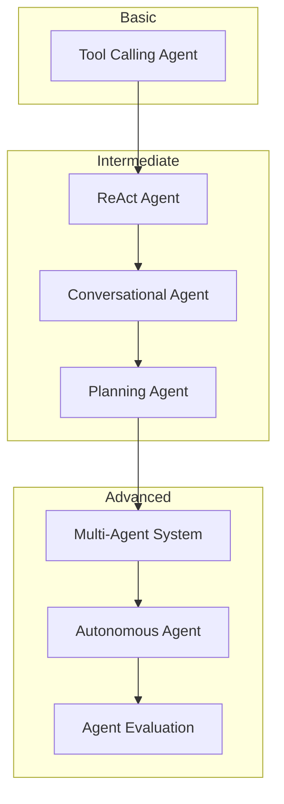
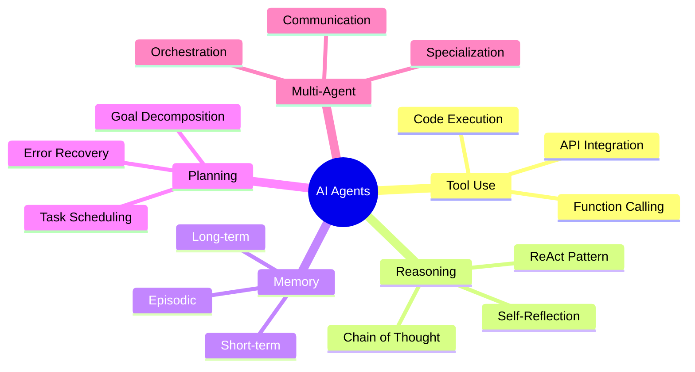

# AI Agents Projects

Build autonomous AI systems that think, plan, and act

## AI Agents Projects

Create intelligent agents that go beyond simple question-answering to accomplish complex tasks through reasoning and tool use.

## Learning Path

## Projects

### Beginner

| Project | Description | Time |
|---------|-------------|------|
| [Tool Calling Agent](/docs/agents/basic/tool-calling-agent) | Build an agent that uses functions and APIs | ~2 hours |

### Intermediate

| Project | Description | Time |
|---------|-------------|------|
| [ReAct Agent](/docs/agents/intermediate/react-agent) | Implement reasoning and acting patterns | ~4 hours |
| [Conversational Agent](/docs/agents/intermediate/conversational-agent) | Add memory and context to your agents | ~4 hours |
| [Planning Agent](/docs/agents/intermediate/planning-agent) | Build agents that plan before executing | ~5 hours |

### Advanced

| Project | Description | Time |
|---------|-------------|------|
| [Multi-Agent System](/docs/agents/advanced/multi-agent-system) | Orchestrate multiple specialized agents | ~3 days |
| [Autonomous Agent](/docs/agents/advanced/autonomous-agent) | Build self-directed agents with goal decomposition | ~4 days |
| [Agent Evaluation](/docs/agents/advanced/agent-evaluation) | Test and evaluate agent performance | ~2 days |

## Why Learn AI Agents?

| Benefit | Description |
|---------|-------------|
| **Automation** | Agents handle complex multi-step tasks autonomously |
| **Reasoning** | LLMs with tools can solve problems humans define |
| **Scalability** | Deploy agents that work 24/7 without human intervention |
| **Flexibility** | Agents adapt to new situations using reasoning |

## Key Concepts

Start with the [Tool Calling Agent](/docs/agents/basic/tool-calling-agent) project to learn the fundamentals.
