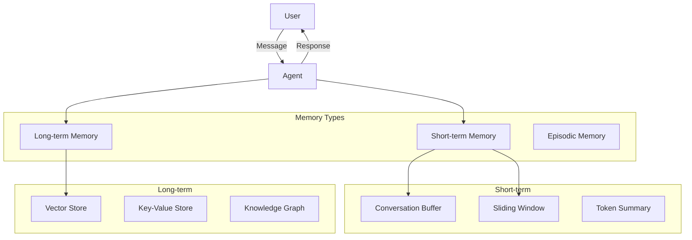

# Conversational Agent

Add memory and context management to your AI agents

## What You'll Learn

- Different types of agent memory
- Implementing short-term and long-term memory
- Managing conversation context windows
- Building stateful conversational agents

## Tech Stack

| Component | Technology |
|-----------|------------|
| LLM | OpenAI GPT-4 |
| Memory | Redis / PostgreSQL |
| Framework | LangChain |
| Vector Store | ChromaDB |

## Memory Architecture



## Project Structure

```
conversational-agent/
├── src/
│   ├── __init__.py
│   ├── agent.py           # Main agent with memory
│   ├── memory/
│   │   ├── __init__.py
│   │   ├── buffer.py      # Conversation buffer
│   │   ├── summary.py     # Summary memory
│   │   └── vector.py      # Vector-based memory
│   ├── tools.py           # Agent tools
│   └── api.py             # FastAPI application
├── tests/
│   └── test_memory.py
└── requirements.txt
```

## Implementation

### Step 1: Setup

```python title="requirements.txt"
openai>=1.0.0
langchain>=0.1.0
langchain-openai>=0.0.5
chromadb>=0.4.0
redis>=5.0.0
fastapi>=0.100.0
uvicorn>=0.23.0
tiktoken>=0.5.0
```

### Step 2: Conversation Buffer Memory

The simplest memory - stores recent messages.

```python title="src/memory/buffer.py"
"""
Conversation buffer memory.

Stores the last N messages or messages within a token limit.
"""

from dataclasses import dataclass, field
from typing import Optional
import tiktoken


@dataclass
class Message:
    """A single conversation message."""
    role: str  # "user", "assistant", "system"
    content: str
    timestamp: Optional[float] = None


class ConversationBuffer:
    """
    Simple buffer that stores recent conversation history.
    
    Two modes:
    - max_messages: Keep last N messages
    - max_tokens: Keep messages within token limit
    """
    
    def __init__(
        self,
        max_messages: Optional[int] = None,
        max_tokens: Optional[int] = 4000,
        model: str = "gpt-4"
    ):
        self.max_messages = max_messages
        self.max_tokens = max_tokens
        self.messages: list[Message] = []
        self.encoder = tiktoken.encoding_for_model(model)
    
    def add(self, role: str, content: str) -> None:
        """Add a message to the buffer."""
        import time
        self.messages.append(Message(
            role=role,
            content=content,
            timestamp=time.time()
        ))
        self._trim()
    
    def _count_tokens(self, messages: list[Message]) -> int:
        """Count total tokens in messages."""
        total = 0
        for msg in messages:
            total += len(self.encoder.encode(msg.content)) + 4  # +4 for role overhead
        return total
    
    def _trim(self) -> None:
        """Trim buffer to stay within limits."""
        # Trim by message count
        if self.max_messages and len(self.messages) > self.max_messages:
            self.messages = self.messages[-self.max_messages:]
        
        # Trim by token count
        if self.max_tokens:
            while (
                len(self.messages) > 1 and 
                self._count_tokens(self.messages) > self.max_tokens
            ):
                self.messages.pop(0)
    
    def get_messages(self) -> list[dict]:
        """Get messages in OpenAI format."""
        return [
            {"role": msg.role, "content": msg.content}
            for msg in self.messages
        ]
    
    def clear(self) -> None:
        """Clear all messages."""
        self.messages = []
    
    def get_context_string(self) -> str:
        """Get conversation as a formatted string."""
        lines = []
        for msg in self.messages:
            lines.append(f"{msg.role.capitalize()}: {msg.content}")
        return "\n".join(lines)
```

### Step 3: Summary Memory

Summarize old conversations to save tokens.

```python title="src/memory/summary.py"
"""
Summary memory - compresses old conversations into summaries.

Useful for long conversations where you want to retain context
without using too many tokens.
"""

from dataclasses import dataclass
from typing import Optional
from openai import OpenAI

from .buffer import ConversationBuffer, Message


@dataclass
class SummaryMemory:
    """
    Memory that maintains a running summary of the conversation.
    
    When the buffer gets too long, older messages are summarized
    and the summary is prepended to new conversations.
    """
    
    def __init__(
        self,
        buffer_size: int = 10,
        summary_model: str = "gpt-3.5-turbo"
    ):
        self.buffer = ConversationBuffer(max_messages=buffer_size)
        self.summary: str = ""
        self.client = OpenAI()
        self.summary_model = summary_model
        self.buffer_size = buffer_size
    
    def add(self, role: str, content: str) -> None:
        """Add a message, summarizing if needed."""
        self.buffer.add(role, content)
        
        # Check if we need to summarize
        if len(self.buffer.messages) >= self.buffer_size:
            self._update_summary()
    
    def _update_summary(self) -> None:
        """Summarize older messages and update the running summary."""
        # Take first half of messages to summarize
        half = len(self.buffer.messages) // 2
        to_summarize = self.buffer.messages[:half]
        
        # Build context for summarization
        conversation = "\n".join([
            f"{m.role}: {m.content}" for m in to_summarize
        ])
        
        prompt = f"""Summarize this conversation concisely, preserving key information:

Previous summary: {self.summary or 'None'}

New conversation:
{conversation}

Updated summary:"""
        
        response = self.client.chat.completions.create(
            model=self.summary_model,
            messages=[{"role": "user", "content": prompt}],
            max_tokens=500
        )
        
        self.summary = response.choices[0].message.content
        
        # Keep only recent messages
        self.buffer.messages = self.buffer.messages[half:]
    
    def get_context(self) -> list[dict]:
        """Get full context including summary."""
        messages = []
        
        if self.summary:
            messages.append({
                "role": "system",
                "content": f"Previous conversation summary: {self.summary}"
            })
        
        messages.extend(self.buffer.get_messages())
        return messages
    
    def clear(self) -> None:
        """Clear all memory."""
        self.buffer.clear()
        self.summary = ""
```

### Step 4: Vector Memory

Store and retrieve relevant past conversations.

```python title="src/memory/vector.py"
"""
Vector-based long-term memory.

Stores conversation snippets as embeddings and retrieves
relevant context based on the current query.
"""

from dataclasses import dataclass
from typing import Optional
import chromadb
from chromadb.utils import embedding_functions
import uuid
import time


@dataclass
class MemoryEntry:
    """A single memory entry."""
    id: str
    content: str
    metadata: dict
    relevance: float = 0.0


class VectorMemory:
    """
    Long-term memory using vector similarity search.
    
    Stores conversation turns and retrieves relevant ones
    based on semantic similarity to the current query.
    """
    
    def __init__(
        self,
        collection_name: str = "conversations",
        persist_directory: Optional[str] = None
    ):
        # Initialize ChromaDB
        if persist_directory:
            self.client = chromadb.PersistentClient(path=persist_directory)
        else:
            self.client = chromadb.Client()
        
        # Use OpenAI embeddings
        self.embedding_fn = embedding_functions.OpenAIEmbeddingFunction(
            model_name="text-embedding-3-small"
        )
        
        self.collection = self.client.get_or_create_collection(
            name=collection_name,
            embedding_function=self.embedding_fn
        )
    
    def store(
        self,
        content: str,
        metadata: Optional[dict] = None
    ) -> str:
        """Store a memory entry."""
        entry_id = str(uuid.uuid4())
        
        self.collection.add(
            ids=[entry_id],
            documents=[content],
            metadatas=[{
                **(metadata or {}),
                "timestamp": time.time()
            }]
        )
        
        return entry_id
    
    def store_exchange(
        self,
        user_message: str,
        assistant_message: str,
        metadata: Optional[dict] = None
    ) -> str:
        """Store a complete user-assistant exchange."""
        content = f"User: {user_message}\nAssistant: {assistant_message}"
        return self.store(content, metadata)
    
    def retrieve(
        self,
        query: str,
        top_k: int = 5,
        min_relevance: float = 0.5
    ) -> list[MemoryEntry]:
        """Retrieve relevant memories."""
        results = self.collection.query(
            query_texts=[query],
            n_results=top_k,
            include=["documents", "metadatas", "distances"]
        )
        
        entries = []
        for i, doc in enumerate(results["documents"][0]):
            # Convert distance to similarity (ChromaDB uses L2 distance)
            distance = results["distances"][0][i]
            relevance = 1 / (1 + distance)
            
            if relevance >= min_relevance:
                entries.append(MemoryEntry(
                    id=results["ids"][0][i],
                    content=doc,
                    metadata=results["metadatas"][0][i],
                    relevance=relevance
                ))
        
        return entries
    
    def get_relevant_context(
        self,
        query: str,
        max_entries: int = 3
    ) -> str:
        """Get relevant past context as a formatted string."""
        entries = self.retrieve(query, top_k=max_entries)
        
        if not entries:
            return ""
        
        context_parts = ["Relevant past conversations:"]
        for entry in entries:
            context_parts.append(f"---\n{entry.content}")
        
        return "\n".join(context_parts)
    
    def clear(self) -> None:
        """Clear all memories."""
        self.client.delete_collection(self.collection.name)
        self.collection = self.client.create_collection(
            name=self.collection.name,
            embedding_function=self.embedding_fn
        )
```

### Step 5: Conversational Agent

Combine all memory types into a full agent.

```python title="src/agent.py"
"""
Conversational agent with multiple memory types.
"""

from dataclasses import dataclass, field
from typing import Optional
from openai import OpenAI

from .memory.buffer import ConversationBuffer
from .memory.summary import SummaryMemory
from .memory.vector import VectorMemory


@dataclass
class AgentResponse:
    """Response from the conversational agent."""
    content: str
    memories_used: list[str] = field(default_factory=list)


class ConversationalAgent:
    """
    An agent that maintains conversation context using
    multiple memory systems.
    
    Memory hierarchy:
    1. Buffer: Recent messages (always included)
    2. Summary: Compressed older context
    3. Vector: Relevant past conversations
    """
    
    def __init__(
        self,
        model: str = "gpt-4-turbo-preview",
        use_summary: bool = True,
        use_vector: bool = True,
        session_id: Optional[str] = None
    ):
        self.client = OpenAI()
        self.model = model
        self.session_id = session_id or "default"
        
        # Initialize memory systems
        self.buffer = ConversationBuffer(max_tokens=2000)
        self.summary = SummaryMemory() if use_summary else None
        self.vector = VectorMemory(
            collection_name=f"session_{self.session_id}"
        ) if use_vector else None
        
        self.system_prompt = """You are a helpful AI assistant with memory.
You can remember past conversations and use that context to provide better responses.
Be conversational and reference past discussions when relevant."""
    
    def _build_messages(self, user_message: str) -> list[dict]:
        """Build the full message list with memory context."""
        messages = [{"role": "system", "content": self.system_prompt}]
        
        # Add relevant long-term memories
        if self.vector:
            relevant = self.vector.get_relevant_context(user_message)
            if relevant:
                messages.append({
                    "role": "system",
                    "content": relevant
                })
        
        # Add summary if available
        if self.summary and self.summary.summary:
            messages.append({
                "role": "system",
                "content": f"Conversation summary: {self.summary.summary}"
            })
        
        # Add recent conversation buffer
        messages.extend(self.buffer.get_messages())
        
        # Add current user message
        messages.append({"role": "user", "content": user_message})
        
        return messages
    
    def chat(self, user_message: str) -> AgentResponse:
        """
        Send a message and get a response.
        
        Args:
            user_message: The user's input
            
        Returns:
            AgentResponse with the reply and memory info
        """
        # Build messages with context
        messages = self._build_messages(user_message)
        
        # Track which memories were used
        memories_used = []
        if self.vector:
            memories = self.vector.retrieve(user_message, top_k=3)
            memories_used = [m.content[:100] for m in memories]
        
        # Call the LLM
        response = self.client.chat.completions.create(
            model=self.model,
            messages=messages,
            temperature=0.7
        )
        
        assistant_message = response.choices[0].message.content
        
        # Update all memory systems
        self.buffer.add("user", user_message)
        self.buffer.add("assistant", assistant_message)
        
        if self.summary:
            self.summary.add("user", user_message)
            self.summary.add("assistant", assistant_message)
        
        if self.vector:
            self.vector.store_exchange(user_message, assistant_message)
        
        return AgentResponse(
            content=assistant_message,
            memories_used=memories_used
        )
    
    def clear_session(self) -> None:
        """Clear all memory for this session."""
        self.buffer.clear()
        if self.summary:
            self.summary.clear()
        if self.vector:
            self.vector.clear()
```

### Step 6: API

```python title="src/api.py"
"""FastAPI application for conversational agent."""

from fastapi import FastAPI, HTTPException
from pydantic import BaseModel
from typing import Optional

from .agent import ConversationalAgent


app = FastAPI(title="Conversational Agent API")

# Store agents by session
agents: dict[str, ConversationalAgent] = {}


class ChatRequest(BaseModel):
    message: str
    session_id: str = "default"


class ChatResponse(BaseModel):
    response: str
    session_id: str
    memories_retrieved: list[str]


@app.post("/chat", response_model=ChatResponse)
async def chat(request: ChatRequest):
    """Send a message to the agent."""
    # Get or create agent for session
    if request.session_id not in agents:
        agents[request.session_id] = ConversationalAgent(
            session_id=request.session_id
        )
    
    agent = agents[request.session_id]
    result = agent.chat(request.message)
    
    return ChatResponse(
        response=result.content,
        session_id=request.session_id,
        memories_retrieved=result.memories_used
    )


@app.delete("/session/{session_id}")
async def clear_session(session_id: str):
    """Clear a session's memory."""
    if session_id in agents:
        agents[session_id].clear_session()
        del agents[session_id]
    return {"status": "cleared"}
```

## Memory Comparison

| Type | Best For | Tokens | Persistence |
|------|----------|--------|-------------|
| Buffer | Recent context | High | Session |
| Summary | Long conversations | Medium | Session |
| Vector | Relevant retrieval | Low | Permanent |

## Next Steps

- **[Planning Agent](/docs/agents/intermediate/planning-agent)** - Add task planning
- **[Multi-Agent System](/docs/agents/advanced/multi-agent-system)** - Coordinate multiple agents
