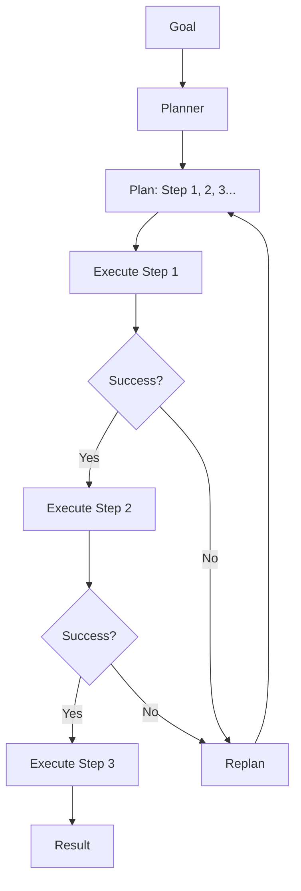

# Planning Agent

Create agents that decompose complex goals into executable plans

## What You'll Learn

- Plan-and-execute architecture
- Task decomposition strategies
- Dynamic replanning on failure
- Building reliable multi-step agents

## Tech Stack

| Component | Technology |
|-----------|------------|
| LLM | OpenAI GPT-4 |
| Framework | LangGraph |
| Planning | Custom planner |
| Execution | Tool-based |

## Plan-and-Execute Pattern



## Project Structure

```
planning-agent/
├── src/
│   ├── __init__.py
│   ├── planner.py         # Task planning
│   ├── executor.py        # Step execution
│   ├── agent.py           # Main agent
│   ├── tools.py           # Available tools
│   └── api.py
├── tests/
└── requirements.txt
```

## Implementation

### Step 1: Setup

```python title="requirements.txt"
openai>=1.0.0
langchain>=0.1.0
langgraph>=0.0.20
pydantic>=2.0.0
fastapi>=0.100.0
uvicorn>=0.23.0
```

### Step 2: Task Planner

```python title="src/planner.py"
"""
Task planner that decomposes goals into steps.
"""

from dataclasses import dataclass
from typing import Optional
from openai import OpenAI
import json


@dataclass
class PlanStep:
    """A single step in a plan."""
    id: int
    description: str
    tool: Optional[str] = None
    tool_input: Optional[str] = None
    dependencies: list[int] = None
    status: str = "pending"  # pending, running, completed, failed
    result: Optional[str] = None
    
    def __post_init__(self):
        if self.dependencies is None:
            self.dependencies = []


@dataclass
class Plan:
    """A complete plan for achieving a goal."""
    goal: str
    steps: list[PlanStep]
    current_step: int = 0
    status: str = "pending"


class TaskPlanner:
    """
    Creates plans to achieve goals.
    
    The planner:
    1. Analyzes the goal
    2. Breaks it into logical steps
    3. Identifies tools needed for each step
    4. Determines step dependencies
    """
    
    def __init__(self, model: str = "gpt-4-turbo-preview"):
        self.client = OpenAI()
        self.model = model
        
        self.system_prompt = """You are a task planning expert.
Given a goal, break it down into concrete, executable steps.

Available tools:
- search: Search the web for information
- calculate: Perform mathematical calculations
- write_file: Write content to a file
- read_file: Read content from a file
- execute_code: Run Python code

For each step, specify:
1. A clear description of what to do
2. Which tool to use (if any)
3. The input for the tool
4. Which previous steps it depends on

Output your plan as JSON in this format:
{
  "steps": [
    {
      "id": 1,
      "description": "What this step does",
      "tool": "tool_name or null",
      "tool_input": "input for tool or null",
      "dependencies": [list of step IDs this depends on]
    }
  ]
}

Keep plans concise - use 3-7 steps typically.
Each step should be atomic and verifiable."""

    def create_plan(self, goal: str) -> Plan:
        """Create a plan to achieve the goal."""
        response = self.client.chat.completions.create(
            model=self.model,
            messages=[
                {"role": "system", "content": self.system_prompt},
                {"role": "user", "content": f"Create a plan for: {goal}"}
            ],
            response_format={"type": "json_object"}
        )
        
        plan_data = json.loads(response.choices[0].message.content)
        
        steps = [
            PlanStep(
                id=s["id"],
                description=s["description"],
                tool=s.get("tool"),
                tool_input=s.get("tool_input"),
                dependencies=s.get("dependencies", [])
            )
            for s in plan_data["steps"]
        ]
        
        return Plan(goal=goal, steps=steps)
    
    def replan(self, plan: Plan, failure_reason: str) -> Plan:
        """Create a new plan after a failure."""
        context = f"""Original goal: {plan.goal}

Previous plan failed at step {plan.current_step + 1}.
Failure reason: {failure_reason}

Completed steps:
{self._format_completed_steps(plan)}

Create a new plan to achieve the goal, taking into account what was already done."""
        
        response = self.client.chat.completions.create(
            model=self.model,
            messages=[
                {"role": "system", "content": self.system_prompt},
                {"role": "user", "content": context}
            ],
            response_format={"type": "json_object"}
        )
        
        plan_data = json.loads(response.choices[0].message.content)
        
        steps = [
            PlanStep(
                id=s["id"],
                description=s["description"],
                tool=s.get("tool"),
                tool_input=s.get("tool_input"),
                dependencies=s.get("dependencies", [])
            )
            for s in plan_data["steps"]
        ]
        
        return Plan(goal=plan.goal, steps=steps)
    
    def _format_completed_steps(self, plan: Plan) -> str:
        completed = [s for s in plan.steps if s.status == "completed"]
        if not completed:
            return "None"
        return "\n".join([
            f"- Step {s.id}: {s.description} -> {s.result}"
            for s in completed
        ])
```

### Step 3: Step Executor

```python title="src/executor.py"
"""
Executes individual plan steps.
"""

from dataclasses import dataclass
from typing import Optional, Callable
import httpx


@dataclass
class ExecutionResult:
    """Result of executing a step."""
    success: bool
    result: Optional[str] = None
    error: Optional[str] = None


class StepExecutor:
    """Executes plan steps using available tools."""
    
    def __init__(self):
        self.tools: dict[str, Callable] = {
            "search": self._search,
            "calculate": self._calculate,
            "write_file": self._write_file,
            "read_file": self._read_file,
            "execute_code": self._execute_code
        }
    
    def execute(self, tool: str, tool_input: str) -> ExecutionResult:
        """Execute a tool with given input."""
        if tool not in self.tools:
            return ExecutionResult(
                success=False,
                error=f"Unknown tool: {tool}"
            )
        
        try:
            result = self.tools[tool](tool_input)
            return ExecutionResult(success=True, result=result)
        except Exception as e:
            return ExecutionResult(success=False, error=str(e))
    
    def _search(self, query: str) -> str:
        """Search the web."""
        try:
            url = f"https://en.wikipedia.org/api/rest_v1/page/summary/{query.replace(' ', '_')}"
            response = httpx.get(url, timeout=10.0)
            if response.status_code == 200:
                return response.json().get("extract", "No results")[:500]
            return f"No results for: {query}"
        except Exception as e:
            return f"Search error: {e}"
    
    def _calculate(self, expression: str) -> str:
        """Evaluate math expression."""
        import math
        allowed = {"sqrt": math.sqrt, "pow": pow, "abs": abs, 
                   "sin": math.sin, "cos": math.cos, "pi": math.pi}
        try:
            result = eval(expression, {"__builtins__": {}}, allowed)
            return str(result)
        except Exception as e:
            return f"Calculation error: {e}"
    
    def _write_file(self, input_str: str) -> str:
        """Write to a file. Input: 'filename|content'"""
        try:
            parts = input_str.split("|", 1)
            if len(parts) != 2:
                return "Error: Input should be 'filename|content'"
            filename, content = parts
            # Safety: only allow .txt files in current directory
            if ".." in filename or "/" in filename:
                return "Error: Invalid filename"
            with open(f"output_{filename}", "w") as f:
                f.write(content)
            return f"Written to output_{filename}"
        except Exception as e:
            return f"Write error: {e}"
    
    def _read_file(self, filename: str) -> str:
        """Read from a file."""
        try:
            if ".." in filename or "/" in filename:
                return "Error: Invalid filename"
            with open(filename, "r") as f:
                return f.read()[:1000]
        except FileNotFoundError:
            return f"File not found: {filename}"
        except Exception as e:
            return f"Read error: {e}"
    
    def _execute_code(self, code: str) -> str:
        """Execute Python code (sandboxed)."""
        # Very limited sandbox
        allowed_builtins = {
            "print": print, "len": len, "range": range,
            "str": str, "int": int, "float": float, "list": list
        }
        try:
            local_vars = {}
            exec(code, {"__builtins__": allowed_builtins}, local_vars)
            return str(local_vars.get("result", "Code executed"))
        except Exception as e:
            return f"Execution error: {e}"
```

### Step 4: Planning Agent

```python title="src/agent.py"
"""
Planning agent that creates and executes plans.
"""

from dataclasses import dataclass, field
from typing import Optional
from openai import OpenAI

from .planner import TaskPlanner, Plan, PlanStep
from .executor import StepExecutor, ExecutionResult


@dataclass
class AgentResult:
    """Final result from the planning agent."""
    goal: str
    success: bool
    result: Optional[str] = None
    plan_history: list[Plan] = field(default_factory=list)
    total_steps_executed: int = 0


class PlanningAgent:
    """
    An agent that plans before acting.
    
    Process:
    1. Receive a goal
    2. Create a plan with multiple steps
    3. Execute steps in order
    4. Replan if a step fails
    5. Return final result
    """
    
    def __init__(
        self,
        model: str = "gpt-4-turbo-preview",
        max_replans: int = 3,
        verbose: bool = True
    ):
        self.planner = TaskPlanner(model=model)
        self.executor = StepExecutor()
        self.synthesizer = OpenAI()
        self.model = model
        self.max_replans = max_replans
        self.verbose = verbose
    
    def run(self, goal: str) -> AgentResult:
        """
        Execute a goal using plan-and-execute.
        
        Args:
            goal: The goal to achieve
            
        Returns:
            AgentResult with success status and result
        """
        plan_history = []
        replans = 0
        total_steps = 0
        
        # Create initial plan
        plan = self.planner.create_plan(goal)
        plan_history.append(plan)
        
        if self.verbose:
            self._print_plan(plan)
        
        while replans <= self.max_replans:
            # Execute plan steps
            success, failure_reason = self._execute_plan(plan)
            total_steps += plan.current_step
            
            if success:
                # Synthesize final result
                result = self._synthesize_result(plan)
                return AgentResult(
                    goal=goal,
                    success=True,
                    result=result,
                    plan_history=plan_history,
                    total_steps_executed=total_steps
                )
            
            # Plan failed - try to replan
            replans += 1
            if replans > self.max_replans:
                break
            
            if self.verbose:
                print(f"\n⚠️ Replanning (attempt {replans})...")
            
            plan = self.planner.replan(plan, failure_reason)
            plan_history.append(plan)
            
            if self.verbose:
                self._print_plan(plan)
        
        return AgentResult(
            goal=goal,
            success=False,
            result=f"Failed after {replans} replanning attempts",
            plan_history=plan_history,
            total_steps_executed=total_steps
        )
    
    def _execute_plan(self, plan: Plan) -> tuple[bool, str]:
        """Execute all steps in a plan."""
        for i, step in enumerate(plan.steps):
            plan.current_step = i
            step.status = "running"
            
            if self.verbose:
                print(f"\n▶️ Step {step.id}: {step.description}")
            
            # Check dependencies
            for dep_id in step.dependencies:
                dep_step = next((s for s in plan.steps if s.id == dep_id), None)
                if dep_step and dep_step.status != "completed":
                    step.status = "failed"
                    return False, f"Dependency {dep_id} not completed"
            
            # Execute the step
            if step.tool:
                result = self.executor.execute(step.tool, step.tool_input or "")
                
                if not result.success:
                    step.status = "failed"
                    step.result = result.error
                    if self.verbose:
                        print(f"   ❌ Failed: {result.error}")
                    return False, result.error
                
                step.result = result.result
                if self.verbose:
                    print(f"   ✅ Result: {result.result[:100]}...")
            else:
                step.result = "Completed (no tool needed)"
                if self.verbose:
                    print("   ✅ Completed")
            
            step.status = "completed"
        
        plan.status = "completed"
        return True, ""
    
    def _synthesize_result(self, plan: Plan) -> str:
        """Synthesize a final answer from completed plan."""
        steps_summary = "\n".join([
            f"- {s.description}: {s.result}"
            for s in plan.steps if s.status == "completed"
        ])
        
        response = self.synthesizer.chat.completions.create(
            model=self.model,
            messages=[
                {"role": "system", "content": "Synthesize a clear, concise answer."},
                {"role": "user", "content": f"""Goal: {plan.goal}

Completed steps:
{steps_summary}

Provide a clear final answer based on these results."""}
            ]
        )
        
        return response.choices[0].message.content
    
    def _print_plan(self, plan: Plan) -> None:
        """Print plan details."""
        print(f"\n📋 Plan for: {plan.goal}")
        print("-" * 40)
        for step in plan.steps:
            deps = f" (depends on: {step.dependencies})" if step.dependencies else ""
            tool = f" [{step.tool}]" if step.tool else ""
            print(f"  {step.id}. {step.description}{tool}{deps}")
```

### Step 5: API

```python title="src/api.py"
"""FastAPI application."""

from fastapi import FastAPI
from pydantic import BaseModel

from .agent import PlanningAgent


app = FastAPI(title="Planning Agent API")
agent = PlanningAgent(verbose=False)


class GoalRequest(BaseModel):
    goal: str


class StepInfo(BaseModel):
    id: int
    description: str
    status: str
    result: str | None


class GoalResponse(BaseModel):
    success: bool
    result: str | None
    steps_executed: int
    plan: list[StepInfo]


@app.post("/execute", response_model=GoalResponse)
async def execute_goal(request: GoalRequest):
    result = agent.run(request.goal)
    
    # Get final plan steps
    final_plan = result.plan_history[-1] if result.plan_history else None
    steps = []
    if final_plan:
        steps = [
            StepInfo(
                id=s.id,
                description=s.description,
                status=s.status,
                result=s.result
            )
            for s in final_plan.steps
        ]
    
    return GoalResponse(
        success=result.success,
        result=result.result,
        steps_executed=result.total_steps_executed,
        plan=steps
    )
```

## Example Execution

```
Goal: Research Python's creator and calculate their birth year minus 1900

📋 Plan:
  1. Search for information about Python's creator [search]
  2. Extract the birth year from the search results
  3. Calculate birth year minus 1900 [calculate]

▶️ Step 1: Search for Python's creator
   ✅ Result: Guido van Rossum is a Dutch programmer, creator of Python...

▶️ Step 2: Extract birth year
   ✅ Result: Birth year is 1956

▶️ Step 3: Calculate 1956 - 1900
   ✅ Result: 56

Final Answer: Python was created by Guido van Rossum, who was born in 1956.
That's 56 years after 1900.
```

## Next Steps

- **[Multi-Agent System](/docs/agents/advanced/multi-agent-system)** - Coordinate multiple agents
- **[Autonomous Agent](/docs/agents/advanced/autonomous-agent)** - Self-directed goal pursuit
