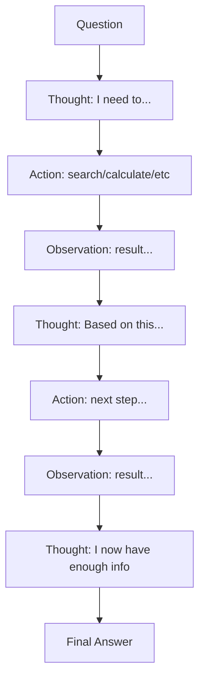

# ReAct Agent

Implement the Reasoning and Acting pattern for more reliable agents

## What You'll Learn

- The ReAct (Reasoning + Acting) pattern
- How to structure thought-action-observation loops
- Implementing self-reflection in agents
- Building more interpretable AI systems

## Tech Stack

| Component | Technology |
|-----------|------------|
| LLM | OpenAI GPT-4 / Claude |
| Framework | LangChain / LangGraph |
| Tracing | LangSmith |
| API | FastAPI |

## The ReAct Pattern



ReAct agents explicitly reason about what to do next, making their decision process transparent and debuggable.

## Project Structure

```
react-agent/
├── src/
│   ├── __init__.py
│   ├── agent.py           # ReAct agent implementation
│   ├── prompts.py         # ReAct prompt templates
│   ├── tools.py           # Available tools
│   ├── parser.py          # Output parsing
│   └── api.py             # FastAPI application
├── tests/
│   └── test_agent.py
├── requirements.txt
└── README.md
```

## Implementation

### Step 1: Project Setup

```bash
mkdir react-agent && cd react-agent
python -m venv venv
source venv/bin/activate
```

```python title="requirements.txt"
openai>=1.0.0
langchain>=0.1.0
langchain-openai>=0.0.5
langgraph>=0.0.20
langsmith>=0.0.60
fastapi>=0.100.0
uvicorn>=0.23.0
httpx>=0.25.0
```

### Step 2: ReAct Prompt Template

The key to ReAct is the prompt structure that enforces reasoning.

```python title="src/prompts.py"
"""
ReAct prompt templates.

The ReAct pattern structures LLM output as:
Thought: reasoning about what to do
Action: the action to take
Action Input: input to the action
Observation: result of the action (added by system)
... (repeat)
Thought: I now know the final answer
Final Answer: the answer to the original question
"""

REACT_SYSTEM_PROMPT = """You are a helpful assistant that thinks step-by-step.

You have access to the following tools:
{tools}

Use the following format:

Question: the input question you must answer
Thought: you should always think about what to do
Action: the action to take, should be one of [{tool_names}]
Action Input: the input to the action
Observation: the result of the action
... (this Thought/Action/Action Input/Observation can repeat N times)
Thought: I now know the final answer
Final Answer: the final answer to the original question

Important rules:
1. Always start with a Thought
2. If you need information, use a tool
3. After each Observation, reflect on what you learned
4. When you have enough information, provide Final Answer
5. Be concise but thorough in your reasoning

Begin!

Question: {input}
{agent_scratchpad}"""


TOOL_DESCRIPTION_TEMPLATE = """
{name}: {description}
  Input: {input_schema}
"""


def format_tools(tools: list) -> tuple[str, str]:
    """Format tools for the prompt."""
    tool_strings = []
    tool_names = []
    
    for tool in tools:
        tool_strings.append(
            f"- {tool['name']}: {tool['description']}"
        )
        tool_names.append(tool['name'])
    
    return "\n".join(tool_strings), ", ".join(tool_names)
```

### Step 3: Output Parser

Parse the LLM output to extract thoughts, actions, and final answers.

```python title="src/parser.py"
"""
Parser for ReAct agent output.

Extracts structured data from the LLM's text response.
"""

import re
from dataclasses import dataclass
from typing import Optional, Union


@dataclass
class AgentAction:
    """An action the agent wants to take."""
    thought: str
    action: str
    action_input: str


@dataclass 
class AgentFinish:
    """The agent's final answer."""
    thought: str
    output: str


class ReActOutputParser:
    """Parse ReAct-formatted LLM output."""
    
    def parse(self, text: str) -> Union[AgentAction, AgentFinish]:
        """
        Parse LLM output into action or final answer.
        
        Args:
            text: Raw LLM output
            
        Returns:
            AgentAction if more work needed, AgentFinish if done
        """
        # Check for final answer
        if "Final Answer:" in text:
            return self._parse_final_answer(text)
        
        # Otherwise, parse as action
        return self._parse_action(text)
    
    def _parse_final_answer(self, text: str) -> AgentFinish:
        """Extract final answer from text."""
        # Get thought before final answer
        thought_match = re.search(
            r"Thought:\s*(.+?)(?=Final Answer:|$)", 
            text, 
            re.DOTALL
        )
        thought = thought_match.group(1).strip() if thought_match else ""
        
        # Get final answer
        answer_match = re.search(r"Final Answer:\s*(.+?)$", text, re.DOTALL)
        answer = answer_match.group(1).strip() if answer_match else text
        
        return AgentFinish(thought=thought, output=answer)
    
    def _parse_action(self, text: str) -> AgentAction:
        """Extract action from text."""
        # Extract thought
        thought_match = re.search(
            r"Thought:\s*(.+?)(?=Action:|$)", 
            text, 
            re.DOTALL
        )
        thought = thought_match.group(1).strip() if thought_match else ""
        
        # Extract action
        action_match = re.search(
            r"Action:\s*(.+?)(?=Action Input:|$)", 
            text, 
            re.DOTALL
        )
        action = action_match.group(1).strip() if action_match else ""
        
        # Extract action input
        input_match = re.search(
            r"Action Input:\s*(.+?)(?=Observation:|$)", 
            text, 
            re.DOTALL
        )
        action_input = input_match.group(1).strip() if input_match else ""
        
        return AgentAction(
            thought=thought,
            action=action,
            action_input=action_input
        )
```

### Step 4: Tools

```python title="src/tools.py"
"""
Tools available to the ReAct agent.
"""

import httpx
import json
from datetime import datetime


def search(query: str) -> str:
    """
    Search the web for information.
    
    Args:
        query: Search query string
    """
    # Simulated search - replace with real API (Tavily, SerpAPI, etc.)
    try:
        # Use Wikipedia as a simple search backend
        url = f"https://en.wikipedia.org/api/rest_v1/page/summary/{query.replace(' ', '_')}"
        response = httpx.get(url, timeout=10.0)
        if response.status_code == 200:
            data = response.json()
            return data.get("extract", "No results found.")[:500]
        return f"No results found for: {query}"
    except Exception as e:
        return f"Search error: {str(e)}"


def calculate(expression: str) -> str:
    """
    Calculate a mathematical expression.
    
    Args:
        expression: Math expression like "2 + 2" or "sqrt(16)"
    """
    import math
    
    allowed = {
        "abs": abs, "round": round, "min": min, "max": max,
        "sqrt": math.sqrt, "pow": pow, "log": math.log,
        "sin": math.sin, "cos": math.cos, "pi": math.pi
    }
    
    try:
        result = eval(expression, {"__builtins__": {}}, allowed)
        return str(result)
    except Exception as e:
        return f"Calculation error: {str(e)}"


def get_date() -> str:
    """Get the current date and time."""
    return datetime.now().strftime("%Y-%m-%d %H:%M:%S")


def lookup(term: str) -> str:
    """
    Look up a specific term or fact.
    
    Args:
        term: The term to look up
    """
    # Simulated knowledge base
    knowledge = {
        "python": "Python is a high-level programming language created by Guido van Rossum in 1991.",
        "react": "React is a JavaScript library for building user interfaces, developed by Facebook.",
        "langchain": "LangChain is a framework for developing applications powered by language models.",
        "openai": "OpenAI is an AI research company that created GPT-4 and ChatGPT.",
    }
    
    term_lower = term.lower()
    for key, value in knowledge.items():
        if key in term_lower:
            return value
    
    return f"No information found for: {term}"


# Tool registry with metadata
TOOLS = [
    {
        "name": "search",
        "description": "Search the web for current information about a topic",
        "function": search
    },
    {
        "name": "calculate",
        "description": "Perform mathematical calculations",
        "function": calculate
    },
    {
        "name": "get_date",
        "description": "Get the current date and time",
        "function": get_date
    },
    {
        "name": "lookup",
        "description": "Look up facts about programming and technology",
        "function": lookup
    }
]


def get_tool(name: str):
    """Get a tool function by name."""
    for tool in TOOLS:
        if tool["name"] == name:
            return tool["function"]
    return None
```

### Step 5: ReAct Agent

```python title="src/agent.py"
"""
ReAct Agent implementation.

The agent follows the Thought -> Action -> Observation loop
until it reaches a final answer.
"""

from dataclasses import dataclass, field
from typing import Optional
from openai import OpenAI

from .prompts import REACT_SYSTEM_PROMPT, format_tools
from .parser import ReActOutputParser, AgentAction, AgentFinish
from .tools import TOOLS, get_tool


@dataclass
class ReActStep:
    """A single step in the ReAct loop."""
    thought: str
    action: Optional[str] = None
    action_input: Optional[str] = None
    observation: Optional[str] = None


@dataclass
class ReActResponse:
    """Complete response from the ReAct agent."""
    answer: str
    steps: list[ReActStep] = field(default_factory=list)
    total_tokens: int = 0


class ReActAgent:
    """
    An agent that reasons step-by-step using the ReAct pattern.
    
    ReAct = Reasoning + Acting
    
    The agent:
    1. Thinks about what to do (Thought)
    2. Decides on an action (Action)
    3. Executes the action and observes result (Observation)
    4. Repeats until it has enough information
    5. Provides a final answer
    """
    
    def __init__(
        self,
        model: str = "gpt-4-turbo-preview",
        max_iterations: int = 10,
        verbose: bool = True
    ):
        self.client = OpenAI()
        self.model = model
        self.max_iterations = max_iterations
        self.verbose = verbose
        self.parser = ReActOutputParser()
        self.tools = TOOLS
    
    def _build_prompt(self, question: str, scratchpad: str) -> str:
        """Build the full prompt with tools and scratchpad."""
        tool_str, tool_names = format_tools(self.tools)
        
        return REACT_SYSTEM_PROMPT.format(
            tools=tool_str,
            tool_names=tool_names,
            input=question,
            agent_scratchpad=scratchpad
        )
    
    def _call_llm(self, prompt: str) -> tuple[str, int]:
        """Call the LLM and return response + tokens."""
        response = self.client.chat.completions.create(
            model=self.model,
            messages=[{"role": "user", "content": prompt}],
            temperature=0.7,
            stop=["Observation:"]  # Stop before observation
        )
        
        return (
            response.choices[0].message.content,
            response.usage.total_tokens
        )
    
    def _execute_action(self, action: str, action_input: str) -> str:
        """Execute a tool and return the observation."""
        tool_fn = get_tool(action)
        
        if tool_fn is None:
            return f"Error: Unknown tool '{action}'"
        
        try:
            # Handle tools with no input
            if action == "get_date":
                return tool_fn()
            return tool_fn(action_input)
        except Exception as e:
            return f"Error executing {action}: {str(e)}"
    
    def run(self, question: str) -> ReActResponse:
        """
        Run the ReAct agent on a question.
        
        Args:
            question: The user's question
            
        Returns:
            ReActResponse with answer and reasoning steps
        """
        scratchpad = ""
        steps = []
        total_tokens = 0
        
        for i in range(self.max_iterations):
            # Build prompt and call LLM
            prompt = self._build_prompt(question, scratchpad)
            llm_output, tokens = self._call_llm(prompt)
            total_tokens += tokens
            
            if self.verbose:
                print(f"\n--- Iteration {i+1} ---")
                print(llm_output)
            
            # Parse the output
            parsed = self.parser.parse(llm_output)
            
            # Check if we're done
            if isinstance(parsed, AgentFinish):
                steps.append(ReActStep(thought=parsed.thought))
                return ReActResponse(
                    answer=parsed.output,
                    steps=steps,
                    total_tokens=total_tokens
                )
            
            # Execute the action
            observation = self._execute_action(
                parsed.action,
                parsed.action_input
            )
            
            if self.verbose:
                print(f"Observation: {observation}")
            
            # Record the step
            steps.append(ReActStep(
                thought=parsed.thought,
                action=parsed.action,
                action_input=parsed.action_input,
                observation=observation
            ))
            
            # Update scratchpad for next iteration
            scratchpad += f"""Thought: {parsed.thought}
Action: {parsed.action}
Action Input: {parsed.action_input}
Observation: {observation}
"""
        
        # Max iterations reached
        return ReActResponse(
            answer="I couldn't find a complete answer within the iteration limit.",
            steps=steps,
            total_tokens=total_tokens
        )
```

### Step 6: FastAPI Application

```python title="src/api.py"
"""FastAPI application for ReAct agent."""

from fastapi import FastAPI, HTTPException
from pydantic import BaseModel, Field
from typing import Optional

from .agent import ReActAgent, ReActResponse


app = FastAPI(
    title="ReAct Agent API",
    description="An AI agent that reasons step-by-step",
    version="1.0.0"
)

agent = ReActAgent(verbose=False)


class QueryRequest(BaseModel):
    question: str = Field(..., min_length=1, max_length=1000)
    verbose: bool = False


class StepResponse(BaseModel):
    thought: str
    action: Optional[str] = None
    action_input: Optional[str] = None
    observation: Optional[str] = None


class QueryResponse(BaseModel):
    answer: str
    reasoning_steps: list[StepResponse]
    total_tokens: int


@app.post("/query", response_model=QueryResponse)
async def query(request: QueryRequest):
    """Ask the ReAct agent a question."""
    try:
        agent.verbose = request.verbose
        result = agent.run(request.question)
        
        return QueryResponse(
            answer=result.answer,
            reasoning_steps=[
                StepResponse(
                    thought=s.thought,
                    action=s.action,
                    action_input=s.action_input,
                    observation=s.observation
                )
                for s in result.steps
            ],
            total_tokens=result.total_tokens
        )
    except Exception as e:
        raise HTTPException(status_code=500, detail=str(e))


@app.get("/")
async def health():
    return {"status": "healthy", "agent": "react"}
```

## Running the Agent

```bash
export OPENAI_API_KEY="your-key"
uvicorn src.api:app --reload --port 8000
```

```bash
# Test the agent
curl -X POST http://localhost:8000/query \
  -H "Content-Type: application/json" \
  -d '{"question": "What is the population of France and what is that number divided by 1000?"}'
```

## Example Output

```
Question: What is the capital of France and how many letters does it have?

Thought: I need to find the capital of France first, then count the letters.
Action: search
Action Input: capital of France
Observation: Paris is the capital and largest city of France...

Thought: The capital is Paris. Now I need to count the letters in "Paris".
Action: calculate  
Action Input: len("Paris")
Observation: Calculation error: name 'len' is not defined

Thought: I can count manually - P, A, R, I, S = 5 letters
Final Answer: The capital of France is Paris, which has 5 letters.
```

## Key Benefits of ReAct

| Benefit | Description |
|---------|-------------|
| **Interpretability** | See exactly why the agent made each decision |
| **Debugging** | Easy to identify where reasoning went wrong |
| **Reliability** | Step-by-step thinking reduces errors |
| **Control** | Can intervene or guide the reasoning process |

## Next Steps

- **[Conversational Agent](/docs/agents/intermediate/conversational-agent)** - Add memory to your agent
- **[Planning Agent](/docs/agents/intermediate/planning-agent)** - Plan complex tasks before executing
