# Multi-Modal Embeddings

Build systems that understand both text and images in the same embedding space

## What You'll Learn

- How CLIP aligns text and image embeddings
- Building cross-modal search (text-to-image, image-to-text)
- Multi-modal similarity and fusion
- Production deployment considerations

## Tech Stack

| Component | Technology |
|-----------|------------|
| Model | OpenCLIP / CLIP |
| Image Processing | PIL, torchvision |
| Vector Storage | ChromaDB |
| API | FastAPI |

## How CLIP Works

```mermaid
flowchart LR
    subgraph Inputs
        T[Text: A dog]
        I[Image: 🐕]
    end

    subgraph Encoders
        TE[Text Encoder]
        IE[Image Encoder]
    end

    subgraph Shared Space
        V[Same Vector Space]
    end

    T --> TE --> V
    I --> IE --> V
```



CLIP (Contrastive Language-Image Pre-training) learns to align text and images in a shared embedding space. This enables:
- **Text-to-Image**: Find images matching a text description
- **Image-to-Text**: Find text describing an image
- **Image-to-Image**: Find visually similar images

## Project Structure

```
multimodal-embeddings/
├── src/
│   ├── __init__.py
│   ├── clip_embeddings.py    # CLIP model wrapper
│   ├── image_processor.py    # Image preprocessing
│   ├── index.py              # Vector storage
│   └── api.py                # FastAPI application
├── data/
│   └── images/
├── app.py                    # Streamlit demo
├── requirements.txt
└── README.md
```

## Implementation

### Step 1: Setup

```txt title="requirements.txt"
open-clip-torch>=2.20.0
torch>=2.0.0
torchvision>=0.15.0
Pillow>=10.0.0
chromadb>=0.4.0
fastapi>=0.100.0
uvicorn>=0.23.0
streamlit>=1.28.0
numpy>=1.24.0
```

### Step 2: CLIP Embeddings

```python title="src/clip_embeddings.py"
"""
CLIP-based multi-modal embeddings.
"""

import torch
import open_clip
from PIL import Image
import numpy as np
from typing import Union
from pathlib import Path


class CLIPEmbedder:
    """
    Generate embeddings for text and images using CLIP.
    
    Both modalities are embedded into the same vector space,
    enabling cross-modal similarity search.
    """
    
    def __init__(
        self,
        model_name: str = "ViT-B-32",
        pretrained: str = "laion2b_s34b_b79k"
    ):
        """
        Initialize CLIP model.
        
        Args:
            model_name: CLIP model architecture
            pretrained: Pretrained weights to use
            
        Available models:
            - ViT-B-32: Good balance of speed and quality
            - ViT-L-14: Higher quality, slower
            - ViT-H-14: Highest quality, slowest
        """
        self.device = "cuda" if torch.cuda.is_available() else "cpu"
        
        self.model, _, self.preprocess = open_clip.create_model_and_transforms(
            model_name,
            pretrained=pretrained,
            device=self.device
        )
        
        self.tokenizer = open_clip.get_tokenizer(model_name)
        self.embedding_dim = self.model.visual.output_dim
    
    def embed_text(self, texts: Union[str, list[str]]) -> np.ndarray:
        """
        Generate embeddings for text.
        
        Args:
            texts: Single text or list of texts
            
        Returns:
            Normalized embeddings
        """
        if isinstance(texts, str):
            texts = [texts]
        
        with torch.no_grad():
            tokens = self.tokenizer(texts).to(self.device)
            embeddings = self.model.encode_text(tokens)
            embeddings = embeddings / embeddings.norm(dim=-1, keepdim=True)
        
        return embeddings.cpu().numpy()
    
    def embed_image(
        self,
        images: Union[Image.Image, list[Image.Image], str, list[str]]
    ) -> np.ndarray:
        """
        Generate embeddings for images.
        
        Args:
            images: PIL Image(s) or path(s) to images
            
        Returns:
            Normalized embeddings
        """
        # Handle paths
        if isinstance(images, str):
            images = [Image.open(images)]
        elif isinstance(images, list) and isinstance(images[0], str):
            images = [Image.open(p) for p in images]
        elif isinstance(images, Image.Image):
            images = [images]
        
        # Preprocess
        processed = torch.stack([
            self.preprocess(img) for img in images
        ]).to(self.device)
        
        with torch.no_grad():
            embeddings = self.model.encode_image(processed)
            embeddings = embeddings / embeddings.norm(dim=-1, keepdim=True)
        
        return embeddings.cpu().numpy()
    
    def similarity(
        self,
        text_embeddings: np.ndarray,
        image_embeddings: np.ndarray
    ) -> np.ndarray:
        """
        Compute similarity between text and image embeddings.
        
        Args:
            text_embeddings: Text embeddings (n_texts, dim)
            image_embeddings: Image embeddings (n_images, dim)
            
        Returns:
            Similarity matrix (n_texts, n_images)
        """
        return np.dot(text_embeddings, image_embeddings.T)


class MultiModalIndex:
    """
    Index for storing and searching multi-modal embeddings.
    """
    
    def __init__(self, embedder: CLIPEmbedder):
        import chromadb
        
        self.embedder = embedder
        self.client = chromadb.Client()
        
        # Separate collections for images and texts
        self.image_collection = self.client.get_or_create_collection(
            name="images",
            metadata={"hnsw:space": "cosine"}
        )
        
        self.text_collection = self.client.get_or_create_collection(
            name="texts",
            metadata={"hnsw:space": "cosine"}
        )
    
    def add_images(
        self,
        image_paths: list[str],
        metadata: list[dict] = None
    ) -> None:
        """Add images to the index."""
        embeddings = self.embedder.embed_image(image_paths)
        
        ids = [f"img_{i}" for i in range(len(image_paths))]
        meta = metadata or [{"path": p} for p in image_paths]
        
        self.image_collection.add(
            ids=ids,
            embeddings=embeddings.tolist(),
            metadatas=meta,
            documents=image_paths
        )
    
    def add_texts(
        self,
        texts: list[str],
        metadata: list[dict] = None
    ) -> None:
        """Add texts to the index."""
        embeddings = self.embedder.embed_text(texts)
        
        ids = [f"txt_{i}" for i in range(len(texts))]
        meta = metadata or [{"text": t} for t in texts]
        
        self.text_collection.add(
            ids=ids,
            embeddings=embeddings.tolist(),
            metadatas=meta,
            documents=texts
        )
    
    def search_images_by_text(
        self,
        query: str,
        n: int = 5
    ) -> list[dict]:
        """
        Find images matching a text query.
        
        Text-to-Image search.
        """
        query_embedding = self.embedder.embed_text(query)
        
        results = self.image_collection.query(
            query_embeddings=query_embedding.tolist(),
            n_results=n
        )
        
        return [
            {
                "id": results["ids"][0][i],
                "path": results["documents"][0][i],
                "score": 1 - results["distances"][0][i],
                "metadata": results["metadatas"][0][i]
            }
            for i in range(len(results["ids"][0]))
        ]
    
    def search_texts_by_image(
        self,
        image_path: str,
        n: int = 5
    ) -> list[dict]:
        """
        Find texts describing an image.
        
        Image-to-Text search.
        """
        query_embedding = self.embedder.embed_image(image_path)
        
        results = self.text_collection.query(
            query_embeddings=query_embedding.tolist(),
            n_results=n
        )
        
        return [
            {
                "id": results["ids"][0][i],
                "text": results["documents"][0][i],
                "score": 1 - results["distances"][0][i]
            }
            for i in range(len(results["ids"][0]))
        ]
    
    def search_similar_images(
        self,
        image_path: str,
        n: int = 5
    ) -> list[dict]:
        """
        Find visually similar images.
        
        Image-to-Image search.
        """
        query_embedding = self.embedder.embed_image(image_path)
        
        results = self.image_collection.query(
            query_embeddings=query_embedding.tolist(),
            n_results=n + 1  # +1 to exclude self
        )
        
        # Filter out the query image itself
        return [
            {
                "id": results["ids"][0][i],
                "path": results["documents"][0][i],
                "score": 1 - results["distances"][0][i],
                "metadata": results["metadatas"][0][i]
            }
            for i in range(len(results["ids"][0]))
            if results["documents"][0][i] != image_path
        ][:n]


# Example usage
if __name__ == "__main__":
    embedder = CLIPEmbedder()
    
    # Embed text
    text_emb = embedder.embed_text("a photo of a cat")
    print(f"Text embedding shape: {text_emb.shape}")
    
    # Embed image (if you have one)
    # image_emb = embedder.embed_image("cat.jpg")
    # similarity = embedder.similarity(text_emb, image_emb)
    # print(f"Similarity: {similarity[0][0]:.4f}")
```

### Step 3: Image Processing

```python title="src/image_processor.py"
"""
Image processing utilities for CLIP.
"""

from PIL import Image
import io
import base64
from pathlib import Path
from typing import Union, Optional
import numpy as np


def load_image(source: Union[str, bytes, Image.Image]) -> Image.Image:
    """
    Load image from various sources.
    
    Args:
        source: File path, bytes, or PIL Image
    """
    if isinstance(source, Image.Image):
        return source
    elif isinstance(source, bytes):
        return Image.open(io.BytesIO(source))
    elif isinstance(source, str):
        if source.startswith("data:image"):
            # Base64 encoded
            header, data = source.split(",", 1)
            return Image.open(io.BytesIO(base64.b64decode(data)))
        else:
            # File path
            return Image.open(source)
    else:
        raise ValueError(f"Unsupported image source type: {type(source)}")


def resize_image(
    image: Image.Image,
    max_size: int = 512,
    keep_aspect: bool = True
) -> Image.Image:
    """
    Resize image while maintaining aspect ratio.
    """
    if keep_aspect:
        image.thumbnail((max_size, max_size), Image.Resampling.LANCZOS)
        return image
    else:
        return image.resize((max_size, max_size), Image.Resampling.LANCZOS)


def convert_to_rgb(image: Image.Image) -> Image.Image:
    """Convert image to RGB mode (required for CLIP)."""
    if image.mode != "RGB":
        return image.convert("RGB")
    return image


def image_to_base64(image: Image.Image, format: str = "PNG") -> str:
    """Convert PIL Image to base64 string."""
    buffer = io.BytesIO()
    image.save(buffer, format=format)
    return base64.b64encode(buffer.getvalue()).decode()


def process_image_for_clip(
    source: Union[str, bytes, Image.Image]
) -> Image.Image:
    """
    Prepare image for CLIP embedding.
    
    - Load from various sources
    - Convert to RGB
    - Resize if too large
    """
    image = load_image(source)
    image = convert_to_rgb(image)
    image = resize_image(image, max_size=512)
    return image


def create_image_grid(
    images: list[Image.Image],
    cols: int = 4,
    cell_size: int = 256
) -> Image.Image:
    """
    Create a grid of images for visualization.
    """
    n_images = len(images)
    rows = (n_images + cols - 1) // cols
    
    grid = Image.new(
        "RGB",
        (cols * cell_size, rows * cell_size),
        color="white"
    )
    
    for i, img in enumerate(images):
        row = i // cols
        col = i % cols
        
        # Resize to cell size
        img_resized = img.copy()
        img_resized.thumbnail((cell_size, cell_size))
        
        # Center in cell
        x = col * cell_size + (cell_size - img_resized.width) // 2
        y = row * cell_size + (cell_size - img_resized.height) // 2
        
        grid.paste(img_resized, (x, y))
    
    return grid
```

### Step 4: FastAPI Application

```python title="src/api.py"
"""
FastAPI application for multi-modal search.
"""

from fastapi import FastAPI, UploadFile, File, HTTPException
from fastapi.responses import FileResponse
from pydantic import BaseModel
from typing import Optional
import tempfile
from pathlib import Path

from .clip_embeddings import CLIPEmbedder, MultiModalIndex
from .image_processor import process_image_for_clip, image_to_base64


app = FastAPI(
    title="Multi-Modal Search API",
    description="Search across text and images using CLIP",
    version="1.0.0"
)

# Initialize
embedder = CLIPEmbedder()
index = MultiModalIndex(embedder)


class TextSearchRequest(BaseModel):
    query: str
    n_results: int = 5


class TextSearchResult(BaseModel):
    id: str
    path: str
    score: float


class SimilarityRequest(BaseModel):
    text: str
    image_path: str


@app.post("/index/images")
async def index_images(image_paths: list[str]):
    """Index a list of image files."""
    # Validate paths
    valid_paths = [p for p in image_paths if Path(p).exists()]
    
    if not valid_paths:
        raise HTTPException(status_code=400, detail="No valid image paths")
    
    index.add_images(valid_paths)
    
    return {"message": f"Indexed {len(valid_paths)} images"}


@app.post("/index/texts")
async def index_texts(texts: list[str]):
    """Index a list of text documents."""
    index.add_texts(texts)
    return {"message": f"Indexed {len(texts)} texts"}


@app.post("/search/text-to-image")
async def search_images_by_text(request: TextSearchRequest):
    """
    Find images matching a text description.
    
    Example: "a sunset over the ocean" -> finds sunset photos
    """
    results = index.search_images_by_text(
        request.query,
        n=request.n_results
    )
    
    return {"query": request.query, "results": results}


@app.post("/search/image-to-text")
async def search_texts_by_image(file: UploadFile = File(...), n: int = 5):
    """
    Find text descriptions for an uploaded image.
    """
    # Save uploaded file temporarily
    with tempfile.NamedTemporaryFile(delete=False, suffix=".jpg") as tmp:
        content = await file.read()
        tmp.write(content)
        tmp_path = tmp.name
    
    try:
        results = index.search_texts_by_image(tmp_path, n=n)
        return {"results": results}
    finally:
        Path(tmp_path).unlink()


@app.post("/search/similar-images")
async def search_similar_images(file: UploadFile = File(...), n: int = 5):
    """
    Find visually similar images to the uploaded image.
    """
    with tempfile.NamedTemporaryFile(delete=False, suffix=".jpg") as tmp:
        content = await file.read()
        tmp.write(content)
        tmp_path = tmp.name
    
    try:
        results = index.search_similar_images(tmp_path, n=n)
        return {"results": results}
    finally:
        Path(tmp_path).unlink()


@app.post("/similarity")
async def compute_similarity(request: SimilarityRequest):
    """
    Compute similarity between a text and an image.
    
    Returns a score from 0-1 indicating how well the text describes the image.
    """
    text_emb = embedder.embed_text(request.text)
    image_emb = embedder.embed_image(request.image_path)
    
    similarity = float(embedder.similarity(text_emb, image_emb)[0][0])
    
    return {
        "text": request.text,
        "image": request.image_path,
        "similarity": similarity
    }


@app.get("/stats")
async def get_stats():
    """Get index statistics."""
    return {
        "model": "ViT-B-32",
        "embedding_dim": embedder.embedding_dim,
        "images_indexed": index.image_collection.count(),
        "texts_indexed": index.text_collection.count()
    }
```

### Step 5: Streamlit Demo

```python title="app.py"
"""
Streamlit demo for multi-modal search.
"""

import streamlit as st
from PIL import Image
import tempfile
from pathlib import Path

from src.clip_embeddings import CLIPEmbedder, MultiModalIndex
from src.image_processor import create_image_grid


st.set_page_config(
    page_title="Multi-Modal Search",
    page_icon="🖼️",
    layout="wide"
)


@st.cache_resource
def load_model():
    embedder = CLIPEmbedder()
    index = MultiModalIndex(embedder)
    return embedder, index


def main():
    st.title("🖼️ Multi-Modal Search with CLIP")
    st.markdown("Search images with text, or find similar images")
    
    embedder, index = load_model()
    
    tab1, tab2, tab3 = st.tabs([
        "📝 Text-to-Image",
        "🖼️ Image-to-Image",
        "📊 Add Images"
    ])
    
    with tab1:
        st.subheader("Find images by description")
        
        query = st.text_input(
            "Enter description",
            placeholder="a photo of a sunset"
        )
        
        if st.button("Search", key="text_search"):
            if query and index.image_collection.count() > 0:
                results = index.search_images_by_text(query, n=6)
                
                if results:
                    cols = st.columns(3)
                    for i, result in enumerate(results):
                        with cols[i % 3]:
                            try:
                                img = Image.open(result["path"])
                                st.image(img, caption=f"Score: {result['score']:.3f}")
                            except:
                                st.error(f"Could not load: {result['path']}")
                else:
                    st.warning("No results found")
            else:
                st.warning("Add some images first!")
    
    with tab2:
        st.subheader("Find similar images")
        
        uploaded = st.file_uploader(
            "Upload an image",
            type=["jpg", "jpeg", "png"]
        )
        
        if uploaded:
            # Show uploaded image
            image = Image.open(uploaded)
            st.image(image, caption="Query image", width=300)
            
            if st.button("Find Similar", key="image_search"):
                # Save temporarily
                with tempfile.NamedTemporaryFile(delete=False, suffix=".jpg") as tmp:
                    image.save(tmp.name)
                    tmp_path = tmp.name
                
                results = index.search_similar_images(tmp_path, n=6)
                Path(tmp_path).unlink()
                
                if results:
                    st.subheader("Similar images:")
                    cols = st.columns(3)
                    for i, result in enumerate(results):
                        with cols[i % 3]:
                            try:
                                img = Image.open(result["path"])
                                st.image(img, caption=f"Score: {result['score']:.3f}")
                            except:
                                st.error(f"Could not load: {result['path']}")
                else:
                    st.warning("No similar images found")
    
    with tab3:
        st.subheader("Add images to index")
        
        uploaded_files = st.file_uploader(
            "Upload images",
            type=["jpg", "jpeg", "png"],
            accept_multiple_files=True
        )
        
        if uploaded_files and st.button("Index Images"):
            paths = []
            for uploaded in uploaded_files:
                # Save to temp directory
                temp_dir = Path(tempfile.gettempdir()) / "clip_images"
                temp_dir.mkdir(exist_ok=True)
                
                path = temp_dir / uploaded.name
                with open(path, "wb") as f:
                    f.write(uploaded.getbuffer())
                paths.append(str(path))
            
            with st.spinner("Indexing..."):
                index.add_images(paths)
            
            st.success(f"Indexed {len(paths)} images!")
        
        st.metric("Images indexed", index.image_collection.count())


if __name__ == "__main__":
    main()
```

## Running the Application

```bash
# Install dependencies
pip install -r requirements.txt

# Run the API
uvicorn src.api:app --reload --port 8000

# Run the demo
streamlit run app.py
```

## Key Concepts

### CLIP Model Variants

| Model | Dim | Speed | Quality |
|-------|-----|-------|---------|
| ViT-B-32 | 512 | Fast | Good |
| ViT-B-16 | 512 | Medium | Better |
| ViT-L-14 | 768 | Slow | Best |

### Use Cases

- **E-commerce**: Search products by description
- **Stock Photos**: Find images matching keywords
- **Content Moderation**: Detect specific content
- **Accessibility**: Generate image descriptions

## Next Steps

- [Search at Scale](/docs/embeddings/advanced/search-at-scale) - Scale to billions of vectors
- [Production Pipeline](/docs/embeddings/advanced/production-pipeline) - Deploy for production
