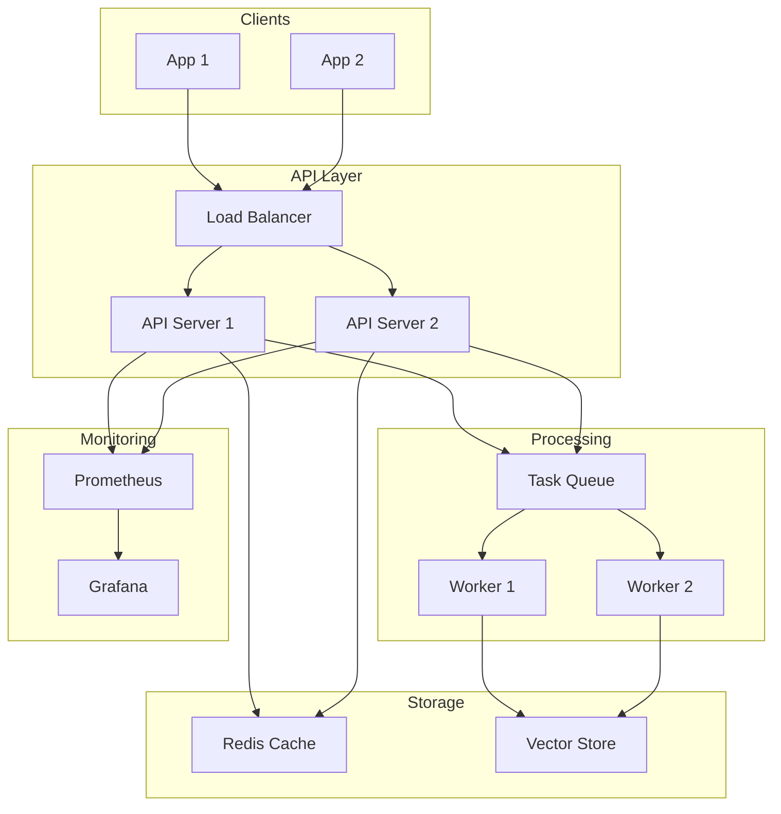

# Production Embedding Pipeline

Build enterprise-grade embedding infrastructure that scales

## What You'll Learn

- Batch embedding generation for large datasets
- Caching strategies for low latency
- Rate limiting and error handling
- Monitoring and observability

## Tech Stack

| Component | Technology |
|-----------|------------|
| Embeddings | OpenAI / sentence-transformers |
| Queue | Redis / Celery |
| Cache | Redis |
| Monitoring | Prometheus + Grafana |
| API | FastAPI |

## Architecture



## Project Structure

```
embedding-pipeline/
├── src/
│   ├── __init__.py
│   ├── config.py          # Configuration
│   ├── embeddings.py      # Embedding generation
│   ├── cache.py           # Caching layer
│   ├── queue.py           # Task queue
│   ├── rate_limiter.py    # Rate limiting
│   ├── metrics.py         # Prometheus metrics
│   └── api.py             # FastAPI application
├── workers/
│   └── embedding_worker.py
├── docker-compose.yml
├── requirements.txt
└── README.md
```

## Implementation

### Step 1: Configuration

```python title="src/config.py"
"""
Configuration management for embedding pipeline.
"""

from pydantic_settings import BaseSettings
from functools import lru_cache


class Settings(BaseSettings):
    """Application settings."""
    
    # API
    api_host: str = "0.0.0.0"
    api_port: int = 8000
    
    # Embedding model
    embedding_model: str = "all-MiniLM-L6-v2"
    embedding_dim: int = 384
    batch_size: int = 32
    max_text_length: int = 512
    
    # Redis
    redis_url: str = "redis://localhost:6379"
    cache_ttl: int = 86400  # 24 hours
    
    # Rate limiting
    rate_limit_requests: int = 100
    rate_limit_window: int = 60  # seconds
    
    # OpenAI (optional)
    openai_api_key: str = ""
    use_openai: bool = False
    
    class Config:
        env_file = ".env"


@lru_cache
def get_settings() -> Settings:
    return Settings()
```

### Step 2: Embedding Service

```python title="src/embeddings.py"
"""
Embedding generation service with batching support.
"""

import numpy as np
from sentence_transformers import SentenceTransformer
from typing import Optional
import hashlib
import asyncio
from concurrent.futures import ThreadPoolExecutor

from .config import get_settings


class EmbeddingService:
    """
    Production embedding service with batching and async support.
    """
    
    def __init__(self):
        settings = get_settings()
        self.model = SentenceTransformer(settings.embedding_model)
        self.batch_size = settings.batch_size
        self.max_length = settings.max_text_length
        self.executor = ThreadPoolExecutor(max_workers=4)
    
    def _truncate_text(self, text: str) -> str:
        """Truncate text to max length."""
        if len(text) > self.max_length:
            return text[:self.max_length]
        return text
    
    def _compute_hash(self, text: str) -> str:
        """Compute hash for caching."""
        return hashlib.sha256(text.encode()).hexdigest()[:16]
    
    def embed_single(self, text: str) -> np.ndarray:
        """Generate embedding for a single text."""
        text = self._truncate_text(text)
        return self.model.encode(
            text,
            convert_to_numpy=True,
            normalize_embeddings=True
        )
    
    def embed_batch(self, texts: list[str]) -> np.ndarray:
        """
        Generate embeddings for a batch of texts.
        
        More efficient than single embeddings for multiple texts.
        """
        texts = [self._truncate_text(t) for t in texts]
        
        return self.model.encode(
            texts,
            convert_to_numpy=True,
            normalize_embeddings=True,
            batch_size=self.batch_size,
            show_progress_bar=len(texts) > 100
        )
    
    async def embed_async(self, text: str) -> np.ndarray:
        """Async embedding generation."""
        loop = asyncio.get_event_loop()
        return await loop.run_in_executor(
            self.executor,
            self.embed_single,
            text
        )
    
    async def embed_batch_async(self, texts: list[str]) -> np.ndarray:
        """Async batch embedding generation."""
        loop = asyncio.get_event_loop()
        return await loop.run_in_executor(
            self.executor,
            self.embed_batch,
            texts
        )


class OpenAIEmbeddingService:
    """
    OpenAI embedding service with rate limiting and retries.
    """
    
    def __init__(self):
        import openai
        settings = get_settings()
        self.client = openai.OpenAI(api_key=settings.openai_api_key)
        self.model = "text-embedding-3-small"
    
    def embed_single(self, text: str) -> np.ndarray:
        """Generate embedding using OpenAI."""
        response = self.client.embeddings.create(
            input=text,
            model=self.model
        )
        return np.array(response.data[0].embedding)
    
    def embed_batch(self, texts: list[str]) -> np.ndarray:
        """Generate batch embeddings using OpenAI."""
        response = self.client.embeddings.create(
            input=texts,
            model=self.model
        )
        return np.array([d.embedding for d in response.data])


# Factory function
def get_embedding_service():
    settings = get_settings()
    if settings.use_openai and settings.openai_api_key:
        return OpenAIEmbeddingService()
    return EmbeddingService()
```

### Step 3: Caching Layer

```python title="src/cache.py"
"""
Redis-based caching for embeddings.
"""

import numpy as np
import redis
import json
import hashlib
from typing import Optional

from .config import get_settings


class EmbeddingCache:
    """
    Redis cache for embeddings.
    
    Stores embeddings as JSON-encoded lists for simplicity.
    For production with high throughput, consider using
    Redis with numpy serialization or a dedicated vector cache.
    """
    
    def __init__(self):
        settings = get_settings()
        self.redis = redis.from_url(settings.redis_url)
        self.ttl = settings.cache_ttl
        self.prefix = "emb:"
    
    def _key(self, text: str) -> str:
        """Generate cache key from text."""
        text_hash = hashlib.sha256(text.encode()).hexdigest()[:16]
        return f"{self.prefix}{text_hash}"
    
    def get(self, text: str) -> Optional[np.ndarray]:
        """Get embedding from cache."""
        key = self._key(text)
        data = self.redis.get(key)
        
        if data:
            return np.array(json.loads(data))
        return None
    
    def set(self, text: str, embedding: np.ndarray) -> None:
        """Store embedding in cache."""
        key = self._key(text)
        data = json.dumps(embedding.tolist())
        self.redis.setex(key, self.ttl, data)
    
    def get_many(self, texts: list[str]) -> dict[str, Optional[np.ndarray]]:
        """Get multiple embeddings from cache."""
        keys = [self._key(t) for t in texts]
        values = self.redis.mget(keys)
        
        results = {}
        for text, value in zip(texts, values):
            if value:
                results[text] = np.array(json.loads(value))
            else:
                results[text] = None
        
        return results
    
    def set_many(self, embeddings: dict[str, np.ndarray]) -> None:
        """Store multiple embeddings in cache."""
        pipe = self.redis.pipeline()
        
        for text, embedding in embeddings.items():
            key = self._key(text)
            data = json.dumps(embedding.tolist())
            pipe.setex(key, self.ttl, data)
        
        pipe.execute()
    
    def invalidate(self, text: str) -> None:
        """Remove embedding from cache."""
        key = self._key(text)
        self.redis.delete(key)
    
    def stats(self) -> dict:
        """Get cache statistics."""
        info = self.redis.info("stats")
        keys = self.redis.keys(f"{self.prefix}*")
        
        return {
            "cached_embeddings": len(keys),
            "hits": info.get("keyspace_hits", 0),
            "misses": info.get("keyspace_misses", 0),
            "hit_rate": info.get("keyspace_hits", 0) / 
                       max(1, info.get("keyspace_hits", 0) + info.get("keyspace_misses", 0))
        }


class CachedEmbeddingService:
    """
    Embedding service with caching.
    """
    
    def __init__(self, embedding_service, cache: EmbeddingCache):
        self.embedder = embedding_service
        self.cache = cache
    
    def embed(self, text: str) -> np.ndarray:
        """Get embedding with cache lookup."""
        # Check cache
        cached = self.cache.get(text)
        if cached is not None:
            return cached
        
        # Generate and cache
        embedding = self.embedder.embed_single(text)
        self.cache.set(text, embedding)
        
        return embedding
    
    def embed_batch(self, texts: list[str]) -> np.ndarray:
        """
        Get embeddings with batch cache lookup.
        
        Only computes embeddings for cache misses.
        """
        # Check cache for all texts
        cached = self.cache.get_many(texts)
        
        # Separate hits and misses
        hits = {t: e for t, e in cached.items() if e is not None}
        misses = [t for t in texts if cached[t] is None]
        
        # Compute missing embeddings
        if misses:
            new_embeddings = self.embedder.embed_batch(misses)
            
            # Cache new embeddings
            new_cache = {t: e for t, e in zip(misses, new_embeddings)}
            self.cache.set_many(new_cache)
            hits.update(new_cache)
        
        # Return in original order
        return np.array([hits[t] for t in texts])
```

### Step 4: Rate Limiting

```python title="src/rate_limiter.py"
"""
Rate limiting for API protection.
"""

import redis
import time
from typing import Optional

from .config import get_settings


class RateLimiter:
    """
    Token bucket rate limiter using Redis.
    """
    
    def __init__(self, key_prefix: str = "rate:"):
        settings = get_settings()
        self.redis = redis.from_url(settings.redis_url)
        self.prefix = key_prefix
        self.max_requests = settings.rate_limit_requests
        self.window = settings.rate_limit_window
    
    def _key(self, identifier: str) -> str:
        return f"{self.prefix}{identifier}"
    
    def is_allowed(self, identifier: str) -> tuple[bool, dict]:
        """
        Check if request is allowed under rate limit.
        
        Args:
            identifier: Unique identifier (IP, API key, user ID)
            
        Returns:
            Tuple of (allowed, info_dict)
        """
        key = self._key(identifier)
        now = time.time()
        window_start = now - self.window
        
        pipe = self.redis.pipeline()
        
        # Remove old entries
        pipe.zremrangebyscore(key, 0, window_start)
        
        # Count current requests
        pipe.zcard(key)
        
        # Add new request
        pipe.zadd(key, {str(now): now})
        
        # Set expiry
        pipe.expire(key, self.window)
        
        results = pipe.execute()
        current_count = results[1]
        
        allowed = current_count < self.max_requests
        
        return allowed, {
            "remaining": max(0, self.max_requests - current_count - 1),
            "limit": self.max_requests,
            "reset": int(now + self.window)
        }
    
    def get_wait_time(self, identifier: str) -> float:
        """Get time to wait before next allowed request."""
        key = self._key(identifier)
        now = time.time()
        window_start = now - self.window
        
        # Get oldest request in window
        oldest = self.redis.zrangebyscore(
            key, window_start, now, start=0, num=1, withscores=True
        )
        
        if not oldest:
            return 0
        
        oldest_time = oldest[0][1]
        wait = (oldest_time + self.window) - now
        
        return max(0, wait)


class RateLimitMiddleware:
    """
    FastAPI middleware for rate limiting.
    """
    
    def __init__(self):
        self.limiter = RateLimiter()
    
    async def __call__(self, request, call_next):
        from fastapi import HTTPException
        from fastapi.responses import JSONResponse
        
        # Get identifier (IP or API key)
        identifier = request.client.host
        if "x-api-key" in request.headers:
            identifier = request.headers["x-api-key"]
        
        allowed, info = self.limiter.is_allowed(identifier)
        
        if not allowed:
            return JSONResponse(
                status_code=429,
                content={
                    "error": "Rate limit exceeded",
                    "retry_after": info["reset"]
                },
                headers={
                    "X-RateLimit-Limit": str(info["limit"]),
                    "X-RateLimit-Remaining": str(info["remaining"]),
                    "X-RateLimit-Reset": str(info["reset"])
                }
            )
        
        response = await call_next(request)
        
        # Add rate limit headers
        response.headers["X-RateLimit-Limit"] = str(info["limit"])
        response.headers["X-RateLimit-Remaining"] = str(info["remaining"])
        response.headers["X-RateLimit-Reset"] = str(info["reset"])
        
        return response
```

### Step 5: Prometheus Metrics

```python title="src/metrics.py"
"""
Prometheus metrics for monitoring.
"""

from prometheus_client import Counter, Histogram, Gauge, generate_latest
import time
from functools import wraps


# Counters
EMBEDDING_REQUESTS = Counter(
    "embedding_requests_total",
    "Total embedding requests",
    ["status", "cached"]
)

# Histograms
EMBEDDING_LATENCY = Histogram(
    "embedding_latency_seconds",
    "Embedding generation latency",
    ["model"],
    buckets=[0.01, 0.05, 0.1, 0.25, 0.5, 1.0, 2.5, 5.0]
)

BATCH_SIZE = Histogram(
    "embedding_batch_size",
    "Size of embedding batches",
    buckets=[1, 5, 10, 25, 50, 100, 250, 500]
)

# Gauges
CACHE_HIT_RATE = Gauge(
    "embedding_cache_hit_rate",
    "Cache hit rate"
)

QUEUE_SIZE = Gauge(
    "embedding_queue_size",
    "Number of pending embedding tasks"
)


def track_latency(model_name: str = "default"):
    """Decorator to track embedding latency."""
    def decorator(func):
        @wraps(func)
        def wrapper(*args, **kwargs):
            start = time.time()
            try:
                result = func(*args, **kwargs)
                EMBEDDING_REQUESTS.labels(status="success", cached="false").inc()
                return result
            except Exception as e:
                EMBEDDING_REQUESTS.labels(status="error", cached="false").inc()
                raise
            finally:
                EMBEDDING_LATENCY.labels(model=model_name).observe(time.time() - start)
        return wrapper
    return decorator


def track_async_latency(model_name: str = "default"):
    """Decorator to track async embedding latency."""
    def decorator(func):
        @wraps(func)
        async def wrapper(*args, **kwargs):
            start = time.time()
            try:
                result = await func(*args, **kwargs)
                EMBEDDING_REQUESTS.labels(status="success", cached="false").inc()
                return result
            except Exception as e:
                EMBEDDING_REQUESTS.labels(status="error", cached="false").inc()
                raise
            finally:
                EMBEDDING_LATENCY.labels(model=model_name).observe(time.time() - start)
        return wrapper
    return decorator
```

### Step 6: FastAPI Application

```python title="src/api.py"
"""
FastAPI application for embedding service.
"""

from fastapi import FastAPI, HTTPException, Depends
from pydantic import BaseModel, Field
from prometheus_client import generate_latest
from starlette.responses import Response
from typing import Optional

from .embeddings import get_embedding_service, EmbeddingService
from .cache import EmbeddingCache, CachedEmbeddingService
from .rate_limiter import RateLimiter
from .metrics import (
    EMBEDDING_REQUESTS, BATCH_SIZE, CACHE_HIT_RATE,
    track_latency, track_async_latency
)
from .config import get_settings


app = FastAPI(
    title="Embedding Pipeline API",
    description="Production embedding service with caching",
    version="1.0.0"
)

# Initialize services
embedding_service = get_embedding_service()
cache = EmbeddingCache()
cached_service = CachedEmbeddingService(embedding_service, cache)
rate_limiter = RateLimiter()


# Request/Response models
class EmbedRequest(BaseModel):
    text: str = Field(..., max_length=10000)


class EmbedBatchRequest(BaseModel):
    texts: list[str] = Field(..., max_length=100)


class EmbedResponse(BaseModel):
    embedding: list[float]
    cached: bool
    model: str


class EmbedBatchResponse(BaseModel):
    embeddings: list[list[float]]
    count: int
    cached_count: int


# Dependency for rate limiting
async def check_rate_limit(request):
    identifier = request.client.host
    allowed, info = rate_limiter.is_allowed(identifier)
    
    if not allowed:
        raise HTTPException(
            status_code=429,
            detail="Rate limit exceeded",
            headers={
                "Retry-After": str(info["reset"]),
                "X-RateLimit-Remaining": str(info["remaining"])
            }
        )
    
    return info


@app.get("/health")
async def health():
    """Health check endpoint."""
    return {"status": "healthy"}


@app.post("/embed", response_model=EmbedResponse)
async def embed_text(
    request: EmbedRequest,
    rate_info: dict = Depends(check_rate_limit)
):
    """
    Generate embedding for a single text.
    
    Uses caching for repeated requests.
    """
    settings = get_settings()
    
    # Check cache first
    cached_embedding = cache.get(request.text)
    
    if cached_embedding is not None:
        EMBEDDING_REQUESTS.labels(status="success", cached="true").inc()
        return EmbedResponse(
            embedding=cached_embedding.tolist(),
            cached=True,
            model=settings.embedding_model
        )
    
    # Generate embedding
    embedding = cached_service.embed(request.text)
    
    return EmbedResponse(
        embedding=embedding.tolist(),
        cached=False,
        model=settings.embedding_model
    )


@app.post("/embed/batch", response_model=EmbedBatchResponse)
async def embed_batch(
    request: EmbedBatchRequest,
    rate_info: dict = Depends(check_rate_limit)
):
    """
    Generate embeddings for multiple texts.
    
    More efficient than individual requests.
    """
    BATCH_SIZE.observe(len(request.texts))
    
    # Check cache for all
    cached = cache.get_many(request.texts)
    cached_count = sum(1 for v in cached.values() if v is not None)
    
    # Generate all embeddings (cache-aware)
    embeddings = cached_service.embed_batch(request.texts)
    
    return EmbedBatchResponse(
        embeddings=embeddings.tolist(),
        count=len(request.texts),
        cached_count=cached_count
    )


@app.get("/metrics")
async def metrics():
    """Prometheus metrics endpoint."""
    # Update cache metrics
    stats = cache.stats()
    CACHE_HIT_RATE.set(stats["hit_rate"])
    
    return Response(
        content=generate_latest(),
        media_type="text/plain"
    )


@app.get("/stats")
async def stats():
    """Get service statistics."""
    cache_stats = cache.stats()
    settings = get_settings()
    
    return {
        "model": settings.embedding_model,
        "embedding_dim": settings.embedding_dim,
        "cache": cache_stats
    }
```

### Step 7: Docker Compose

```yaml title="docker-compose.yml"
version: "3.8"

services:
  api:
    build: .
    ports:
      - "8000:8000"
    environment:
      - REDIS_URL=redis://redis:6379
      - EMBEDDING_MODEL=all-MiniLM-L6-v2
    depends_on:
      - redis
    deploy:
      replicas: 2
      resources:
        limits:
          memory: 2G

  redis:
    image: redis:7-alpine
    ports:
      - "6379:6379"
    volumes:
      - redis_data:/data

  prometheus:
    image: prom/prometheus:latest
    ports:
      - "9090:9090"
    volumes:
      - ./prometheus.yml:/etc/prometheus/prometheus.yml

  grafana:
    image: grafana/grafana:latest
    ports:
      - "3001:3000"
    environment:
      - GF_SECURITY_ADMIN_PASSWORD=admin
    volumes:
      - grafana_data:/var/lib/grafana

volumes:
  redis_data:
  grafana_data:
```

```dockerfile title="Dockerfile"
FROM python:3.11-slim

WORKDIR /app

COPY requirements.txt .
RUN pip install --no-cache-dir -r requirements.txt

COPY src/ src/

CMD ["uvicorn", "src.api:app", "--host", "0.0.0.0", "--port", "8000"]
```

## Running the Pipeline

```bash
# Start all services
docker-compose up -d

# Test the API
curl -X POST "http://localhost:8000/embed" \
  -H "Content-Type: application/json" \
  -d '{"text": "Hello, world!"}'

# Batch request
curl -X POST "http://localhost:8000/embed/batch" \
  -H "Content-Type: application/json" \
  -d '{"texts": ["Hello", "World", "Test"]}'

# Check metrics
curl http://localhost:8000/metrics
```

## Key Concepts

### Caching Strategy

| Strategy | Latency | Cost | Best For |
|----------|---------|------|----------|
| No cache | High | High | Development |
| Memory cache | Very low | Medium | Single instance |
| Redis cache | Low | Low | Distributed systems |

### Monitoring Dashboard

Key metrics to track:
- **Request latency** (p50, p95, p99)
- **Cache hit rate** (target: >80%)
- **Error rate** (target: less than 1%)
- **Throughput** (requests/second)

## Next Steps

- [Multi-Modal Embeddings](/docs/embeddings/advanced/multimodal-embeddings) - Combine text and images
- [Search at Scale](/docs/embeddings/advanced/search-at-scale) - Billion-vector search
