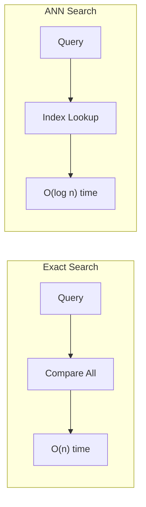

# Search at Scale

Build vector search systems that handle billions of vectors efficiently

## What You'll Learn

- Approximate Nearest Neighbors (ANN) algorithms
- FAISS index types and tradeoffs
- Quantization for memory efficiency
- Distributed search architectures

## Tech Stack

| Component | Technology |
|-----------|------------|
| ANN Index | FAISS |
| Embeddings | sentence-transformers |
| Storage | S3 / GCS |
| API | FastAPI |

## ANN vs Exact Search



| Approach | Time | Accuracy | Memory |
|----------|------|----------|--------|
| Exact (brute force) | O(n) | 100% | High |
| ANN (FAISS IVF) | O(log n) | 95-99% | Medium |
| ANN (FAISS PQ) | O(log n) | 90-98% | Low |

## Project Structure

```
search-at-scale/
├── src/
│   ├── __init__.py
│   ├── index.py           # FAISS index management
│   ├── embeddings.py      # Embedding generation
│   ├── quantization.py    # Quantization utilities
│   ├── distributed.py     # Sharding logic
│   └── api.py             # FastAPI application
├── scripts/
│   ├── build_index.py     # Index building
│   └── benchmark.py       # Performance testing
├── docker-compose.yml
├── requirements.txt
└── README.md
```

## Implementation

### Step 1: Setup

```txt title="requirements.txt"
faiss-cpu>=1.7.4  # or faiss-gpu for GPU support
sentence-transformers>=2.2.0
numpy>=1.24.0
fastapi>=0.100.0
uvicorn>=0.23.0
boto3>=1.28.0
tqdm>=4.65.0
```

### Step 2: FAISS Index Manager

```python title="src/index.py"
"""
FAISS index management for billion-scale search.
"""

import faiss
import numpy as np
from pathlib import Path
from typing import Optional, Literal
from dataclasses import dataclass
import pickle


@dataclass
class SearchResult:
    """Search result with id and score."""
    id: int
    score: float
    metadata: Optional[dict] = None


class FAISSIndex:
    """
    FAISS-based vector index for efficient similarity search.
    
    Supports multiple index types optimized for different scales:
    - Flat: Exact search, small datasets (under 100K)
    - IVF: Inverted file index, medium datasets (under 10M)
    - IVFPQ: Product quantization, large datasets (>10M)
    - HNSW: Graph-based, best recall/speed tradeoff
    """
    
    def __init__(
        self,
        dimension: int,
        index_type: Literal["flat", "ivf", "ivfpq", "hnsw"] = "flat",
        metric: Literal["l2", "ip"] = "ip",  # ip = inner product (cosine for normalized)
        **kwargs
    ):
        """
        Initialize FAISS index.
        
        Args:
            dimension: Vector dimension
            index_type: Type of index to create
            metric: Distance metric (l2 or ip for cosine)
        """
        self.dimension = dimension
        self.index_type = index_type
        self.metric = faiss.METRIC_INNER_PRODUCT if metric == "ip" else faiss.METRIC_L2
        
        self.index = self._create_index(**kwargs)
        self.id_map: dict[int, dict] = {}  # Store metadata
        self.current_id = 0
    
    def _create_index(
        self,
        nlist: int = 100,      # IVF clusters
        m: int = 8,            # PQ subquantizers
        nbits: int = 8,        # Bits per subquantizer
        ef_construction: int = 200,  # HNSW build quality
        ef_search: int = 64,   # HNSW search quality
        M: int = 32,           # HNSW connections
        **kwargs
    ) -> faiss.Index:
        """Create the appropriate FAISS index."""
        
        if self.index_type == "flat":
            # Exact search - use for small datasets
            index = faiss.IndexFlatIP(self.dimension) if self.metric == faiss.METRIC_INNER_PRODUCT else faiss.IndexFlatL2(self.dimension)
        
        elif self.index_type == "ivf":
            # Inverted file - good for medium datasets
            quantizer = faiss.IndexFlatIP(self.dimension)
            index = faiss.IndexIVFFlat(
                quantizer, self.dimension, nlist, self.metric
            )
        
        elif self.index_type == "ivfpq":
            # Product quantization - best for large datasets
            quantizer = faiss.IndexFlatIP(self.dimension)
            index = faiss.IndexIVFPQ(
                quantizer, self.dimension, nlist, m, nbits
            )
        
        elif self.index_type == "hnsw":
            # Hierarchical NSW - best recall/speed tradeoff
            index = faiss.IndexHNSWFlat(self.dimension, M)
            index.hnsw.efConstruction = ef_construction
            index.hnsw.efSearch = ef_search
        
        else:
            raise ValueError(f"Unknown index type: {self.index_type}")
        
        return index
    
    def train(self, vectors: np.ndarray) -> None:
        """
        Train the index (required for IVF and IVFPQ).
        
        Args:
            vectors: Training vectors (representative sample)
        """
        if self.index_type in ["ivf", "ivfpq"]:
            print(f"Training index with {len(vectors)} vectors...")
            self.index.train(vectors.astype(np.float32))
    
    def add(
        self,
        vectors: np.ndarray,
        metadata: Optional[list[dict]] = None
    ) -> list[int]:
        """
        Add vectors to the index.
        
        Args:
            vectors: Vectors to add
            metadata: Optional metadata for each vector
            
        Returns:
            List of assigned IDs
        """
        vectors = vectors.astype(np.float32)
        n = len(vectors)
        
        # Assign IDs
        ids = list(range(self.current_id, self.current_id + n))
        self.current_id += n
        
        # Store metadata
        if metadata:
            for i, meta in zip(ids, metadata):
                self.id_map[i] = meta
        
        # Add to index
        self.index.add(vectors)
        
        return ids
    
    def search(
        self,
        query: np.ndarray,
        k: int = 10,
        nprobe: int = 10
    ) -> list[SearchResult]:
        """
        Search for nearest neighbors.
        
        Args:
            query: Query vector(s)
            k: Number of results
            nprobe: Number of clusters to search (IVF only)
            
        Returns:
            List of SearchResult objects
        """
        query = query.astype(np.float32)
        
        if len(query.shape) == 1:
            query = query.reshape(1, -1)
        
        # Set search parameters
        if self.index_type in ["ivf", "ivfpq"]:
            self.index.nprobe = nprobe
        
        # Search
        scores, indices = self.index.search(query, k)
        
        # Build results
        results = []
        for score, idx in zip(scores[0], indices[0]):
            if idx >= 0:  # -1 indicates not found
                results.append(SearchResult(
                    id=int(idx),
                    score=float(score),
                    metadata=self.id_map.get(int(idx))
                ))
        
        return results
    
    def save(self, path: str) -> None:
        """Save index to disk."""
        path = Path(path)
        path.parent.mkdir(parents=True, exist_ok=True)
        
        # Save FAISS index
        faiss.write_index(self.index, str(path.with_suffix(".faiss")))
        
        # Save metadata
        with open(path.with_suffix(".meta"), "wb") as f:
            pickle.dump({
                "id_map": self.id_map,
                "current_id": self.current_id,
                "dimension": self.dimension,
                "index_type": self.index_type
            }, f)
    
    def load(self, path: str) -> None:
        """Load index from disk."""
        path = Path(path)
        
        # Load FAISS index
        self.index = faiss.read_index(str(path.with_suffix(".faiss")))
        
        # Load metadata
        with open(path.with_suffix(".meta"), "rb") as f:
            meta = pickle.load(f)
            self.id_map = meta["id_map"]
            self.current_id = meta["current_id"]
    
    @property
    def size(self) -> int:
        """Number of vectors in index."""
        return self.index.ntotal


class ShardedIndex:
    """
    Sharded index for distributed search.
    
    Splits data across multiple FAISS indexes for:
    - Horizontal scaling
    - Parallel search
    - Memory management
    """
    
    def __init__(
        self,
        dimension: int,
        n_shards: int = 4,
        index_type: str = "ivf"
    ):
        """
        Initialize sharded index.
        
        Args:
            dimension: Vector dimension
            n_shards: Number of shards
            index_type: Type of index for each shard
        """
        self.dimension = dimension
        self.n_shards = n_shards
        
        self.shards = [
            FAISSIndex(dimension, index_type=index_type)
            for _ in range(n_shards)
        ]
        
        self.total_vectors = 0
    
    def _get_shard(self, vector_id: int) -> int:
        """Determine shard for a vector ID."""
        return vector_id % self.n_shards
    
    def train(self, vectors: np.ndarray) -> None:
        """Train all shards with the same data."""
        for shard in self.shards:
            shard.train(vectors)
    
    def add(
        self,
        vectors: np.ndarray,
        metadata: Optional[list[dict]] = None
    ) -> None:
        """Add vectors, distributing across shards."""
        n = len(vectors)
        
        # Assign to shards round-robin
        for i in range(n):
            shard_idx = (self.total_vectors + i) % self.n_shards
            meta = [metadata[i]] if metadata else None
            self.shards[shard_idx].add(
                vectors[i:i+1],
                metadata=meta
            )
        
        self.total_vectors += n
    
    def search(
        self,
        query: np.ndarray,
        k: int = 10
    ) -> list[SearchResult]:
        """Search all shards and merge results."""
        all_results = []
        
        # Search each shard
        for shard in self.shards:
            results = shard.search(query, k=k)
            all_results.extend(results)
        
        # Sort by score and take top k
        all_results.sort(key=lambda x: x.score, reverse=True)
        return all_results[:k]
    
    def save(self, directory: str) -> None:
        """Save all shards."""
        directory = Path(directory)
        directory.mkdir(parents=True, exist_ok=True)
        
        for i, shard in enumerate(self.shards):
            shard.save(str(directory / f"shard_{i}"))
    
    def load(self, directory: str) -> None:
        """Load all shards."""
        directory = Path(directory)
        
        for i, shard in enumerate(self.shards):
            shard.load(str(directory / f"shard_{i}"))
```

### Step 3: Quantization

```python title="src/quantization.py"
"""
Vector quantization for memory efficiency.
"""

import numpy as np
import faiss
from typing import Optional


class ProductQuantizer:
    """
    Product Quantization for compressing vectors.
    
    Reduces memory by 4-32x while maintaining search quality.
    """
    
    def __init__(
        self,
        dimension: int,
        n_subquantizers: int = 8,
        n_bits: int = 8
    ):
        """
        Initialize product quantizer.
        
        Args:
            dimension: Vector dimension
            n_subquantizers: Number of subvectors (must divide dimension)
            n_bits: Bits per subquantizer (typically 8)
        """
        self.dimension = dimension
        self.n_subquantizers = n_subquantizers
        self.n_bits = n_bits
        
        self.pq = faiss.ProductQuantizer(dimension, n_subquantizers, n_bits)
        self.is_trained = False
    
    def train(self, vectors: np.ndarray) -> None:
        """Train the quantizer on representative data."""
        vectors = vectors.astype(np.float32)
        self.pq.train(vectors)
        self.is_trained = True
    
    def encode(self, vectors: np.ndarray) -> np.ndarray:
        """
        Encode vectors to compressed codes.
        
        Args:
            vectors: Full-precision vectors
            
        Returns:
            Compressed codes (uint8)
        """
        if not self.is_trained:
            raise ValueError("Train the quantizer first")
        
        vectors = vectors.astype(np.float32)
        codes = self.pq.compute_codes(vectors)
        return codes
    
    def decode(self, codes: np.ndarray) -> np.ndarray:
        """
        Decode compressed codes back to vectors.
        
        Note: Some precision is lost.
        """
        return self.pq.decode(codes)
    
    def memory_reduction(self) -> float:
        """Calculate memory reduction ratio."""
        original_bytes = self.dimension * 4  # float32
        compressed_bytes = self.n_subquantizers  # uint8 codes
        return original_bytes / compressed_bytes


class ScalarQuantizer:
    """
    Scalar quantization for simpler compression.
    
    Converts float32 to int8 or uint8.
    """
    
    def __init__(self, dimension: int, n_bits: int = 8):
        """
        Initialize scalar quantizer.
        
        Args:
            dimension: Vector dimension
            n_bits: Bits per value (4 or 8)
        """
        if n_bits == 8:
            qtype = faiss.ScalarQuantizer.QT_8bit
        elif n_bits == 4:
            qtype = faiss.ScalarQuantizer.QT_4bit
        else:
            raise ValueError("n_bits must be 4 or 8")
        
        self.sq = faiss.IndexScalarQuantizer(dimension, qtype)
        self.is_trained = False
    
    def train(self, vectors: np.ndarray) -> None:
        """Train the quantizer."""
        vectors = vectors.astype(np.float32)
        self.sq.train(vectors)
        self.is_trained = True
    
    def add(self, vectors: np.ndarray) -> None:
        """Add vectors to the quantized index."""
        vectors = vectors.astype(np.float32)
        self.sq.add(vectors)
    
    def search(self, query: np.ndarray, k: int = 10):
        """Search the quantized index."""
        query = query.astype(np.float32).reshape(1, -1)
        return self.sq.search(query, k)
```

### Step 4: Index Building Script

```python title="scripts/build_index.py"
"""
Script to build FAISS index from embeddings.
"""

import argparse
import numpy as np
from pathlib import Path
from tqdm import tqdm
import json

from sentence_transformers import SentenceTransformer
from src.index import FAISSIndex


def load_documents(path: str) -> list[dict]:
    """Load documents from JSON file."""
    with open(path) as f:
        return json.load(f)


def generate_embeddings(
    documents: list[dict],
    model_name: str,
    batch_size: int = 32
) -> np.ndarray:
    """Generate embeddings for documents."""
    model = SentenceTransformer(model_name)
    
    texts = [doc["text"] for doc in documents]
    embeddings = model.encode(
        texts,
        batch_size=batch_size,
        show_progress_bar=True,
        normalize_embeddings=True
    )
    
    return embeddings


def main():
    parser = argparse.ArgumentParser(description="Build FAISS index")
    parser.add_argument("--input", required=True, help="Input JSON file")
    parser.add_argument("--output", required=True, help="Output index path")
    parser.add_argument("--model", default="all-MiniLM-L6-v2")
    parser.add_argument("--index-type", default="ivf", 
                       choices=["flat", "ivf", "ivfpq", "hnsw"])
    parser.add_argument("--nlist", type=int, default=100)
    parser.add_argument("--batch-size", type=int, default=32)
    args = parser.parse_args()
    
    # Load documents
    print(f"Loading documents from {args.input}")
    documents = load_documents(args.input)
    print(f"Loaded {len(documents)} documents")
    
    # Generate embeddings
    print(f"Generating embeddings with {args.model}")
    embeddings = generate_embeddings(
        documents, args.model, args.batch_size
    )
    
    # Create index
    print(f"Creating {args.index_type} index")
    dimension = embeddings.shape[1]
    index = FAISSIndex(
        dimension=dimension,
        index_type=args.index_type,
        nlist=args.nlist
    )
    
    # Train if needed
    if args.index_type in ["ivf", "ivfpq"]:
        # Use subset for training if dataset is large
        n_train = min(len(embeddings), 100000)
        train_indices = np.random.choice(len(embeddings), n_train, replace=False)
        index.train(embeddings[train_indices])
    
    # Add vectors
    print("Adding vectors to index")
    metadata = [{"id": doc.get("id"), "text": doc["text"][:100]} for doc in documents]
    index.add(embeddings, metadata=metadata)
    
    # Save
    print(f"Saving index to {args.output}")
    index.save(args.output)
    
    print(f"Done! Index contains {index.size} vectors")


if __name__ == "__main__":
    main()
```

### Step 5: FastAPI Application

```python title="src/api.py"
"""
FastAPI application for scalable vector search.
"""

from fastapi import FastAPI, HTTPException
from pydantic import BaseModel, Field
from typing import Optional
import numpy as np

from sentence_transformers import SentenceTransformer
from .index import FAISSIndex, ShardedIndex


app = FastAPI(
    title="Vector Search API",
    description="Billion-scale vector search with FAISS",
    version="1.0.0"
)

# Global instances
model: Optional[SentenceTransformer] = None
index: Optional[FAISSIndex] = None


class SearchRequest(BaseModel):
    query: str
    k: int = Field(default=10, ge=1, le=100)
    nprobe: int = Field(default=10, ge=1, le=100)


class SearchResult(BaseModel):
    id: int
    score: float
    text: Optional[str] = None


class SearchResponse(BaseModel):
    query: str
    results: list[SearchResult]
    latency_ms: float


class IndexStats(BaseModel):
    total_vectors: int
    dimension: int
    index_type: str
    memory_mb: float


@app.on_event("startup")
async def startup():
    """Load model and index on startup."""
    global model, index
    
    model = SentenceTransformer("all-MiniLM-L6-v2")
    
    # Try to load existing index
    try:
        index = FAISSIndex(dimension=384, index_type="ivf")
        index.load("data/index")
        print(f"Loaded index with {index.size} vectors")
    except FileNotFoundError:
        print("No existing index found. Creating new one.")
        index = FAISSIndex(dimension=384, index_type="ivf")


@app.post("/search", response_model=SearchResponse)
async def search(request: SearchRequest):
    """
    Search for similar vectors.
    
    Embeds the query and searches the FAISS index.
    """
    import time
    
    if index is None or index.size == 0:
        raise HTTPException(status_code=400, detail="Index is empty")
    
    start = time.time()
    
    # Embed query
    query_embedding = model.encode(
        request.query,
        normalize_embeddings=True
    )
    
    # Search
    results = index.search(
        query_embedding,
        k=request.k,
        nprobe=request.nprobe
    )
    
    latency = (time.time() - start) * 1000
    
    return SearchResponse(
        query=request.query,
        results=[
            SearchResult(
                id=r.id,
                score=r.score,
                text=r.metadata.get("text") if r.metadata else None
            )
            for r in results
        ],
        latency_ms=latency
    )


@app.get("/stats", response_model=IndexStats)
async def get_stats():
    """Get index statistics."""
    if index is None:
        raise HTTPException(status_code=400, detail="Index not loaded")
    
    # Estimate memory usage
    bytes_per_vector = index.dimension * 4  # float32
    memory_mb = (index.size * bytes_per_vector) / (1024 * 1024)
    
    return IndexStats(
        total_vectors=index.size,
        dimension=index.dimension,
        index_type=index.index_type,
        memory_mb=memory_mb
    )


@app.post("/index")
async def add_to_index(texts: list[str]):
    """Add new vectors to the index."""
    global index
    
    if len(texts) == 0:
        raise HTTPException(status_code=400, detail="No texts provided")
    
    # Embed
    embeddings = model.encode(
        texts,
        normalize_embeddings=True,
        show_progress_bar=False
    )
    
    # Train if needed and index is empty
    if index.size == 0 and index.index_type in ["ivf", "ivfpq"]:
        index.train(embeddings)
    
    # Add
    metadata = [{"text": t[:100]} for t in texts]
    ids = index.add(embeddings, metadata=metadata)
    
    return {"added": len(ids), "total": index.size}


@app.post("/save")
async def save_index(path: str = "data/index"):
    """Save index to disk."""
    index.save(path)
    return {"message": f"Saved to {path}"}
```

## Benchmarking

```python title="scripts/benchmark.py"
"""
Benchmark search performance.
"""

import numpy as np
import time
from src.index import FAISSIndex


def benchmark_index(
    index_type: str,
    n_vectors: int,
    dimension: int,
    n_queries: int = 100,
    k: int = 10
):
    """Benchmark an index type."""
    print(f"\nBenchmarking {index_type} with {n_vectors:,} vectors")
    
    # Create random data
    vectors = np.random.randn(n_vectors, dimension).astype(np.float32)
    vectors /= np.linalg.norm(vectors, axis=1, keepdims=True)
    
    queries = np.random.randn(n_queries, dimension).astype(np.float32)
    queries /= np.linalg.norm(queries, axis=1, keepdims=True)
    
    # Create index
    index = FAISSIndex(dimension, index_type=index_type)
    
    # Train if needed
    if index_type in ["ivf", "ivfpq"]:
        index.train(vectors[:min(100000, n_vectors)])
    
    # Add vectors
    start = time.time()
    index.add(vectors)
    add_time = time.time() - start
    
    # Search
    search_times = []
    for query in queries:
        start = time.time()
        index.search(query, k=k)
        search_times.append(time.time() - start)
    
    avg_search_ms = np.mean(search_times) * 1000
    p99_search_ms = np.percentile(search_times, 99) * 1000
    
    print(f"  Add time: {add_time:.2f}s")
    print(f"  Avg search: {avg_search_ms:.2f}ms")
    print(f"  P99 search: {p99_search_ms:.2f}ms")
    
    return {
        "index_type": index_type,
        "n_vectors": n_vectors,
        "add_time": add_time,
        "avg_search_ms": avg_search_ms,
        "p99_search_ms": p99_search_ms
    }


if __name__ == "__main__":
    dimension = 384
    n_vectors = 1000000
    
    results = []
    for index_type in ["flat", "ivf", "hnsw"]:
        result = benchmark_index(
            index_type=index_type,
            n_vectors=n_vectors,
            dimension=dimension
        )
        results.append(result)
    
    print("\n=== Summary ===")
    for r in results:
        print(f"{r['index_type']}: {r['avg_search_ms']:.2f}ms avg, {r['p99_search_ms']:.2f}ms p99")
```

## Key Concepts

### Choosing Index Type

| Scale | Recommended | Recall | Speed |
|-------|-------------|--------|-------|
| Under 100K | Flat | 100% | Fast enough |
| 100K-1M | IVF | 95%+ | 10x faster |
| 1M-10M | IVFPQ | 90%+ | 100x smaller |
| Over 10M | HNSW | 98%+ | Best tradeoff |

### Memory Estimation

```
Memory = n_vectors × (dimension × 4 bytes + overhead)

1M vectors × 384 dim × 4 bytes = ~1.5 GB (flat)
With PQ (8 subquantizers): ~8 MB
```

## Summary

You've learned to build vector search that scales to billions of vectors with:
- FAISS for efficient ANN search
- Product quantization for memory efficiency
- Sharding for horizontal scaling
- FastAPI for serving
