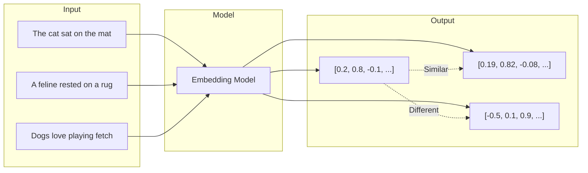

# Semantic Search Engine

Build a semantic search system that understands meaning, not just keywords

## What You'll Learn

- How text embeddings capture semantic meaning
- Using sentence-transformers for high-quality embeddings
- Implementing cosine similarity for relevance ranking
- Building a complete search API with FastAPI

## Tech Stack

| Component | Technology |
|-----------|------------|
| Embeddings | sentence-transformers |
| Vector Storage | NumPy / ChromaDB |
| API | FastAPI |
| Frontend | Streamlit |

## Prerequisites

- Python 3.9+
- Basic understanding of vectors
- Familiarity with REST APIs

## Understanding Embeddings



Embeddings transform text into dense vectors where similar meanings are close together in vector space. This enables semantic search that understands "cat" and "feline" are related, even without shared keywords.

## Project Structure

```
semantic-search/
├── src/
│   ├── __init__.py
│   ├── embeddings.py      # Embedding generation
│   ├── search.py          # Search engine logic
│   ├── indexer.py         # Document indexing
│   └── api.py             # FastAPI application
├── data/
│   └── documents.json     # Sample documents
├── tests/
│   └── test_search.py
├── app.py                 # Streamlit frontend
├── requirements.txt
└── README.md
```

## Implementation

### Step 1: Project Setup

Create your project and install dependencies:

```bash
mkdir semantic-search && cd semantic-search
python -m venv venv
source venv/bin/activate  # On Windows: venv\Scripts\activate
```

```txt title="requirements.txt"
sentence-transformers>=2.2.0
numpy>=1.24.0
fastapi>=0.100.0
uvicorn>=0.23.0
streamlit>=1.28.0
chromadb>=0.4.0
pydantic>=2.0.0
```

```bash
pip install -r requirements.txt
```

### Step 2: Embedding Generator

Create the core embedding functionality:

```python title="src/embeddings.py"
"""
Embedding generation using sentence-transformers.

Sentence-transformers provides state-of-the-art embeddings
optimized for semantic similarity tasks.
"""

from sentence_transformers import SentenceTransformer
import numpy as np
from typing import Union


class EmbeddingGenerator:
    """Generate embeddings for text using sentence-transformers."""
    
    def __init__(self, model_name: str = "all-MiniLM-L6-v2"):
        """
        Initialize the embedding generator.
        
        Args:
            model_name: The sentence-transformer model to use.
                - all-MiniLM-L6-v2: Fast, good quality (384 dims)
                - all-mpnet-base-v2: Best quality (768 dims)
                - paraphrase-multilingual-MiniLM-L12-v2: Multilingual
        """
        self.model = SentenceTransformer(model_name)
        self.embedding_dim = self.model.get_sentence_embedding_dimension()
    
    def embed(self, texts: Union[str, list[str]]) -> np.ndarray:
        """
        Generate embeddings for one or more texts.
        
        Args:
            texts: Single text or list of texts to embed
            
        Returns:
            Numpy array of shape (n_texts, embedding_dim)
        """
        if isinstance(texts, str):
            texts = [texts]
        
        embeddings = self.model.encode(
            texts,
            convert_to_numpy=True,
            normalize_embeddings=True,  # For cosine similarity
            show_progress_bar=len(texts) > 10
        )
        
        return embeddings
    
    def embed_batch(
        self, 
        texts: list[str], 
        batch_size: int = 32
    ) -> np.ndarray:
        """
        Generate embeddings in batches for large datasets.
        
        Args:
            texts: List of texts to embed
            batch_size: Number of texts per batch
            
        Returns:
            Numpy array of embeddings
        """
        return self.model.encode(
            texts,
            convert_to_numpy=True,
            normalize_embeddings=True,
            batch_size=batch_size,
            show_progress_bar=True
        )


# Quick test
if __name__ == "__main__":
    generator = EmbeddingGenerator()
    
    texts = [
        "The quick brown fox jumps over the lazy dog",
        "A fast auburn fox leaps above a sleepy canine",
        "Python is a programming language"
    ]
    
    embeddings = generator.embed(texts)
    print(f"Embedding shape: {embeddings.shape}")
    print(f"Embedding dimension: {generator.embedding_dim}")
    
    # Check similarity
    from numpy.linalg import norm
    
    def cosine_similarity(a, b):
        return np.dot(a, b) / (norm(a) * norm(b))
    
    print(f"\nSimilarity (text 0 vs 1): {cosine_similarity(embeddings[0], embeddings[1]):.4f}")
    print(f"Similarity (text 0 vs 2): {cosine_similarity(embeddings[0], embeddings[2]):.4f}")
```

### Step 3: Search Engine

Build the search functionality:

```python title="src/search.py"
"""
Semantic search engine using cosine similarity.
"""

import numpy as np
from dataclasses import dataclass
from typing import Optional

from .embeddings import EmbeddingGenerator


@dataclass
class SearchResult:
    """A single search result."""
    id: str
    text: str
    score: float
    metadata: dict


class SemanticSearchEngine:
    """
    A semantic search engine using dense embeddings.
    
    This implementation stores vectors in memory using NumPy.
    For production, consider using a vector database like
    ChromaDB, Pinecone, or Weaviate.
    """
    
    def __init__(self, model_name: str = "all-MiniLM-L6-v2"):
        """Initialize the search engine."""
        self.embedder = EmbeddingGenerator(model_name)
        self.documents: list[dict] = []
        self.embeddings: Optional[np.ndarray] = None
    
    def add_documents(self, documents: list[dict]) -> None:
        """
        Add documents to the search index.
        
        Args:
            documents: List of dicts with 'id', 'text', and optional 'metadata'
        """
        texts = [doc["text"] for doc in documents]
        new_embeddings = self.embedder.embed(texts)
        
        if self.embeddings is None:
            self.embeddings = new_embeddings
        else:
            self.embeddings = np.vstack([self.embeddings, new_embeddings])
        
        self.documents.extend(documents)
        print(f"Indexed {len(documents)} documents. Total: {len(self.documents)}")
    
    def search(
        self, 
        query: str, 
        top_k: int = 5,
        threshold: float = 0.0
    ) -> list[SearchResult]:
        """
        Search for documents similar to the query.
        
        Args:
            query: The search query
            top_k: Number of results to return
            threshold: Minimum similarity score (0-1)
            
        Returns:
            List of SearchResult objects sorted by relevance
        """
        if self.embeddings is None or len(self.documents) == 0:
            return []
        
        # Embed the query
        query_embedding = self.embedder.embed(query)[0]
        
        # Compute cosine similarity with all documents
        # Since embeddings are normalized, dot product = cosine similarity
        similarities = np.dot(self.embeddings, query_embedding)
        
        # Get top-k indices
        top_indices = np.argsort(similarities)[::-1][:top_k]
        
        # Build results
        results = []
        for idx in top_indices:
            score = float(similarities[idx])
            if score >= threshold:
                doc = self.documents[idx]
                results.append(SearchResult(
                    id=doc.get("id", str(idx)),
                    text=doc["text"],
                    score=score,
                    metadata=doc.get("metadata", {})
                ))
        
        return results
    
    def search_with_filter(
        self,
        query: str,
        filter_fn: callable,
        top_k: int = 5
    ) -> list[SearchResult]:
        """
        Search with a metadata filter.
        
        Args:
            query: The search query
            filter_fn: Function that takes a document and returns True/False
            top_k: Number of results to return
        """
        # Filter documents
        filtered_indices = [
            i for i, doc in enumerate(self.documents)
            if filter_fn(doc)
        ]
        
        if not filtered_indices:
            return []
        
        # Embed query
        query_embedding = self.embedder.embed(query)[0]
        
        # Compute similarities only for filtered documents
        filtered_embeddings = self.embeddings[filtered_indices]
        similarities = np.dot(filtered_embeddings, query_embedding)
        
        # Get top-k from filtered
        top_k = min(top_k, len(filtered_indices))
        top_local_indices = np.argsort(similarities)[::-1][:top_k]
        
        results = []
        for local_idx in top_local_indices:
            global_idx = filtered_indices[local_idx]
            doc = self.documents[global_idx]
            results.append(SearchResult(
                id=doc.get("id", str(global_idx)),
                text=doc["text"],
                score=float(similarities[local_idx]),
                metadata=doc.get("metadata", {})
            ))
        
        return results
    
    def save(self, path: str) -> None:
        """Save the index to disk."""
        import json
        
        np.save(f"{path}_embeddings.npy", self.embeddings)
        with open(f"{path}_documents.json", "w") as f:
            json.dump(self.documents, f)
    
    def load(self, path: str) -> None:
        """Load the index from disk."""
        import json
        
        self.embeddings = np.load(f"{path}_embeddings.npy")
        with open(f"{path}_documents.json", "r") as f:
            self.documents = json.load(f)


# Example usage
if __name__ == "__main__":
    engine = SemanticSearchEngine()
    
    # Add sample documents
    documents = [
        {"id": "1", "text": "Python is a versatile programming language", "metadata": {"category": "tech"}},
        {"id": "2", "text": "Machine learning enables computers to learn from data", "metadata": {"category": "ai"}},
        {"id": "3", "text": "Natural language processing helps computers understand text", "metadata": {"category": "ai"}},
        {"id": "4", "text": "Web development involves creating websites and applications", "metadata": {"category": "tech"}},
        {"id": "5", "text": "Deep learning uses neural networks with many layers", "metadata": {"category": "ai"}},
    ]
    
    engine.add_documents(documents)
    
    # Search
    results = engine.search("How do computers understand human language?", top_k=3)
    
    print("\nSearch Results:")
    for result in results:
        print(f"  [{result.score:.4f}] {result.text}")
```

### Step 4: Document Indexer

Create a utility to index documents from files:

```python title="src/indexer.py"
"""
Document indexer for loading and processing documents.
"""

import json
from pathlib import Path
from typing import Iterator
import hashlib


def generate_doc_id(text: str) -> str:
    """Generate a unique ID from text content."""
    return hashlib.md5(text.encode()).hexdigest()[:12]


def load_json_documents(path: str) -> list[dict]:
    """
    Load documents from a JSON file.
    
    Expected format:
    [
        {"text": "...", "metadata": {...}},
        ...
    ]
    """
    with open(path, "r") as f:
        data = json.load(f)
    
    documents = []
    for i, item in enumerate(data):
        doc = {
            "id": item.get("id", generate_doc_id(item["text"])),
            "text": item["text"],
            "metadata": item.get("metadata", {})
        }
        documents.append(doc)
    
    return documents


def load_text_files(directory: str, pattern: str = "*.txt") -> list[dict]:
    """
    Load documents from text files in a directory.
    
    Each file becomes one document.
    """
    documents = []
    path = Path(directory)
    
    for file_path in path.glob(pattern):
        text = file_path.read_text()
        documents.append({
            "id": generate_doc_id(text),
            "text": text,
            "metadata": {
                "filename": file_path.name,
                "path": str(file_path)
            }
        })
    
    return documents


def chunk_text(
    text: str,
    chunk_size: int = 500,
    overlap: int = 50
) -> Iterator[str]:
    """
    Split text into overlapping chunks.
    
    Args:
        text: The text to split
        chunk_size: Maximum characters per chunk
        overlap: Number of characters to overlap
        
    Yields:
        Text chunks
    """
    start = 0
    text_length = len(text)
    
    while start < text_length:
        end = start + chunk_size
        
        # Try to break at a sentence boundary
        if end < text_length:
            # Look for sentence endings
            for sep in [". ", "! ", "? ", "\n\n", "\n"]:
                last_sep = text[start:end].rfind(sep)
                if last_sep != -1:
                    end = start + last_sep + len(sep)
                    break
        
        yield text[start:end].strip()
        start = end - overlap


def load_and_chunk_documents(
    path: str,
    chunk_size: int = 500,
    overlap: int = 50
) -> list[dict]:
    """
    Load documents and split into chunks.
    
    Useful for long documents where you want to
    search within specific sections.
    """
    documents = load_json_documents(path)
    chunked = []
    
    for doc in documents:
        chunks = list(chunk_text(doc["text"], chunk_size, overlap))
        
        for i, chunk in enumerate(chunks):
            chunked.append({
                "id": f"{doc['id']}_chunk_{i}",
                "text": chunk,
                "metadata": {
                    **doc.get("metadata", {}),
                    "parent_id": doc["id"],
                    "chunk_index": i,
                    "total_chunks": len(chunks)
                }
            })
    
    return chunked
```

### Step 5: FastAPI Application

Build the REST API:

```python title="src/api.py"
"""
FastAPI application for semantic search.
"""

from fastapi import FastAPI, HTTPException
from pydantic import BaseModel, Field
from typing import Optional

from .search import SemanticSearchEngine, SearchResult
from .indexer import load_json_documents


# Request/Response models
class SearchRequest(BaseModel):
    query: str = Field(..., min_length=1, max_length=1000)
    top_k: int = Field(default=5, ge=1, le=100)
    threshold: float = Field(default=0.0, ge=0.0, le=1.0)
    category: Optional[str] = None


class SearchResultResponse(BaseModel):
    id: str
    text: str
    score: float
    metadata: dict


class SearchResponse(BaseModel):
    query: str
    results: list[SearchResultResponse]
    total: int


class DocumentRequest(BaseModel):
    id: Optional[str] = None
    text: str
    metadata: dict = {}


class IndexResponse(BaseModel):
    message: str
    document_count: int


# Initialize app and search engine
app = FastAPI(
    title="Semantic Search API",
    description="Search documents using semantic similarity",
    version="1.0.0"
)

# Global search engine instance
engine = SemanticSearchEngine()


@app.on_event("startup")
async def startup():
    """Load initial documents on startup."""
    try:
        engine.load("data/index")
        print(f"Loaded {len(engine.documents)} documents from disk")
    except FileNotFoundError:
        print("No existing index found. Starting fresh.")


@app.get("/")
async def root():
    """Health check endpoint."""
    return {
        "status": "healthy",
        "documents_indexed": len(engine.documents)
    }


@app.post("/search", response_model=SearchResponse)
async def search(request: SearchRequest):
    """
    Search for documents similar to the query.
    
    - **query**: The search query (required)
    - **top_k**: Number of results to return (default: 5)
    - **threshold**: Minimum similarity score 0-1 (default: 0)
    - **category**: Filter by metadata category (optional)
    """
    if request.category:
        results = engine.search_with_filter(
            query=request.query,
            filter_fn=lambda doc: doc.get("metadata", {}).get("category") == request.category,
            top_k=request.top_k
        )
    else:
        results = engine.search(
            query=request.query,
            top_k=request.top_k,
            threshold=request.threshold
        )
    
    return SearchResponse(
        query=request.query,
        results=[
            SearchResultResponse(
                id=r.id,
                text=r.text,
                score=r.score,
                metadata=r.metadata
            )
            for r in results
        ],
        total=len(results)
    )


@app.post("/index", response_model=IndexResponse)
async def index_documents(documents: list[DocumentRequest]):
    """
    Add documents to the search index.
    
    Each document should have:
    - **text**: The document content (required)
    - **id**: Unique identifier (optional, auto-generated if not provided)
    - **metadata**: Additional metadata dict (optional)
    """
    docs = [
        {
            "id": doc.id or f"doc_{len(engine.documents) + i}",
            "text": doc.text,
            "metadata": doc.metadata
        }
        for i, doc in enumerate(documents)
    ]
    
    engine.add_documents(docs)
    
    return IndexResponse(
        message=f"Indexed {len(documents)} documents",
        document_count=len(engine.documents)
    )


@app.post("/index/file")
async def index_from_file(path: str):
    """Index documents from a JSON file."""
    try:
        documents = load_json_documents(path)
        engine.add_documents(documents)
        return IndexResponse(
            message=f"Indexed {len(documents)} documents from {path}",
            document_count=len(engine.documents)
        )
    except FileNotFoundError:
        raise HTTPException(status_code=404, detail=f"File not found: {path}")


@app.post("/save")
async def save_index(path: str = "data/index"):
    """Save the current index to disk."""
    engine.save(path)
    return {"message": f"Index saved to {path}"}


@app.get("/stats")
async def get_stats():
    """Get index statistics."""
    return {
        "total_documents": len(engine.documents),
        "embedding_dimension": engine.embedder.embedding_dim,
        "model": engine.embedder.model.get_config_dict().get("name_or_path", "unknown")
    }
```

### Step 6: Streamlit Frontend

Create an interactive UI:

```python title="app.py"
"""
Streamlit frontend for semantic search.
"""

import streamlit as st
import requests
from typing import Optional

# Configuration
API_URL = "http://localhost:8000"

st.set_page_config(
    page_title="Semantic Search",
    page_icon="🔍",
    layout="wide"
)


def search(query: str, top_k: int = 5, threshold: float = 0.0) -> dict:
    """Call the search API."""
    response = requests.post(
        f"{API_URL}/search",
        json={
            "query": query,
            "top_k": top_k,
            "threshold": threshold
        }
    )
    return response.json()


def get_stats() -> dict:
    """Get index statistics."""
    try:
        response = requests.get(f"{API_URL}/stats")
        return response.json()
    except:
        return {"error": "Could not connect to API"}


def main():
    st.title("🔍 Semantic Search Engine")
    st.markdown("Search documents using AI-powered semantic similarity")
    
    # Sidebar
    with st.sidebar:
        st.header("Settings")
        top_k = st.slider("Number of results", 1, 20, 5)
        threshold = st.slider("Minimum score", 0.0, 1.0, 0.0, 0.05)
        
        st.divider()
        
        st.header("Index Stats")
        stats = get_stats()
        if "error" not in stats:
            st.metric("Documents Indexed", stats.get("total_documents", 0))
            st.metric("Embedding Dimension", stats.get("embedding_dimension", 0))
            st.caption(f"Model: {stats.get('model', 'unknown')}")
        else:
            st.error("API not available")
    
    # Main search interface
    query = st.text_input(
        "Enter your search query",
        placeholder="What would you like to find?"
    )
    
    col1, col2 = st.columns([1, 5])
    with col1:
        search_button = st.button("🔍 Search", type="primary")
    
    if search_button and query:
        with st.spinner("Searching..."):
            results = search(query, top_k, threshold)
        
        if results.get("results"):
            st.success(f"Found {results['total']} results")
            
            for i, result in enumerate(results["results"], 1):
                score = result["score"]
                
                # Color code by score
                if score >= 0.7:
                    score_color = "🟢"
                elif score >= 0.4:
                    score_color = "🟡"
                else:
                    score_color = "🔴"
                
                with st.expander(
                    f"{score_color} Result {i} (Score: {score:.4f})",
                    expanded=i <= 3
                ):
                    st.markdown(f"**Text:** {result['text']}")
                    st.markdown(f"**ID:** `{result['id']}`")
                    if result.get("metadata"):
                        st.json(result["metadata"])
        else:
            st.warning("No results found. Try a different query.")
    
    # Document upload section
    st.divider()
    st.header("Add Documents")
    
    with st.form("add_document"):
        doc_text = st.text_area(
            "Document text",
            placeholder="Enter the document content..."
        )
        doc_metadata = st.text_input(
            "Metadata (JSON)",
            placeholder='{"category": "tech"}'
        )
        
        if st.form_submit_button("Add Document"):
            if doc_text:
                import json
                metadata = {}
                if doc_metadata:
                    try:
                        metadata = json.loads(doc_metadata)
                    except:
                        st.error("Invalid JSON in metadata")
                        return
                
                response = requests.post(
                    f"{API_URL}/index",
                    json=[{"text": doc_text, "metadata": metadata}]
                )
                
                if response.status_code == 200:
                    st.success("Document added successfully!")
                    st.rerun()
                else:
                    st.error("Failed to add document")


if __name__ == "__main__":
    main()
```

### Step 7: Sample Documents

Create sample data to test with:

```json title="data/documents.json"
[
  {
    "text": "Machine learning is a subset of artificial intelligence that enables systems to learn and improve from experience without being explicitly programmed.",
    "metadata": {"category": "ai", "topic": "machine-learning"}
  },
  {
    "text": "Natural language processing (NLP) is a field of AI focused on enabling computers to understand, interpret, and generate human language.",
    "metadata": {"category": "ai", "topic": "nlp"}
  },
  {
    "text": "Deep learning uses artificial neural networks with multiple layers to progressively extract higher-level features from raw input.",
    "metadata": {"category": "ai", "topic": "deep-learning"}
  },
  {
    "text": "Python is a high-level, interpreted programming language known for its readability and versatility in web development, data science, and automation.",
    "metadata": {"category": "programming", "topic": "python"}
  },
  {
    "text": "Vector databases are specialized database systems designed to store and query high-dimensional vector data efficiently using similarity search.",
    "metadata": {"category": "databases", "topic": "vector-db"}
  },
  {
    "text": "Transformers are a neural network architecture that uses self-attention mechanisms to process sequential data in parallel.",
    "metadata": {"category": "ai", "topic": "transformers"}
  },
  {
    "text": "Embeddings are dense vector representations of data that capture semantic meaning, enabling similarity comparisons between items.",
    "metadata": {"category": "ai", "topic": "embeddings"}
  },
  {
    "text": "FastAPI is a modern Python web framework for building APIs with automatic documentation and type validation.",
    "metadata": {"category": "programming", "topic": "fastapi"}
  },
  {
    "text": "Cosine similarity measures the cosine of the angle between two vectors, commonly used to determine how similar two documents are.",
    "metadata": {"category": "math", "topic": "similarity"}
  },
  {
    "text": "Retrieval-Augmented Generation (RAG) combines information retrieval with language models to generate more accurate and grounded responses.",
    "metadata": {"category": "ai", "topic": "rag"}
  }
]
```

## Running the Application

### Start the API Server

```bash
# From project root
uvicorn src.api:app --reload --host 0.0.0.0 --port 8000
```

### Index Sample Documents

```bash
# Using curl
curl -X POST "http://localhost:8000/index/file?path=data/documents.json"
```

### Start the Frontend

```bash
# In a new terminal
streamlit run app.py
```

### Test with curl

```bash
# Search for documents
curl -X POST "http://localhost:8000/search" \
  -H "Content-Type: application/json" \
  -d '{"query": "How do computers understand text?", "top_k": 3}'

# Add a document
curl -X POST "http://localhost:8000/index" \
  -H "Content-Type: application/json" \
  -d '[{"text": "Docker containers package applications with their dependencies", "metadata": {"category": "devops"}}]'
```

## Testing

```python title="tests/test_search.py"
"""Tests for semantic search engine."""

import pytest
from src.search import SemanticSearchEngine


@pytest.fixture
def engine():
    """Create a search engine with test documents."""
    engine = SemanticSearchEngine()
    engine.add_documents([
        {"id": "1", "text": "Python programming language", "metadata": {"category": "tech"}},
        {"id": "2", "text": "Machine learning algorithms", "metadata": {"category": "ai"}},
        {"id": "3", "text": "Data science and analytics", "metadata": {"category": "data"}},
    ])
    return engine


def test_search_returns_results(engine):
    """Test that search returns relevant results."""
    results = engine.search("programming in Python")
    
    assert len(results) > 0
    assert results[0].id == "1"  # Python doc should be most relevant


def test_search_with_threshold(engine):
    """Test that threshold filters low-scoring results."""
    results = engine.search("unrelated query about cooking", threshold=0.5)
    
    # Should filter out low-scoring results
    assert all(r.score >= 0.5 for r in results)


def test_search_with_filter(engine):
    """Test category filtering."""
    results = engine.search_with_filter(
        query="learning",
        filter_fn=lambda doc: doc.get("metadata", {}).get("category") == "ai"
    )
    
    assert len(results) > 0
    assert all(r.metadata.get("category") == "ai" for r in results)


def test_empty_index_returns_empty():
    """Test searching empty index."""
    engine = SemanticSearchEngine()
    results = engine.search("test query")
    
    assert results == []


def test_similar_texts_have_high_scores(engine):
    """Test that semantically similar texts score highly."""
    results = engine.search("ML models and AI")
    
    # Machine learning doc should have high score
    ml_result = next((r for r in results if r.id == "2"), None)
    assert ml_result is not None
    assert ml_result.score > 0.5


def test_save_and_load(engine, tmp_path):
    """Test persistence."""
    path = str(tmp_path / "test_index")
    engine.save(path)
    
    new_engine = SemanticSearchEngine()
    new_engine.load(path)
    
    assert len(new_engine.documents) == len(engine.documents)
```

Run tests:

```bash
pytest tests/ -v
```

## Key Concepts Explained

### Why Normalize Embeddings?

When embeddings are normalized (unit length), cosine similarity simplifies to a dot product:

```python
# Without normalization
cosine_sim = np.dot(a, b) / (np.linalg.norm(a) * np.linalg.norm(b))

# With normalization (||a|| = ||b|| = 1)
cosine_sim = np.dot(a, b)  # Much faster!
```

### Choosing the Right Model

| Model | Dimensions | Speed | Quality | Use Case |
|-------|-----------|-------|---------|----------|
| all-MiniLM-L6-v2 | 384 | Fast | Good | General purpose |
| all-mpnet-base-v2 | 768 | Medium | Best | High accuracy needs |
| paraphrase-multilingual-MiniLM-L12-v2 | 384 | Fast | Good | Multi-language |

### Similarity Score Interpretation

| Score Range | Interpretation |
|-------------|----------------|
| 0.8 - 1.0 | Very similar / Near duplicate |
| 0.6 - 0.8 | Highly relevant |
| 0.4 - 0.6 | Somewhat relevant |
| 0.2 - 0.4 | Loosely related |
| 0.0 - 0.2 | Not relevant |

## Next Steps

Now that you've built a basic semantic search engine, continue to:

1. **[Text Clustering](/docs/embeddings/intermediate/text-clustering)** - Group similar documents automatically
2. **[Similarity Recommendations](/docs/embeddings/intermediate/similarity-recommendations)** - Build a recommendation system
3. **[Production Pipeline](/docs/embeddings/advanced/production-pipeline)** - Scale to millions of documents

## Summary

You've built a complete semantic search system that:

- Transforms text into dense vector embeddings
- Uses cosine similarity for relevance ranking
- Provides a REST API for search operations
- Includes a user-friendly Streamlit interface
- Supports filtering by metadata

This foundation enables powerful AI applications like document search, FAQ matching, and content recommendations.
