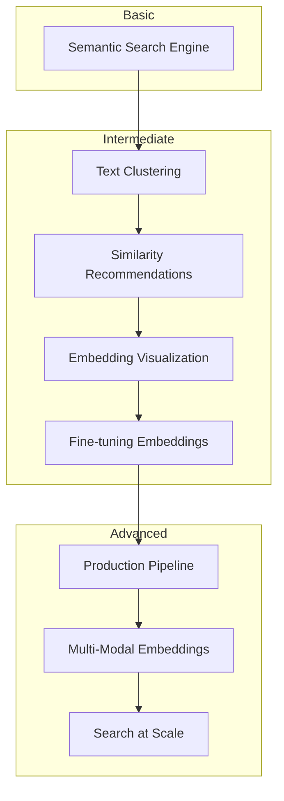
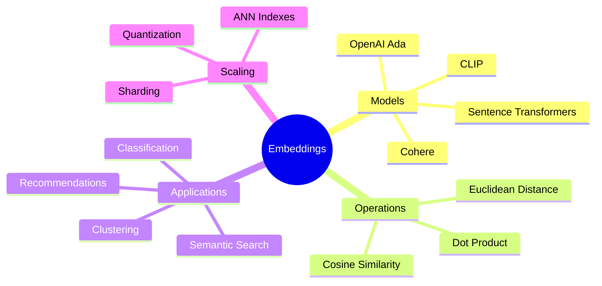

# Embeddings Projects

Transform text into powerful vector representations for semantic understanding

## Learning Path

## Projects

### Beginner

| Project | Description | Time |
|---------|-------------|------|
| [Semantic Search Engine](/docs/embeddings/basic/semantic-search) | Build semantic search with sentence-transformers | ~2 hours |

### Intermediate

| Project | Description | Time |
|---------|-------------|------|
| [Text Clustering](/docs/embeddings/intermediate/text-clustering) | Cluster documents using K-means and embeddings | ~3 hours |
| [Similarity Recommendations](/docs/embeddings/intermediate/similarity-recommendations) | Build a recommendation system using cosine similarity | ~3 hours |
| [Embedding Visualization](/docs/embeddings/intermediate/embedding-visualization) | Visualize embeddings with t-SNE and UMAP | ~3 hours |
| [Fine-tuning Embeddings](/docs/embeddings/intermediate/fine-tuning) | Train domain-specific embeddings | ~4 hours |

### Advanced

| Project | Description | Time |
|---------|-------------|------|
| [Production Embedding Pipeline](/docs/embeddings/advanced/production-pipeline) | Scalable embedding generation with caching and monitoring | ~3 days |
| [Multi-Modal Embeddings](/docs/embeddings/advanced/multimodal-embeddings) | Combine text and image embeddings with CLIP | ~3 days |
| [Search at Scale](/docs/embeddings/advanced/search-at-scale) | Billion-scale search with FAISS and approximate nearest neighbors | ~4 days |

## Why Learn Embeddings?

| Benefit | Description |
|---------|-------------|
| **Foundation** | Embeddings power RAG, search, recommendations, and clustering |
| **Semantic Understanding** | Capture meaning beyond keyword matching |
| **Versatility** | Same techniques work for text, images, audio, and code |
| **Efficiency** | Dense vectors enable fast similarity computation |

## Key Concepts

Start with the [Semantic Search Engine](/docs/embeddings/basic/semantic-search) project to learn the fundamentals.
