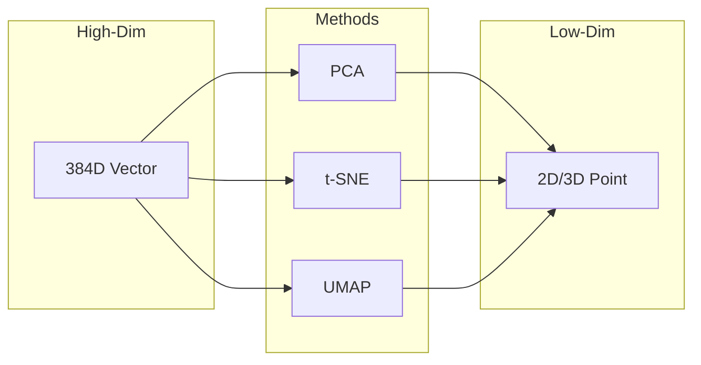

# Embedding Visualization

Explore and understand your embedding space through interactive visualization

## What You'll Learn

- Dimensionality reduction techniques (t-SNE, UMAP, PCA)
- Interactive visualizations with Plotly
- Identifying clusters and outliers
- Debugging embedding quality

## Tech Stack

| Component | Technology |
|-----------|------------|
| Embeddings | sentence-transformers |
| Reduction | scikit-learn, umap-learn |
| Visualization | plotly, matplotlib |
| Dashboard | Streamlit |

## Dimensionality Reduction



| Method | Speed | Global Structure | Local Structure | Use Case |
|--------|-------|-----------------|-----------------|----------|
| PCA | Fast | Good | Poor | Quick overview |
| t-SNE | Slow | Poor | Excellent | Cluster visualization |
| UMAP | Medium | Good | Excellent | Best overall |

## Project Structure

```
embedding-viz/
├── src/
│   ├── __init__.py
│   ├── embeddings.py
│   ├── reducers.py
│   └── plots.py
├── app.py                 # Streamlit dashboard
├── requirements.txt
└── README.md
```

## Implementation

### Step 1: Setup

```txt title="requirements.txt"
sentence-transformers>=2.2.0
scikit-learn>=1.3.0
umap-learn>=0.5.0
plotly>=5.15.0
streamlit>=1.28.0
pandas>=2.0.0
numpy>=1.24.0
```

### Step 2: Dimension Reducers

```python title="src/reducers.py"
"""
Dimensionality reduction for embedding visualization.
"""

import numpy as np
from sklearn.manifold import TSNE
from sklearn.decomposition import PCA
from typing import Literal
from dataclasses import dataclass

# UMAP is optional (slower to install)
try:
    from umap import UMAP
    UMAP_AVAILABLE = True
except ImportError:
    UMAP_AVAILABLE = False


@dataclass
class ReductionResult:
    """Result of dimensionality reduction."""
    coords: np.ndarray
    method: str
    params: dict


class DimensionReducer:
    """
    Reduce high-dimensional embeddings for visualization.
    """
    
    def __init__(self, n_components: int = 2):
        """
        Initialize reducer.
        
        Args:
            n_components: Output dimensions (2 or 3)
        """
        self.n_components = n_components
        self._cache: dict[str, np.ndarray] = {}
    
    def reduce_pca(
        self,
        embeddings: np.ndarray,
        **kwargs
    ) -> ReductionResult:
        """
        Reduce using PCA (Principal Component Analysis).
        
        Best for: Quick visualization, preserving global variance
        """
        pca = PCA(n_components=self.n_components, **kwargs)
        coords = pca.fit_transform(embeddings)
        
        return ReductionResult(
            coords=coords,
            method="PCA",
            params={
                "explained_variance_ratio": pca.explained_variance_ratio_.tolist()
            }
        )
    
    def reduce_tsne(
        self,
        embeddings: np.ndarray,
        perplexity: int = 30,
        learning_rate: float = 200.0,
        n_iter: int = 1000,
        **kwargs
    ) -> ReductionResult:
        """
        Reduce using t-SNE (t-Distributed Stochastic Neighbor Embedding).
        
        Best for: Visualizing clusters, local neighborhood preservation
        
        Args:
            perplexity: Balance between local and global aspects (5-50)
            learning_rate: Step size for optimization (10-1000)
            n_iter: Number of optimization iterations
        """
        # Adjust perplexity for small datasets
        perplexity = min(perplexity, len(embeddings) - 1)
        
        tsne = TSNE(
            n_components=self.n_components,
            perplexity=perplexity,
            learning_rate=learning_rate,
            n_iter=n_iter,
            random_state=42,
            **kwargs
        )
        
        coords = tsne.fit_transform(embeddings)
        
        return ReductionResult(
            coords=coords,
            method="t-SNE",
            params={
                "perplexity": perplexity,
                "learning_rate": learning_rate,
                "n_iter": n_iter,
                "kl_divergence": float(tsne.kl_divergence_)
            }
        )
    
    def reduce_umap(
        self,
        embeddings: np.ndarray,
        n_neighbors: int = 15,
        min_dist: float = 0.1,
        metric: str = "cosine",
        **kwargs
    ) -> ReductionResult:
        """
        Reduce using UMAP (Uniform Manifold Approximation and Projection).
        
        Best for: Balanced global/local structure, faster than t-SNE
        
        Args:
            n_neighbors: Size of local neighborhood (5-50)
            min_dist: Minimum distance between points (0.0-0.99)
            metric: Distance metric to use
        """
        if not UMAP_AVAILABLE:
            raise ImportError("umap-learn not installed. Run: pip install umap-learn")
        
        umap = UMAP(
            n_components=self.n_components,
            n_neighbors=n_neighbors,
            min_dist=min_dist,
            metric=metric,
            random_state=42,
            **kwargs
        )
        
        coords = umap.fit_transform(embeddings)
        
        return ReductionResult(
            coords=coords,
            method="UMAP",
            params={
                "n_neighbors": n_neighbors,
                "min_dist": min_dist,
                "metric": metric
            }
        )
    
    def reduce(
        self,
        embeddings: np.ndarray,
        method: Literal["pca", "tsne", "umap"] = "umap",
        **kwargs
    ) -> ReductionResult:
        """
        Reduce embeddings using the specified method.
        """
        if method == "pca":
            return self.reduce_pca(embeddings, **kwargs)
        elif method == "tsne":
            return self.reduce_tsne(embeddings, **kwargs)
        elif method == "umap":
            return self.reduce_umap(embeddings, **kwargs)
        else:
            raise ValueError(f"Unknown method: {method}")


def compare_methods(embeddings: np.ndarray) -> dict[str, ReductionResult]:
    """
    Compare all reduction methods on the same data.
    """
    reducer = DimensionReducer(n_components=2)
    
    results = {
        "PCA": reducer.reduce_pca(embeddings),
        "t-SNE": reducer.reduce_tsne(embeddings),
    }
    
    if UMAP_AVAILABLE:
        results["UMAP"] = reducer.reduce_umap(embeddings)
    
    return results
```

### Step 3: Visualization Plots

```python title="src/plots.py"
"""
Interactive plots for embedding visualization.
"""

import numpy as np
import plotly.express as px
import plotly.graph_objects as go
from plotly.subplots import make_subplots
from typing import Optional


def scatter_2d(
    coords: np.ndarray,
    labels: Optional[np.ndarray] = None,
    texts: Optional[list[str]] = None,
    title: str = "Embedding Visualization",
    color_discrete_map: Optional[dict] = None
) -> go.Figure:
    """
    Create interactive 2D scatter plot.
    
    Args:
        coords: 2D coordinates (n_samples, 2)
        labels: Optional cluster/category labels
        texts: Optional text for hover
        title: Plot title
    """
    hover_data = {}
    if texts:
        hover_data["text"] = texts
    
    fig = px.scatter(
        x=coords[:, 0],
        y=coords[:, 1],
        color=labels.astype(str) if labels is not None else None,
        hover_data=hover_data if hover_data else None,
        title=title,
        color_discrete_map=color_discrete_map
    )
    
    fig.update_layout(
        xaxis_title="Dimension 1",
        yaxis_title="Dimension 2",
        showlegend=labels is not None
    )
    
    fig.update_traces(
        marker=dict(size=8, opacity=0.7),
        hovertemplate="<b>%{customdata[0]}</b><extra></extra>" if texts else None
    )
    
    return fig


def scatter_3d(
    coords: np.ndarray,
    labels: Optional[np.ndarray] = None,
    texts: Optional[list[str]] = None,
    title: str = "3D Embedding Visualization"
) -> go.Figure:
    """
    Create interactive 3D scatter plot.
    """
    hover_data = {}
    if texts:
        hover_data["text"] = texts
    
    fig = px.scatter_3d(
        x=coords[:, 0],
        y=coords[:, 1],
        z=coords[:, 2],
        color=labels.astype(str) if labels is not None else None,
        hover_data=hover_data if hover_data else None,
        title=title
    )
    
    fig.update_layout(
        scene=dict(
            xaxis_title="Dim 1",
            yaxis_title="Dim 2",
            zaxis_title="Dim 3"
        )
    )
    
    return fig


def compare_methods_plot(
    results: dict[str, np.ndarray],
    labels: Optional[np.ndarray] = None
) -> go.Figure:
    """
    Side-by-side comparison of reduction methods.
    """
    n_methods = len(results)
    fig = make_subplots(
        rows=1,
        cols=n_methods,
        subplot_titles=list(results.keys())
    )
    
    colors = px.colors.qualitative.Set1
    
    for i, (method, coords) in enumerate(results.items(), 1):
        if labels is not None:
            for label in np.unique(labels):
                mask = labels == label
                fig.add_trace(
                    go.Scatter(
                        x=coords[mask, 0],
                        y=coords[mask, 1],
                        mode="markers",
                        name=str(label),
                        marker=dict(color=colors[label % len(colors)]),
                        showlegend=(i == 1)
                    ),
                    row=1, col=i
                )
        else:
            fig.add_trace(
                go.Scatter(
                    x=coords[:, 0],
                    y=coords[:, 1],
                    mode="markers",
                    marker=dict(color="blue", opacity=0.6)
                ),
                row=1, col=i
            )
    
    fig.update_layout(
        title="Comparison of Dimensionality Reduction Methods",
        height=500
    )
    
    return fig


def heatmap_similarity(
    embeddings: np.ndarray,
    labels: list[str],
    title: str = "Pairwise Similarity"
) -> go.Figure:
    """
    Create a heatmap of pairwise similarities.
    """
    # Compute cosine similarity matrix
    norm_emb = embeddings / np.linalg.norm(embeddings, axis=1, keepdims=True)
    similarity = np.dot(norm_emb, norm_emb.T)
    
    fig = px.imshow(
        similarity,
        x=labels,
        y=labels,
        color_continuous_scale="RdBu",
        title=title,
        aspect="auto"
    )
    
    fig.update_layout(
        xaxis_title="Documents",
        yaxis_title="Documents"
    )
    
    return fig


def plot_nearest_neighbors(
    query_idx: int,
    coords: np.ndarray,
    embeddings: np.ndarray,
    texts: list[str],
    n_neighbors: int = 5
) -> go.Figure:
    """
    Highlight nearest neighbors for a query point.
    """
    # Find nearest neighbors
    query_emb = embeddings[query_idx]
    distances = np.linalg.norm(embeddings - query_emb, axis=1)
    neighbor_indices = distances.argsort()[1:n_neighbors + 1]  # Exclude self
    
    # Create plot
    fig = go.Figure()
    
    # All points (light)
    fig.add_trace(go.Scatter(
        x=coords[:, 0],
        y=coords[:, 1],
        mode="markers",
        marker=dict(size=8, color="lightgray"),
        text=texts,
        name="Other"
    ))
    
    # Neighbors
    fig.add_trace(go.Scatter(
        x=coords[neighbor_indices, 0],
        y=coords[neighbor_indices, 1],
        mode="markers",
        marker=dict(size=12, color="green"),
        text=[texts[i] for i in neighbor_indices],
        name="Neighbors"
    ))
    
    # Query point
    fig.add_trace(go.Scatter(
        x=[coords[query_idx, 0]],
        y=[coords[query_idx, 1]],
        mode="markers",
        marker=dict(size=15, color="red", symbol="star"),
        text=[texts[query_idx]],
        name="Query"
    ))
    
    fig.update_layout(
        title=f"Nearest Neighbors for: {texts[query_idx][:50]}...",
        showlegend=True
    )
    
    return fig
```

### Step 4: Streamlit Dashboard

```python title="app.py"
"""
Interactive embedding visualization dashboard.
"""

import streamlit as st
import numpy as np
from sentence_transformers import SentenceTransformer
import plotly.express as px

from src.reducers import DimensionReducer, UMAP_AVAILABLE
from src.plots import scatter_2d, scatter_3d, compare_methods_plot, heatmap_similarity


st.set_page_config(
    page_title="Embedding Visualizer",
    page_icon="📊",
    layout="wide"
)


@st.cache_resource
def load_model(model_name: str):
    return SentenceTransformer(model_name)


@st.cache_data
def generate_embeddings(_model, texts: list[str]):
    return _model.encode(texts, convert_to_numpy=True, normalize_embeddings=True)


@st.cache_data
def reduce_embeddings(embeddings: np.ndarray, method: str, n_dims: int, **params):
    reducer = DimensionReducer(n_components=n_dims)
    return reducer.reduce(embeddings, method=method.lower(), **params)


def main():
    st.title("📊 Embedding Visualization")
    st.markdown("Explore your text data in embedding space")
    
    # Sidebar
    with st.sidebar:
        st.header("Settings")
        
        # Model selection
        model_name = st.selectbox(
            "Embedding Model",
            ["all-MiniLM-L6-v2", "all-mpnet-base-v2"],
            index=0
        )
        
        # Reduction method
        methods = ["PCA", "t-SNE"]
        if UMAP_AVAILABLE:
            methods.append("UMAP")
        
        method = st.selectbox("Reduction Method", methods, index=0)
        
        # Dimensions
        n_dims = st.radio("Dimensions", [2, 3], index=0)
        
        # Method-specific parameters
        st.subheader("Parameters")
        
        params = {}
        if method == "t-SNE":
            params["perplexity"] = st.slider("Perplexity", 5, 50, 30)
            params["learning_rate"] = st.slider("Learning Rate", 10, 500, 200)
        elif method == "UMAP":
            params["n_neighbors"] = st.slider("N Neighbors", 5, 50, 15)
            params["min_dist"] = st.slider("Min Distance", 0.0, 0.99, 0.1)
    
    # Main content
    tab1, tab2, tab3 = st.tabs(["📝 Input Data", "📈 Visualization", "🔍 Analysis"])
    
    with tab1:
        st.subheader("Enter your texts")
        
        default_texts = """Machine learning is a subset of AI
Deep learning uses neural networks
Natural language processing understands text
Computer vision analyzes images
Reinforcement learning learns from rewards
Python is a programming language
JavaScript powers the web
Rust is memory safe
Data science extracts insights
Statistics is the foundation"""
        
        text_input = st.text_area(
            "One text per line",
            value=default_texts,
            height=300
        )
        
        # Optional labels
        st.subheader("Labels (optional)")
        labels_input = st.text_input(
            "Comma-separated labels (must match number of texts)",
            placeholder="ai, ai, ai, ai, ai, programming, programming, programming, data, data"
        )
    
    with tab2:
        texts = [t.strip() for t in text_input.strip().split("\n") if t.strip()]
        
        if len(texts) < 3:
            st.warning("Enter at least 3 texts to visualize")
            return
        
        # Parse labels
        labels = None
        if labels_input:
            labels_list = [l.strip() for l in labels_input.split(",")]
            if len(labels_list) == len(texts):
                labels = np.array(labels_list)
            else:
                st.error(f"Number of labels ({len(labels_list)}) doesn't match texts ({len(texts)})")
        
        # Generate embeddings
        with st.spinner("Generating embeddings..."):
            model = load_model(model_name)
            embeddings = generate_embeddings(model, texts)
        
        st.success(f"Generated {len(texts)} embeddings of dimension {embeddings.shape[1]}")
        
        # Reduce dimensions
        with st.spinner(f"Reducing dimensions with {method}..."):
            result = reduce_embeddings(embeddings, method, n_dims, **params)
        
        # Display plot
        st.subheader(f"{method} Visualization ({n_dims}D)")
        
        if n_dims == 2:
            fig = scatter_2d(result.coords, labels, texts, title=f"{method} Projection")
        else:
            fig = scatter_3d(result.coords, labels, texts, title=f"{method} Projection (3D)")
        
        st.plotly_chart(fig, use_container_width=True)
        
        # Show parameters
        with st.expander("Reduction Parameters"):
            st.json(result.params)
    
    with tab3:
        if len(texts) < 3:
            st.warning("Enter texts first")
            return
        
        model = load_model(model_name)
        embeddings = generate_embeddings(model, texts)
        
        # Similarity heatmap
        st.subheader("Pairwise Similarity")
        short_labels = [t[:30] + "..." if len(t) > 30 else t for t in texts]
        fig_heat = heatmap_similarity(embeddings, short_labels)
        st.plotly_chart(fig_heat, use_container_width=True)
        
        # Nearest neighbor search
        st.subheader("Find Similar Texts")
        query_idx = st.selectbox(
            "Select a text",
            range(len(texts)),
            format_func=lambda i: texts[i][:50] + "..."
        )
        
        # Compute similarities
        query_emb = embeddings[query_idx]
        similarities = np.dot(embeddings, query_emb)
        
        # Display results
        st.write("**Most similar:**")
        for idx in similarities.argsort()[::-1][1:6]:  # Top 5, excluding self
            st.write(f"- [{similarities[idx]:.4f}] {texts[idx]}")


if __name__ == "__main__":
    main()
```

## Running the Application

```bash
# Install dependencies
pip install -r requirements.txt

# Run the dashboard
streamlit run app.py
```

## Key Concepts

### Choosing Parameters

**t-SNE Perplexity:**
- Low (5-10): Focus on local structure
- High (30-50): More global structure
- Rule of thumb: 5-50, smaller for small datasets

**UMAP n_neighbors:**
- Low (5-10): Fine-grained local structure
- High (30-50): More global view
- min_dist: How tightly points cluster (0=tight, 0.99=spread out)

### When to Use Each Method

| Scenario | Best Method |
|----------|-------------|
| Quick exploration | PCA |
| Finding clusters | t-SNE or UMAP |
| Preserving distances | UMAP |
| Very large datasets | PCA then UMAP |

## Next Steps

- [Fine-tuning Embeddings](/docs/embeddings/intermediate/fine-tuning) - Train domain-specific models
- [Production Pipeline](/docs/embeddings/advanced/production-pipeline) - Scale to production
