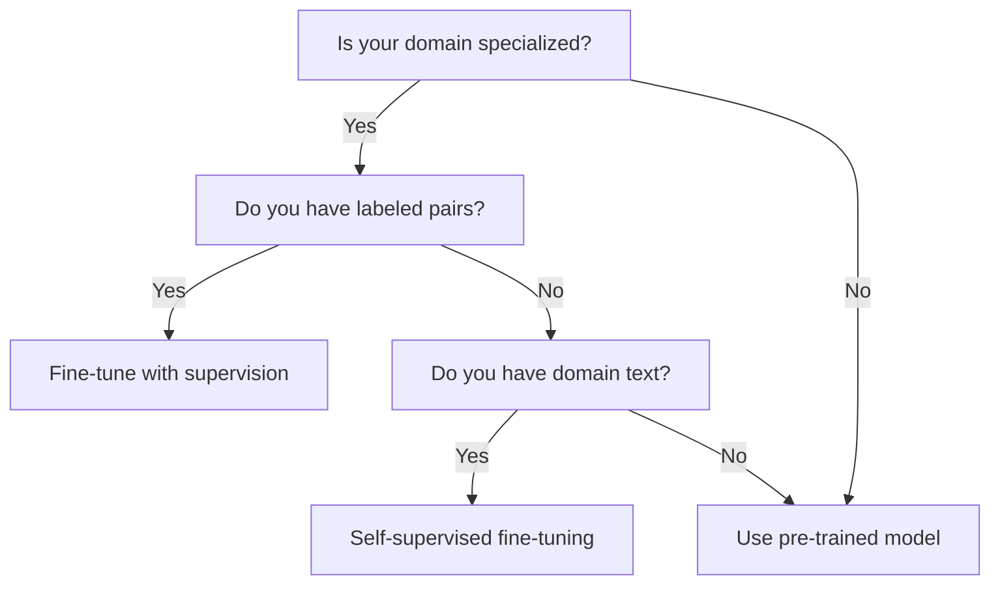

# Fine-tuning Embeddings

Adapt pre-trained embedding models to your domain for better performance

## What You'll Learn

- When and why to fine-tune embeddings
- Contrastive learning for embeddings
- Training with sentence-transformers
- Evaluating fine-tuned models

## Tech Stack

| Component | Technology |
|-----------|------------|
| Training | sentence-transformers |
| Data | Hugging Face datasets |
| Evaluation | Custom metrics |
| Experiment Tracking | Weights & Biases (optional) |

## When to Fine-tune



| Scenario | Recommendation |
|----------|----------------|
| General text | Use pre-trained model |
| Legal/Medical/Technical | Fine-tune for domain |
| Custom similarity definition | Fine-tune with labeled pairs |
| Multiple languages | Fine-tune multilingual model |

## Project Structure

```
fine-tuning/
├── src/
│   ├── __init__.py
│   ├── data.py            # Data loading and processing
│   ├── trainer.py         # Training logic
│   ├── evaluate.py        # Evaluation metrics
│   └── model.py           # Model utilities
├── data/
│   ├── train_pairs.csv
│   └── eval_pairs.csv
├── models/                 # Saved models
├── train.py               # Training script
├── evaluate.py            # Evaluation script
├── requirements.txt
└── README.md
```

## Implementation

### Step 1: Setup

```txt title="requirements.txt"
sentence-transformers>=2.2.0
datasets>=2.14.0
pandas>=2.0.0
scikit-learn>=1.3.0
torch>=2.0.0
tqdm>=4.65.0
wandb>=0.15.0  # optional
```

### Step 2: Data Preparation

```python title="src/data.py"
"""
Data preparation for embedding fine-tuning.
"""

import pandas as pd
from sentence_transformers import InputExample
from torch.utils.data import Dataset
from typing import Optional
import random


class PairDataset(Dataset):
    """
    Dataset for contrastive learning with pairs.
    
    Each example is a pair of texts with a similarity label.
    """
    
    def __init__(
        self,
        pairs: list[tuple[str, str, float]],
        transform=None
    ):
        """
        Args:
            pairs: List of (text1, text2, similarity_score)
            transform: Optional transformation
        """
        self.pairs = pairs
        self.transform = transform
    
    def __len__(self):
        return len(self.pairs)
    
    def __getitem__(self, idx):
        text1, text2, score = self.pairs[idx]
        
        example = InputExample(
            texts=[text1, text2],
            label=float(score)
        )
        
        if self.transform:
            example = self.transform(example)
        
        return example


def load_pairs_from_csv(
    path: str,
    text1_col: str = "text1",
    text2_col: str = "text2",
    label_col: str = "label"
) -> list[tuple[str, str, float]]:
    """
    Load pairs from a CSV file.
    
    Expected columns: text1, text2, label (0-1 similarity)
    """
    df = pd.read_csv(path)
    
    pairs = [
        (row[text1_col], row[text2_col], row[label_col])
        for _, row in df.iterrows()
    ]
    
    return pairs


def create_training_pairs(
    documents: list[dict],
    positive_key: str = "category"
) -> list[tuple[str, str, float]]:
    """
    Create training pairs from documents with categories.
    
    Documents in the same category are positive pairs (label=1),
    different categories are negative pairs (label=0).
    
    Args:
        documents: List of dicts with 'text' and category key
        positive_key: Key to use for determining positive pairs
    """
    pairs = []
    
    # Group by category
    by_category: dict[str, list[str]] = {}
    for doc in documents:
        cat = doc.get(positive_key, "unknown")
        if cat not in by_category:
            by_category[cat] = []
        by_category[cat].append(doc["text"])
    
    categories = list(by_category.keys())
    
    # Create positive pairs (same category)
    for cat, texts in by_category.items():
        for i, text1 in enumerate(texts):
            for text2 in texts[i+1:]:
                pairs.append((text1, text2, 1.0))
    
    # Create negative pairs (different categories)
    n_positive = len(pairs)
    for _ in range(n_positive):  # Balance positive/negative
        cat1, cat2 = random.sample(categories, 2)
        text1 = random.choice(by_category[cat1])
        text2 = random.choice(by_category[cat2])
        pairs.append((text1, text2, 0.0))
    
    random.shuffle(pairs)
    return pairs


def create_triplet_data(
    documents: list[dict],
    category_key: str = "category"
) -> list[InputExample]:
    """
    Create triplet data for MultipleNegativesRankingLoss.
    
    Each example: (anchor, positive) - negatives sampled in batch
    """
    examples = []
    
    # Group by category
    by_category: dict[str, list[str]] = {}
    for doc in documents:
        cat = doc.get(category_key, "unknown")
        if cat not in by_category:
            by_category[cat] = []
        by_category[cat].append(doc["text"])
    
    # Create anchor-positive pairs
    for cat, texts in by_category.items():
        if len(texts) < 2:
            continue
        
        for i, anchor in enumerate(texts):
            for positive in texts[i+1:]:
                examples.append(InputExample(texts=[anchor, positive]))
    
    random.shuffle(examples)
    return examples


def create_hard_negatives(
    query: str,
    positive: str,
    candidates: list[str],
    model,
    n_hard: int = 3
) -> list[str]:
    """
    Select hard negatives (similar but wrong) for better training.
    
    Hard negatives are negative examples that are close to the
    query in embedding space, making training more challenging.
    """
    import numpy as np
    
    # Embed everything
    query_emb = model.encode(query)
    candidate_embs = model.encode(candidates)
    
    # Compute similarities
    similarities = np.dot(candidate_embs, query_emb)
    
    # Get top-k most similar (excluding positive if present)
    sorted_indices = similarities.argsort()[::-1]
    
    hard_negatives = []
    for idx in sorted_indices:
        if candidates[idx] != positive and len(hard_negatives) < n_hard:
            hard_negatives.append(candidates[idx])
    
    return hard_negatives
```

### Step 3: Training

```python title="src/trainer.py"
"""
Training logic for embedding fine-tuning.
"""

from sentence_transformers import (
    SentenceTransformer,
    InputExample,
    losses,
    evaluation
)
from torch.utils.data import DataLoader
from typing import Optional
import os


class EmbeddingTrainer:
    """
    Fine-tune sentence transformer models.
    """
    
    def __init__(
        self,
        base_model: str = "all-MiniLM-L6-v2",
        output_dir: str = "models/fine-tuned"
    ):
        """
        Args:
            base_model: Pre-trained model to fine-tune
            output_dir: Directory to save fine-tuned model
        """
        self.model = SentenceTransformer(base_model)
        self.output_dir = output_dir
        os.makedirs(output_dir, exist_ok=True)
    
    def train_with_pairs(
        self,
        train_pairs: list[tuple[str, str, float]],
        eval_pairs: Optional[list[tuple[str, str, float]]] = None,
        epochs: int = 3,
        batch_size: int = 16,
        warmup_steps: int = 100,
        learning_rate: float = 2e-5
    ) -> SentenceTransformer:
        """
        Train with labeled pairs using CosineSimilarityLoss.
        
        Good for: When you have similarity scores between pairs.
        
        Args:
            train_pairs: List of (text1, text2, similarity) tuples
            eval_pairs: Optional evaluation pairs
            epochs: Number of training epochs
            batch_size: Training batch size
        """
        # Create training examples
        train_examples = [
            InputExample(texts=[t1, t2], label=float(score))
            for t1, t2, score in train_pairs
        ]
        
        # Create DataLoader
        train_dataloader = DataLoader(
            train_examples,
            shuffle=True,
            batch_size=batch_size
        )
        
        # Loss function
        train_loss = losses.CosineSimilarityLoss(self.model)
        
        # Evaluator
        evaluator = None
        if eval_pairs:
            sentences1 = [p[0] for p in eval_pairs]
            sentences2 = [p[1] for p in eval_pairs]
            scores = [p[2] for p in eval_pairs]
            
            evaluator = evaluation.EmbeddingSimilarityEvaluator(
                sentences1, sentences2, scores,
                name="eval"
            )
        
        # Train
        self.model.fit(
            train_objectives=[(train_dataloader, train_loss)],
            evaluator=evaluator,
            epochs=epochs,
            warmup_steps=warmup_steps,
            output_path=self.output_dir,
            optimizer_params={"lr": learning_rate},
            show_progress_bar=True
        )
        
        return self.model
    
    def train_with_mnrl(
        self,
        train_examples: list[InputExample],
        eval_pairs: Optional[list[tuple[str, str, float]]] = None,
        epochs: int = 3,
        batch_size: int = 32
    ) -> SentenceTransformer:
        """
        Train with MultipleNegativesRankingLoss.
        
        Good for: When you have (anchor, positive) pairs.
        Negatives are sampled from other examples in the batch.
        
        This is efficient because you don't need explicit negatives.
        """
        train_dataloader = DataLoader(
            train_examples,
            shuffle=True,
            batch_size=batch_size
        )
        
        # MNRL uses in-batch negatives
        train_loss = losses.MultipleNegativesRankingLoss(self.model)
        
        evaluator = None
        if eval_pairs:
            sentences1 = [p[0] for p in eval_pairs]
            sentences2 = [p[1] for p in eval_pairs]
            scores = [p[2] for p in eval_pairs]
            
            evaluator = evaluation.EmbeddingSimilarityEvaluator(
                sentences1, sentences2, scores
            )
        
        self.model.fit(
            train_objectives=[(train_dataloader, train_loss)],
            evaluator=evaluator,
            epochs=epochs,
            output_path=self.output_dir,
            show_progress_bar=True
        )
        
        return self.model
    
    def train_contrastive(
        self,
        train_examples: list[InputExample],
        epochs: int = 3,
        batch_size: int = 16,
        margin: float = 0.5
    ) -> SentenceTransformer:
        """
        Train with ContrastiveLoss.
        
        Good for: Binary pairs (similar/dissimilar).
        """
        train_dataloader = DataLoader(
            train_examples,
            shuffle=True,
            batch_size=batch_size
        )
        
        train_loss = losses.ContrastiveLoss(
            model=self.model,
            margin=margin
        )
        
        self.model.fit(
            train_objectives=[(train_dataloader, train_loss)],
            epochs=epochs,
            output_path=self.output_dir,
            show_progress_bar=True
        )
        
        return self.model


# Training script
if __name__ == "__main__":
    from data import create_training_pairs, load_pairs_from_csv
    
    # Example: Fine-tune on domain data
    documents = [
        {"text": "The patient presents with acute myocardial infarction", "category": "cardiology"},
        {"text": "Heart attack symptoms include chest pain", "category": "cardiology"},
        {"text": "The defendant filed a motion to dismiss", "category": "legal"},
        {"text": "Court proceedings were adjourned", "category": "legal"},
        {"text": "Python list comprehension syntax", "category": "programming"},
        {"text": "How to write a for loop in Python", "category": "programming"},
    ]
    
    # Create training pairs
    pairs = create_training_pairs(documents, positive_key="category")
    print(f"Created {len(pairs)} training pairs")
    
    # Train
    trainer = EmbeddingTrainer(
        base_model="all-MiniLM-L6-v2",
        output_dir="models/domain-tuned"
    )
    
    model = trainer.train_with_pairs(
        train_pairs=pairs,
        epochs=3,
        batch_size=8
    )
    
    print(f"Model saved to models/domain-tuned")
```

### Step 4: Evaluation

```python title="src/evaluate.py"
"""
Evaluation metrics for embedding models.
"""

import numpy as np
from sentence_transformers import SentenceTransformer
from sklearn.metrics import (
    accuracy_score,
    precision_recall_fscore_support,
    average_precision_score
)
from typing import Optional
from dataclasses import dataclass


@dataclass
class EvaluationResults:
    """Evaluation results container."""
    accuracy: float
    precision: float
    recall: float
    f1: float
    map_score: float  # Mean Average Precision
    mrr: float  # Mean Reciprocal Rank


def compute_similarity_accuracy(
    model: SentenceTransformer,
    pairs: list[tuple[str, str, float]],
    threshold: float = 0.5
) -> dict:
    """
    Compute accuracy on similarity prediction.
    
    Args:
        model: Embedding model
        pairs: List of (text1, text2, label) tuples
        threshold: Similarity threshold for positive prediction
    """
    texts1 = [p[0] for p in pairs]
    texts2 = [p[1] for p in pairs]
    labels = [1 if p[2] >= 0.5 else 0 for p in pairs]
    
    # Compute embeddings
    emb1 = model.encode(texts1, convert_to_numpy=True, normalize_embeddings=True)
    emb2 = model.encode(texts2, convert_to_numpy=True, normalize_embeddings=True)
    
    # Compute cosine similarities
    similarities = np.sum(emb1 * emb2, axis=1)
    predictions = (similarities >= threshold).astype(int)
    
    # Compute metrics
    accuracy = accuracy_score(labels, predictions)
    precision, recall, f1, _ = precision_recall_fscore_support(
        labels, predictions, average="binary"
    )
    
    return {
        "accuracy": accuracy,
        "precision": precision,
        "recall": recall,
        "f1": f1,
        "threshold": threshold
    }


def compute_retrieval_metrics(
    model: SentenceTransformer,
    queries: list[str],
    documents: list[str],
    relevance: list[list[int]],  # For each query, list of relevant doc indices
    k: int = 10
) -> dict:
    """
    Compute retrieval metrics (MRR, MAP, Recall@K).
    
    Args:
        model: Embedding model
        queries: List of query texts
        documents: List of document texts
        relevance: For each query, indices of relevant documents
        k: Cut-off for Recall@K
    """
    # Embed queries and documents
    query_embs = model.encode(queries, convert_to_numpy=True, normalize_embeddings=True)
    doc_embs = model.encode(documents, convert_to_numpy=True, normalize_embeddings=True)
    
    # Compute similarity matrix
    similarities = np.dot(query_embs, doc_embs.T)
    
    mrr_scores = []
    map_scores = []
    recall_at_k = []
    
    for i, (sim_scores, relevant_docs) in enumerate(zip(similarities, relevance)):
        # Rank documents by similarity
        ranked_indices = sim_scores.argsort()[::-1]
        
        # MRR: Reciprocal rank of first relevant document
        for rank, idx in enumerate(ranked_indices, 1):
            if idx in relevant_docs:
                mrr_scores.append(1.0 / rank)
                break
        else:
            mrr_scores.append(0.0)
        
        # MAP: Mean Average Precision
        relevant_found = 0
        precision_sum = 0
        for rank, idx in enumerate(ranked_indices, 1):
            if idx in relevant_docs:
                relevant_found += 1
                precision_sum += relevant_found / rank
        
        if len(relevant_docs) > 0:
            map_scores.append(precision_sum / len(relevant_docs))
        else:
            map_scores.append(0.0)
        
        # Recall@K
        retrieved_at_k = set(ranked_indices[:k])
        relevant_set = set(relevant_docs)
        recall = len(retrieved_at_k & relevant_set) / len(relevant_set) if relevant_set else 0
        recall_at_k.append(recall)
    
    return {
        "mrr": np.mean(mrr_scores),
        "map": np.mean(map_scores),
        f"recall@{k}": np.mean(recall_at_k)
    }


def compare_models(
    models: dict[str, SentenceTransformer],
    eval_pairs: list[tuple[str, str, float]]
) -> dict:
    """
    Compare multiple models on the same evaluation data.
    """
    results = {}
    
    for name, model in models.items():
        metrics = compute_similarity_accuracy(model, eval_pairs)
        results[name] = metrics
    
    return results


# Evaluation script
if __name__ == "__main__":
    # Load models
    base_model = SentenceTransformer("all-MiniLM-L6-v2")
    fine_tuned = SentenceTransformer("models/domain-tuned")
    
    # Evaluation data
    eval_pairs = [
        ("Heart disease symptoms", "Cardiac arrest signs", 1.0),
        ("Heart disease symptoms", "Python programming", 0.0),
        ("Legal proceedings", "Court case", 1.0),
        ("Legal proceedings", "Machine learning", 0.0),
    ]
    
    # Compare
    results = compare_models(
        {"base": base_model, "fine-tuned": fine_tuned},
        eval_pairs
    )
    
    print("\nComparison Results:")
    for model_name, metrics in results.items():
        print(f"\n{model_name}:")
        for metric, value in metrics.items():
            print(f"  {metric}: {value:.4f}")
```

### Step 5: Training Script

```python title="train.py"
"""
Main training script for embedding fine-tuning.
"""

import argparse
import json
from pathlib import Path

from src.data import load_pairs_from_csv, create_training_pairs
from src.trainer import EmbeddingTrainer
from src.evaluate import compute_similarity_accuracy


def main():
    parser = argparse.ArgumentParser(description="Fine-tune embedding model")
    parser.add_argument("--base-model", default="all-MiniLM-L6-v2")
    parser.add_argument("--train-data", required=True, help="Path to training CSV")
    parser.add_argument("--eval-data", help="Path to evaluation CSV")
    parser.add_argument("--output-dir", default="models/fine-tuned")
    parser.add_argument("--epochs", type=int, default=3)
    parser.add_argument("--batch-size", type=int, default=16)
    parser.add_argument("--learning-rate", type=float, default=2e-5)
    args = parser.parse_args()
    
    print(f"Loading training data from {args.train_data}")
    train_pairs = load_pairs_from_csv(args.train_data)
    print(f"Loaded {len(train_pairs)} training pairs")
    
    eval_pairs = None
    if args.eval_data:
        eval_pairs = load_pairs_from_csv(args.eval_data)
        print(f"Loaded {len(eval_pairs)} evaluation pairs")
    
    # Initialize trainer
    trainer = EmbeddingTrainer(
        base_model=args.base_model,
        output_dir=args.output_dir
    )
    
    # Train
    print(f"\nTraining for {args.epochs} epochs...")
    model = trainer.train_with_pairs(
        train_pairs=train_pairs,
        eval_pairs=eval_pairs,
        epochs=args.epochs,
        batch_size=args.batch_size,
        learning_rate=args.learning_rate
    )
    
    # Final evaluation
    if eval_pairs:
        print("\nFinal Evaluation:")
        metrics = compute_similarity_accuracy(model, eval_pairs)
        for key, value in metrics.items():
            print(f"  {key}: {value:.4f}")
        
        # Save metrics
        metrics_path = Path(args.output_dir) / "metrics.json"
        with open(metrics_path, "w") as f:
            json.dump(metrics, f, indent=2)
    
    print(f"\nModel saved to {args.output_dir}")


if __name__ == "__main__":
    main()
```

## Example Training Data

```csv title="data/train_pairs.csv"
text1,text2,label
"Patient has chest pain","Cardiac symptoms present",1.0
"Heart attack treatment","Myocardial infarction therapy",1.0
"Python programming","JavaScript coding",0.8
"Machine learning model","Deep learning network",0.9
"Legal contract","Court document",0.7
"Cooking recipe","Food preparation",0.9
"Heart disease","Python code",0.0
"Legal brief","Baking instructions",0.0
```

## Running Training

```bash
# Train with your data
python train.py \
  --base-model all-MiniLM-L6-v2 \
  --train-data data/train_pairs.csv \
  --eval-data data/eval_pairs.csv \
  --output-dir models/my-domain \
  --epochs 3 \
  --batch-size 16
```

## Key Concepts

### Loss Functions

| Loss | When to Use |
|------|-------------|
| CosineSimilarityLoss | Have similarity scores (0-1) |
| ContrastiveLoss | Have binary labels (similar/dissimilar) |
| MultipleNegativesRankingLoss | Have (anchor, positive) pairs only |
| TripletLoss | Have (anchor, positive, negative) triplets |

### Tips for Better Results

1. **Data quality** > quantity - Clean, consistent labels matter
2. **Hard negatives** - Use challenging examples for better discrimination
3. **Domain coverage** - Include diverse examples from your domain
4. **Evaluation set** - Keep separate data for unbiased evaluation

## Next Steps

- [Production Embedding Pipeline](/docs/embeddings/advanced/production-pipeline) - Scale your fine-tuned model
- [Search at Scale](/docs/embeddings/advanced/search-at-scale) - Deploy for billions of vectors
