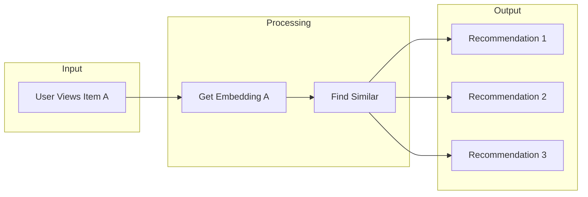

# Similarity-Based Recommendations

Build a content-based recommendation engine using vector similarity

## What You'll Learn

- Content-based vs collaborative filtering
- Using embeddings for item similarity
- Building a recommendation API
- Handling cold start problems

## Tech Stack

| Component | Technology |
|-----------|------------|
| Embeddings | sentence-transformers |
| Storage | ChromaDB |
| API | FastAPI |
| Cache | Redis (optional) |

## How It Works



## Project Structure

```
recommendations/
├── src/
│   ├── __init__.py
│   ├── embeddings.py
│   ├── recommender.py
│   ├── storage.py
│   └── api.py
├── data/
│   └── items.json
├── requirements.txt
└── README.md
```

## Implementation

### Step 1: Setup

```txt title="requirements.txt"
sentence-transformers>=2.2.0
chromadb>=0.4.0
fastapi>=0.100.0
uvicorn>=0.23.0
numpy>=1.24.0
```

### Step 2: Recommendation Engine

```python title="src/recommender.py"
"""
Content-based recommendation engine using embeddings.
"""

import numpy as np
from sentence_transformers import SentenceTransformer
from dataclasses import dataclass
from typing import Optional
import chromadb
from chromadb.config import Settings


@dataclass
class Item:
    """An item that can be recommended."""
    id: str
    title: str
    description: str
    metadata: dict


@dataclass
class Recommendation:
    """A recommendation result."""
    item: Item
    score: float
    reason: str


class RecommendationEngine:
    """
    Content-based recommendation using embedding similarity.
    
    Finds similar items based on their text descriptions
    using cosine similarity in embedding space.
    """
    
    def __init__(
        self,
        model_name: str = "all-MiniLM-L6-v2",
        collection_name: str = "items"
    ):
        """Initialize the recommendation engine."""
        self.model = SentenceTransformer(model_name)
        
        # Use ChromaDB for vector storage
        self.client = chromadb.Client(Settings(
            anonymized_telemetry=False
        ))
        
        self.collection = self.client.get_or_create_collection(
            name=collection_name,
            metadata={"hnsw:space": "cosine"}
        )
        
        self.items: dict[str, Item] = {}
    
    def add_items(self, items: list[Item]) -> None:
        """
        Add items to the recommendation index.
        
        Args:
            items: List of items to add
        """
        # Create text for embedding (combine title + description)
        texts = [
            f"{item.title}. {item.description}"
            for item in items
        ]
        
        # Generate embeddings
        embeddings = self.model.encode(texts).tolist()
        
        # Add to ChromaDB
        self.collection.add(
            ids=[item.id for item in items],
            embeddings=embeddings,
            metadatas=[item.metadata for item in items],
            documents=texts
        )
        
        # Store item objects
        for item in items:
            self.items[item.id] = item
        
        print(f"Added {len(items)} items. Total: {self.collection.count()}")
    
    def get_similar(
        self,
        item_id: str,
        n: int = 5,
        exclude_self: bool = True
    ) -> list[Recommendation]:
        """
        Get items similar to the given item.
        
        Args:
            item_id: ID of the source item
            n: Number of recommendations
            exclude_self: Whether to exclude the source item
            
        Returns:
            List of recommendations sorted by similarity
        """
        if item_id not in self.items:
            raise ValueError(f"Item {item_id} not found")
        
        # Get the item's embedding by querying itself
        item = self.items[item_id]
        query_text = f"{item.title}. {item.description}"
        
        # Query for similar items
        results = self.collection.query(
            query_texts=[query_text],
            n_results=n + (1 if exclude_self else 0)
        )
        
        recommendations = []
        for i, result_id in enumerate(results["ids"][0]):
            if exclude_self and result_id == item_id:
                continue
            
            if result_id in self.items:
                score = 1 - results["distances"][0][i]  # Convert distance to similarity
                recommendations.append(Recommendation(
                    item=self.items[result_id],
                    score=score,
                    reason=f"Similar to {item.title}"
                ))
        
        return recommendations[:n]
    
    def get_recommendations_for_user(
        self,
        viewed_item_ids: list[str],
        n: int = 5
    ) -> list[Recommendation]:
        """
        Get recommendations based on user's viewing history.
        
        Combines similarities from multiple viewed items
        using weighted averaging.
        
        Args:
            viewed_item_ids: IDs of items the user has viewed
            n: Number of recommendations
        """
        if not viewed_item_ids:
            return []
        
        # Get embeddings for viewed items
        viewed_texts = [
            f"{self.items[item_id].title}. {self.items[item_id].description}"
            for item_id in viewed_item_ids
            if item_id in self.items
        ]
        
        if not viewed_texts:
            return []
        
        # Average the embeddings (simple approach)
        embeddings = self.model.encode(viewed_texts)
        avg_embedding = np.mean(embeddings, axis=0).tolist()
        
        # Query with averaged embedding
        results = self.collection.query(
            query_embeddings=[avg_embedding],
            n_results=n + len(viewed_item_ids)
        )
        
        # Filter out already viewed items
        recommendations = []
        for i, result_id in enumerate(results["ids"][0]):
            if result_id in viewed_item_ids:
                continue
            
            if result_id in self.items:
                score = 1 - results["distances"][0][i]
                recommendations.append(Recommendation(
                    item=self.items[result_id],
                    score=score,
                    reason="Based on your viewing history"
                ))
        
        return recommendations[:n]
    
    def search(
        self,
        query: str,
        n: int = 5,
        filters: Optional[dict] = None
    ) -> list[Recommendation]:
        """
        Search for items matching a text query.
        
        Args:
            query: Search query
            n: Number of results
            filters: Optional metadata filters
        """
        where_filter = filters if filters else None
        
        results = self.collection.query(
            query_texts=[query],
            n_results=n,
            where=where_filter
        )
        
        recommendations = []
        for i, result_id in enumerate(results["ids"][0]):
            if result_id in self.items:
                score = 1 - results["distances"][0][i]
                recommendations.append(Recommendation(
                    item=self.items[result_id],
                    score=score,
                    reason=f"Matches: {query}"
                ))
        
        return recommendations


# Example usage
if __name__ == "__main__":
    engine = RecommendationEngine()
    
    # Add sample items
    items = [
        Item("1", "Python Crash Course", "Learn Python programming from scratch", {"category": "programming"}),
        Item("2", "Machine Learning Basics", "Introduction to ML algorithms", {"category": "ai"}),
        Item("3", "Deep Learning with PyTorch", "Build neural networks with PyTorch", {"category": "ai"}),
        Item("4", "Web Development with Flask", "Create web apps using Flask", {"category": "programming"}),
        Item("5", "Data Science Handbook", "Complete guide to data science", {"category": "data"}),
        Item("6", "NLP with Transformers", "Modern NLP using transformer models", {"category": "ai"}),
    ]
    
    engine.add_items(items)
    
    # Get recommendations
    print("\nSimilar to 'Machine Learning Basics':")
    for rec in engine.get_similar("2", n=3):
        print(f"  [{rec.score:.3f}] {rec.item.title}")
    
    # User-based recommendations
    print("\nFor user who viewed ML and Deep Learning:")
    for rec in engine.get_recommendations_for_user(["2", "3"], n=3):
        print(f"  [{rec.score:.3f}] {rec.item.title} - {rec.reason}")
```

### Step 3: FastAPI Application

```python title="src/api.py"
"""
FastAPI application for recommendations.
"""

from fastapi import FastAPI, HTTPException
from pydantic import BaseModel, Field
from typing import Optional

from .recommender import RecommendationEngine, Item


app = FastAPI(
    title="Recommendation API",
    description="Content-based recommendations using embeddings",
    version="1.0.0"
)

engine = RecommendationEngine()


class ItemRequest(BaseModel):
    id: str
    title: str
    description: str
    metadata: dict = {}


class RecommendationResponse(BaseModel):
    id: str
    title: str
    description: str
    score: float
    reason: str


class SimilarRequest(BaseModel):
    item_id: str
    n: int = Field(default=5, ge=1, le=50)


class UserRecommendationRequest(BaseModel):
    viewed_items: list[str]
    n: int = Field(default=5, ge=1, le=50)


@app.post("/items")
async def add_items(items: list[ItemRequest]):
    """Add items to the recommendation index."""
    item_objects = [
        Item(
            id=item.id,
            title=item.title,
            description=item.description,
            metadata=item.metadata
        )
        for item in items
    ]
    
    engine.add_items(item_objects)
    
    return {"message": f"Added {len(items)} items"}


@app.post("/similar", response_model=list[RecommendationResponse])
async def get_similar(request: SimilarRequest):
    """Get items similar to a given item."""
    try:
        recommendations = engine.get_similar(request.item_id, request.n)
        
        return [
            RecommendationResponse(
                id=rec.item.id,
                title=rec.item.title,
                description=rec.item.description,
                score=rec.score,
                reason=rec.reason
            )
            for rec in recommendations
        ]
    except ValueError as e:
        raise HTTPException(status_code=404, detail=str(e))


@app.post("/recommend", response_model=list[RecommendationResponse])
async def get_user_recommendations(request: UserRecommendationRequest):
    """Get recommendations for a user based on viewing history."""
    recommendations = engine.get_recommendations_for_user(
        request.viewed_items,
        request.n
    )
    
    return [
        RecommendationResponse(
            id=rec.item.id,
            title=rec.item.title,
            description=rec.item.description,
            score=rec.score,
            reason=rec.reason
        )
        for rec in recommendations
    ]


@app.get("/search")
async def search(query: str, n: int = 5, category: Optional[str] = None):
    """Search for items matching a query."""
    filters = {"category": category} if category else None
    recommendations = engine.search(query, n, filters)
    
    return [
        RecommendationResponse(
            id=rec.item.id,
            title=rec.item.title,
            description=rec.item.description,
            score=rec.score,
            reason=rec.reason
        )
        for rec in recommendations
    ]
```

## Testing

```python title="tests/test_recommender.py"
"""Tests for recommendation engine."""

import pytest
from src.recommender import RecommendationEngine, Item


@pytest.fixture
def engine():
    e = RecommendationEngine()
    items = [
        Item("1", "Python Basics", "Learn Python programming", {"category": "tech"}),
        Item("2", "Machine Learning", "Introduction to ML", {"category": "ai"}),
        Item("3", "Deep Learning", "Neural networks with PyTorch", {"category": "ai"}),
        Item("4", "Cooking 101", "Basic cooking recipes", {"category": "food"}),
    ]
    e.add_items(items)
    return e


def test_similar_items(engine):
    """Test finding similar items."""
    recs = engine.get_similar("2", n=2)
    
    # Deep Learning should be most similar to ML
    assert len(recs) == 2
    assert recs[0].item.id == "3"  # Deep Learning


def test_user_recommendations(engine):
    """Test user-based recommendations."""
    recs = engine.get_recommendations_for_user(["2", "3"], n=2)
    
    # Should not include viewed items
    rec_ids = [r.item.id for r in recs]
    assert "2" not in rec_ids
    assert "3" not in rec_ids


def test_search(engine):
    """Test search functionality."""
    recs = engine.search("programming")
    
    assert len(recs) > 0
    # Python should rank highly for programming
    assert any(r.item.id == "1" for r in recs)
```

## Key Concepts

### Content vs Collaborative Filtering

| Approach | Description | Pros | Cons |
|----------|-------------|------|------|
| Content-based | Similarity based on item features | No cold start for items | Limited diversity |
| Collaborative | Based on user behavior patterns | Discovers hidden patterns | Cold start problem |
| Hybrid | Combines both approaches | Best of both worlds | More complex |

### Handling Cold Start

For new items without interactions:
1. Use content-based similarity (embeddings)
2. Extract features from metadata
3. Use popularity as fallback

## Next Steps

- [Embedding Visualization](/docs/embeddings/intermediate/embedding-visualization) - Visualize your item space
- [Fine-tuning Embeddings](/docs/embeddings/intermediate/fine-tuning) - Train domain-specific embeddings
