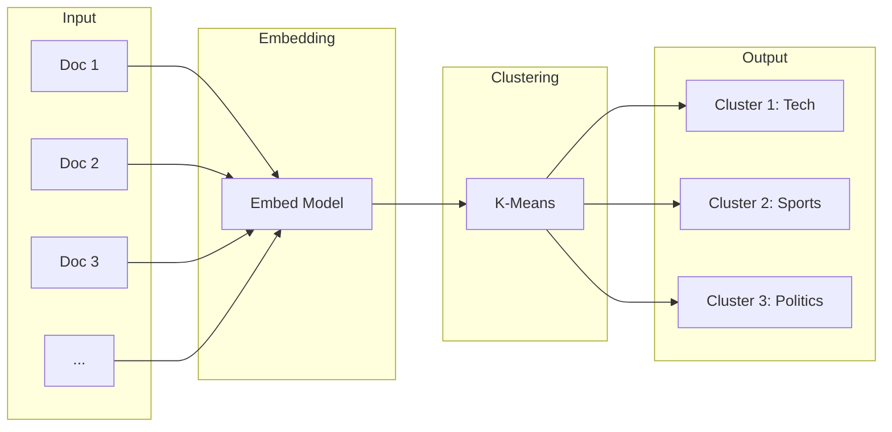

# Text Clustering with Embeddings

Discover hidden patterns by automatically grouping similar documents

## What You'll Learn

- Clustering algorithms for text data
- K-means and hierarchical clustering with embeddings
- Determining optimal cluster count
- Labeling and interpreting clusters

## Tech Stack

| Component | Technology |
|-----------|------------|
| Embeddings | sentence-transformers |
| Clustering | scikit-learn |
| Visualization | matplotlib, plotly |
| API | FastAPI |

## Prerequisites

- Completed [Semantic Search Engine](/docs/embeddings/basic/semantic-search)
- Understanding of basic statistics

## How Text Clustering Works



## Project Structure

```
text-clustering/
├── src/
│   ├── __init__.py
│   ├── embeddings.py      # Embedding generation
│   ├── clustering.py      # Clustering algorithms
│   ├── evaluation.py      # Cluster quality metrics
│   └── api.py             # FastAPI application
├── notebooks/
│   └── clustering_exploration.ipynb
├── data/
│   └── articles.json
├── requirements.txt
└── README.md
```

## Implementation

### Step 1: Project Setup

```txt title="requirements.txt"
sentence-transformers>=2.2.0
scikit-learn>=1.3.0
numpy>=1.24.0
pandas>=2.0.0
matplotlib>=3.7.0
plotly>=5.15.0
fastapi>=0.100.0
uvicorn>=0.23.0
```

### Step 2: Clustering Engine

```python title="src/clustering.py"
"""
Text clustering using embeddings and K-means.
"""

import numpy as np
from sklearn.cluster import KMeans, AgglomerativeClustering
from sklearn.metrics import silhouette_score, calinski_harabasz_score
from sentence_transformers import SentenceTransformer
from dataclasses import dataclass
from typing import Optional
from collections import Counter


@dataclass
class ClusterResult:
    """Result of clustering operation."""
    labels: np.ndarray
    centroids: Optional[np.ndarray]
    silhouette: float
    documents_per_cluster: dict[int, int]


class TextClusterer:
    """
    Cluster text documents using embeddings.
    
    Uses K-means by default, with support for
    hierarchical clustering.
    """
    
    def __init__(self, model_name: str = "all-MiniLM-L6-v2"):
        """Initialize with embedding model."""
        self.model = SentenceTransformer(model_name)
        self.embeddings: Optional[np.ndarray] = None
        self.documents: list[str] = []
        self.labels: Optional[np.ndarray] = None
    
    def fit(self, documents: list[str]) -> np.ndarray:
        """
        Generate embeddings for documents.
        
        Args:
            documents: List of text documents
            
        Returns:
            Embedding matrix
        """
        self.documents = documents
        self.embeddings = self.model.encode(
            documents,
            convert_to_numpy=True,
            normalize_embeddings=True,
            show_progress_bar=True
        )
        return self.embeddings
    
    def cluster_kmeans(
        self,
        n_clusters: int,
        random_state: int = 42
    ) -> ClusterResult:
        """
        Cluster documents using K-means.
        
        Args:
            n_clusters: Number of clusters
            random_state: Random seed for reproducibility
            
        Returns:
            ClusterResult with labels and metrics
        """
        if self.embeddings is None:
            raise ValueError("Call fit() first to generate embeddings")
        
        kmeans = KMeans(
            n_clusters=n_clusters,
            random_state=random_state,
            n_init=10
        )
        
        self.labels = kmeans.fit_predict(self.embeddings)
        
        # Calculate metrics
        silhouette = silhouette_score(self.embeddings, self.labels)
        
        # Count documents per cluster
        counts = Counter(self.labels)
        
        return ClusterResult(
            labels=self.labels,
            centroids=kmeans.cluster_centers_,
            silhouette=silhouette,
            documents_per_cluster=dict(counts)
        )
    
    def cluster_hierarchical(
        self,
        n_clusters: int,
        linkage: str = "ward"
    ) -> ClusterResult:
        """
        Cluster using hierarchical/agglomerative clustering.
        
        Args:
            n_clusters: Number of clusters
            linkage: Linkage criterion (ward, complete, average, single)
        """
        if self.embeddings is None:
            raise ValueError("Call fit() first")
        
        clustering = AgglomerativeClustering(
            n_clusters=n_clusters,
            linkage=linkage
        )
        
        self.labels = clustering.fit_predict(self.embeddings)
        silhouette = silhouette_score(self.embeddings, self.labels)
        counts = Counter(self.labels)
        
        return ClusterResult(
            labels=self.labels,
            centroids=None,  # Hierarchical doesn't have centroids
            silhouette=silhouette,
            documents_per_cluster=dict(counts)
        )
    
    def find_optimal_k(
        self,
        k_range: tuple[int, int] = (2, 10)
    ) -> dict:
        """
        Find optimal number of clusters using elbow method and silhouette.
        
        Args:
            k_range: Range of k values to try (min, max)
            
        Returns:
            Dict with metrics for each k
        """
        if self.embeddings is None:
            raise ValueError("Call fit() first")
        
        results = {
            "k_values": [],
            "inertias": [],
            "silhouettes": [],
            "calinski_harabasz": []
        }
        
        for k in range(k_range[0], k_range[1] + 1):
            kmeans = KMeans(n_clusters=k, random_state=42, n_init=10)
            labels = kmeans.fit_predict(self.embeddings)
            
            results["k_values"].append(k)
            results["inertias"].append(kmeans.inertia_)
            results["silhouettes"].append(
                silhouette_score(self.embeddings, labels)
            )
            results["calinski_harabasz"].append(
                calinski_harabasz_score(self.embeddings, labels)
            )
        
        # Find best k by silhouette score
        best_idx = np.argmax(results["silhouettes"])
        results["optimal_k"] = results["k_values"][best_idx]
        
        return results
    
    def get_cluster_documents(self, cluster_id: int) -> list[str]:
        """Get all documents in a specific cluster."""
        if self.labels is None:
            raise ValueError("Run clustering first")
        
        indices = np.where(self.labels == cluster_id)[0]
        return [self.documents[i] for i in indices]
    
    def get_cluster_keywords(
        self,
        cluster_id: int,
        top_n: int = 5
    ) -> list[str]:
        """
        Extract representative keywords for a cluster.
        
        Uses TF-IDF to find distinctive terms.
        """
        from sklearn.feature_extraction.text import TfidfVectorizer
        
        cluster_docs = self.get_cluster_documents(cluster_id)
        other_docs = [
            doc for i, doc in enumerate(self.documents)
            if self.labels[i] != cluster_id
        ]
        
        # Compute TF-IDF
        vectorizer = TfidfVectorizer(
            max_features=1000,
            stop_words="english",
            ngram_range=(1, 2)
        )
        
        # Fit on all docs
        vectorizer.fit(self.documents)
        
        # Get average TF-IDF for cluster
        cluster_tfidf = vectorizer.transform(cluster_docs).mean(axis=0)
        cluster_tfidf = np.asarray(cluster_tfidf).flatten()
        
        # Get top terms
        feature_names = vectorizer.get_feature_names_out()
        top_indices = cluster_tfidf.argsort()[::-1][:top_n]
        
        return [feature_names[i] for i in top_indices]
    
    def get_nearest_to_centroid(
        self,
        cluster_id: int,
        centroids: np.ndarray,
        n: int = 3
    ) -> list[tuple[str, float]]:
        """
        Get documents nearest to cluster centroid.
        
        These are the most representative documents.
        """
        if self.labels is None:
            raise ValueError("Run clustering first")
        
        centroid = centroids[cluster_id]
        cluster_indices = np.where(self.labels == cluster_id)[0]
        cluster_embeddings = self.embeddings[cluster_indices]
        
        # Compute distances to centroid
        distances = np.linalg.norm(cluster_embeddings - centroid, axis=1)
        
        # Get nearest
        nearest_local = distances.argsort()[:n]
        
        return [
            (self.documents[cluster_indices[i]], float(distances[i]))
            for i in nearest_local
        ]


# Example usage
if __name__ == "__main__":
    documents = [
        "Python is great for machine learning",
        "TensorFlow is a deep learning framework",
        "Basketball is an exciting sport",
        "The Lakers won the championship",
        "Neural networks power modern AI",
        "Soccer World Cup attracts millions",
        "PyTorch makes deep learning easier",
        "NFL season starts in September",
    ]
    
    clusterer = TextClusterer()
    clusterer.fit(documents)
    
    # Find optimal k
    metrics = clusterer.find_optimal_k((2, 5))
    print(f"Optimal k: {metrics['optimal_k']}")
    
    # Cluster with optimal k
    result = clusterer.cluster_kmeans(n_clusters=2)
    print(f"Silhouette score: {result.silhouette:.4f}")
    
    # Show clusters
    for cluster_id in range(2):
        print(f"\nCluster {cluster_id}:")
        for doc in clusterer.get_cluster_documents(cluster_id):
            print(f"  - {doc}")
```

### Step 3: Cluster Evaluation

```python title="src/evaluation.py"
"""
Evaluation metrics for clustering quality.
"""

import numpy as np
from sklearn.metrics import (
    silhouette_score,
    silhouette_samples,
    calinski_harabasz_score,
    davies_bouldin_score
)
from typing import Optional
import matplotlib.pyplot as plt


class ClusterEvaluator:
    """Evaluate clustering quality with multiple metrics."""
    
    def __init__(
        self,
        embeddings: np.ndarray,
        labels: np.ndarray
    ):
        """
        Initialize evaluator.
        
        Args:
            embeddings: Document embeddings
            labels: Cluster assignments
        """
        self.embeddings = embeddings
        self.labels = labels
        self.n_clusters = len(set(labels))
    
    def compute_all_metrics(self) -> dict:
        """Compute all clustering metrics."""
        return {
            "silhouette_score": silhouette_score(
                self.embeddings, self.labels
            ),
            "calinski_harabasz": calinski_harabasz_score(
                self.embeddings, self.labels
            ),
            "davies_bouldin": davies_bouldin_score(
                self.embeddings, self.labels
            ),
            "cluster_sizes": self._get_cluster_sizes(),
            "size_balance": self._compute_balance()
        }
    
    def _get_cluster_sizes(self) -> dict[int, int]:
        """Get size of each cluster."""
        unique, counts = np.unique(self.labels, return_counts=True)
        return dict(zip(unique.tolist(), counts.tolist()))
    
    def _compute_balance(self) -> float:
        """
        Compute cluster balance (0-1).
        
        1.0 = perfectly balanced
        0.0 = highly imbalanced
        """
        sizes = list(self._get_cluster_sizes().values())
        if len(sizes) <= 1:
            return 1.0
        
        mean_size = np.mean(sizes)
        std_size = np.std(sizes)
        
        # Coefficient of variation (lower = more balanced)
        cv = std_size / mean_size if mean_size > 0 else 0
        
        # Convert to 0-1 scale where 1 is balanced
        return max(0, 1 - cv)
    
    def plot_silhouette(self, ax: Optional[plt.Axes] = None) -> plt.Figure:
        """
        Plot silhouette diagram.
        
        Shows quality of each sample's cluster assignment.
        """
        if ax is None:
            fig, ax = plt.subplots(figsize=(10, 6))
        else:
            fig = ax.figure
        
        sample_silhouettes = silhouette_samples(self.embeddings, self.labels)
        avg_silhouette = silhouette_score(self.embeddings, self.labels)
        
        y_lower = 10
        for i in range(self.n_clusters):
            cluster_silhouettes = sample_silhouettes[self.labels == i]
            cluster_silhouettes.sort()
            
            size = cluster_silhouettes.shape[0]
            y_upper = y_lower + size
            
            color = plt.cm.nipy_spectral(float(i) / self.n_clusters)
            ax.fill_betweenx(
                np.arange(y_lower, y_upper),
                0,
                cluster_silhouettes,
                facecolor=color,
                edgecolor=color,
                alpha=0.7
            )
            
            ax.text(-0.05, y_lower + 0.5 * size, str(i))
            y_lower = y_upper + 10
        
        ax.axvline(x=avg_silhouette, color="red", linestyle="--",
                   label=f"Average: {avg_silhouette:.3f}")
        ax.set_xlabel("Silhouette Coefficient")
        ax.set_ylabel("Cluster")
        ax.set_title("Silhouette Analysis")
        ax.legend()
        
        return fig
    
    def plot_elbow(
        self,
        k_range: range,
        inertias: list[float],
        ax: Optional[plt.Axes] = None
    ) -> plt.Figure:
        """Plot elbow curve for K selection."""
        if ax is None:
            fig, ax = plt.subplots(figsize=(10, 6))
        else:
            fig = ax.figure
        
        ax.plot(k_range, inertias, 'bx-')
        ax.set_xlabel('Number of Clusters (k)')
        ax.set_ylabel('Inertia')
        ax.set_title('Elbow Method for Optimal k')
        ax.grid(True)
        
        return fig


def compare_clusterings(
    embeddings: np.ndarray,
    labels_list: list[np.ndarray],
    names: list[str]
) -> dict:
    """
    Compare multiple clustering results.
    
    Args:
        embeddings: Document embeddings
        labels_list: List of label arrays from different methods
        names: Names for each method
        
    Returns:
        Comparison metrics
    """
    results = {}
    
    for labels, name in zip(labels_list, names):
        evaluator = ClusterEvaluator(embeddings, labels)
        results[name] = evaluator.compute_all_metrics()
    
    return results
```

### Step 4: Visualization

```python title="src/visualization.py"
"""
Visualization utilities for clustering results.
"""

import numpy as np
import plotly.express as px
import plotly.graph_objects as go
from sklearn.manifold import TSNE
from sklearn.decomposition import PCA
from typing import Optional


def reduce_dimensions(
    embeddings: np.ndarray,
    method: str = "tsne",
    n_components: int = 2,
    **kwargs
) -> np.ndarray:
    """
    Reduce embedding dimensions for visualization.
    
    Args:
        embeddings: High-dimensional embeddings
        method: "tsne" or "pca"
        n_components: Output dimensions (2 or 3)
        
    Returns:
        Reduced embeddings
    """
    if method == "tsne":
        reducer = TSNE(
            n_components=n_components,
            random_state=42,
            perplexity=min(30, len(embeddings) - 1),
            **kwargs
        )
    elif method == "pca":
        reducer = PCA(n_components=n_components, **kwargs)
    else:
        raise ValueError(f"Unknown method: {method}")
    
    return reducer.fit_transform(embeddings)


def plot_clusters_2d(
    embeddings_2d: np.ndarray,
    labels: np.ndarray,
    texts: Optional[list[str]] = None,
    title: str = "Document Clusters"
) -> go.Figure:
    """
    Create interactive 2D scatter plot of clusters.
    """
    hover_text = texts if texts else [f"Doc {i}" for i in range(len(labels))]
    
    fig = px.scatter(
        x=embeddings_2d[:, 0],
        y=embeddings_2d[:, 1],
        color=labels.astype(str),
        hover_data={"text": hover_text},
        title=title,
        labels={"color": "Cluster"}
    )
    
    fig.update_layout(
        xaxis_title="Dimension 1",
        yaxis_title="Dimension 2",
        showlegend=True
    )
    
    return fig


def plot_clusters_3d(
    embeddings_3d: np.ndarray,
    labels: np.ndarray,
    texts: Optional[list[str]] = None,
    title: str = "Document Clusters (3D)"
) -> go.Figure:
    """
    Create interactive 3D scatter plot of clusters.
    """
    hover_text = texts if texts else [f"Doc {i}" for i in range(len(labels))]
    
    fig = px.scatter_3d(
        x=embeddings_3d[:, 0],
        y=embeddings_3d[:, 1],
        z=embeddings_3d[:, 2],
        color=labels.astype(str),
        hover_data={"text": hover_text},
        title=title,
        labels={"color": "Cluster"}
    )
    
    return fig


def plot_cluster_distribution(
    labels: np.ndarray,
    cluster_names: Optional[dict[int, str]] = None
) -> go.Figure:
    """
    Plot bar chart of cluster sizes.
    """
    unique, counts = np.unique(labels, return_counts=True)
    
    names = [
        cluster_names.get(i, f"Cluster {i}") if cluster_names else f"Cluster {i}"
        for i in unique
    ]
    
    fig = px.bar(
        x=names,
        y=counts,
        title="Documents per Cluster",
        labels={"x": "Cluster", "y": "Count"}
    )
    
    return fig
```

### Step 5: FastAPI Application

```python title="src/api.py"
"""
FastAPI application for text clustering.
"""

from fastapi import FastAPI, HTTPException
from pydantic import BaseModel, Field
from typing import Optional

from .clustering import TextClusterer, ClusterResult
from .visualization import reduce_dimensions


app = FastAPI(
    title="Text Clustering API",
    description="Cluster documents using embeddings",
    version="1.0.0"
)

# Global clusterer
clusterer = TextClusterer()


class ClusterRequest(BaseModel):
    documents: list[str] = Field(..., min_length=2)
    n_clusters: Optional[int] = None
    method: str = Field(default="kmeans", pattern="^(kmeans|hierarchical)$")


class ClusterResponse(BaseModel):
    labels: list[int]
    silhouette_score: float
    cluster_sizes: dict[int, int]
    optimal_k: Optional[int] = None


class ClusterDetailsResponse(BaseModel):
    cluster_id: int
    documents: list[str]
    keywords: list[str]
    size: int


@app.post("/cluster", response_model=ClusterResponse)
async def cluster_documents(request: ClusterRequest):
    """
    Cluster a list of documents.
    
    If n_clusters is not provided, optimal k is determined automatically.
    """
    # Generate embeddings
    clusterer.fit(request.documents)
    
    # Find optimal k if not provided
    optimal_k = None
    if request.n_clusters is None:
        metrics = clusterer.find_optimal_k((2, min(10, len(request.documents) - 1)))
        n_clusters = metrics["optimal_k"]
        optimal_k = n_clusters
    else:
        n_clusters = request.n_clusters
    
    # Cluster
    if request.method == "kmeans":
        result = clusterer.cluster_kmeans(n_clusters)
    else:
        result = clusterer.cluster_hierarchical(n_clusters)
    
    return ClusterResponse(
        labels=result.labels.tolist(),
        silhouette_score=result.silhouette,
        cluster_sizes=result.documents_per_cluster,
        optimal_k=optimal_k
    )


@app.get("/cluster/{cluster_id}", response_model=ClusterDetailsResponse)
async def get_cluster_details(cluster_id: int):
    """Get details for a specific cluster."""
    if clusterer.labels is None:
        raise HTTPException(status_code=400, detail="No clustering performed yet")
    
    if cluster_id not in set(clusterer.labels):
        raise HTTPException(status_code=404, detail=f"Cluster {cluster_id} not found")
    
    documents = clusterer.get_cluster_documents(cluster_id)
    keywords = clusterer.get_cluster_keywords(cluster_id)
    
    return ClusterDetailsResponse(
        cluster_id=cluster_id,
        documents=documents,
        keywords=keywords,
        size=len(documents)
    )


@app.get("/visualization")
async def get_visualization_data():
    """Get 2D coordinates for visualization."""
    if clusterer.embeddings is None:
        raise HTTPException(status_code=400, detail="No data to visualize")
    
    coords_2d = reduce_dimensions(clusterer.embeddings, method="tsne")
    
    return {
        "x": coords_2d[:, 0].tolist(),
        "y": coords_2d[:, 1].tolist(),
        "labels": clusterer.labels.tolist(),
        "documents": clusterer.documents
    }
```

## Testing

```python title="tests/test_clustering.py"
"""Tests for text clustering."""

import pytest
import numpy as np
from src.clustering import TextClusterer


@pytest.fixture
def sample_documents():
    return [
        "Machine learning is transforming industries",
        "Deep learning uses neural networks",
        "AI and ML are related fields",
        "Football is a popular sport worldwide",
        "Basketball players are very tall",
        "Soccer World Cup is watched by billions",
    ]


@pytest.fixture
def clusterer(sample_documents):
    c = TextClusterer()
    c.fit(sample_documents)
    return c


def test_embedding_generation(clusterer, sample_documents):
    """Test that embeddings are generated correctly."""
    assert clusterer.embeddings is not None
    assert clusterer.embeddings.shape[0] == len(sample_documents)


def test_kmeans_clustering(clusterer):
    """Test K-means clustering."""
    result = clusterer.cluster_kmeans(n_clusters=2)
    
    assert len(result.labels) == len(clusterer.documents)
    assert result.silhouette >= -1 and result.silhouette <= 1
    assert sum(result.documents_per_cluster.values()) == len(clusterer.documents)


def test_optimal_k_finding(clusterer):
    """Test finding optimal number of clusters."""
    metrics = clusterer.find_optimal_k((2, 4))
    
    assert "optimal_k" in metrics
    assert metrics["optimal_k"] >= 2
    assert len(metrics["silhouettes"]) == 3  # k=2,3,4


def test_cluster_keywords(clusterer):
    """Test keyword extraction."""
    clusterer.cluster_kmeans(n_clusters=2)
    keywords = clusterer.get_cluster_keywords(0, top_n=3)
    
    assert len(keywords) <= 3
    assert all(isinstance(k, str) for k in keywords)
```

## Running the Application

```bash
# Start the API
uvicorn src.api:app --reload --port 8000

# Test clustering
curl -X POST "http://localhost:8000/cluster" \
  -H "Content-Type: application/json" \
  -d '{
    "documents": [
      "Python is great for data science",
      "JavaScript powers web applications",
      "Machine learning transforms industries",
      "React is a frontend framework",
      "Deep learning uses neural networks",
      "Vue.js is gaining popularity"
    ]
  }'
```

## Key Concepts

### Silhouette Score

Measures how similar a document is to its own cluster compared to other clusters:
- **1.0**: Perfect clustering
- **0.0**: Overlapping clusters
- **-1.0**: Wrong cluster assignments

### Choosing K

| Method | Description |
|--------|-------------|
| Elbow | Look for the "elbow" in inertia curve |
| Silhouette | Maximize silhouette score |
| Domain Knowledge | Use known categories |
| Calinski-Harabasz | Higher is better |

## Next Steps

- [Similarity Recommendations](/docs/embeddings/intermediate/similarity-recommendations) - Build a recommendation system
- [Embedding Visualization](/docs/embeddings/intermediate/embedding-visualization) - Interactive visualization with t-SNE/UMAP
