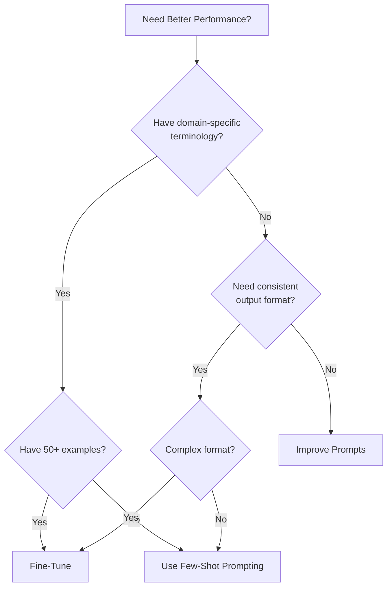

# Fine-Tuning LLMs

Adapt pre-trained models to your specific domain and use cases

## What You'll Learn

- When and why to fine-tune
- Data preparation and formatting
- OpenAI fine-tuning API
- Evaluation and iteration
- Cost-effective fine-tuning strategies

## Tech Stack

| Component | Technology |
|-----------|------------|
| Base Model | GPT-3.5 Turbo / GPT-4 |
| Data Format | JSONL |
| Validation | Pydantic |
| Tracking | Weights & Biases |

## Fine-Tuning Decision Tree



## Project Structure

```
fine-tuning/
├── src/
│   ├── __init__.py
│   ├── data_prep.py       # Data preparation
│   ├── trainer.py         # Fine-tuning logic
│   ├── evaluator.py       # Model evaluation
│   └── api.py             # FastAPI application
├── data/
│   ├── raw/               # Raw training data
│   └── processed/         # JSONL files
├── tests/
└── requirements.txt
```

## Implementation

### Step 1: Setup

```python title="requirements.txt"
openai>=1.0.0
pydantic>=2.0.0
pandas>=2.0.0
tiktoken>=0.5.0
wandb>=0.15.0
fastapi>=0.100.0
uvicorn>=0.23.0
```

### Step 2: Data Preparation

```python title="src/data_prep.py"
"""
Prepare training data for fine-tuning.
"""

from dataclasses import dataclass
from pathlib import Path
import json
import tiktoken


@dataclass
class TrainingExample:
    """Single training example."""
    system: str
    user: str
    assistant: str

    def to_messages(self) -> list[dict]:
        """Convert to OpenAI message format."""
        messages = []

        if self.system:
            messages.append({"role": "system", "content": self.system})

        messages.append({"role": "user", "content": self.user})
        messages.append({"role": "assistant", "content": self.assistant})

        return messages

    def to_jsonl(self) -> str:
        """Convert to JSONL line."""
        return json.dumps({"messages": self.to_messages()})


class DataPreparer:
    """
    Prepare and validate training data for fine-tuning.
    """

    def __init__(self, model: str = "gpt-3.5-turbo"):
        self.model = model
        self.encoding = tiktoken.encoding_for_model(model)
        self.max_tokens = 4096  # Context limit

    def prepare_dataset(
        self,
        examples: list[TrainingExample],
        output_path: str,
        validate: bool = True
    ) -> dict:
        """
        Prepare training dataset.

        Args:
            examples: List of training examples
            output_path: Path to save JSONL file
            validate: Whether to validate examples

        Returns:
            Dataset statistics
        """
        stats = {
            "total": len(examples),
            "valid": 0,
            "invalid": 0,
            "total_tokens": 0,
            "avg_tokens": 0,
            "issues": []
        }

        valid_examples = []

        for i, example in enumerate(examples):
            issues = self._validate_example(example) if validate else []

            if issues:
                stats["invalid"] += 1
                stats["issues"].append({"index": i, "issues": issues})
            else:
                stats["valid"] += 1
                tokens = self._count_tokens(example)
                stats["total_tokens"] += tokens
                valid_examples.append(example)

        if valid_examples:
            stats["avg_tokens"] = stats["total_tokens"] // len(valid_examples)

        # Write to JSONL
        with open(output_path, "w") as f:
            for example in valid_examples:
                f.write(example.to_jsonl() + "\n")

        return stats

    def _validate_example(self, example: TrainingExample) -> list[str]:
        """Validate a single example."""
        issues = []

        # Check for empty fields
        if not example.user.strip():
            issues.append("Empty user message")

        if not example.assistant.strip():
            issues.append("Empty assistant message")

        # Check token count
        tokens = self._count_tokens(example)
        if tokens > self.max_tokens:
            issues.append(f"Exceeds max tokens: {tokens}")

        # Check for assistant ending
        if example.assistant.strip().endswith("..."):
            issues.append("Assistant response appears truncated")

        return issues

    def _count_tokens(self, example: TrainingExample) -> int:
        """Count tokens in example."""
        text = f"{example.system} {example.user} {example.assistant}"
        return len(self.encoding.encode(text))

    def split_dataset(
        self,
        input_path: str,
        train_path: str,
        val_path: str,
        val_ratio: float = 0.1
    ) -> dict:
        """Split dataset into training and validation."""
        import random

        with open(input_path) as f:
            lines = f.readlines()

        random.shuffle(lines)

        val_size = int(len(lines) * val_ratio)
        val_lines = lines[:val_size]
        train_lines = lines[val_size:]

        with open(train_path, "w") as f:
            f.writelines(train_lines)

        with open(val_path, "w") as f:
            f.writelines(val_lines)

        return {
            "total": len(lines),
            "train": len(train_lines),
            "validation": len(val_lines)
        }


class DomainDataGenerator:
    """Generate training data from domain-specific sources."""

    def __init__(self, system_prompt: str):
        self.system_prompt = system_prompt

    def from_qa_pairs(
        self,
        qa_pairs: list[tuple[str, str]]
    ) -> list[TrainingExample]:
        """Create examples from Q&A pairs."""
        return [
            TrainingExample(
                system=self.system_prompt,
                user=question,
                assistant=answer
            )
            for question, answer in qa_pairs
        ]

    def from_conversations(
        self,
        conversations: list[list[dict]]
    ) -> list[TrainingExample]:
        """
        Create examples from multi-turn conversations.

        Each conversation is a list of messages with role and content.
        """
        examples = []

        for conv in conversations:
            context = []

            for i, msg in enumerate(conv):
                if msg["role"] == "assistant" and i > 0:
                    last_user = context[-1]["content"] if context else ""

                    examples.append(TrainingExample(
                        system=self.system_prompt,
                        user=last_user,
                        assistant=msg["content"]
                    ))

                context.append(msg)

        return examples
```

### Step 3: Fine-Tuning Trainer

```python title="src/trainer.py"
"""
Fine-tuning orchestration with OpenAI API.
"""

from dataclasses import dataclass
from typing import Optional
from openai import OpenAI
import time


@dataclass
class FineTuneJob:
    """Fine-tuning job details."""
    id: str
    model: str
    status: str
    trained_tokens: Optional[int] = None
    fine_tuned_model: Optional[str] = None
    error: Optional[str] = None


class FineTuner:
    """
    Manage fine-tuning jobs with OpenAI.
    """

    def __init__(self):
        self.client = OpenAI()

    def upload_file(self, file_path: str, purpose: str = "fine-tune") -> str:
        """
        Upload training file to OpenAI.

        Args:
            file_path: Path to JSONL file
            purpose: File purpose

        Returns:
            File ID
        """
        with open(file_path, "rb") as f:
            response = self.client.files.create(file=f, purpose=purpose)

        return response.id

    def create_job(
        self,
        training_file: str,
        model: str = "gpt-3.5-turbo",
        validation_file: Optional[str] = None,
        suffix: Optional[str] = None,
        n_epochs: Optional[int] = None,
        batch_size: Optional[int] = None,
        learning_rate_multiplier: Optional[float] = None
    ) -> FineTuneJob:
        """
        Create a fine-tuning job.

        Args:
            training_file: Training file ID
            model: Base model to fine-tune
            validation_file: Optional validation file ID
            suffix: Custom suffix for model name
            n_epochs: Number of training epochs
            batch_size: Batch size for training
            learning_rate_multiplier: Learning rate multiplier

        Returns:
            FineTuneJob with job details
        """
        hyperparameters = {}
        if n_epochs:
            hyperparameters["n_epochs"] = n_epochs
        if batch_size:
            hyperparameters["batch_size"] = batch_size
        if learning_rate_multiplier:
            hyperparameters["learning_rate_multiplier"] = learning_rate_multiplier

        response = self.client.fine_tuning.jobs.create(
            training_file=training_file,
            model=model,
            validation_file=validation_file,
            suffix=suffix,
            hyperparameters=hyperparameters if hyperparameters else None
        )

        return FineTuneJob(
            id=response.id,
            model=response.model,
            status=response.status
        )

    def get_job(self, job_id: str) -> FineTuneJob:
        """Get fine-tuning job status."""
        response = self.client.fine_tuning.jobs.retrieve(job_id)

        return FineTuneJob(
            id=response.id,
            model=response.model,
            status=response.status,
            trained_tokens=response.trained_tokens,
            fine_tuned_model=response.fine_tuned_model,
            error=response.error.message if response.error else None
        )

    def wait_for_completion(
        self,
        job_id: str,
        poll_interval: int = 60,
        timeout: int = 7200
    ) -> FineTuneJob:
        """
        Wait for fine-tuning job to complete.

        Args:
            job_id: Job ID to monitor
            poll_interval: Seconds between status checks
            timeout: Maximum wait time in seconds

        Returns:
            Completed FineTuneJob
        """
        start_time = time.time()

        while True:
            job = self.get_job(job_id)

            if job.status in ["succeeded", "failed", "cancelled"]:
                return job

            if time.time() - start_time > timeout:
                raise TimeoutError(f"Job {job_id} timed out")

            time.sleep(poll_interval)

    def list_jobs(self, limit: int = 10) -> list[FineTuneJob]:
        """List recent fine-tuning jobs."""
        response = self.client.fine_tuning.jobs.list(limit=limit)

        return [
            FineTuneJob(
                id=job.id,
                model=job.model,
                status=job.status,
                trained_tokens=job.trained_tokens,
                fine_tuned_model=job.fine_tuned_model
            )
            for job in response.data
        ]

    def cancel_job(self, job_id: str) -> FineTuneJob:
        """Cancel a fine-tuning job."""
        response = self.client.fine_tuning.jobs.cancel(job_id)

        return FineTuneJob(
            id=response.id,
            model=response.model,
            status=response.status
        )

    def get_events(self, job_id: str, limit: int = 20) -> list[dict]:
        """Get fine-tuning job events."""
        response = self.client.fine_tuning.jobs.list_events(
            fine_tuning_job_id=job_id,
            limit=limit
        )

        return [
            {
                "created_at": event.created_at,
                "level": event.level,
                "message": event.message
            }
            for event in response.data
        ]


class FineTunedModel:
    """Use a fine-tuned model."""

    def __init__(self, model_id: str):
        self.client = OpenAI()
        self.model_id = model_id

    def complete(
        self,
        messages: list[dict],
        temperature: float = 0.7,
        max_tokens: int = 1000
    ) -> str:
        """Generate completion with fine-tuned model."""
        response = self.client.chat.completions.create(
            model=self.model_id,
            messages=messages,
            temperature=temperature,
            max_tokens=max_tokens
        )

        return response.choices[0].message.content

    def compare_with_base(
        self,
        prompt: str,
        base_model: str = "gpt-3.5-turbo"
    ) -> dict:
        """Compare fine-tuned model with base model."""
        messages = [{"role": "user", "content": prompt}]

        ft_response = self.complete(messages)

        base_response = self.client.chat.completions.create(
            model=base_model,
            messages=messages
        ).choices[0].message.content

        return {
            "prompt": prompt,
            "fine_tuned": ft_response,
            "base_model": base_response
        }
```

### Step 4: Model Evaluation

```python title="src/evaluator.py"
"""
Evaluate fine-tuned models.
"""

from dataclasses import dataclass
from typing import Callable
from openai import OpenAI
import re


@dataclass
class EvalResult:
    """Evaluation result for a single example."""
    input: str
    expected: str
    actual: str
    correct: bool
    score: float
    metrics: dict


@dataclass
class EvalSummary:
    """Summary of evaluation results."""
    total: int
    correct: int
    accuracy: float
    avg_score: float
    metrics: dict


class ModelEvaluator:
    """
    Evaluate fine-tuned model performance.
    """

    def __init__(self, model_id: str):
        self.client = OpenAI()
        self.model_id = model_id

    def evaluate(
        self,
        test_data: list[dict],
        scorer: Callable[[str, str], float] = None
    ) -> EvalSummary:
        """
        Evaluate model on test dataset.

        Args:
            test_data: List of input/expected pairs
            scorer: Optional custom scoring function

        Returns:
            EvalSummary with results
        """
        results = []

        for item in test_data:
            response = self.client.chat.completions.create(
                model=self.model_id,
                messages=[{"role": "user", "content": item["input"]}],
                temperature=0
            )
            actual = response.choices[0].message.content

            if scorer:
                score = scorer(item["expected"], actual)
            else:
                score = self._default_scorer(item["expected"], actual)

            results.append(EvalResult(
                input=item["input"],
                expected=item["expected"],
                actual=actual,
                correct=score >= 0.8,
                score=score,
                metrics={}
            ))

        correct = sum(1 for r in results if r.correct)
        avg_score = sum(r.score for r in results) / len(results)

        return EvalSummary(
            total=len(results),
            correct=correct,
            accuracy=correct / len(results),
            avg_score=avg_score,
            metrics={}
        )

    def _default_scorer(self, expected: str, actual: str) -> float:
        """Default scoring using exact/partial match."""
        expected_lower = expected.lower().strip()
        actual_lower = actual.lower().strip()

        if expected_lower == actual_lower:
            return 1.0

        if expected_lower in actual_lower or actual_lower in expected_lower:
            return 0.8

        expected_words = set(expected_lower.split())
        actual_words = set(actual_lower.split())

        if not expected_words:
            return 0.0

        overlap = len(expected_words & actual_words)
        return overlap / len(expected_words)

    def llm_judge(
        self,
        test_data: list[dict],
        criteria: str = "accuracy and relevance"
    ) -> EvalSummary:
        """
        Use LLM as judge for evaluation.

        Args:
            test_data: Test examples
            criteria: Evaluation criteria

        Returns:
            EvalSummary with LLM-judged scores
        """
        results = []

        for item in test_data:
            response = self.client.chat.completions.create(
                model=self.model_id,
                messages=[{"role": "user", "content": item["input"]}],
                temperature=0
            )
            actual = response.choices[0].message.content

            judge_prompt = f"""Evaluate the following response.

Input: {item["input"]}
Expected: {item["expected"]}
Actual: {actual}

Criteria: {criteria}

Rate the response from 0.0 to 1.0 and explain briefly.
Format: SCORE: [number]
REASON: [explanation]"""

            judge_response = self.client.chat.completions.create(
                model="gpt-4-turbo-preview",
                messages=[{"role": "user", "content": judge_prompt}],
                temperature=0
            )

            judge_text = judge_response.choices[0].message.content
            score = self._parse_score(judge_text)

            results.append(EvalResult(
                input=item["input"],
                expected=item["expected"],
                actual=actual,
                correct=score >= 0.7,
                score=score,
                metrics={"judge_response": judge_text}
            ))

        correct = sum(1 for r in results if r.correct)
        avg_score = sum(r.score for r in results) / len(results)

        return EvalSummary(
            total=len(results),
            correct=correct,
            accuracy=correct / len(results),
            avg_score=avg_score,
            metrics={}
        )

    def _parse_score(self, text: str) -> float:
        """Parse score from judge response."""
        match = re.search(r"SCORE:\s*([0-9.]+)", text)
        if match:
            return float(match.group(1))
        return 0.5


class ABComparison:
    """Compare two models A/B style."""

    def __init__(self, model_a: str, model_b: str):
        self.client = OpenAI()
        self.model_a = model_a
        self.model_b = model_b

    def compare(self, prompts: list[str]) -> dict:
        """Run A/B comparison on prompts."""
        results = {"a_wins": 0, "b_wins": 0, "ties": 0, "details": []}

        for prompt in prompts:
            resp_a = self._get_response(self.model_a, prompt)
            resp_b = self._get_response(self.model_b, prompt)

            winner = self._judge_comparison(prompt, resp_a, resp_b)

            if winner == "A":
                results["a_wins"] += 1
            elif winner == "B":
                results["b_wins"] += 1
            else:
                results["ties"] += 1

            results["details"].append({
                "prompt": prompt,
                "response_a": resp_a,
                "response_b": resp_b,
                "winner": winner
            })

        return results

    def _get_response(self, model: str, prompt: str) -> str:
        """Get response from model."""
        response = self.client.chat.completions.create(
            model=model,
            messages=[{"role": "user", "content": prompt}],
            temperature=0
        )
        return response.choices[0].message.content

    def _judge_comparison(
        self,
        prompt: str,
        response_a: str,
        response_b: str
    ) -> str:
        """Use LLM to judge which response is better."""
        judge_prompt = f"""Compare these two responses to the same prompt.

Prompt: {prompt}

Response A: {response_a}

Response B: {response_b}

Which response is better? Consider accuracy, helpfulness, and clarity.
Answer with just: A, B, or TIE"""

        response = self.client.chat.completions.create(
            model="gpt-4-turbo-preview",
            messages=[{"role": "user", "content": judge_prompt}],
            temperature=0
        )

        answer = response.choices[0].message.content.strip().upper()

        if "A" in answer and "B" not in answer:
            return "A"
        elif "B" in answer and "A" not in answer:
            return "B"
        return "TIE"
```

### Step 5: FastAPI Application

```python title="src/api.py"
"""FastAPI application for fine-tuning management."""

from fastapi import FastAPI, HTTPException
from pydantic import BaseModel
from typing import Optional

from .data_prep import DataPreparer, TrainingExample
from .trainer import FineTuner, FineTunedModel


app = FastAPI(
    title="Fine-Tuning API",
    description="Manage LLM fine-tuning jobs"
)

preparer = DataPreparer()
tuner = FineTuner()


class PrepareRequest(BaseModel):
    examples: list[dict]
    output_path: str


class FineTuneRequest(BaseModel):
    training_file: str
    model: str = "gpt-3.5-turbo"
    validation_file: Optional[str] = None
    suffix: Optional[str] = None
    n_epochs: Optional[int] = None


class CompletionRequest(BaseModel):
    model_id: str
    prompt: str
    temperature: float = 0.7


@app.post("/prepare")
async def prepare_data(request: PrepareRequest):
    """Prepare and validate training data."""
    examples = [
        TrainingExample(
            system=ex.get("system", ""),
            user=ex["user"],
            assistant=ex["assistant"]
        )
        for ex in request.examples
    ]

    stats = preparer.prepare_dataset(examples, request.output_path)
    return stats


@app.post("/upload")
async def upload_file(file_path: str):
    """Upload training file to OpenAI."""
    try:
        file_id = tuner.upload_file(file_path)
        return {"file_id": file_id}
    except Exception as e:
        raise HTTPException(500, str(e))


@app.post("/fine-tune")
async def create_fine_tune(request: FineTuneRequest):
    """Create a fine-tuning job."""
    try:
        job = tuner.create_job(
            training_file=request.training_file,
            model=request.model,
            validation_file=request.validation_file,
            suffix=request.suffix,
            n_epochs=request.n_epochs
        )
        return {
            "job_id": job.id,
            "status": job.status,
            "model": job.model
        }
    except Exception as e:
        raise HTTPException(500, str(e))


@app.get("/fine-tune/{job_id}")
async def get_job_status(job_id: str):
    """Get fine-tuning job status."""
    job = tuner.get_job(job_id)
    return {
        "job_id": job.id,
        "status": job.status,
        "model": job.model,
        "fine_tuned_model": job.fine_tuned_model,
        "trained_tokens": job.trained_tokens,
        "error": job.error
    }


@app.get("/fine-tune")
async def list_jobs(limit: int = 10):
    """List recent fine-tuning jobs."""
    jobs = tuner.list_jobs(limit)
    return [
        {
            "job_id": job.id,
            "status": job.status,
            "model": job.model,
            "fine_tuned_model": job.fine_tuned_model
        }
        for job in jobs
    ]


@app.post("/complete")
async def complete(request: CompletionRequest):
    """Generate completion with fine-tuned model."""
    model = FineTunedModel(request.model_id)

    response = model.complete(
        messages=[{"role": "user", "content": request.prompt}],
        temperature=request.temperature
    )

    return {"response": response}
```

## Example Usage

```bash
# Prepare training data
curl -X POST http://localhost:8000/prepare \
  -H "Content-Type: application/json" \
  -d '{"examples": [{"system": "You are helpful.", "user": "Hello", "assistant": "Hi!"}], "output_path": "./data/train.jsonl"}'

# Upload file
curl -X POST "http://localhost:8000/upload?file_path=./data/train.jsonl"

# Create fine-tuning job
curl -X POST http://localhost:8000/fine-tune \
  -H "Content-Type: application/json" \
  -d '{"training_file": "file-abc123", "suffix": "my-model"}'

# Check status
curl http://localhost:8000/fine-tune/ftjob-xyz789
```

## Best Practices

| Practice | Description |
|----------|-------------|
| **Data Quality** | Clean, diverse, representative examples |
| **Minimum Examples** | Start with 50-100 high-quality examples |
| **Validation Set** | Hold out 10-20% for validation |
| **Iterative** | Start small, evaluate, add more data |
| **Consistent Format** | Same system prompt across examples |

## Cost Estimation

```python
def estimate_cost(
    num_examples: int,
    avg_tokens: int,
    n_epochs: int = 3,
    model: str = "gpt-3.5-turbo"
) -> float:
    """Estimate fine-tuning cost."""
    rates = {
        "gpt-3.5-turbo": 0.008,
        "gpt-4": 0.03
    }

    total_tokens = num_examples * avg_tokens * n_epochs
    cost = (total_tokens / 1000) * rates.get(model, 0.008)

    return cost
```

## Next Steps

- **[LLM Evaluation](/docs/llm-applications/advanced/llm-evaluation)** - Comprehensive testing
- **[Multi-Modal Application](/docs/llm-applications/advanced/multi-modal-app)** - Vision capabilities
