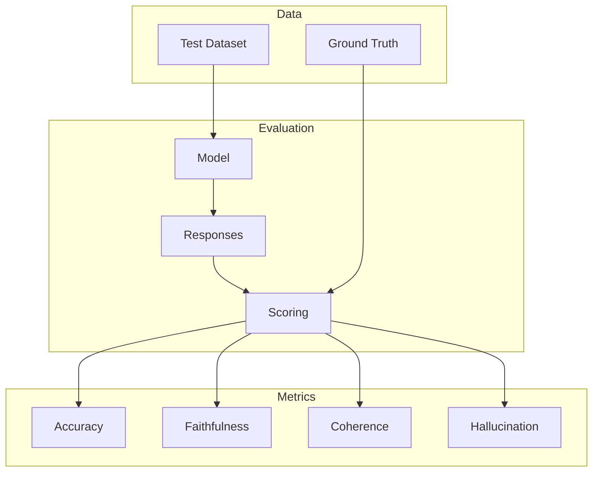

# LLM Evaluation

Build robust evaluation pipelines to measure and improve LLM performance

## What You'll Learn

- Evaluation metrics and benchmarks
- Automated testing frameworks
- Human evaluation protocols
- Regression testing for LLMs
- Monitoring and continuous evaluation

## Tech Stack

| Component | Technology |
|-----------|------------|
| LLM | OpenAI GPT-4 |
| Framework | Custom + pytest |
| Metrics | Custom scorers |
| Tracking | MLflow / W&B |

## Evaluation Pipeline



## Project Structure

```
llm-evaluation/
├── src/
│   ├── __init__.py
│   ├── metrics.py         # Evaluation metrics
│   ├── datasets.py        # Test datasets
│   ├── evaluator.py       # Main evaluator
│   ├── judges.py          # LLM-as-judge
│   └── api.py             # FastAPI application
├── tests/
│   └── test_models.py
├── data/
│   └── benchmarks/
└── requirements.txt
```

## Implementation

### Step 1: Setup

```python title="requirements.txt"
openai>=1.0.0
pydantic>=2.0.0
pandas>=2.0.0
numpy>=1.24.0
scikit-learn>=1.3.0
mlflow>=2.8.0
fastapi>=0.100.0
uvicorn>=0.23.0
pytest>=7.4.0
```

### Step 2: Evaluation Metrics

```python title="src/metrics.py"
"""
Evaluation metrics for LLM outputs.
"""

from dataclasses import dataclass
from typing import Callable
import re
from collections import Counter


@dataclass
class MetricResult:
    """Result of a metric calculation."""
    name: str
    score: float
    details: dict


class TextMetrics:
    """Text-based evaluation metrics."""

    @staticmethod
    def exact_match(expected: str, actual: str) -> float:
        """Exact string match."""
        return 1.0 if expected.strip() == actual.strip() else 0.0

    @staticmethod
    def contains_match(expected: str, actual: str) -> float:
        """Check if expected is contained in actual."""
        return 1.0 if expected.lower() in actual.lower() else 0.0

    @staticmethod
    def word_overlap(expected: str, actual: str) -> float:
        """Calculate word overlap ratio."""
        expected_words = set(expected.lower().split())
        actual_words = set(actual.lower().split())

        if not expected_words:
            return 0.0

        overlap = len(expected_words & actual_words)
        return overlap / len(expected_words)

    @staticmethod
    def bleu_score(reference: str, candidate: str, n: int = 4) -> float:
        """Calculate BLEU-like score."""
        ref_tokens = reference.lower().split()
        cand_tokens = candidate.lower().split()

        if not cand_tokens:
            return 0.0

        scores = []
        for i in range(1, n + 1):
            ref_ngrams = Counter(
                tuple(ref_tokens[j:j+i])
                for j in range(len(ref_tokens) - i + 1)
            )
            cand_ngrams = Counter(
                tuple(cand_tokens[j:j+i])
                for j in range(len(cand_tokens) - i + 1)
            )

            overlap = sum((ref_ngrams & cand_ngrams).values())
            total = sum(cand_ngrams.values())

            if total > 0:
                scores.append(overlap / total)
            else:
                scores.append(0.0)

        if not scores:
            return 0.0

        return sum(scores) / len(scores)

    @staticmethod
    def rouge_l(reference: str, candidate: str) -> float:
        """Calculate ROUGE-L score (longest common subsequence)."""
        ref_tokens = reference.lower().split()
        cand_tokens = candidate.lower().split()

        if not ref_tokens or not cand_tokens:
            return 0.0

        # LCS calculation
        m, n = len(ref_tokens), len(cand_tokens)
        dp = [[0] * (n + 1) for _ in range(m + 1)]

        for i in range(1, m + 1):
            for j in range(1, n + 1):
                if ref_tokens[i-1] == cand_tokens[j-1]:
                    dp[i][j] = dp[i-1][j-1] + 1
                else:
                    dp[i][j] = max(dp[i-1][j], dp[i][j-1])

        lcs_length = dp[m][n]

        precision = lcs_length / n if n > 0 else 0
        recall = lcs_length / m if m > 0 else 0

        if precision + recall == 0:
            return 0.0

        f1 = 2 * precision * recall / (precision + recall)
        return f1


class SemanticMetrics:
    """Semantic evaluation metrics."""

    def __init__(self):
        from openai import OpenAI
        self.client = OpenAI()

    def semantic_similarity(
        self,
        text1: str,
        text2: str,
        model: str = "text-embedding-3-small"
    ) -> float:
        """Calculate semantic similarity using embeddings."""
        response = self.client.embeddings.create(
            model=model,
            input=[text1, text2]
        )

        emb1 = response.data[0].embedding
        emb2 = response.data[1].embedding

        # Cosine similarity
        dot_product = sum(a * b for a, b in zip(emb1, emb2))
        norm1 = sum(a * a for a in emb1) ** 0.5
        norm2 = sum(b * b for b in emb2) ** 0.5

        return dot_product / (norm1 * norm2)

    def factual_consistency(
        self,
        source: str,
        generated: str
    ) -> float:
        """Check if generated text is factually consistent with source."""
        prompt = f"""Evaluate if the generated text is factually consistent with the source.

Source: {source}

Generated: {generated}

Rate from 0.0 (completely inconsistent) to 1.0 (fully consistent).
Only output the number."""

        response = self.client.chat.completions.create(
            model="gpt-4-turbo-preview",
            messages=[{"role": "user", "content": prompt}],
            temperature=0
        )

        try:
            return float(response.choices[0].message.content.strip())
        except ValueError:
            return 0.5


class TaskMetrics:
    """Task-specific evaluation metrics."""

    @staticmethod
    def classification_accuracy(
        predictions: list[str],
        labels: list[str]
    ) -> dict:
        """Calculate classification metrics."""
        correct = sum(p == l for p, l in zip(predictions, labels))
        total = len(predictions)

        # Per-class metrics
        classes = set(labels)
        per_class = {}

        for cls in classes:
            tp = sum(p == l == cls for p, l in zip(predictions, labels))
            fp = sum(p == cls and l != cls for p, l in zip(predictions, labels))
            fn = sum(p != cls and l == cls for p, l in zip(predictions, labels))

            precision = tp / (tp + fp) if (tp + fp) > 0 else 0
            recall = tp / (tp + fn) if (tp + fn) > 0 else 0
            f1 = 2 * precision * recall / (precision + recall) if (precision + recall) > 0 else 0

            per_class[cls] = {
                "precision": precision,
                "recall": recall,
                "f1": f1
            }

        return {
            "accuracy": correct / total if total > 0 else 0,
            "per_class": per_class
        }

    @staticmethod
    def extraction_metrics(
        predicted: dict,
        expected: dict
    ) -> dict:
        """Calculate extraction metrics for structured output."""
        correct_fields = 0
        total_fields = len(expected)

        field_results = {}

        for field, expected_value in expected.items():
            predicted_value = predicted.get(field)

            if predicted_value == expected_value:
                correct_fields += 1
                field_results[field] = {"correct": True}
            else:
                field_results[field] = {
                    "correct": False,
                    "expected": expected_value,
                    "predicted": predicted_value
                }

        return {
            "field_accuracy": correct_fields / total_fields if total_fields > 0 else 0,
            "fields": field_results
        }
```

### Step 3: Test Datasets

```python title="src/datasets.py"
"""
Test dataset management for LLM evaluation.
"""

from dataclasses import dataclass
from typing import Optional
from pathlib import Path
import json


@dataclass
class TestCase:
    """Single test case."""
    id: str
    input: str
    expected: str
    category: str = "general"
    metadata: dict = None


@dataclass
class TestDataset:
    """Collection of test cases."""
    name: str
    cases: list[TestCase]
    description: str = ""

    def __len__(self):
        return len(self.cases)

    def __iter__(self):
        return iter(self.cases)

    def filter_by_category(self, category: str) -> "TestDataset":
        """Filter test cases by category."""
        filtered = [c for c in self.cases if c.category == category]
        return TestDataset(
            name=f"{self.name}_{category}",
            cases=filtered,
            description=f"Filtered by {category}"
        )


class DatasetLoader:
    """Load and manage test datasets."""

    def __init__(self, data_dir: str = "./data/benchmarks"):
        self.data_dir = Path(data_dir)
        self.data_dir.mkdir(parents=True, exist_ok=True)

    def load(self, name: str) -> TestDataset:
        """Load dataset from file."""
        file_path = self.data_dir / f"{name}.json"

        with open(file_path) as f:
            data = json.load(f)

        cases = [
            TestCase(
                id=case.get("id", str(i)),
                input=case["input"],
                expected=case["expected"],
                category=case.get("category", "general"),
                metadata=case.get("metadata")
            )
            for i, case in enumerate(data["cases"])
        ]

        return TestDataset(
            name=data.get("name", name),
            cases=cases,
            description=data.get("description", "")
        )

    def save(self, dataset: TestDataset) -> None:
        """Save dataset to file."""
        file_path = self.data_dir / f"{dataset.name}.json"

        data = {
            "name": dataset.name,
            "description": dataset.description,
            "cases": [
                {
                    "id": case.id,
                    "input": case.input,
                    "expected": case.expected,
                    "category": case.category,
                    "metadata": case.metadata
                }
                for case in dataset.cases
            ]
        }

        with open(file_path, "w") as f:
            json.dump(data, f, indent=2)

    def list_datasets(self) -> list[str]:
        """List available datasets."""
        return [f.stem for f in self.data_dir.glob("*.json")]


class BenchmarkSuite:
    """Pre-defined benchmark suites."""

    @staticmethod
    def qa_benchmark() -> TestDataset:
        """Question-answering benchmark."""
        cases = [
            TestCase(
                id="qa_1",
                input="What is the capital of France?",
                expected="Paris",
                category="factual"
            ),
            TestCase(
                id="qa_2",
                input="What is 2 + 2?",
                expected="4",
                category="math"
            ),
            TestCase(
                id="qa_3",
                input="Who wrote Romeo and Juliet?",
                expected="William Shakespeare",
                category="factual"
            ),
        ]

        return TestDataset(
            name="qa_benchmark",
            cases=cases,
            description="Basic QA benchmark"
        )

    @staticmethod
    def summarization_benchmark() -> TestDataset:
        """Summarization benchmark."""
        cases = [
            TestCase(
                id="sum_1",
                input="The quick brown fox jumps over the lazy dog. This sentence contains every letter of the alphabet.",
                expected="A sentence demonstrating all alphabet letters.",
                category="summarization"
            ),
        ]

        return TestDataset(
            name="summarization_benchmark",
            cases=cases,
            description="Text summarization benchmark"
        )

    @staticmethod
    def instruction_following() -> TestDataset:
        """Instruction following benchmark."""
        cases = [
            TestCase(
                id="inst_1",
                input="List three colors. Format: bullet points.",
                expected="- Red\n- Blue\n- Green",
                category="format"
            ),
            TestCase(
                id="inst_2",
                input="Write exactly 5 words about weather.",
                expected="The weather is very nice.",
                category="length"
            ),
        ]

        return TestDataset(
            name="instruction_following",
            cases=cases,
            description="Instruction following benchmark"
        )
```

### Step 4: LLM-as-Judge

```python title="src/judges.py"
"""
LLM-as-Judge evaluation framework.
"""

from dataclasses import dataclass
from typing import Optional
from openai import OpenAI
import re


@dataclass
class JudgeResult:
    """Result from LLM judge."""
    score: float
    reasoning: str
    criteria_scores: dict


class LLMJudge:
    """
    Use LLMs to evaluate other LLM outputs.
    """

    def __init__(self, model: str = "gpt-4-turbo-preview"):
        self.client = OpenAI()
        self.model = model

    def evaluate(
        self,
        question: str,
        response: str,
        reference: Optional[str] = None,
        criteria: list[str] = None
    ) -> JudgeResult:
        """
        Evaluate a response using LLM judge.

        Args:
            question: Original question/prompt
            response: Model response to evaluate
            reference: Optional reference answer
            criteria: Evaluation criteria

        Returns:
            JudgeResult with scores and reasoning
        """
        if criteria is None:
            criteria = ["accuracy", "helpfulness", "clarity"]

        criteria_text = "\n".join(f"- {c}" for c in criteria)

        prompt = f"""Evaluate the following response.

Question: {question}

Response: {response}

{f"Reference Answer: {reference}" if reference else ""}

Evaluate on these criteria:
{criteria_text}

For each criterion, provide a score from 1-5 and brief reasoning.
Then provide an overall score from 0.0 to 1.0.

Format:
CRITERION: [name]
SCORE: [1-5]
REASON: [explanation]

...

OVERALL: [0.0-1.0]
SUMMARY: [overall assessment]"""

        judge_response = self.client.chat.completions.create(
            model=self.model,
            messages=[{"role": "user", "content": prompt}],
            temperature=0
        )

        return self._parse_judgment(
            judge_response.choices[0].message.content,
            criteria
        )

    def _parse_judgment(
        self,
        text: str,
        criteria: list[str]
    ) -> JudgeResult:
        """Parse judge response into structured result."""
        criteria_scores = {}

        for criterion in criteria:
            pattern = rf"{criterion}.*?SCORE:\s*(\d)"
            match = re.search(pattern, text, re.IGNORECASE | re.DOTALL)
            if match:
                criteria_scores[criterion] = int(match.group(1)) / 5.0

        overall_match = re.search(r"OVERALL:\s*([0-9.]+)", text)
        overall = float(overall_match.group(1)) if overall_match else 0.5

        summary_match = re.search(r"SUMMARY:\s*(.+?)(?:\n|$)", text)
        reasoning = summary_match.group(1) if summary_match else ""

        return JudgeResult(
            score=overall,
            reasoning=reasoning,
            criteria_scores=criteria_scores
        )

    def pairwise_compare(
        self,
        question: str,
        response_a: str,
        response_b: str
    ) -> dict:
        """Compare two responses and determine which is better."""
        prompt = f"""Compare these two responses to the same question.

Question: {question}

Response A: {response_a}

Response B: {response_b}

Which response is better? Consider:
- Accuracy and correctness
- Helpfulness and completeness
- Clarity and presentation

Provide your judgment:
WINNER: [A/B/TIE]
CONFIDENCE: [high/medium/low]
REASON: [explanation]"""

        response = self.client.chat.completions.create(
            model=self.model,
            messages=[{"role": "user", "content": prompt}],
            temperature=0
        )

        text = response.choices[0].message.content

        winner_match = re.search(r"WINNER:\s*(\w+)", text)
        confidence_match = re.search(r"CONFIDENCE:\s*(\w+)", text)
        reason_match = re.search(r"REASON:\s*(.+?)(?:\n|$)", text, re.DOTALL)

        return {
            "winner": winner_match.group(1) if winner_match else "TIE",
            "confidence": confidence_match.group(1) if confidence_match else "medium",
            "reason": reason_match.group(1).strip() if reason_match else ""
        }


class MultiJudge:
    """Use multiple judges and aggregate results."""

    def __init__(self, judges: list[LLMJudge] = None):
        if judges is None:
            judges = [
                LLMJudge("gpt-4-turbo-preview"),
            ]
        self.judges = judges

    def evaluate(
        self,
        question: str,
        response: str,
        reference: Optional[str] = None
    ) -> dict:
        """Get consensus evaluation from multiple judges."""
        results = []

        for judge in self.judges:
            result = judge.evaluate(question, response, reference)
            results.append(result)

        # Aggregate scores
        avg_score = sum(r.score for r in results) / len(results)
        score_variance = sum((r.score - avg_score) ** 2 for r in results) / len(results)

        return {
            "consensus_score": avg_score,
            "variance": score_variance,
            "individual_results": results
        }
```

### Step 5: Main Evaluator

```python title="src/evaluator.py"
"""
Main evaluation orchestrator.
"""

from dataclasses import dataclass
from typing import Optional, Callable
from openai import OpenAI

from .metrics import TextMetrics, SemanticMetrics, MetricResult
from .datasets import TestDataset, TestCase
from .judges import LLMJudge, JudgeResult


@dataclass
class EvaluationResult:
    """Result for a single test case."""
    test_case: TestCase
    response: str
    metrics: dict
    judge_result: Optional[JudgeResult] = None
    passed: bool = False


@dataclass
class EvaluationReport:
    """Complete evaluation report."""
    dataset_name: str
    model: str
    total_cases: int
    passed_cases: int
    pass_rate: float
    avg_score: float
    results: list[EvaluationResult]
    metrics_summary: dict


class ModelEvaluator:
    """
    Comprehensive model evaluation framework.
    """

    def __init__(
        self,
        model: str = "gpt-4-turbo-preview",
        use_judge: bool = True
    ):
        self.client = OpenAI()
        self.model = model
        self.text_metrics = TextMetrics()
        self.semantic_metrics = SemanticMetrics()
        self.judge = LLMJudge() if use_judge else None

    def evaluate(
        self,
        dataset: TestDataset,
        pass_threshold: float = 0.7,
        metrics: list[str] = None
    ) -> EvaluationReport:
        """
        Evaluate model on a test dataset.

        Args:
            dataset: Test dataset
            pass_threshold: Score threshold to pass
            metrics: Metrics to calculate

        Returns:
            EvaluationReport with results
        """
        if metrics is None:
            metrics = ["exact_match", "word_overlap", "bleu"]

        results = []
        total_score = 0

        for case in dataset:
            # Get model response
            response = self._get_response(case.input)

            # Calculate metrics
            case_metrics = self._calculate_metrics(
                case.expected, response, metrics
            )

            # Use LLM judge if available
            judge_result = None
            if self.judge:
                judge_result = self.judge.evaluate(
                    case.input, response, case.expected
                )

            # Determine if passed
            score = judge_result.score if judge_result else case_metrics.get("word_overlap", 0)
            passed = score >= pass_threshold

            total_score += score

            results.append(EvaluationResult(
                test_case=case,
                response=response,
                metrics=case_metrics,
                judge_result=judge_result,
                passed=passed
            ))

        # Calculate summary
        passed_cases = sum(1 for r in results if r.passed)
        avg_score = total_score / len(results) if results else 0

        return EvaluationReport(
            dataset_name=dataset.name,
            model=self.model,
            total_cases=len(results),
            passed_cases=passed_cases,
            pass_rate=passed_cases / len(results) if results else 0,
            avg_score=avg_score,
            results=results,
            metrics_summary=self._summarize_metrics(results)
        )

    def _get_response(self, prompt: str) -> str:
        """Get model response for prompt."""
        response = self.client.chat.completions.create(
            model=self.model,
            messages=[{"role": "user", "content": prompt}],
            temperature=0
        )
        return response.choices[0].message.content

    def _calculate_metrics(
        self,
        expected: str,
        actual: str,
        metrics: list[str]
    ) -> dict:
        """Calculate requested metrics."""
        results = {}

        metric_funcs = {
            "exact_match": self.text_metrics.exact_match,
            "contains": self.text_metrics.contains_match,
            "word_overlap": self.text_metrics.word_overlap,
            "bleu": self.text_metrics.bleu_score,
            "rouge_l": self.text_metrics.rouge_l
        }

        for metric in metrics:
            if metric in metric_funcs:
                results[metric] = metric_funcs[metric](expected, actual)

        return results

    def _summarize_metrics(
        self,
        results: list[EvaluationResult]
    ) -> dict:
        """Summarize metrics across all results."""
        if not results:
            return {}

        summary = {}
        all_metrics = set()

        for r in results:
            all_metrics.update(r.metrics.keys())

        for metric in all_metrics:
            values = [r.metrics.get(metric, 0) for r in results]
            summary[metric] = {
                "mean": sum(values) / len(values),
                "min": min(values),
                "max": max(values)
            }

        return summary


class RegressionTester:
    """Test for regressions in model performance."""

    def __init__(self, baseline_report: EvaluationReport):
        self.baseline = baseline_report

    def test_regression(
        self,
        new_report: EvaluationReport,
        tolerance: float = 0.05
    ) -> dict:
        """
        Test if new results show regression from baseline.

        Args:
            new_report: New evaluation report
            tolerance: Acceptable performance drop

        Returns:
            Regression test results
        """
        regressions = []

        # Check overall pass rate
        pass_rate_drop = self.baseline.pass_rate - new_report.pass_rate
        if pass_rate_drop > tolerance:
            regressions.append({
                "type": "pass_rate",
                "baseline": self.baseline.pass_rate,
                "current": new_report.pass_rate,
                "drop": pass_rate_drop
            })

        # Check individual metrics
        for metric, baseline_stats in self.baseline.metrics_summary.items():
            if metric in new_report.metrics_summary:
                current_stats = new_report.metrics_summary[metric]
                drop = baseline_stats["mean"] - current_stats["mean"]

                if drop > tolerance:
                    regressions.append({
                        "type": f"metric_{metric}",
                        "baseline": baseline_stats["mean"],
                        "current": current_stats["mean"],
                        "drop": drop
                    })

        return {
            "passed": len(regressions) == 0,
            "regressions": regressions,
            "baseline_model": self.baseline.model,
            "current_model": new_report.model
        }
```

### Step 6: FastAPI Application

```python title="src/api.py"
"""FastAPI application for LLM evaluation."""

from fastapi import FastAPI, HTTPException
from pydantic import BaseModel
from typing import Optional

from .evaluator import ModelEvaluator
from .datasets import DatasetLoader, BenchmarkSuite
from .judges import LLMJudge


app = FastAPI(
    title="LLM Evaluation API",
    description="Evaluate and benchmark LLM performance"
)

evaluator = ModelEvaluator()
loader = DatasetLoader()
judge = LLMJudge()


class EvaluateRequest(BaseModel):
    dataset_name: str
    model: str = "gpt-4-turbo-preview"
    pass_threshold: float = 0.7
    metrics: list[str] = ["word_overlap", "bleu"]


class JudgeRequest(BaseModel):
    question: str
    response: str
    reference: Optional[str] = None
    criteria: list[str] = ["accuracy", "helpfulness", "clarity"]


class CompareRequest(BaseModel):
    question: str
    response_a: str
    response_b: str


@app.post("/evaluate")
async def evaluate_model(request: EvaluateRequest):
    """Evaluate model on a dataset."""
    try:
        dataset = loader.load(request.dataset_name)
        eval_instance = ModelEvaluator(model=request.model)

        report = eval_instance.evaluate(
            dataset,
            pass_threshold=request.pass_threshold,
            metrics=request.metrics
        )

        return {
            "dataset": report.dataset_name,
            "model": report.model,
            "total_cases": report.total_cases,
            "passed_cases": report.passed_cases,
            "pass_rate": report.pass_rate,
            "avg_score": report.avg_score,
            "metrics_summary": report.metrics_summary
        }
    except Exception as e:
        raise HTTPException(500, str(e))


@app.post("/judge")
async def judge_response(request: JudgeRequest):
    """Get LLM judge evaluation."""
    result = judge.evaluate(
        question=request.question,
        response=request.response,
        reference=request.reference,
        criteria=request.criteria
    )

    return {
        "score": result.score,
        "reasoning": result.reasoning,
        "criteria_scores": result.criteria_scores
    }


@app.post("/compare")
async def compare_responses(request: CompareRequest):
    """Compare two responses."""
    result = judge.pairwise_compare(
        question=request.question,
        response_a=request.response_a,
        response_b=request.response_b
    )

    return result


@app.get("/datasets")
async def list_datasets():
    """List available benchmark datasets."""
    return {"datasets": loader.list_datasets()}


@app.post("/datasets/create-benchmark")
async def create_benchmark(name: str):
    """Create a standard benchmark dataset."""
    benchmarks = {
        "qa": BenchmarkSuite.qa_benchmark,
        "summarization": BenchmarkSuite.summarization_benchmark,
        "instruction": BenchmarkSuite.instruction_following
    }

    if name not in benchmarks:
        raise HTTPException(400, f"Unknown benchmark: {name}")

    dataset = benchmarks[name]()
    loader.save(dataset)

    return {"created": dataset.name, "cases": len(dataset)}
```

## Example Usage

```bash
# Create benchmark dataset
curl -X POST "http://localhost:8000/datasets/create-benchmark?name=qa"

# Evaluate model
curl -X POST http://localhost:8000/evaluate \
  -H "Content-Type: application/json" \
  -d '{"dataset_name": "qa_benchmark", "model": "gpt-4-turbo-preview"}'

# Judge a single response
curl -X POST http://localhost:8000/judge \
  -H "Content-Type: application/json" \
  -d '{"question": "What is AI?", "response": "AI stands for Artificial Intelligence.", "criteria": ["accuracy", "completeness"]}'

# Compare two responses
curl -X POST http://localhost:8000/compare \
  -H "Content-Type: application/json" \
  -d '{"question": "Explain ML", "response_a": "ML is machine learning.", "response_b": "Machine learning is a subset of AI that enables systems to learn from data."}'
```

## Evaluation Metrics Summary

| Metric | Type | Description |
|--------|------|-------------|
| **Exact Match** | Text | Strict string equality |
| **Word Overlap** | Text | Jaccard similarity of words |
| **BLEU** | Text | N-gram precision |
| **ROUGE-L** | Text | Longest common subsequence |
| **Semantic Similarity** | Semantic | Embedding cosine similarity |
| **LLM Judge** | Holistic | GPT-4 evaluation |

## Next Steps

- **[Fine-Tuning LLMs](/docs/llm-applications/advanced/fine-tuning)** - Customize models
- **[Multi-Modal Application](/docs/llm-applications/advanced/multi-modal-app)** - Vision capabilities
