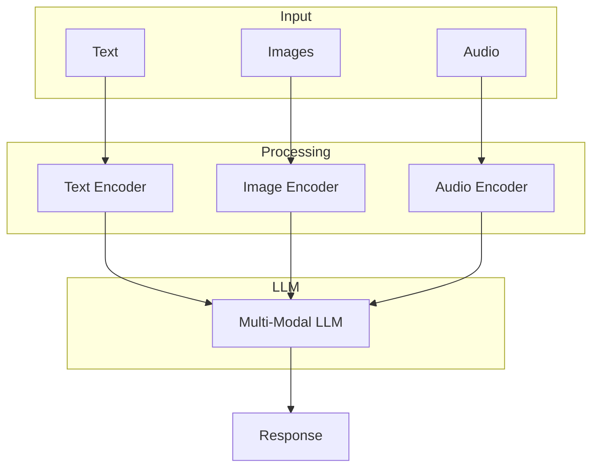

# Multi-Modal Application

Create AI applications that work with multiple modalities

## What You'll Learn

- Using vision-capable LLMs
- Image understanding and description
- Multi-modal RAG systems
- Building visual Q&A applications

## Tech Stack

| Component | Technology |
|-----------|------------|
| LLM | GPT-4 Vision / Claude 3 |
| Image Processing | Pillow |
| Vector Store | ChromaDB |
| API | FastAPI |

## Multi-Modal Architecture



## Project Structure

```
multi-modal-app/
├── src/
│   ├── __init__.py
│   ├── vision.py          # Image understanding
│   ├── embeddings.py      # Multi-modal embeddings
│   ├── rag.py             # Multi-modal RAG
│   └── api.py             # FastAPI application
├── tests/
└── requirements.txt
```

## Implementation

### Step 1: Setup

```python title="requirements.txt"
openai>=1.0.0
anthropic>=0.18.0
pillow>=10.0.0
chromadb>=0.4.0
open-clip-torch>=2.20.0
fastapi>=0.100.0
uvicorn>=0.23.0
python-multipart>=0.0.6
```

### Step 2: Vision Module

```python title="src/vision.py"
"""
Image understanding using vision-capable LLMs.
"""

from dataclasses import dataclass
from typing import Optional, Union
from pathlib import Path
import base64
from openai import OpenAI


@dataclass
class ImageAnalysis:
    """Result of image analysis."""
    description: str
    objects: list[str]
    text_found: list[str]
    colors: list[str]
    mood: str


class VisionAnalyzer:
    """
    Analyze images using GPT-4 Vision.
    """
    
    def __init__(self, model: str = "gpt-4-vision-preview"):
        self.client = OpenAI()
        self.model = model
    
    def analyze(
        self,
        image: Union[str, Path, bytes],
        question: str = "Describe this image in detail"
    ) -> str:
        """
        Analyze an image and answer questions about it.
        
        Args:
            image: Image path, URL, or bytes
            question: Question about the image
            
        Returns:
            Analysis or answer
        """
        image_content = self._prepare_image(image)
        
        response = self.client.chat.completions.create(
            model=self.model,
            messages=[
                {
                    "role": "user",
                    "content": [
                        {"type": "text", "text": question},
                        image_content
                    ]
                }
            ],
            max_tokens=1000
        )
        
        return response.choices[0].message.content
    
    def extract_info(self, image: Union[str, Path, bytes]) -> ImageAnalysis:
        """Extract structured information from an image."""
        prompt = """Analyze this image and extract:
1. A detailed description
2. List of main objects/elements
3. Any text visible in the image
4. Dominant colors
5. Overall mood/atmosphere

Format as:
DESCRIPTION: [description]
OBJECTS: [comma-separated list]
TEXT: [comma-separated list or "none"]
COLORS: [comma-separated list]
MOOD: [single word or short phrase]"""
        
        response = self.analyze(image, prompt)
        return self._parse_analysis(response)
    
    def compare_images(
        self,
        image1: Union[str, Path, bytes],
        image2: Union[str, Path, bytes]
    ) -> str:
        """Compare two images."""
        img1_content = self._prepare_image(image1)
        img2_content = self._prepare_image(image2)
        
        response = self.client.chat.completions.create(
            model=self.model,
            messages=[
                {
                    "role": "user",
                    "content": [
                        {"type": "text", "text": "Compare these two images. What are the similarities and differences?"},
                        img1_content,
                        img2_content
                    ]
                }
            ],
            max_tokens=1000
        )
        
        return response.choices[0].message.content
    
    def _prepare_image(self, image: Union[str, Path, bytes]) -> dict:
        """Prepare image for API."""
        if isinstance(image, bytes):
            b64 = base64.standard_b64encode(image).decode()
            return {
                "type": "image_url",
                "image_url": {"url": f"data:image/jpeg;base64,{b64}"}
            }
        
        image_str = str(image)
        
        if image_str.startswith(("http://", "https://")):
            return {
                "type": "image_url",
                "image_url": {"url": image_str}
            }
        
        # Local file
        path = Path(image_str)
        with open(path, "rb") as f:
            b64 = base64.standard_b64encode(f.read()).decode()
        
        ext = path.suffix.lower()
        mime = {"jpg": "jpeg", "jpeg": "jpeg", "png": "png", "gif": "gif", "webp": "webp"}
        mime_type = mime.get(ext.lstrip("."), "jpeg")
        
        return {
            "type": "image_url",
            "image_url": {"url": f"data:image/{mime_type};base64,{b64}"}
        }
    
    def _parse_analysis(self, response: str) -> ImageAnalysis:
        """Parse structured analysis response."""
        lines = response.strip().split("\n")
        result = {}
        
        for line in lines:
            if ":" in line:
                key, value = line.split(":", 1)
                result[key.strip().upper()] = value.strip()
        
        return ImageAnalysis(
            description=result.get("DESCRIPTION", ""),
            objects=[o.strip() for o in result.get("OBJECTS", "").split(",") if o.strip()],
            text_found=[t.strip() for t in result.get("TEXT", "").split(",") if t.strip() and t.lower() != "none"],
            colors=[c.strip() for c in result.get("COLORS", "").split(",") if c.strip()],
            mood=result.get("MOOD", "")
        )
```

### Step 3: Multi-Modal RAG

```python title="src/rag.py"
"""
Multi-modal RAG with image and text.
"""

from dataclasses import dataclass
from typing import Union, Optional
from pathlib import Path
import chromadb
from chromadb.utils import embedding_functions
import hashlib
import base64

from .vision import VisionAnalyzer


@dataclass
class MultiModalDocument:
    """Document with text and optional image."""
    id: str
    text: str
    image_path: Optional[str] = None
    image_description: Optional[str] = None
    metadata: dict = None


class MultiModalRAG:
    """
    RAG system that handles both text and images.
    """
    
    def __init__(self, persist_dir: str = "./multimodal_index"):
        self.client = chromadb.PersistentClient(path=persist_dir)
        self.embedding_fn = embedding_functions.OpenAIEmbeddingFunction(
            model_name="text-embedding-3-small"
        )
        
        # Separate collections for text and images
        self.text_collection = self.client.get_or_create_collection(
            name="text_docs",
            embedding_function=self.embedding_fn
        )
        self.image_collection = self.client.get_or_create_collection(
            name="image_docs",
            embedding_function=self.embedding_fn
        )
        
        self.vision = VisionAnalyzer()
    
    def add_document(self, doc: MultiModalDocument) -> None:
        """Add a document to the index."""
        # Add text to text collection
        self.text_collection.upsert(
            ids=[doc.id],
            documents=[doc.text],
            metadatas=[doc.metadata or {}]
        )
        
        # If image, analyze and add to image collection
        if doc.image_path:
            description = doc.image_description
            if not description:
                description = self.vision.analyze(doc.image_path)
            
            self.image_collection.upsert(
                ids=[doc.id],
                documents=[description],
                metadatas={
                    "image_path": doc.image_path,
                    "type": "image",
                    **(doc.metadata or {})
                }
            )
    
    def query(
        self,
        question: str,
        n_results: int = 5,
        include_images: bool = True
    ) -> dict:
        """
        Query the multi-modal knowledge base.
        
        Args:
            question: User question
            n_results: Number of results per modality
            include_images: Whether to search images
            
        Returns:
            Combined results from text and images
        """
        results = {"text": [], "images": []}
        
        # Search text
        text_results = self.text_collection.query(
            query_texts=[question],
            n_results=n_results,
            include=["documents", "metadatas", "distances"]
        )
        
        for i, doc in enumerate(text_results["documents"][0]):
            results["text"].append({
                "content": doc,
                "metadata": text_results["metadatas"][0][i],
                "relevance": 1 - text_results["distances"][0][i]
            })
        
        # Search images
        if include_images:
            image_results = self.image_collection.query(
                query_texts=[question],
                n_results=n_results,
                include=["documents", "metadatas", "distances"]
            )
            
            for i, doc in enumerate(image_results["documents"][0]):
                results["images"].append({
                    "description": doc,
                    "image_path": image_results["metadatas"][0][i].get("image_path"),
                    "relevance": 1 - image_results["distances"][0][i]
                })
        
        return results
    
    def answer(
        self,
        question: str,
        include_images: bool = True
    ) -> str:
        """
        Answer a question using multi-modal context.
        """
        from openai import OpenAI
        client = OpenAI()
        
        # Get relevant context
        context = self.query(question, include_images=include_images)
        
        # Build prompt with context
        prompt = f"Question: {question}\n\nRelevant information:\n"
        
        for text in context["text"][:3]:
            prompt += f"\nText: {text['content']}\n"
        
        for img in context["images"][:2]:
            prompt += f"\nImage description: {img['description']}\n"
        
        prompt += "\nAnswer the question based on the above information."
        
        response = client.chat.completions.create(
            model="gpt-4-turbo-preview",
            messages=[{"role": "user", "content": prompt}]
        )
        
        return response.choices[0].message.content
```

### Step 4: FastAPI Application

```python title="src/api.py"
"""FastAPI application for multi-modal AI."""

from fastapi import FastAPI, UploadFile, File, Form
from pydantic import BaseModel
from typing import Optional
import tempfile
import shutil

from .vision import VisionAnalyzer, ImageAnalysis
from .rag import MultiModalRAG


app = FastAPI(
    title="Multi-Modal AI API",
    description="AI that understands text and images"
)

vision = VisionAnalyzer()
rag = MultiModalRAG()


class AnalyzeResponse(BaseModel):
    description: str
    objects: list[str]
    text_found: list[str]
    colors: list[str]
    mood: str


@app.post("/analyze", response_model=AnalyzeResponse)
async def analyze_image(
    file: UploadFile = File(...),
    question: str = Form(default="Describe this image in detail")
):
    """Analyze an uploaded image."""
    # Save to temp file
    with tempfile.NamedTemporaryFile(delete=False, suffix=file.filename) as tmp:
        shutil.copyfileobj(file.file, tmp)
        tmp_path = tmp.name
    
    try:
        if question == "Describe this image in detail":
            result = vision.extract_info(tmp_path)
            return AnalyzeResponse(
                description=result.description,
                objects=result.objects,
                text_found=result.text_found,
                colors=result.colors,
                mood=result.mood
            )
        else:
            response = vision.analyze(tmp_path, question)
            return AnalyzeResponse(
                description=response,
                objects=[],
                text_found=[],
                colors=[],
                mood=""
            )
    finally:
        import os
        os.unlink(tmp_path)


class QuestionRequest(BaseModel):
    question: str
    include_images: bool = True


@app.post("/ask")
async def ask_question(request: QuestionRequest):
    """Ask a question using multi-modal RAG."""
    answer = rag.answer(
        request.question,
        include_images=request.include_images
    )
    return {"answer": answer}
```

## Example Usage

```bash
# Analyze an image
curl -X POST http://localhost:8000/analyze \
  -F "file=@photo.jpg" \
  -F "question=What objects are in this image?"

# Ask multi-modal question
curl -X POST http://localhost:8000/ask \
  -H "Content-Type: application/json" \
  -d '{"question": "What does the product look like?"}'
```

## Next Steps

- **[Fine-Tuning LLMs](/docs/llm-applications/advanced/fine-tuning)** - Customize models
- **[LLM Evaluation](/docs/llm-applications/advanced/llm-evaluation)** - Test and evaluate
