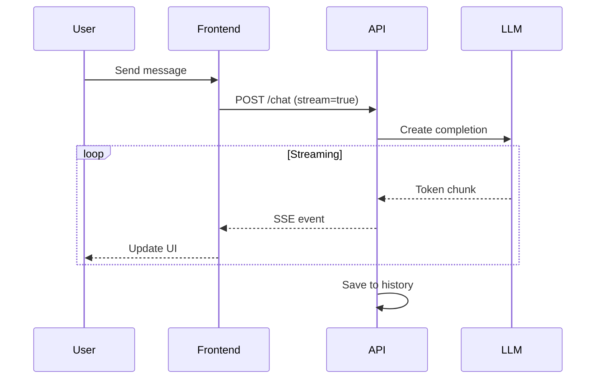

# Chatbot

Build a production-ready conversational AI with streaming and memory

## What You'll Learn

- Setting up OpenAI/Anthropic API clients
- Implementing streaming responses
- Managing conversation history
- Building a chat UI with real-time updates

## Tech Stack

| Component | Technology |
|-----------|------------|
| LLM | OpenAI GPT-4 / Anthropic Claude |
| Backend | FastAPI |
| Frontend | React / Streamlit |
| Streaming | Server-Sent Events |

## Architecture



## Project Structure

```
chatbot/
├── src/
│   ├── __init__.py
│   ├── chat.py            # Chat logic
│   ├── memory.py          # Conversation memory
│   ├── api.py             # FastAPI application
│   └── prompts.py         # System prompts
├── frontend/
│   └── app.py             # Streamlit UI
├── tests/
│   └── test_chat.py
├── requirements.txt
└── README.md
```

## Implementation

### Step 1: Project Setup

```bash
mkdir chatbot && cd chatbot
python -m venv venv
source venv/bin/activate
```

```python title="requirements.txt"
openai>=1.0.0
anthropic>=0.18.0
fastapi>=0.100.0
uvicorn>=0.23.0
sse-starlette>=1.6.0
streamlit>=1.28.0
pydantic>=2.0.0
python-dotenv>=1.0.0
```

```bash
pip install -r requirements.txt
```

### Step 2: Chat Engine

```python title="src/chat.py"
"""
Core chat functionality with streaming support.
"""

from typing import AsyncIterator, Optional
from dataclasses import dataclass, field
from openai import OpenAI, AsyncOpenAI
import anthropic


@dataclass
class Message:
    """A chat message."""
    role: str  # "user", "assistant", "system"
    content: str


@dataclass
class ChatConfig:
    """Chat configuration."""
    model: str = "gpt-4-turbo-preview"
    temperature: float = 0.7
    max_tokens: int = 2000
    system_prompt: str = "You are a helpful AI assistant."


class ChatEngine:
    """
    Chat engine with streaming support.
    
    Supports both OpenAI and Anthropic models.
    """
    
    def __init__(self, config: ChatConfig = None, provider: str = "openai"):
        self.config = config or ChatConfig()
        self.provider = provider
        
        if provider == "openai":
            self.client = OpenAI()
            self.async_client = AsyncOpenAI()
        else:
            self.client = anthropic.Anthropic()
            self.async_client = anthropic.AsyncAnthropic()
    
    def chat(self, messages: list[Message]) -> str:
        """
        Send a chat message and get a complete response.
        
        Args:
            messages: Conversation history
            
        Returns:
            Assistant's response
        """
        if self.provider == "openai":
            return self._chat_openai(messages)
        return self._chat_anthropic(messages)
    
    async def chat_stream(
        self, 
        messages: list[Message]
    ) -> AsyncIterator[str]:
        """
        Stream a chat response token by token.
        
        Args:
            messages: Conversation history
            
        Yields:
            Response tokens as they arrive
        """
        if self.provider == "openai":
            async for token in self._stream_openai(messages):
                yield token
        else:
            async for token in self._stream_anthropic(messages):
                yield token
    
    def _chat_openai(self, messages: list[Message]) -> str:
        """OpenAI chat completion."""
        formatted = self._format_messages_openai(messages)
        
        response = self.client.chat.completions.create(
            model=self.config.model,
            messages=formatted,
            temperature=self.config.temperature,
            max_tokens=self.config.max_tokens
        )
        
        return response.choices[0].message.content
    
    async def _stream_openai(
        self, 
        messages: list[Message]
    ) -> AsyncIterator[str]:
        """Stream OpenAI response."""
        formatted = self._format_messages_openai(messages)
        
        stream = await self.async_client.chat.completions.create(
            model=self.config.model,
            messages=formatted,
            temperature=self.config.temperature,
            max_tokens=self.config.max_tokens,
            stream=True
        )
        
        async for chunk in stream:
            if chunk.choices[0].delta.content:
                yield chunk.choices[0].delta.content
    
    def _chat_anthropic(self, messages: list[Message]) -> str:
        """Anthropic chat completion."""
        formatted = self._format_messages_anthropic(messages)
        
        response = self.client.messages.create(
            model=self.config.model,
            system=self.config.system_prompt,
            messages=formatted,
            max_tokens=self.config.max_tokens
        )
        
        return response.content[0].text
    
    async def _stream_anthropic(
        self, 
        messages: list[Message]
    ) -> AsyncIterator[str]:
        """Stream Anthropic response."""
        formatted = self._format_messages_anthropic(messages)
        
        async with self.async_client.messages.stream(
            model=self.config.model,
            system=self.config.system_prompt,
            messages=formatted,
            max_tokens=self.config.max_tokens
        ) as stream:
            async for text in stream.text_stream:
                yield text
    
    def _format_messages_openai(self, messages: list[Message]) -> list[dict]:
        """Format messages for OpenAI API."""
        formatted = [{"role": "system", "content": self.config.system_prompt}]
        for msg in messages:
            formatted.append({"role": msg.role, "content": msg.content})
        return formatted
    
    def _format_messages_anthropic(self, messages: list[Message]) -> list[dict]:
        """Format messages for Anthropic API."""
        return [{"role": msg.role, "content": msg.content} for msg in messages]
```

### Step 3: Conversation Memory

```python title="src/memory.py"
"""
Conversation memory management.
"""

from dataclasses import dataclass, field
from typing import Optional
import json
from pathlib import Path

from .chat import Message


@dataclass
class Conversation:
    """A conversation with history."""
    id: str
    messages: list[Message] = field(default_factory=list)
    metadata: dict = field(default_factory=dict)


class ConversationMemory:
    """
    Manages conversation history with persistence.
    """
    
    def __init__(self, storage_path: Optional[str] = None):
        self.conversations: dict[str, Conversation] = {}
        self.storage_path = Path(storage_path) if storage_path else None
        
        if self.storage_path:
            self._load_conversations()
    
    def create_conversation(self, conversation_id: str = None) -> str:
        """Create a new conversation."""
        import uuid
        conv_id = conversation_id or str(uuid.uuid4())
        self.conversations[conv_id] = Conversation(id=conv_id)
        return conv_id
    
    def add_message(
        self, 
        conversation_id: str, 
        role: str, 
        content: str
    ) -> None:
        """Add a message to a conversation."""
        if conversation_id not in self.conversations:
            self.create_conversation(conversation_id)
        
        self.conversations[conversation_id].messages.append(
            Message(role=role, content=content)
        )
        
        if self.storage_path:
            self._save_conversations()
    
    def get_messages(
        self, 
        conversation_id: str,
        limit: Optional[int] = None
    ) -> list[Message]:
        """Get messages from a conversation."""
        if conversation_id not in self.conversations:
            return []
        
        messages = self.conversations[conversation_id].messages
        if limit:
            return messages[-limit:]
        return messages
    
    def clear_conversation(self, conversation_id: str) -> None:
        """Clear a conversation's history."""
        if conversation_id in self.conversations:
            self.conversations[conversation_id].messages = []
    
    def delete_conversation(self, conversation_id: str) -> None:
        """Delete a conversation."""
        if conversation_id in self.conversations:
            del self.conversations[conversation_id]
    
    def _save_conversations(self) -> None:
        """Save conversations to disk."""
        if not self.storage_path:
            return
        
        self.storage_path.mkdir(parents=True, exist_ok=True)
        
        data = {
            conv_id: {
                "id": conv.id,
                "messages": [
                    {"role": m.role, "content": m.content}
                    for m in conv.messages
                ],
                "metadata": conv.metadata
            }
            for conv_id, conv in self.conversations.items()
        }
        
        with open(self.storage_path / "conversations.json", "w") as f:
            json.dump(data, f, indent=2)
    
    def _load_conversations(self) -> None:
        """Load conversations from disk."""
        if not self.storage_path:
            return
        
        conv_file = self.storage_path / "conversations.json"
        if not conv_file.exists():
            return
        
        with open(conv_file, "r") as f:
            data = json.load(f)
        
        for conv_id, conv_data in data.items():
            self.conversations[conv_id] = Conversation(
                id=conv_data["id"],
                messages=[
                    Message(role=m["role"], content=m["content"])
                    for m in conv_data["messages"]
                ],
                metadata=conv_data.get("metadata", {})
            )
```

### Step 4: FastAPI Application

```python title="src/api.py"
"""
FastAPI application with streaming support.
"""

from fastapi import FastAPI, HTTPException
from fastapi.middleware.cors import CORSMiddleware
from pydantic import BaseModel, Field
from typing import Optional
from sse_starlette.sse import EventSourceResponse
import asyncio

from .chat import ChatEngine, ChatConfig, Message
from .memory import ConversationMemory


app = FastAPI(
    title="Chatbot API",
    description="Conversational AI with streaming responses",
    version="1.0.0"
)

app.add_middleware(
    CORSMiddleware,
    allow_origins=["*"],
    allow_methods=["*"],
    allow_headers=["*"],
)

# Initialize components
chat_engine = ChatEngine(ChatConfig())
memory = ConversationMemory(storage_path="./data/conversations")


class ChatRequest(BaseModel):
    """Chat request model."""
    message: str = Field(..., min_length=1, max_length=10000)
    conversation_id: Optional[str] = None
    stream: bool = True


class ChatResponse(BaseModel):
    """Chat response model."""
    response: str
    conversation_id: str


@app.get("/")
async def health():
    """Health check."""
    return {"status": "healthy", "service": "chatbot"}


@app.post("/chat", response_model=ChatResponse)
async def chat(request: ChatRequest):
    """
    Send a chat message and get a response.
    
    Set stream=false for non-streaming response.
    """
    # Get or create conversation
    conv_id = request.conversation_id or memory.create_conversation()
    
    # Add user message to history
    memory.add_message(conv_id, "user", request.message)
    
    # Get conversation history
    messages = memory.get_messages(conv_id, limit=20)
    
    # Generate response
    response = chat_engine.chat(messages)
    
    # Save assistant response
    memory.add_message(conv_id, "assistant", response)
    
    return ChatResponse(
        response=response,
        conversation_id=conv_id
    )


@app.post("/chat/stream")
async def chat_stream(request: ChatRequest):
    """
    Stream a chat response using Server-Sent Events.
    """
    conv_id = request.conversation_id or memory.create_conversation()
    
    # Add user message
    memory.add_message(conv_id, "user", request.message)
    
    # Get history
    messages = memory.get_messages(conv_id, limit=20)
    
    async def generate():
        full_response = ""
        
        async for token in chat_engine.chat_stream(messages):
            full_response += token
            yield {"event": "token", "data": token}
        
        # Save complete response
        memory.add_message(conv_id, "assistant", full_response)
        
        yield {
            "event": "done",
            "data": {"conversation_id": conv_id}
        }
    
    return EventSourceResponse(generate())


@app.get("/conversations/{conversation_id}")
async def get_conversation(conversation_id: str):
    """Get conversation history."""
    messages = memory.get_messages(conversation_id)
    
    if not messages:
        raise HTTPException(status_code=404, detail="Conversation not found")
    
    return {
        "conversation_id": conversation_id,
        "messages": [
            {"role": m.role, "content": m.content}
            for m in messages
        ]
    }


@app.delete("/conversations/{conversation_id}")
async def delete_conversation(conversation_id: str):
    """Delete a conversation."""
    memory.delete_conversation(conversation_id)
    return {"status": "deleted"}
```

### Step 5: Streamlit Frontend

```python title="frontend/app.py"
"""
Streamlit chat interface.
"""

import streamlit as st
import requests
import json

API_URL = "http://localhost:8000"

st.set_page_config(
    page_title="AI Chatbot",
    page_icon="🤖",
    layout="centered"
)

st.title("🤖 AI Chatbot")

# Initialize session state
if "messages" not in st.session_state:
    st.session_state.messages = []
if "conversation_id" not in st.session_state:
    st.session_state.conversation_id = None


def stream_response(message: str):
    """Stream response from API."""
    response = requests.post(
        f"{API_URL}/chat/stream",
        json={
            "message": message,
            "conversation_id": st.session_state.conversation_id
        },
        stream=True
    )
    
    full_response = ""
    for line in response.iter_lines():
        if line:
            line = line.decode("utf-8")
            if line.startswith("data:"):
                data = line[5:].strip()
                if data and not data.startswith("{"):
                    full_response += data
                    yield data
                elif data.startswith("{"):
                    parsed = json.loads(data)
                    if "conversation_id" in parsed:
                        st.session_state.conversation_id = parsed["conversation_id"]
    
    return full_response


# Display chat history
for msg in st.session_state.messages:
    with st.chat_message(msg["role"]):
        st.markdown(msg["content"])

# Chat input
if prompt := st.chat_input("Type your message..."):
    # Add user message
    st.session_state.messages.append({"role": "user", "content": prompt})
    with st.chat_message("user"):
        st.markdown(prompt)
    
    # Stream assistant response
    with st.chat_message("assistant"):
        response_placeholder = st.empty()
        full_response = ""
        
        for token in stream_response(prompt):
            full_response += token
            response_placeholder.markdown(full_response + "▌")
        
        response_placeholder.markdown(full_response)
    
    # Save assistant response
    st.session_state.messages.append({
        "role": "assistant",
        "content": full_response
    })

# Sidebar
with st.sidebar:
    st.header("Settings")
    
    if st.button("New Conversation"):
        st.session_state.messages = []
        st.session_state.conversation_id = None
        st.rerun()
    
    if st.session_state.conversation_id:
        st.caption(f"ID: {st.session_state.conversation_id[:8]}...")
```

## Running the Application

```bash
# Terminal 1: Start the API
export OPENAI_API_KEY="your-key"
uvicorn src.api:app --reload --port 8000

# Terminal 2: Start the frontend
streamlit run frontend/app.py
```

## Testing

```bash
# Test non-streaming
curl -X POST http://localhost:8000/chat \
  -H "Content-Type: application/json" \
  -d '{"message": "Hello! How are you?", "stream": false}'

# Test streaming (will show SSE events)
curl -X POST http://localhost:8000/chat/stream \
  -H "Content-Type: application/json" \
  -d '{"message": "Tell me a short joke"}'
```

## Key Concepts

| Concept | Description |
|---------|-------------|
| **Streaming** | Send tokens as they're generated for better UX |
| **SSE** | Server-Sent Events for real-time updates |
| **Memory** | Persist conversations across sessions |
| **Context Window** | Limit history to fit model's context |

## Next Steps

- **[Text Summarization](/docs/llm-applications/basic/text-summarization)** - Summarize documents
- **[Structured Extraction](/docs/llm-applications/intermediate/structured-extraction)** - Extract data from text
