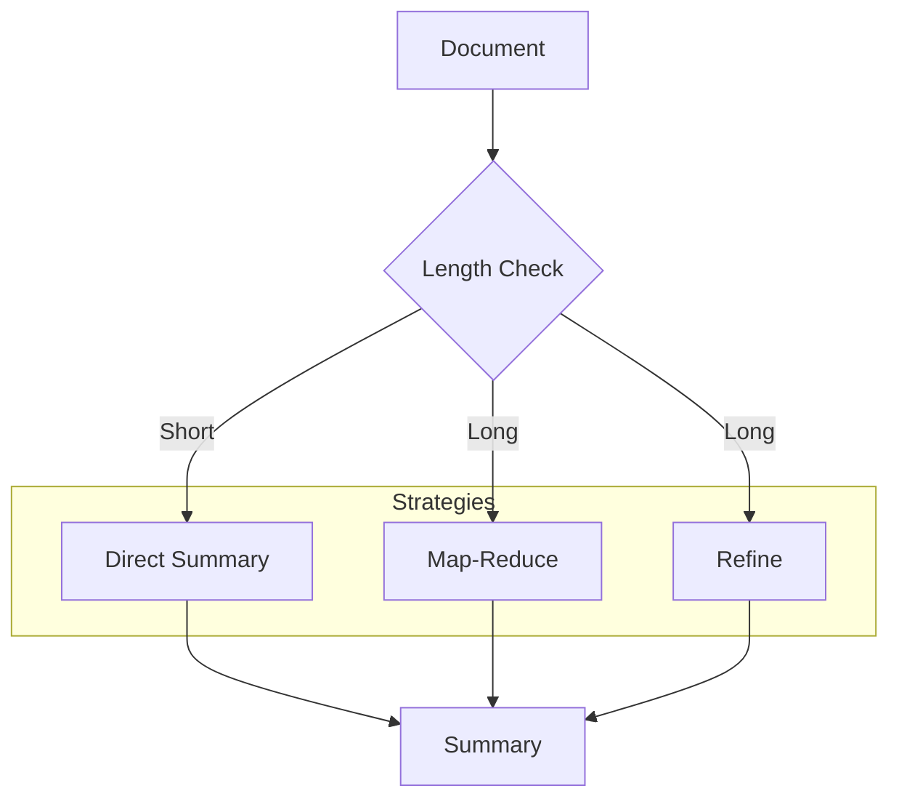

# Text Summarization

Create an intelligent text summarizer with multiple summarization strategies

## What You'll Learn

- Different summarization approaches
- Handling long documents that exceed context limits
- Controlling summary length and style
- Building a summarization API

## Tech Stack

| Component | Technology |
|-----------|------------|
| LLM | OpenAI GPT-4 |
| Chunking | LangChain |
| Backend | FastAPI |
| Frontend | Streamlit |

## Summarization Strategies



| Strategy | Best For | Pros | Cons |
|----------|----------|------|------|
| **Direct** | Short docs | Fast, coherent | Limited by context |
| **Map-Reduce** | Long docs | Parallel, scalable | May lose details |
| **Refine** | Long docs | Preserves details | Sequential, slower |

## Project Structure

```
text-summarization/
├── src/
│   ├── __init__.py
│   ├── summarizer.py      # Core summarization logic
│   ├── chunker.py         # Document chunking
│   ├── strategies.py      # Summarization strategies
│   └── api.py             # FastAPI application
├── frontend/
│   └── app.py             # Streamlit UI
├── tests/
│   └── test_summarizer.py
└── requirements.txt
```

## Implementation

### Step 1: Setup

```python title="requirements.txt"
openai>=1.0.0
langchain>=0.1.0
langchain-openai>=0.0.5
tiktoken>=0.5.0
fastapi>=0.100.0
uvicorn>=0.23.0
streamlit>=1.28.0
python-multipart>=0.0.6
PyPDF2>=3.0.0
```

### Step 2: Document Chunker

```python title="src/chunker.py"
"""
Document chunking for long text processing.
"""

from dataclasses import dataclass
import tiktoken


@dataclass
class Chunk:
    """A document chunk."""
    text: str
    index: int
    token_count: int


class DocumentChunker:
    """
    Split documents into chunks that fit within token limits.
    """
    
    def __init__(
        self,
        model: str = "gpt-4",
        max_chunk_tokens: int = 3000,
        overlap_tokens: int = 200
    ):
        self.encoder = tiktoken.encoding_for_model(model)
        self.max_chunk_tokens = max_chunk_tokens
        self.overlap_tokens = overlap_tokens
    
    def count_tokens(self, text: str) -> int:
        """Count tokens in text."""
        return len(self.encoder.encode(text))
    
    def chunk_text(self, text: str) -> list[Chunk]:
        """
        Split text into overlapping chunks.
        
        Args:
            text: The text to chunk
            
        Returns:
            List of Chunk objects
        """
        # If text fits in one chunk, return as-is
        total_tokens = self.count_tokens(text)
        if total_tokens <= self.max_chunk_tokens:
            return [Chunk(text=text, index=0, token_count=total_tokens)]
        
        # Split into sentences for better boundaries
        sentences = self._split_into_sentences(text)
        
        chunks = []
        current_chunk = []
        current_tokens = 0
        
        for sentence in sentences:
            sentence_tokens = self.count_tokens(sentence)
            
            # If adding sentence exceeds limit, save current chunk
            if current_tokens + sentence_tokens > self.max_chunk_tokens:
                if current_chunk:
                    chunk_text = " ".join(current_chunk)
                    chunks.append(Chunk(
                        text=chunk_text,
                        index=len(chunks),
                        token_count=self.count_tokens(chunk_text)
                    ))
                    
                    # Keep overlap
                    overlap_text = self._get_overlap(current_chunk)
                    current_chunk = [overlap_text] if overlap_text else []
                    current_tokens = self.count_tokens(overlap_text) if overlap_text else 0
            
            current_chunk.append(sentence)
            current_tokens += sentence_tokens
        
        # Add final chunk
        if current_chunk:
            chunk_text = " ".join(current_chunk)
            chunks.append(Chunk(
                text=chunk_text,
                index=len(chunks),
                token_count=self.count_tokens(chunk_text)
            ))
        
        return chunks
    
    def _split_into_sentences(self, text: str) -> list[str]:
        """Split text into sentences."""
        import re
        # Simple sentence splitting
        sentences = re.split(r'(?<=[.!?])\s+', text)
        return [s.strip() for s in sentences if s.strip()]
    
    def _get_overlap(self, sentences: list[str]) -> str:
        """Get overlap text from end of chunk."""
        overlap = []
        tokens = 0
        
        for sentence in reversed(sentences):
            sentence_tokens = self.count_tokens(sentence)
            if tokens + sentence_tokens > self.overlap_tokens:
                break
            overlap.insert(0, sentence)
            tokens += sentence_tokens
        
        return " ".join(overlap)
```

### Step 3: Summarization Strategies

```python title="src/strategies.py"
"""
Different summarization strategies for various document lengths.
"""

from abc import ABC, abstractmethod
from typing import Optional
from openai import OpenAI

from .chunker import DocumentChunker, Chunk


class SummarizationStrategy(ABC):
    """Base class for summarization strategies."""
    
    @abstractmethod
    def summarize(self, text: str, **kwargs) -> str:
        pass


class DirectSummary(SummarizationStrategy):
    """
    Direct summarization for short documents.
    
    Best for: Documents under 4000 tokens
    """
    
    def __init__(self, model: str = "gpt-4-turbo-preview"):
        self.client = OpenAI()
        self.model = model
    
    def summarize(
        self,
        text: str,
        max_length: str = "medium",
        style: str = "professional"
    ) -> str:
        """Summarize text directly."""
        length_guide = {
            "short": "2-3 sentences",
            "medium": "1 paragraph (4-6 sentences)",
            "long": "2-3 paragraphs"
        }
        
        prompt = f"""Summarize the following text in a {style} tone.
Target length: {length_guide.get(max_length, "1 paragraph")}

TEXT:
{text}

SUMMARY:"""
        
        response = self.client.chat.completions.create(
            model=self.model,
            messages=[{"role": "user", "content": prompt}],
            temperature=0.3
        )
        
        return response.choices[0].message.content


class MapReduceSummary(SummarizationStrategy):
    """
    Map-Reduce summarization for long documents.
    
    1. Map: Summarize each chunk independently
    2. Reduce: Combine chunk summaries into final summary
    
    Best for: Very long documents, parallel processing
    """
    
    def __init__(self, model: str = "gpt-4-turbo-preview"):
        self.client = OpenAI()
        self.model = model
        self.chunker = DocumentChunker()
    
    def summarize(
        self,
        text: str,
        max_length: str = "medium",
        style: str = "professional"
    ) -> str:
        """Summarize using map-reduce."""
        # Chunk the document
        chunks = self.chunker.chunk_text(text)
        
        if len(chunks) == 1:
            # Use direct summary for short docs
            return DirectSummary(self.model).summarize(text, max_length, style)
        
        # Map phase: summarize each chunk
        chunk_summaries = []
        for chunk in chunks:
            summary = self._summarize_chunk(chunk.text)
            chunk_summaries.append(summary)
        
        # Reduce phase: combine summaries
        combined = "\n\n".join(chunk_summaries)
        return self._final_summary(combined, max_length, style)
    
    def _summarize_chunk(self, text: str) -> str:
        """Summarize a single chunk."""
        prompt = f"""Summarize the key points from this text section:

{text}

Key points:"""
        
        response = self.client.chat.completions.create(
            model=self.model,
            messages=[{"role": "user", "content": prompt}],
            temperature=0.3,
            max_tokens=500
        )
        
        return response.choices[0].message.content
    
    def _final_summary(
        self, 
        combined: str, 
        max_length: str,
        style: str
    ) -> str:
        """Create final summary from chunk summaries."""
        length_guide = {
            "short": "2-3 sentences",
            "medium": "1 paragraph",
            "long": "2-3 paragraphs"
        }
        
        prompt = f"""Create a cohesive {style} summary from these key points.
Target length: {length_guide.get(max_length, "1 paragraph")}

KEY POINTS:
{combined}

FINAL SUMMARY:"""
        
        response = self.client.chat.completions.create(
            model=self.model,
            messages=[{"role": "user", "content": prompt}],
            temperature=0.3
        )
        
        return response.choices[0].message.content


class RefineSummary(SummarizationStrategy):
    """
    Iterative refinement summarization.
    
    Process chunks sequentially, refining the summary with each chunk.
    
    Best for: Long documents where context preservation is important
    """
    
    def __init__(self, model: str = "gpt-4-turbo-preview"):
        self.client = OpenAI()
        self.model = model
        self.chunker = DocumentChunker()
    
    def summarize(
        self,
        text: str,
        max_length: str = "medium",
        style: str = "professional"
    ) -> str:
        """Summarize using iterative refinement."""
        chunks = self.chunker.chunk_text(text)
        
        if len(chunks) == 1:
            return DirectSummary(self.model).summarize(text, max_length, style)
        
        # Initial summary from first chunk
        current_summary = self._initial_summary(chunks[0].text)
        
        # Refine with each subsequent chunk
        for chunk in chunks[1:]:
            current_summary = self._refine_summary(
                current_summary,
                chunk.text
            )
        
        # Final polish
        return self._polish_summary(current_summary, max_length, style)
    
    def _initial_summary(self, text: str) -> str:
        """Create initial summary from first chunk."""
        prompt = f"""Create an initial summary of this text:

{text}

Summary:"""
        
        response = self.client.chat.completions.create(
            model=self.model,
            messages=[{"role": "user", "content": prompt}],
            temperature=0.3
        )
        
        return response.choices[0].message.content
    
    def _refine_summary(self, current: str, new_text: str) -> str:
        """Refine summary with new information."""
        prompt = f"""Refine this summary by incorporating new information.
Keep the summary concise but comprehensive.

CURRENT SUMMARY:
{current}

NEW INFORMATION:
{new_text}

REFINED SUMMARY:"""
        
        response = self.client.chat.completions.create(
            model=self.model,
            messages=[{"role": "user", "content": prompt}],
            temperature=0.3
        )
        
        return response.choices[0].message.content
    
    def _polish_summary(
        self, 
        summary: str, 
        max_length: str,
        style: str
    ) -> str:
        """Polish the final summary."""
        length_guide = {
            "short": "2-3 sentences",
            "medium": "1 paragraph",
            "long": "2-3 paragraphs"
        }
        
        prompt = f"""Polish this summary to be {style} and well-structured.
Target length: {length_guide.get(max_length, "1 paragraph")}

SUMMARY:
{summary}

POLISHED SUMMARY:"""
        
        response = self.client.chat.completions.create(
            model=self.model,
            messages=[{"role": "user", "content": prompt}],
            temperature=0.3
        )
        
        return response.choices[0].message.content
```

### Step 4: Main Summarizer

```python title="src/summarizer.py"
"""
Main summarizer that selects appropriate strategy.
"""

from enum import Enum
from dataclasses import dataclass
from typing import Optional

from .chunker import DocumentChunker
from .strategies import DirectSummary, MapReduceSummary, RefineSummary


class Strategy(Enum):
    AUTO = "auto"
    DIRECT = "direct"
    MAP_REDUCE = "map_reduce"
    REFINE = "refine"


@dataclass
class SummaryResult:
    """Result of summarization."""
    summary: str
    strategy_used: str
    input_tokens: int
    chunks_processed: int


class Summarizer:
    """
    Document summarizer with automatic strategy selection.
    """
    
    def __init__(self, model: str = "gpt-4-turbo-preview"):
        self.model = model
        self.chunker = DocumentChunker(model=model)
        
        self.strategies = {
            Strategy.DIRECT: DirectSummary(model),
            Strategy.MAP_REDUCE: MapReduceSummary(model),
            Strategy.REFINE: RefineSummary(model)
        }
    
    def summarize(
        self,
        text: str,
        strategy: Strategy = Strategy.AUTO,
        max_length: str = "medium",
        style: str = "professional"
    ) -> SummaryResult:
        """
        Summarize text using the specified or best strategy.
        
        Args:
            text: Text to summarize
            strategy: Summarization strategy (auto selects based on length)
            max_length: Target length (short, medium, long)
            style: Writing style (professional, casual, technical)
            
        Returns:
            SummaryResult with summary and metadata
        """
        input_tokens = self.chunker.count_tokens(text)
        chunks = self.chunker.chunk_text(text)
        
        # Auto-select strategy based on document length
        if strategy == Strategy.AUTO:
            strategy = self._select_strategy(len(chunks))
        
        # Get the strategy implementation
        summarizer = self.strategies[strategy]
        
        # Generate summary
        summary = summarizer.summarize(
            text,
            max_length=max_length,
            style=style
        )
        
        return SummaryResult(
            summary=summary,
            strategy_used=strategy.value,
            input_tokens=input_tokens,
            chunks_processed=len(chunks)
        )
    
    def _select_strategy(self, num_chunks: int) -> Strategy:
        """Select best strategy based on document size."""
        if num_chunks == 1:
            return Strategy.DIRECT
        elif num_chunks <= 5:
            return Strategy.REFINE  # Better for moderate docs
        else:
            return Strategy.MAP_REDUCE  # Better for very long docs
```

### Step 5: FastAPI Application

```python title="src/api.py"
"""FastAPI application for text summarization."""

from fastapi import FastAPI, HTTPException, UploadFile, File
from pydantic import BaseModel, Field
from typing import Optional
import PyPDF2
import io

from .summarizer import Summarizer, Strategy, SummaryResult


app = FastAPI(
    title="Text Summarization API",
    description="Summarize documents using multiple strategies"
)

summarizer = Summarizer()


class SummarizeRequest(BaseModel):
    text: str = Field(..., min_length=10)
    strategy: str = "auto"
    max_length: str = "medium"
    style: str = "professional"


class SummarizeResponse(BaseModel):
    summary: str
    strategy_used: str
    input_tokens: int
    chunks_processed: int


@app.post("/summarize", response_model=SummarizeResponse)
async def summarize_text(request: SummarizeRequest):
    """Summarize text content."""
    try:
        strategy = Strategy(request.strategy)
    except ValueError:
        strategy = Strategy.AUTO
    
    result = summarizer.summarize(
        text=request.text,
        strategy=strategy,
        max_length=request.max_length,
        style=request.style
    )
    
    return SummarizeResponse(
        summary=result.summary,
        strategy_used=result.strategy_used,
        input_tokens=result.input_tokens,
        chunks_processed=result.chunks_processed
    )


@app.post("/summarize/pdf", response_model=SummarizeResponse)
async def summarize_pdf(
    file: UploadFile = File(...),
    strategy: str = "auto",
    max_length: str = "medium",
    style: str = "professional"
):
    """Summarize a PDF document."""
    if not file.filename.endswith(".pdf"):
        raise HTTPException(400, "File must be a PDF")
    
    # Extract text from PDF
    content = await file.read()
    pdf_reader = PyPDF2.PdfReader(io.BytesIO(content))
    
    text = ""
    for page in pdf_reader.pages:
        text += page.extract_text() + "\n"
    
    if not text.strip():
        raise HTTPException(400, "Could not extract text from PDF")
    
    try:
        strat = Strategy(strategy)
    except ValueError:
        strat = Strategy.AUTO
    
    result = summarizer.summarize(
        text=text,
        strategy=strat,
        max_length=max_length,
        style=style
    )
    
    return SummarizeResponse(
        summary=result.summary,
        strategy_used=result.strategy_used,
        input_tokens=result.input_tokens,
        chunks_processed=result.chunks_processed
    )
```

## Running the Application

```bash
export OPENAI_API_KEY="your-key"
uvicorn src.api:app --reload --port 8000
```

```bash
# Summarize text
curl -X POST http://localhost:8000/summarize \
  -H "Content-Type: application/json" \
  -d '{"text": "Your long text here...", "max_length": "short"}'

# Summarize PDF
curl -X POST http://localhost:8000/summarize/pdf \
  -F "file=@document.pdf" \
  -F "max_length=medium"
```

## Next Steps

- **[Structured Extraction](/docs/llm-applications/intermediate/structured-extraction)** - Extract data from text
- **[Content Generation](/docs/llm-applications/intermediate/content-generation)** - Generate content
