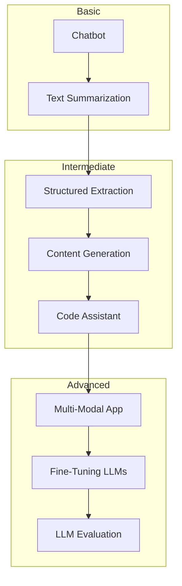
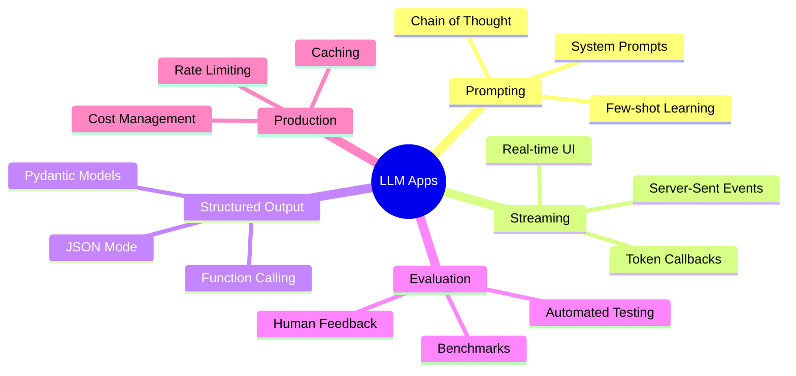

# LLM Applications Projects

Build real-world applications using the power of Large Language Models

## LLM Applications Projects

Create practical, production-ready applications that leverage LLMs for text generation, analysis, and automation.

## Learning Path

## Projects

### Beginner

| Project | Description | Time |
|---------|-------------|------|
| [Chatbot](/docs/llm-applications/basic/chatbot) | Build a conversational AI with streaming responses | ~2 hours |
| [Text Summarization](/docs/llm-applications/basic/text-summarization) | Create a document summarizer with multiple strategies | ~2 hours |

### Intermediate

| Project | Description | Time |
|---------|-------------|------|
| [Structured Extraction](/docs/llm-applications/intermediate/structured-extraction) | Extract structured data from unstructured text | ~4 hours |
| [Content Generation](/docs/llm-applications/intermediate/content-generation) | Build a content generator with templates and styles | ~4 hours |
| [Code Assistant](/docs/llm-applications/intermediate/code-assistant) | Create an AI coding assistant with context awareness | ~5 hours |

### Advanced

| Project | Description | Time |
|---------|-------------|------|
| [Multi-Modal Application](/docs/llm-applications/advanced/multi-modal-app) | Build apps that understand text, images, and audio | ~3 days |
| [Fine-Tuning LLMs](/docs/llm-applications/advanced/fine-tuning) | Fine-tune models for domain-specific tasks | ~4 days |
| [LLM Evaluation](/docs/llm-applications/advanced/llm-evaluation) | Comprehensive testing and evaluation frameworks | ~3 days |

## Why Build LLM Applications?

| Benefit | Description |
|---------|-------------|
| **Automation** | Automate text-heavy workflows and processes |
| **Intelligence** | Add natural language understanding to any application |
| **Scalability** | Handle millions of requests with proper architecture |
| **Flexibility** | Adapt to new use cases through prompting |

## Key Concepts

Start with the [Chatbot](/docs/llm-applications/basic/chatbot) project to learn the fundamentals.
