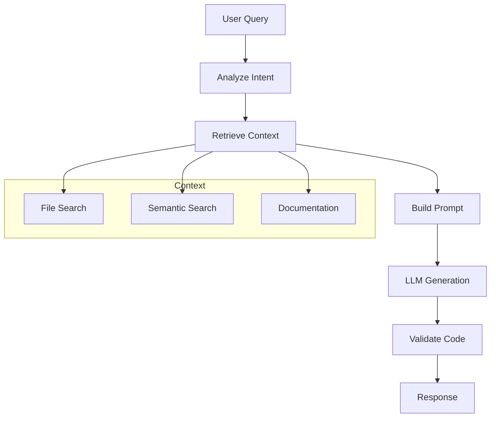

# Code Assistant

Create an intelligent coding assistant that understands your codebase

## What You'll Learn

- Code-aware prompt engineering
- Context retrieval from codebases
- Multi-language code generation
- Code explanation and refactoring

## Tech Stack

| Component | Technology |
|-----------|------------|
| LLM | OpenAI GPT-4 / Claude |
| Embeddings | OpenAI / CodeBERT |
| Vector Store | ChromaDB |
| API | FastAPI |

## Architecture



## Project Structure

```
code-assistant/
├── src/
│   ├── __init__.py
│   ├── assistant.py       # Main assistant logic
│   ├── context.py         # Context retrieval
│   ├── generator.py       # Code generation
│   └── api.py             # FastAPI application
├── tests/
└── requirements.txt
```

## Implementation

### Step 1: Setup

```python title="requirements.txt"
openai>=1.0.0
chromadb>=0.4.0
tiktoken>=0.5.0
tree-sitter>=0.20.0
fastapi>=0.100.0
uvicorn>=0.23.0
```

### Step 2: Context Retrieval

```python title="src/context.py"
"""
Code context retrieval and indexing.
"""

from dataclasses import dataclass
from pathlib import Path
from typing import Optional
import chromadb
from chromadb.utils import embedding_functions
import hashlib


@dataclass
class CodeFile:
    """A code file with metadata."""
    path: str
    content: str
    language: str
    functions: list[str]
    classes: list[str]


@dataclass
class CodeContext:
    """Retrieved code context."""
    files: list[CodeFile]
    snippets: list[str]
    total_tokens: int


class CodebaseIndexer:
    """
    Index and search codebases for context retrieval.
    """
    
    EXTENSIONS = {
        ".py": "python",
        ".js": "javascript",
        ".ts": "typescript",
        ".java": "java",
        ".go": "go",
        ".rs": "rust",
        ".cpp": "cpp",
        ".c": "c",
    }
    
    def __init__(self, persist_dir: str = "./codebase_index"):
        self.client = chromadb.PersistentClient(path=persist_dir)
        self.embedding_fn = embedding_functions.OpenAIEmbeddingFunction(
            model_name="text-embedding-3-small"
        )
        self.collection = self.client.get_or_create_collection(
            name="codebase",
            embedding_function=self.embedding_fn
        )
    
    def index_directory(self, directory: str) -> int:
        """Index all code files in a directory."""
        path = Path(directory)
        indexed = 0
        
        for ext, language in self.EXTENSIONS.items():
            for file_path in path.rglob(f"*{ext}"):
                try:
                    self._index_file(file_path, language)
                    indexed += 1
                except Exception as e:
                    print(f"Error indexing {file_path}: {e}")
        
        return indexed
    
    def _index_file(self, file_path: Path, language: str) -> None:
        """Index a single file."""
        content = file_path.read_text()
        
        # Split into chunks
        chunks = self._chunk_code(content, language)
        
        for i, chunk in enumerate(chunks):
            doc_id = hashlib.md5(f"{file_path}:{i}".encode()).hexdigest()
            
            self.collection.upsert(
                ids=[doc_id],
                documents=[chunk],
                metadatas=[{
                    "file_path": str(file_path),
                    "language": language,
                    "chunk_index": i
                }]
            )
    
    def _chunk_code(self, content: str, language: str) -> list[str]:
        """Split code into meaningful chunks."""
        lines = content.split("\n")
        chunks = []
        current_chunk = []
        current_size = 0
        max_size = 1000  # Characters per chunk
        
        for line in lines:
            # Check if we should start a new chunk
            if current_size + len(line) > max_size and current_chunk:
                chunks.append("\n".join(current_chunk))
                current_chunk = []
                current_size = 0
            
            current_chunk.append(line)
            current_size += len(line) + 1
        
        if current_chunk:
            chunks.append("\n".join(current_chunk))
        
        return chunks
    
    def search(
        self,
        query: str,
        n_results: int = 5,
        language: Optional[str] = None
    ) -> list[dict]:
        """Search for relevant code snippets."""
        where = {"language": language} if language else None
        
        results = self.collection.query(
            query_texts=[query],
            n_results=n_results,
            where=where,
            include=["documents", "metadatas", "distances"]
        )
        
        snippets = []
        for i, doc in enumerate(results["documents"][0]):
            snippets.append({
                "content": doc,
                "file_path": results["metadatas"][0][i]["file_path"],
                "language": results["metadatas"][0][i]["language"],
                "relevance": 1 - results["distances"][0][i]
            })
        
        return snippets
```

### Step 3: Code Generator

```python title="src/generator.py"
"""
Code generation with context awareness.
"""

from dataclasses import dataclass
from typing import Optional
from openai import OpenAI


@dataclass
class GeneratedCode:
    """Generated code with explanation."""
    code: str
    language: str
    explanation: str
    confidence: float


class CodeGenerator:
    """
    Generate code using LLMs with codebase context.
    """
    
    LANGUAGE_INSTRUCTIONS = {
        "python": "Use Python 3.10+ features, type hints, and follow PEP 8",
        "javascript": "Use modern ES6+ syntax, async/await where appropriate",
        "typescript": "Use strict TypeScript with proper typing",
        "go": "Follow Go conventions, handle errors properly",
        "rust": "Follow Rust conventions, handle Result/Option properly",
    }
    
    def __init__(self, model: str = "gpt-4-turbo-preview"):
        self.client = OpenAI()
        self.model = model
    
    def generate(
        self,
        task: str,
        language: str,
        context: list[dict] = None,
        style_guide: str = ""
    ) -> GeneratedCode:
        """
        Generate code for a task.
        
        Args:
            task: Description of what to generate
            language: Programming language
            context: Relevant code snippets for context
            style_guide: Project-specific style guidelines
            
        Returns:
            GeneratedCode with result
        """
        system_prompt = self._build_system_prompt(language, style_guide)
        user_prompt = self._build_user_prompt(task, context)
        
        response = self.client.chat.completions.create(
            model=self.model,
            messages=[
                {"role": "system", "content": system_prompt},
                {"role": "user", "content": user_prompt}
            ],
            temperature=0.3
        )
        
        result = response.choices[0].message.content
        code, explanation = self._parse_response(result)
        
        return GeneratedCode(
            code=code,
            language=language,
            explanation=explanation,
            confidence=0.8  # Could use logprobs for actual confidence
        )
    
    def _build_system_prompt(self, language: str, style_guide: str) -> str:
        """Build system prompt for code generation."""
        lang_instruction = self.LANGUAGE_INSTRUCTIONS.get(language, "")
        backticks = "```"

        return f"""You are an expert {language} developer.
{lang_instruction}

{style_guide}

When generating code:
1. Write clean, readable, well-documented code
2. Include error handling where appropriate
3. Follow best practices and design patterns
4. Explain your implementation choices

Format your response as:
{backticks}{language}
[your code here]
{backticks}

Explanation:
[brief explanation of the implementation]"""
    
    def _build_user_prompt(self, task: str, context: list[dict]) -> str:
        """Build user prompt with context."""
        backticks = "```"
        prompt = f"Task: {task}\n\n"

        if context:
            prompt += "Relevant code from the codebase:\n\n"
            for ctx in context[:3]:  # Limit context
                prompt += f"File: {ctx['file_path']}\n"
                prompt += f"{backticks}{ctx['language']}\n{ctx['content']}\n{backticks}\n\n"

        return prompt
    
    def _parse_response(self, response: str) -> tuple[str, str]:
        """Parse code and explanation from response."""
        import re

        # Extract code block (using backtick variable for MDX compatibility)
        backticks = "```"
        pattern = rf"{backticks}\w*\n(.*?){backticks}"
        code_match = re.search(pattern, response, re.DOTALL)
        code = code_match.group(1).strip() if code_match else ""

        # Extract explanation
        explanation_match = re.search(r"Explanation:\s*(.*?)$", response, re.DOTALL)
        explanation = explanation_match.group(1).strip() if explanation_match else ""

        return code, explanation
    
    def explain_code(self, code: str, language: str) -> str:
        """Explain what code does."""
        backticks = "```"
        prompt = f"""Explain this {language} code in detail:

{backticks}{language}
{code}
{backticks}

Provide:
1. Overview of what it does
2. Line-by-line explanation of key parts
3. Any potential issues or improvements"""

        response = self.client.chat.completions.create(
            model=self.model,
            messages=[{"role": "user", "content": prompt}],
            temperature=0.3
        )

        return response.choices[0].message.content

    def refactor(self, code: str, language: str, goal: str) -> GeneratedCode:
        """Refactor code with a specific goal."""
        backticks = "```"
        return self.generate(
            task=f"Refactor this code to {goal}:\n\n{backticks}{language}\n{code}\n{backticks}",
            language=language
        )
```

### Step 4: Main Assistant

```python title="src/assistant.py"
"""
Main code assistant that combines context and generation.
"""

from dataclasses import dataclass
from typing import Optional
from enum import Enum

from .context import CodebaseIndexer
from .generator import CodeGenerator, GeneratedCode


class Intent(Enum):
    GENERATE = "generate"
    EXPLAIN = "explain"
    REFACTOR = "refactor"
    DEBUG = "debug"
    REVIEW = "review"


@dataclass
class AssistantResponse:
    """Response from the code assistant."""
    intent: str
    response: str
    code: Optional[str] = None
    confidence: float = 0.0


class CodeAssistant:
    """
    Intelligent code assistant with context awareness.
    """
    
    def __init__(
        self,
        codebase_path: Optional[str] = None,
        model: str = "gpt-4-turbo-preview"
    ):
        self.generator = CodeGenerator(model)
        self.indexer = CodebaseIndexer()
        
        if codebase_path:
            self.index_codebase(codebase_path)
    
    def index_codebase(self, path: str) -> int:
        """Index a codebase for context retrieval."""
        return self.indexer.index_directory(path)
    
    def ask(
        self,
        query: str,
        language: str = "python",
        context_enabled: bool = True
    ) -> AssistantResponse:
        """
        Process a coding question or request.
        
        Args:
            query: User's question or request
            language: Programming language context
            context_enabled: Whether to search codebase for context
            
        Returns:
            AssistantResponse with appropriate content
        """
        # Detect intent
        intent = self._detect_intent(query)
        
        # Get relevant context if enabled
        context = []
        if context_enabled:
            context = self.indexer.search(query, n_results=3, language=language)
        
        # Process based on intent
        if intent == Intent.GENERATE:
            result = self.generator.generate(query, language, context)
            return AssistantResponse(
                intent=intent.value,
                response=result.explanation,
                code=result.code,
                confidence=result.confidence
            )
        
        elif intent == Intent.EXPLAIN:
            # Extract code from query if present
            code = self._extract_code(query)
            if code:
                explanation = self.generator.explain_code(code, language)
                return AssistantResponse(
                    intent=intent.value,
                    response=explanation,
                    confidence=0.9
                )
        
        elif intent == Intent.REFACTOR:
            code = self._extract_code(query)
            if code:
                result = self.generator.refactor(code, language, "improve readability")
                return AssistantResponse(
                    intent=intent.value,
                    response=result.explanation,
                    code=result.code,
                    confidence=result.confidence
                )
        
        # Default: treat as generation request
        result = self.generator.generate(query, language, context)
        return AssistantResponse(
            intent="generate",
            response=result.explanation,
            code=result.code,
            confidence=result.confidence
        )
    
    def _detect_intent(self, query: str) -> Intent:
        """Detect user intent from query."""
        query_lower = query.lower()
        
        if any(w in query_lower for w in ["explain", "what does", "how does"]):
            return Intent.EXPLAIN
        if any(w in query_lower for w in ["refactor", "improve", "optimize"]):
            return Intent.REFACTOR
        if any(w in query_lower for w in ["debug", "fix", "error", "bug"]):
            return Intent.DEBUG
        if any(w in query_lower for w in ["review", "check"]):
            return Intent.REVIEW
        
        return Intent.GENERATE
    
    def _extract_code(self, query: str) -> Optional[str]:
        """Extract code block from query."""
        import re
        backticks = "```"
        pattern = rf"{backticks}\w*\n?(.*?){backticks}"
        match = re.search(pattern, query, re.DOTALL)
        return match.group(1).strip() if match else None
```

### Step 5: FastAPI Application

```python title="src/api.py"
"""FastAPI application for code assistant."""

from fastapi import FastAPI
from pydantic import BaseModel
from typing import Optional

from .assistant import CodeAssistant


app = FastAPI(
    title="Code Assistant API",
    description="AI-powered coding assistant"
)

assistant = CodeAssistant()


class AskRequest(BaseModel):
    query: str
    language: str = "python"
    use_context: bool = True


class AskResponse(BaseModel):
    intent: str
    response: str
    code: Optional[str] = None
    confidence: float


@app.post("/ask", response_model=AskResponse)
async def ask(request: AskRequest):
    """Ask the code assistant a question."""
    result = assistant.ask(
        query=request.query,
        language=request.language,
        context_enabled=request.use_context
    )
    
    return AskResponse(
        intent=result.intent,
        response=result.response,
        code=result.code,
        confidence=result.confidence
    )


class IndexRequest(BaseModel):
    path: str


@app.post("/index")
async def index_codebase(request: IndexRequest):
    """Index a codebase for context retrieval."""
    count = assistant.index_codebase(request.path)
    return {"indexed_files": count}
```

## Example Usage

```bash
# Generate code
curl -X POST http://localhost:8000/ask \
  -H "Content-Type: application/json" \
  -d '{"query": "Write a function to merge two sorted lists", "language": "python"}'

# Explain code (pass code in the query)
curl -X POST http://localhost:8000/ask \
  -H "Content-Type: application/json" \
  -d '{"query": "Explain recursion in Python", "language": "python"}'
```

## Next Steps

- **[Multi-Modal Application](/docs/llm-applications/advanced/multi-modal-app)** - Handle images and code
- **[Fine-Tuning LLMs](/docs/llm-applications/advanced/fine-tuning)** - Customize for your domain
