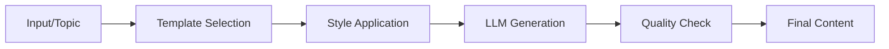

# Content Generation

Create an AI-powered content generator for various formats and styles

## What You'll Learn

- Template-based content generation
- Style and tone customization
- Multi-format output (blog, social, email)
- Content quality scoring

## Tech Stack

| Component | Technology |
|-----------|------------|
| LLM | OpenAI GPT-4 |
| Templates | Jinja2 |
| Backend | FastAPI |
| Frontend | Streamlit |

## Generation Pipeline



## Project Structure

```
content-generation/
├── src/
│   ├── __init__.py
│   ├── generator.py       # Content generation
│   ├── templates.py       # Template definitions
│   ├── styles.py          # Style configurations
│   └── api.py             # FastAPI application
├── templates/             # Jinja2 templates
├── tests/
└── requirements.txt
```

## Implementation

### Step 1: Setup

```python title="requirements.txt"
openai>=1.0.0
jinja2>=3.1.0
fastapi>=0.100.0
uvicorn>=0.23.0
pydantic>=2.0.0
```

### Step 2: Style Definitions

```python title="src/styles.py"
"""
Style and tone configurations for content generation.
"""

from dataclasses import dataclass
from enum import Enum


class Tone(Enum):
    PROFESSIONAL = "professional"
    CASUAL = "casual"
    FRIENDLY = "friendly"
    FORMAL = "formal"
    HUMOROUS = "humorous"
    TECHNICAL = "technical"


class ContentFormat(Enum):
    BLOG_POST = "blog_post"
    SOCIAL_MEDIA = "social_media"
    EMAIL = "email"
    PRODUCT_DESCRIPTION = "product_description"
    NEWSLETTER = "newsletter"
    PRESS_RELEASE = "press_release"


@dataclass
class StyleConfig:
    """Configuration for content style."""
    tone: Tone
    format: ContentFormat
    word_count: int = 500
    include_emojis: bool = False
    include_cta: bool = True
    seo_optimized: bool = False


TONE_INSTRUCTIONS = {
    Tone.PROFESSIONAL: "Use professional language, avoid slang, maintain authority",
    Tone.CASUAL: "Use conversational language, contractions OK, be approachable",
    Tone.FRIENDLY: "Warm and welcoming, use inclusive language",
    Tone.FORMAL: "Strictly formal, no contractions, academic style",
    Tone.HUMOROUS: "Light-hearted, include appropriate humor",
    Tone.TECHNICAL: "Use industry terminology, precise and detailed",
}


FORMAT_TEMPLATES = {
    ContentFormat.BLOG_POST: {
        "structure": ["hook", "introduction", "body", "conclusion", "cta"],
        "elements": ["headings", "paragraphs", "bullet_points"],
    },
    ContentFormat.SOCIAL_MEDIA: {
        "structure": ["hook", "message", "cta", "hashtags"],
        "elements": ["short_sentences", "emojis"],
        "max_length": 280,  # Twitter-friendly
    },
    ContentFormat.EMAIL: {
        "structure": ["subject", "greeting", "body", "cta", "signature"],
        "elements": ["personalization", "clear_action"],
    },
    ContentFormat.PRODUCT_DESCRIPTION: {
        "structure": ["headline", "benefits", "features", "specs", "cta"],
        "elements": ["bullet_points", "persuasive_language"],
    },
}
```

### Step 3: Content Generator

```python title="src/generator.py"
"""
AI-powered content generation.
"""

from dataclasses import dataclass
from typing import Optional
from openai import OpenAI

from .styles import StyleConfig, Tone, ContentFormat, TONE_INSTRUCTIONS, FORMAT_TEMPLATES


@dataclass
class GeneratedContent:
    """Generated content with metadata."""
    content: str
    format: str
    tone: str
    word_count: int
    quality_score: float


class ContentGenerator:
    """
    Generate various types of content using LLMs.
    """
    
    def __init__(self, model: str = "gpt-4-turbo-preview"):
        self.client = OpenAI()
        self.model = model
    
    def generate(
        self,
        topic: str,
        style: StyleConfig,
        context: str = "",
        keywords: list[str] = None
    ) -> GeneratedContent:
        """
        Generate content based on topic and style.
        
        Args:
            topic: Main topic or subject
            style: Style configuration
            context: Additional context or requirements
            keywords: SEO keywords to include
            
        Returns:
            GeneratedContent with the result
        """
        prompt = self._build_prompt(topic, style, context, keywords)
        
        response = self.client.chat.completions.create(
            model=self.model,
            messages=[
                {"role": "system", "content": self._system_prompt(style)},
                {"role": "user", "content": prompt}
            ],
            temperature=0.7,
            max_tokens=style.word_count * 2  # Allow some buffer
        )
        
        content = response.choices[0].message.content
        
        # Calculate quality score
        quality = self._score_quality(content, style, keywords)
        
        return GeneratedContent(
            content=content,
            format=style.format.value,
            tone=style.tone.value,
            word_count=len(content.split()),
            quality_score=quality
        )
    
    def _system_prompt(self, style: StyleConfig) -> str:
        """Build system prompt for the style."""
        tone_instruction = TONE_INSTRUCTIONS.get(style.tone, "")
        format_info = FORMAT_TEMPLATES.get(style.format, {})
        
        return f"""You are an expert content writer.

Tone: {style.tone.value}
{tone_instruction}

Format: {style.format.value}
Structure: {format_info.get('structure', [])}

Rules:
- Target approximately {style.word_count} words
- {'Include relevant emojis' if style.include_emojis else 'Do not use emojis'}
- {'Include a clear call-to-action' if style.include_cta else ''}
- {'Optimize for SEO with headers and keywords' if style.seo_optimized else ''}
- Write engaging, high-quality content"""
    
    def _build_prompt(
        self,
        topic: str,
        style: StyleConfig,
        context: str,
        keywords: list[str]
    ) -> str:
        """Build the generation prompt."""
        prompt = f"Write a {style.format.value} about: {topic}"
        
        if context:
            prompt += f"\n\nAdditional context: {context}"
        
        if keywords:
            prompt += f"\n\nInclude these keywords naturally: {', '.join(keywords)}"
        
        return prompt
    
    def _score_quality(
        self,
        content: str,
        style: StyleConfig,
        keywords: list[str]
    ) -> float:
        """Score content quality (0-1)."""
        score = 0.5  # Base score
        
        # Word count check
        word_count = len(content.split())
        target = style.word_count
        if 0.8 * target <= word_count <= 1.2 * target:
            score += 0.2
        
        # Keyword inclusion
        if keywords:
            content_lower = content.lower()
            keywords_found = sum(1 for k in keywords if k.lower() in content_lower)
            keyword_score = keywords_found / len(keywords)
            score += keyword_score * 0.2
        else:
            score += 0.1
        
        # Structure check (headers, paragraphs)
        if style.format == ContentFormat.BLOG_POST:
            if "#" in content or content.count("\n\n") > 2:
                score += 0.1
        
        return min(score, 1.0)
    
    def generate_variations(
        self,
        topic: str,
        style: StyleConfig,
        count: int = 3
    ) -> list[GeneratedContent]:
        """Generate multiple variations of content."""
        variations = []
        
        for i in range(count):
            # Slightly vary the prompt for each variation
            context = f"Variation {i+1}: Use a unique angle or perspective"
            result = self.generate(topic, style, context)
            variations.append(result)
        
        return variations


class SocialMediaGenerator(ContentGenerator):
    """Specialized generator for social media."""
    
    def generate_thread(
        self,
        topic: str,
        platform: str = "twitter",
        thread_length: int = 5
    ) -> list[str]:
        """Generate a social media thread."""
        prompt = f"""Create a {thread_length}-part thread about: {topic}

Platform: {platform}
Rules:
- Each part should be under 280 characters
- Number each part (1/, 2/, etc.)
- Make it engaging and shareable
- End with a call to action"""
        
        response = self.client.chat.completions.create(
            model=self.model,
            messages=[{"role": "user", "content": prompt}],
            temperature=0.8
        )
        
        content = response.choices[0].message.content
        # Split into individual tweets
        parts = [p.strip() for p in content.split("\n") if p.strip()]
        return parts[:thread_length]
```

### Step 4: FastAPI Application

```python title="src/api.py"
"""FastAPI application for content generation."""

from fastapi import FastAPI
from pydantic import BaseModel, Field
from typing import Optional

from .generator import ContentGenerator, SocialMediaGenerator
from .styles import StyleConfig, Tone, ContentFormat


app = FastAPI(
    title="Content Generation API",
    description="Generate various types of content with AI"
)

generator = ContentGenerator()
social_generator = SocialMediaGenerator()


class GenerateRequest(BaseModel):
    topic: str = Field(..., min_length=3)
    format: str = "blog_post"
    tone: str = "professional"
    word_count: int = 500
    context: str = ""
    keywords: list[str] = []
    include_emojis: bool = False
    seo_optimized: bool = False


class GenerateResponse(BaseModel):
    content: str
    format: str
    tone: str
    word_count: int
    quality_score: float


@app.post("/generate", response_model=GenerateResponse)
async def generate_content(request: GenerateRequest):
    """Generate content based on specifications."""
    style = StyleConfig(
        tone=Tone(request.tone),
        format=ContentFormat(request.format),
        word_count=request.word_count,
        include_emojis=request.include_emojis,
        seo_optimized=request.seo_optimized
    )
    
    result = generator.generate(
        topic=request.topic,
        style=style,
        context=request.context,
        keywords=request.keywords
    )
    
    return GenerateResponse(
        content=result.content,
        format=result.format,
        tone=result.tone,
        word_count=result.word_count,
        quality_score=result.quality_score
    )


class ThreadRequest(BaseModel):
    topic: str
    platform: str = "twitter"
    thread_length: int = Field(default=5, ge=2, le=15)


@app.post("/generate/thread")
async def generate_thread(request: ThreadRequest):
    """Generate a social media thread."""
    thread = social_generator.generate_thread(
        topic=request.topic,
        platform=request.platform,
        thread_length=request.thread_length
    )
    
    return {"thread": thread, "count": len(thread)}
```

## Example Usage

```bash
# Generate blog post
curl -X POST http://localhost:8000/generate \
  -H "Content-Type: application/json" \
  -d '{
    "topic": "Benefits of remote work",
    "format": "blog_post",
    "tone": "professional",
    "word_count": 800,
    "keywords": ["remote work", "productivity", "work-life balance"]
  }'

# Generate Twitter thread
curl -X POST http://localhost:8000/generate/thread \
  -H "Content-Type: application/json" \
  -d '{"topic": "AI in healthcare", "thread_length": 5}'
```

## Next Steps

- **[Code Assistant](/docs/llm-applications/intermediate/code-assistant)** - Build a coding AI
- **[Multi-Modal Application](/docs/llm-applications/advanced/multi-modal-app)** - Handle images and text
