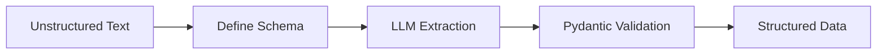

# Structured Extraction

Transform unstructured text into structured, validated data

## What You'll Learn

- Using Pydantic for schema definition
- Function calling for structured output
- Instructor library for reliable extraction
- Handling extraction errors and validation

## Tech Stack

| Component | Technology |
|-----------|------------|
| LLM | OpenAI GPT-4 |
| Schema | Pydantic |
| Extraction | Instructor |
| API | FastAPI |

## Extraction Pipeline



## Project Structure

```
structured-extraction/
├── src/
│   ├── __init__.py
│   ├── schemas.py         # Pydantic schemas
│   ├── extractor.py       # Extraction logic
│   └── api.py             # FastAPI application
├── tests/
│   └── test_extraction.py
└── requirements.txt
```

## Implementation

### Step 1: Setup

```python title="requirements.txt"
openai>=1.0.0
instructor>=0.4.0
pydantic>=2.0.0
fastapi>=0.100.0
uvicorn>=0.23.0
```

### Step 2: Define Schemas

```python title="src/schemas.py"
"""
Pydantic schemas for structured extraction.
"""

from pydantic import BaseModel, Field, field_validator
from typing import Optional
from datetime import date
from enum import Enum


class ContactInfo(BaseModel):
    """Extracted contact information."""
    name: str = Field(description="Full name of the person")
    email: Optional[str] = Field(None, description="Email address")
    phone: Optional[str] = Field(None, description="Phone number")
    company: Optional[str] = Field(None, description="Company or organization")
    title: Optional[str] = Field(None, description="Job title")
    
    @field_validator("email")
    @classmethod
    def validate_email(cls, v):
        if v and "@" not in v:
            raise ValueError("Invalid email format")
        return v


class Sentiment(str, Enum):
    POSITIVE = "positive"
    NEGATIVE = "negative"
    NEUTRAL = "neutral"


class ReviewAnalysis(BaseModel):
    """Analyzed product review."""
    sentiment: Sentiment = Field(description="Overall sentiment")
    rating: int = Field(ge=1, le=5, description="Rating from 1-5")
    pros: list[str] = Field(default_factory=list, description="Positive points")
    cons: list[str] = Field(default_factory=list, description="Negative points")
    summary: str = Field(description="Brief summary of the review")


class InvoiceItem(BaseModel):
    """Single item on an invoice."""
    description: str
    quantity: int = Field(ge=1)
    unit_price: float = Field(ge=0)
    total: float = Field(ge=0)


class Invoice(BaseModel):
    """Extracted invoice data."""
    invoice_number: str = Field(description="Invoice ID or number")
    vendor_name: str = Field(description="Name of the vendor")
    customer_name: str = Field(description="Name of the customer")
    date: Optional[str] = Field(None, description="Invoice date")
    due_date: Optional[str] = Field(None, description="Payment due date")
    items: list[InvoiceItem] = Field(default_factory=list)
    subtotal: Optional[float] = None
    tax: Optional[float] = None
    total: float = Field(description="Total amount")
    currency: str = Field(default="USD")


class EventInfo(BaseModel):
    """Extracted event information."""
    title: str = Field(description="Event name or title")
    date: Optional[str] = Field(None, description="Event date")
    time: Optional[str] = Field(None, description="Event time")
    location: Optional[str] = Field(None, description="Event location or venue")
    description: Optional[str] = Field(None, description="Event description")
    organizer: Optional[str] = Field(None, description="Event organizer")
```

### Step 3: Extractor with Instructor

```python title="src/extractor.py"
"""
Structured extraction using Instructor library.
"""

from typing import Type, TypeVar
from pydantic import BaseModel
import instructor
from openai import OpenAI

from .schemas import ContactInfo, ReviewAnalysis, Invoice, EventInfo


T = TypeVar("T", bound=BaseModel)


class StructuredExtractor:
    """
    Extract structured data from text using LLMs.
    
    Uses the Instructor library for reliable extraction
    with automatic retries and validation.
    """
    
    def __init__(self, model: str = "gpt-4-turbo-preview"):
        # Patch OpenAI client with Instructor
        self.client = instructor.from_openai(OpenAI())
        self.model = model
    
    def extract(
        self,
        text: str,
        schema: Type[T],
        instructions: str = ""
    ) -> T:
        """
        Extract structured data matching the schema.
        
        Args:
            text: Unstructured text to extract from
            schema: Pydantic model defining the structure
            instructions: Additional extraction instructions
            
        Returns:
            Validated Pydantic model instance
        """
        system_prompt = f"""Extract information from the text into the specified structure.
{instructions}

Rules:
- Only extract information that is explicitly stated
- Use null/None for fields not found in the text
- Be precise and accurate"""
        
        return self.client.chat.completions.create(
            model=self.model,
            messages=[
                {"role": "system", "content": system_prompt},
                {"role": "user", "content": text}
            ],
            response_model=schema,
            max_retries=2  # Retry on validation failure
        )
    
    def extract_contact(self, text: str) -> ContactInfo:
        """Extract contact information."""
        return self.extract(
            text,
            ContactInfo,
            "Extract all contact details including name, email, phone, company, and job title."
        )
    
    def analyze_review(self, text: str) -> ReviewAnalysis:
        """Analyze a product review."""
        return self.extract(
            text,
            ReviewAnalysis,
            "Analyze the sentiment, identify pros and cons, and provide a rating."
        )
    
    def extract_invoice(self, text: str) -> Invoice:
        """Extract invoice data."""
        return self.extract(
            text,
            Invoice,
            "Extract all invoice details including line items, totals, and dates."
        )
    
    def extract_event(self, text: str) -> EventInfo:
        """Extract event information."""
        return self.extract(
            text,
            EventInfo,
            "Extract event details including title, date, time, location, and organizer."
        )


class BatchExtractor:
    """Extract multiple items from text."""
    
    def __init__(self, model: str = "gpt-4-turbo-preview"):
        self.client = instructor.from_openai(OpenAI())
        self.model = model
    
    def extract_all(
        self,
        text: str,
        schema: Type[T],
        instructions: str = ""
    ) -> list[T]:
        """Extract all matching items from text."""
        
        # Create a wrapper model for list extraction
        class ItemList(BaseModel):
            items: list[schema]
        
        result = self.client.chat.completions.create(
            model=self.model,
            messages=[
                {
                    "role": "system",
                    "content": f"Extract ALL items matching the schema. {instructions}"
                },
                {"role": "user", "content": text}
            ],
            response_model=ItemList
        )
        
        return result.items
```

### Step 4: FastAPI Application

```python title="src/api.py"
"""FastAPI application for structured extraction."""

from fastapi import FastAPI, HTTPException
from pydantic import BaseModel
from typing import Any

from .extractor import StructuredExtractor
from .schemas import ContactInfo, ReviewAnalysis, Invoice, EventInfo


app = FastAPI(
    title="Structured Extraction API",
    description="Extract structured data from unstructured text"
)

extractor = StructuredExtractor()


class ExtractionRequest(BaseModel):
    text: str


@app.post("/extract/contact", response_model=ContactInfo)
async def extract_contact(request: ExtractionRequest):
    """Extract contact information from text."""
    try:
        return extractor.extract_contact(request.text)
    except Exception as e:
        raise HTTPException(500, str(e))


@app.post("/extract/review", response_model=ReviewAnalysis)
async def analyze_review(request: ExtractionRequest):
    """Analyze a product review."""
    try:
        return extractor.analyze_review(request.text)
    except Exception as e:
        raise HTTPException(500, str(e))


@app.post("/extract/invoice", response_model=Invoice)
async def extract_invoice(request: ExtractionRequest):
    """Extract invoice data from text."""
    try:
        return extractor.extract_invoice(request.text)
    except Exception as e:
        raise HTTPException(500, str(e))


@app.post("/extract/event", response_model=EventInfo)
async def extract_event(request: ExtractionRequest):
    """Extract event information from text."""
    try:
        return extractor.extract_event(request.text)
    except Exception as e:
        raise HTTPException(500, str(e))
```

## Example Usage

```bash
# Extract contact info
curl -X POST http://localhost:8000/extract/contact \
  -H "Content-Type: application/json" \
  -d '{"text": "Hi, I am John Smith, CTO at TechCorp. You can reach me at john@techcorp.com or call 555-0123."}'

# Analyze review
curl -X POST http://localhost:8000/extract/review \
  -H "Content-Type: application/json" \
  -d '{"text": "Great product! Fast delivery and excellent quality. The only downside is the high price. Would recommend to others."}'
```

## Key Concepts

| Concept | Description |
|---------|-------------|
| **Schema-First** | Define structure before extraction |
| **Validation** | Pydantic ensures data quality |
| **Retries** | Instructor handles LLM inconsistency |
| **Type Safety** | Full IDE support and type checking |

## Next Steps

- **[Content Generation](/docs/llm-applications/intermediate/content-generation)** - Generate content with templates
- **[Code Assistant](/docs/llm-applications/intermediate/code-assistant)** - Build a coding AI
