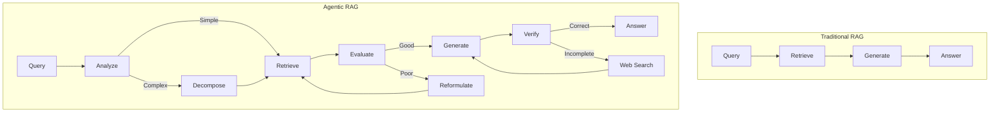
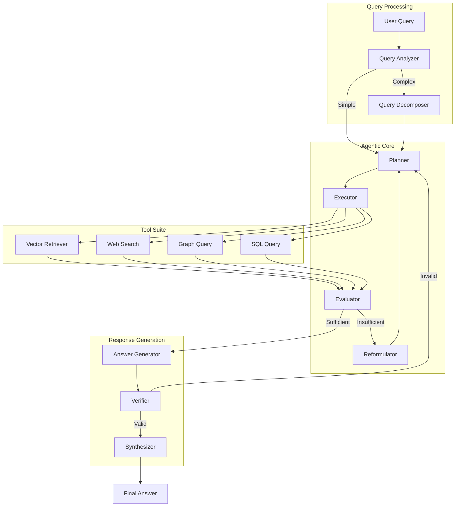

# Agentic RAG

Build an intelligent RAG system that autonomously decides when to retrieve, how to decompose complex questions, and self-corrects when initial answers are insufficient.

| Property | Value |
|----------|-------|
| **Difficulty** | 🔴 Advanced |
| **Category** | RAG |
| **Time Estimate** | ~5 days |
| **Code Size** | ~900 lines |
| **Prerequisites** | Intermediate RAG, AI Agents basics |

## Tech Stack

| Component | Technology |
|-----------|------------|
| **Agent Framework** | LangGraph |
| **LLM** | OpenAI GPT-4o |
| **Vector Store** | ChromaDB |
| **Web Search** | Tavily API |
| **Orchestration** | LangChain |
| **Framework** | FastAPI |

## Prerequisites

Before starting this project, you should:

- Complete the intermediate RAG projects
- Understand basic agent concepts (tools, reasoning, planning)
- Have experience with LangChain
- Know how to work with async Python

## What You'll Learn

- Design self-correcting RAG architectures
- Implement query decomposition for complex questions
- Build retrieval quality assessment
- Create adaptive retrieval strategies
- Use LangGraph for agentic workflows
- Handle multi-step reasoning with tool use

## Why Agentic RAG?

Traditional RAG is a **fixed pipeline** - retrieve once, generate once. But what happens when:

- The retrieval misses relevant documents?
- The question requires multiple pieces of information?
- The answer needs verification from external sources?
- The query is ambiguous and needs clarification?



**Agentic RAG capabilities:**

1. **Self-Evaluation**: Assess if retrieved content is sufficient
2. **Query Decomposition**: Break complex questions into sub-queries
3. **Adaptive Retrieval**: Choose retrieval strategy based on query type
4. **Self-Correction**: Reformulate queries when results are poor
5. **Multi-Source**: Combine knowledge base with web search

## System Architecture



## Project Structure

```
agentic-rag/
├── app/
│   ├── __init__.py
│   ├── main.py                 # FastAPI application
│   ├── config.py               # Configuration settings
│   ├── models.py               # Pydantic models
│   ├── agents/
│   │   ├── __init__.py
│   │   ├── query_analyzer.py   # Query analysis and routing
│   │   ├── decomposer.py       # Query decomposition
│   │   ├── planner.py          # Action planning
│   │   └── evaluator.py        # Result evaluation
│   ├── tools/
│   │   ├── __init__.py
│   │   ├── retriever.py        # Vector retrieval tool
│   │   ├── web_search.py       # Web search tool
│   │   └── sql_query.py        # Database query tool
│   ├── graph/
│   │   ├── __init__.py
│   │   ├── state.py            # Agent state definition
│   │   ├── nodes.py            # Graph nodes
│   │   └── workflow.py         # LangGraph workflow
│   └── generation/
│       ├── __init__.py
│       ├── generator.py        # Answer generation
│       └── verifier.py         # Answer verification
├── tests/
│   ├── __init__.py
│   ├── test_agents.py
│   ├── test_tools.py
│   └── test_workflow.py
├── docker-compose.yml
├── Dockerfile
├── requirements.txt
└── README.md
```

## Step 1: Configuration and Models

```python
# app/config.py
from pydantic_settings import BaseSettings
from functools import lru_cache
from typing import Optional


class Settings(BaseSettings):
    # API Keys
    openai_api_key: str
    tavily_api_key: Optional[str] = None

    # Model Settings
    planning_model: str = "gpt-4o"
    generation_model: str = "gpt-4o"
    evaluation_model: str = "gpt-4o-mini"

    # Retrieval Settings
    chroma_persist_dir: str = "./chroma_agentic"
    collection_name: str = "knowledge_base"
    top_k: int = 5
    relevance_threshold: float = 0.7

    # Agent Settings
    max_iterations: int = 5
    max_decomposition_depth: int = 3
    enable_web_search: bool = True

    class Config:
        env_file = ".env"


@lru_cache()
def get_settings() -> Settings:
    return Settings()
```

```python
# app/models.py
from pydantic import BaseModel, Field
from typing import Optional, List, Dict, Any, Literal
from enum import Enum
from datetime import datetime


class QueryType(str, Enum):
    SIMPLE = "simple"           # Direct factual question
    COMPLEX = "complex"         # Multi-part question
    COMPARATIVE = "comparative"  # Comparing entities
    TEMPORAL = "temporal"       # Time-based question
    AGGREGATION = "aggregation" # Summarization/counting


class RetrievalStrategy(str, Enum):
    VECTOR = "vector"           # Standard vector search
    HYBRID = "hybrid"           # Vector + keyword
    WEB = "web"                 # Web search
    MULTI = "multi"             # Multiple sources


class QueryAnalysis(BaseModel):
    """Analysis of user query"""
    original_query: str
    query_type: QueryType
    complexity_score: float = Field(ge=0, le=1)
    requires_decomposition: bool
    suggested_strategy: RetrievalStrategy
    key_entities: List[str]
    time_constraints: Optional[str] = None


class SubQuery(BaseModel):
    """Decomposed sub-query"""
    id: str
    query: str
    parent_id: Optional[str] = None
    depends_on: List[str] = Field(default_factory=list)
    priority: int = 1
    status: Literal["pending", "completed", "failed"] = "pending"
    answer: Optional[str] = None


class RetrievalResult(BaseModel):
    """Result from retrieval tool"""
    query: str
    documents: List[Dict[str, Any]]
    source: str  # vector, web, sql, etc.
    relevance_scores: List[float]
    metadata: Dict[str, Any] = Field(default_factory=dict)


class EvaluationResult(BaseModel):
    """Evaluation of retrieval quality"""
    is_sufficient: bool
    confidence: float = Field(ge=0, le=1)
    missing_information: List[str]
    suggested_actions: List[str]
    reasoning: str


class AgentAction(BaseModel):
    """Action to be executed by agent"""
    tool: str
    tool_input: Dict[str, Any]
    reasoning: str


class AgentState(BaseModel):
    """State maintained by the agent"""
    query: str
    query_analysis: Optional[QueryAnalysis] = None
    sub_queries: List[SubQuery] = Field(default_factory=list)
    retrieval_results: List[RetrievalResult] = Field(default_factory=list)
    evaluations: List[EvaluationResult] = Field(default_factory=list)
    current_answer: Optional[str] = None
    is_complete: bool = False
    iteration: int = 0
    errors: List[str] = Field(default_factory=list)


class QueryRequest(BaseModel):
    """API request model"""
    query: str
    max_iterations: int = 5
    enable_web_search: bool = True
    stream: bool = False


class QueryResponse(BaseModel):
    """API response model"""
    query: str
    answer: str
    sources: List[Dict[str, Any]]
    sub_queries: List[Dict[str, str]]
    iterations: int
    reasoning_trace: List[str]
    processing_time_ms: float
```

## Step 2: Query Analysis and Decomposition

```python
# app/agents/query_analyzer.py
import openai
from typing import Dict, Any
import json
import logging

from ..models import QueryAnalysis, QueryType, RetrievalStrategy
from ..config import get_settings

logger = logging.getLogger(__name__)
settings = get_settings()


class QueryAnalyzer:
    """Analyze queries to determine processing strategy"""

    def __init__(self):
        self.client = openai.OpenAI(api_key=settings.openai_api_key)

    def analyze(self, query: str) -> QueryAnalysis:
        """Analyze query to determine type and strategy"""
        prompt = f"""Analyze this query and determine how to process it:

Query: "{query}"

Respond in JSON format:
{{
    "query_type": "simple|complex|comparative|temporal|aggregation",
    "complexity_score": 0.0-1.0,
    "requires_decomposition": true/false,
    "suggested_strategy": "vector|hybrid|web|multi",
    "key_entities": ["entity1", "entity2"],
    "time_constraints": "any time-related constraints or null",
    "reasoning": "Brief explanation of your analysis"
}}

Guidelines:
- simple: Direct factual questions ("What is X?")
- complex: Multi-part or multi-step questions
- comparative: Questions comparing entities
- temporal: Questions about time periods or sequences
- aggregation: Questions requiring summarization

Strategies:
- vector: Standard knowledge base search
- hybrid: Knowledge base + keyword matching
- web: Current/real-time information needed
- multi: Multiple sources needed for complete answer"""

        response = self.client.chat.completions.create(
            model=settings.evaluation_model,
            messages=[{"role": "user", "content": prompt}],
            response_format={"type": "json_object"},
            max_tokens=500
        )

        result = json.loads(response.choices[0].message.content)

        return QueryAnalysis(
            original_query=query,
            query_type=QueryType(result["query_type"]),
            complexity_score=result["complexity_score"],
            requires_decomposition=result["requires_decomposition"],
            suggested_strategy=RetrievalStrategy(result["suggested_strategy"]),
            key_entities=result.get("key_entities", []),
            time_constraints=result.get("time_constraints")
        )
```

```python
# app/agents/decomposer.py
import openai
from typing import List
import json
import uuid
import logging

from ..models import SubQuery, QueryAnalysis
from ..config import get_settings

logger = logging.getLogger(__name__)
settings = get_settings()


class QueryDecomposer:
    """Decompose complex queries into sub-queries"""

    def __init__(self):
        self.client = openai.OpenAI(api_key=settings.openai_api_key)

    def decompose(
        self,
        query: str,
        analysis: QueryAnalysis,
        max_sub_queries: int = 5
    ) -> List[SubQuery]:
        """Break down complex query into manageable sub-queries"""
        if not analysis.requires_decomposition:
            return [SubQuery(
                id=str(uuid.uuid4()),
                query=query,
                priority=1
            )]

        prompt = f"""Decompose this complex query into simpler sub-queries:

Original Query: "{query}"

Analysis:
- Type: {analysis.query_type.value}
- Key Entities: {analysis.key_entities}
- Time Constraints: {analysis.time_constraints or 'None'}

Create {max_sub_queries} or fewer sub-queries that together answer the original.

Respond in JSON format:
{{
    "sub_queries": [
        {{
            "query": "Sub-question 1",
            "depends_on": [],  // IDs of queries this depends on
            "priority": 1  // Lower = higher priority
        }},
        ...
    ],
    "reasoning": "Explanation of decomposition strategy"
}}

Guidelines:
- Make sub-queries independent when possible
- Order dependencies correctly
- Each sub-query should be answerable with single retrieval
- Prioritize foundational questions first"""

        response = self.client.chat.completions.create(
            model=settings.planning_model,
            messages=[{"role": "user", "content": prompt}],
            response_format={"type": "json_object"},
            max_tokens=800
        )

        result = json.loads(response.choices[0].message.content)

        sub_queries = []
        id_map = {}  # Map index to generated ID

        for i, sq in enumerate(result.get("sub_queries", [])):
            sq_id = str(uuid.uuid4())
            id_map[i] = sq_id

            # Map dependency indices to IDs
            depends_on = []
            for dep_idx in sq.get("depends_on", []):
                if isinstance(dep_idx, int) and dep_idx in id_map:
                    depends_on.append(id_map[dep_idx])

            sub_queries.append(SubQuery(
                id=sq_id,
                query=sq["query"],
                depends_on=depends_on,
                priority=sq.get("priority", i + 1)
            ))

        # Sort by priority
        sub_queries.sort(key=lambda x: x.priority)

        return sub_queries

    def merge_answers(
        self,
        original_query: str,
        sub_queries: List[SubQuery]
    ) -> str:
        """Merge sub-query answers into final answer"""
        answered = [sq for sq in sub_queries if sq.answer]

        if not answered:
            return "Unable to find relevant information."

        sub_answers = "\n".join([
            f"Q: {sq.query}\nA: {sq.answer}"
            for sq in answered
        ])

        prompt = f"""Synthesize these sub-answers into a comprehensive response:

Original Question: "{original_query}"

Sub-Questions and Answers:
{sub_answers}

Create a coherent, well-structured answer that:
1. Addresses the original question directly
2. Integrates all relevant sub-answers
3. Maintains logical flow
4. Avoids redundancy"""

        response = self.client.chat.completions.create(
            model=settings.generation_model,
            messages=[{"role": "user", "content": prompt}],
            max_tokens=1000
        )

        return response.choices[0].message.content
```

## Step 3: Retrieval Tools

```python
# app/tools/retriever.py
import chromadb
from chromadb.config import Settings as ChromaSettings
import openai
from typing import List, Dict, Any, Optional
import logging

from ..models import RetrievalResult
from ..config import get_settings

logger = logging.getLogger(__name__)
settings = get_settings()


class VectorRetriever:
    """Vector-based document retrieval"""

    def __init__(self):
        self.client = openai.OpenAI(api_key=settings.openai_api_key)

        self.chroma_client = chromadb.Client(ChromaSettings(
            chroma_db_impl="duckdb+parquet",
            persist_directory=settings.chroma_persist_dir,
            anonymized_telemetry=False
        ))

        self.collection = self.chroma_client.get_or_create_collection(
            name=settings.collection_name,
            metadata={"hnsw:space": "cosine"}
        )

    def retrieve(
        self,
        query: str,
        top_k: int = None,
        filters: Optional[Dict[str, Any]] = None
    ) -> RetrievalResult:
        """Retrieve relevant documents"""
        top_k = top_k or settings.top_k

        # Get embedding
        embedding_response = self.client.embeddings.create(
            model="text-embedding-3-small",
            input=query
        )
        query_embedding = embedding_response.data[0].embedding

        # Search
        results = self.collection.query(
            query_embeddings=[query_embedding],
            n_results=top_k,
            where=filters,
            include=["documents", "metadatas", "distances"]
        )

        documents = []
        scores = []

        for i, doc_id in enumerate(results["ids"][0]):
            doc = {
                "id": doc_id,
                "content": results["documents"][0][i],
                "metadata": results["metadatas"][0][i]
            }
            documents.append(doc)
            scores.append(1 - results["distances"][0][i])

        return RetrievalResult(
            query=query,
            documents=documents,
            source="vector",
            relevance_scores=scores,
            metadata={"top_k": top_k}
        )

    def add_documents(
        self,
        documents: List[str],
        metadatas: Optional[List[Dict[str, Any]]] = None,
        ids: Optional[List[str]] = None
    ) -> int:
        """Add documents to the knowledge base"""
        if not ids:
            ids = [f"doc_{i}" for i in range(len(documents))]

        embeddings = []
        for doc in documents:
            response = self.client.embeddings.create(
                model="text-embedding-3-small",
                input=doc
            )
            embeddings.append(response.data[0].embedding)

        self.collection.add(
            ids=ids,
            documents=documents,
            embeddings=embeddings,
            metadatas=metadatas or [{}] * len(documents)
        )

        return len(documents)
```

```python
# app/tools/web_search.py
import httpx
from typing import List, Dict, Any, Optional
import logging

from ..models import RetrievalResult
from ..config import get_settings

logger = logging.getLogger(__name__)
settings = get_settings()


class WebSearchTool:
    """Web search using Tavily API"""

    def __init__(self):
        self.api_key = settings.tavily_api_key
        self.base_url = "https://api.tavily.com"

    async def search(
        self,
        query: str,
        max_results: int = 5,
        search_depth: str = "basic"
    ) -> RetrievalResult:
        """Search the web for relevant information"""
        if not self.api_key:
            return RetrievalResult(
                query=query,
                documents=[],
                source="web",
                relevance_scores=[],
                metadata={"error": "Web search not configured"}
            )

        async with httpx.AsyncClient() as client:
            response = await client.post(
                f"{self.base_url}/search",
                json={
                    "api_key": self.api_key,
                    "query": query,
                    "search_depth": search_depth,
                    "max_results": max_results,
                    "include_answer": True
                },
                timeout=30.0
            )

            if response.status_code != 200:
                logger.error(f"Web search failed: {response.text}")
                return RetrievalResult(
                    query=query,
                    documents=[],
                    source="web",
                    relevance_scores=[],
                    metadata={"error": response.text}
                )

            data = response.json()

        documents = []
        scores = []

        for result in data.get("results", []):
            documents.append({
                "id": result.get("url", ""),
                "content": result.get("content", ""),
                "metadata": {
                    "title": result.get("title", ""),
                    "url": result.get("url", ""),
                    "score": result.get("score", 0)
                }
            })
            scores.append(result.get("score", 0))

        return RetrievalResult(
            query=query,
            documents=documents,
            source="web",
            relevance_scores=scores,
            metadata={
                "answer": data.get("answer"),
                "follow_up_questions": data.get("follow_up_questions", [])
            }
        )
```

## Step 4: Evaluation and Self-Correction

```python
# app/agents/evaluator.py
import openai
from typing import List
import json
import logging

from ..models import RetrievalResult, EvaluationResult
from ..config import get_settings

logger = logging.getLogger(__name__)
settings = get_settings()


class RetrievalEvaluator:
    """Evaluate retrieval quality and suggest improvements"""

    def __init__(self):
        self.client = openai.OpenAI(api_key=settings.openai_api_key)

    def evaluate(
        self,
        query: str,
        results: List[RetrievalResult]
    ) -> EvaluationResult:
        """Evaluate if retrieved content is sufficient"""
        # Combine all retrieved content
        all_content = []
        for result in results:
            for doc in result.documents:
                all_content.append({
                    "source": result.source,
                    "content": doc.get("content", "")[:500],  # Truncate
                    "score": doc.get("metadata", {}).get("score", 0)
                })

        prompt = f"""Evaluate if this retrieved content can answer the query:

Query: "{query}"

Retrieved Content:
{json.dumps(all_content, indent=2)}

Evaluate and respond in JSON format:
{{
    "is_sufficient": true/false,
    "confidence": 0.0-1.0,
    "missing_information": ["What's missing if not sufficient"],
    "suggested_actions": ["What to do next"],
    "reasoning": "Explanation of evaluation"
}}

Guidelines:
- is_sufficient: Can the query be fully answered?
- confidence: How confident in the answer quality?
- missing_information: Specific gaps in the content
- suggested_actions: Concrete next steps (reformulate, web search, etc.)"""

        response = self.client.chat.completions.create(
            model=settings.evaluation_model,
            messages=[{"role": "user", "content": prompt}],
            response_format={"type": "json_object"},
            max_tokens=500
        )

        result = json.loads(response.choices[0].message.content)

        return EvaluationResult(
            is_sufficient=result["is_sufficient"],
            confidence=result["confidence"],
            missing_information=result.get("missing_information", []),
            suggested_actions=result.get("suggested_actions", []),
            reasoning=result["reasoning"]
        )

    def should_retry(self, evaluation: EvaluationResult) -> bool:
        """Determine if retrieval should be retried"""
        return (
            not evaluation.is_sufficient and
            evaluation.confidence < settings.relevance_threshold
        )


class QueryReformulator:
    """Reformulate queries for better retrieval"""

    def __init__(self):
        self.client = openai.OpenAI(api_key=settings.openai_api_key)

    def reformulate(
        self,
        original_query: str,
        evaluation: EvaluationResult,
        previous_queries: List[str]
    ) -> str:
        """Generate improved query based on evaluation feedback"""
        prompt = f"""Reformulate this query to get better retrieval results:

Original Query: "{original_query}"

Evaluation:
- Missing Information: {evaluation.missing_information}
- Reasoning: {evaluation.reasoning}

Previous Query Attempts:
{json.dumps(previous_queries)}

Create an improved query that:
1. Addresses the missing information
2. Uses different keywords/phrasing
3. Is more specific or broader as needed
4. Avoids previous unsuccessful approaches

Return ONLY the reformulated query, nothing else."""

        response = self.client.chat.completions.create(
            model=settings.evaluation_model,
            messages=[{"role": "user", "content": prompt}],
            max_tokens=200
        )

        return response.choices[0].message.content.strip()
```

## Step 5: LangGraph Workflow

```python
# app/graph/state.py
from typing import TypedDict, List, Annotated, Optional
from operator import add

from ..models import (
    QueryAnalysis, SubQuery, RetrievalResult,
    EvaluationResult
)


class AgentGraphState(TypedDict):
    """State for the agentic RAG workflow"""
    # Input
    query: str

    # Analysis
    query_analysis: Optional[QueryAnalysis]

    # Decomposition
    sub_queries: List[SubQuery]
    current_sub_query_idx: int

    # Retrieval
    retrieval_results: Annotated[List[RetrievalResult], add]
    query_history: Annotated[List[str], add]

    # Evaluation
    evaluation: Optional[EvaluationResult]

    # Generation
    current_answer: Optional[str]
    final_answer: Optional[str]

    # Control
    iteration: int
    max_iterations: int
    is_complete: bool
    reasoning_trace: Annotated[List[str], add]
    errors: Annotated[List[str], add]
```

```python
# app/graph/nodes.py
from typing import Dict, Any
import logging

from .state import AgentGraphState
from ..agents.query_analyzer import QueryAnalyzer
from ..agents.decomposer import QueryDecomposer
from ..agents.evaluator import RetrievalEvaluator, QueryReformulator
from ..tools.retriever import VectorRetriever
from ..tools.web_search import WebSearchTool
from ..config import get_settings

logger = logging.getLogger(__name__)
settings = get_settings()

# Initialize components
query_analyzer = QueryAnalyzer()
decomposer = QueryDecomposer()
evaluator = RetrievalEvaluator()
reformulator = QueryReformulator()
retriever = VectorRetriever()
web_search = WebSearchTool()


async def analyze_query(state: AgentGraphState) -> Dict[str, Any]:
    """Analyze the input query"""
    logger.info(f"Analyzing query: {state['query']}")

    analysis = query_analyzer.analyze(state["query"])

    return {
        "query_analysis": analysis,
        "reasoning_trace": [
            f"Query type: {analysis.query_type.value}, "
            f"Strategy: {analysis.suggested_strategy.value}"
        ]
    }


async def decompose_query(state: AgentGraphState) -> Dict[str, Any]:
    """Decompose complex query into sub-queries"""
    analysis = state["query_analysis"]

    if not analysis.requires_decomposition:
        return {
            "sub_queries": [],
            "reasoning_trace": ["Query is simple, no decomposition needed"]
        }

    sub_queries = decomposer.decompose(state["query"], analysis)

    return {
        "sub_queries": sub_queries,
        "current_sub_query_idx": 0,
        "reasoning_trace": [
            f"Decomposed into {len(sub_queries)} sub-queries"
        ]
    }


async def retrieve_documents(state: AgentGraphState) -> Dict[str, Any]:
    """Execute retrieval based on current strategy"""
    analysis = state["query_analysis"]
    sub_queries = state.get("sub_queries", [])

    # Determine which query to use
    if sub_queries:
        idx = state.get("current_sub_query_idx", 0)
        if idx < len(sub_queries):
            current_query = sub_queries[idx].query
        else:
            current_query = state["query"]
    else:
        current_query = state["query"]

    results = []

    # Vector retrieval
    vector_result = retriever.retrieve(current_query)
    results.append(vector_result)

    # Web search if needed
    if (analysis.suggested_strategy.value in ["web", "multi"] and
            settings.enable_web_search):
        web_result = await web_search.search(current_query)
        results.append(web_result)

    return {
        "retrieval_results": results,
        "query_history": [current_query],
        "reasoning_trace": [
            f"Retrieved from {len(results)} sources for: {current_query}"
        ]
    }


async def evaluate_results(state: AgentGraphState) -> Dict[str, Any]:
    """Evaluate retrieval quality"""
    sub_queries = state.get("sub_queries", [])

    # Get current query
    if sub_queries:
        idx = state.get("current_sub_query_idx", 0)
        if idx < len(sub_queries):
            current_query = sub_queries[idx].query
        else:
            current_query = state["query"]
    else:
        current_query = state["query"]

    evaluation = evaluator.evaluate(
        current_query,
        state["retrieval_results"]
    )

    return {
        "evaluation": evaluation,
        "reasoning_trace": [
            f"Evaluation: sufficient={evaluation.is_sufficient}, "
            f"confidence={evaluation.confidence:.2f}"
        ]
    }


async def reformulate_query(state: AgentGraphState) -> Dict[str, Any]:
    """Reformulate query for better retrieval"""
    sub_queries = state.get("sub_queries", [])

    if sub_queries:
        idx = state.get("current_sub_query_idx", 0)
        if idx < len(sub_queries):
            original = sub_queries[idx].query
        else:
            original = state["query"]
    else:
        original = state["query"]

    new_query = reformulator.reformulate(
        original,
        state["evaluation"],
        state.get("query_history", [])
    )

    # Update sub-query if applicable
    if sub_queries and idx < len(sub_queries):
        sub_queries[idx].query = new_query

    return {
        "sub_queries": sub_queries,
        "reasoning_trace": [f"Reformulated to: {new_query}"],
        "iteration": state["iteration"] + 1
    }


async def generate_answer(state: AgentGraphState) -> Dict[str, Any]:
    """Generate answer from retrieved content"""
    from ..generation.generator import AnswerGenerator

    generator = AnswerGenerator()

    sub_queries = state.get("sub_queries", [])

    if sub_queries:
        # Update current sub-query answer
        idx = state.get("current_sub_query_idx", 0)
        if idx < len(sub_queries):
            answer = generator.generate(
                sub_queries[idx].query,
                state["retrieval_results"]
            )
            sub_queries[idx].answer = answer
            sub_queries[idx].status = "completed"

            # Move to next sub-query
            return {
                "sub_queries": sub_queries,
                "current_sub_query_idx": idx + 1,
                "reasoning_trace": [f"Answered sub-query {idx + 1}"]
            }
    else:
        # Generate final answer directly
        answer = generator.generate(
            state["query"],
            state["retrieval_results"]
        )
        return {
            "current_answer": answer,
            "reasoning_trace": ["Generated direct answer"]
        }


async def synthesize_answer(state: AgentGraphState) -> Dict[str, Any]:
    """Synthesize final answer from sub-answers"""
    sub_queries = state.get("sub_queries", [])

    if sub_queries:
        final = decomposer.merge_answers(state["query"], sub_queries)
    else:
        final = state.get("current_answer", "")

    return {
        "final_answer": final,
        "is_complete": True,
        "reasoning_trace": ["Synthesized final answer"]
    }


def should_continue(state: AgentGraphState) -> str:
    """Determine next step in workflow"""
    # Check iteration limit
    if state["iteration"] >= state["max_iterations"]:
        return "synthesize"

    # Check if evaluation passed
    if state.get("evaluation") and state["evaluation"].is_sufficient:
        # Check if more sub-queries to process
        sub_queries = state.get("sub_queries", [])
        idx = state.get("current_sub_query_idx", 0)

        if sub_queries and idx < len(sub_queries):
            return "retrieve"  # Process next sub-query
        return "synthesize"

    # Need to reformulate
    return "reformulate"


def needs_decomposition(state: AgentGraphState) -> str:
    """Check if query needs decomposition"""
    analysis = state.get("query_analysis")
    if analysis and analysis.requires_decomposition:
        return "decompose"
    return "retrieve"
```

```python
# app/graph/workflow.py
from langgraph.graph import StateGraph, END
from .state import AgentGraphState
from .nodes import (
    analyze_query, decompose_query, retrieve_documents,
    evaluate_results, reformulate_query, generate_answer,
    synthesize_answer, should_continue, needs_decomposition
)


def create_workflow() -> StateGraph:
    """Create the agentic RAG workflow"""
    workflow = StateGraph(AgentGraphState)

    # Add nodes
    workflow.add_node("analyze", analyze_query)
    workflow.add_node("decompose", decompose_query)
    workflow.add_node("retrieve", retrieve_documents)
    workflow.add_node("evaluate", evaluate_results)
    workflow.add_node("reformulate", reformulate_query)
    workflow.add_node("generate", generate_answer)
    workflow.add_node("synthesize", synthesize_answer)

    # Set entry point
    workflow.set_entry_point("analyze")

    # Add edges
    workflow.add_conditional_edges(
        "analyze",
        needs_decomposition,
        {
            "decompose": "decompose",
            "retrieve": "retrieve"
        }
    )

    workflow.add_edge("decompose", "retrieve")
    workflow.add_edge("retrieve", "evaluate")

    workflow.add_conditional_edges(
        "evaluate",
        should_continue,
        {
            "synthesize": "generate",
            "reformulate": "reformulate",
            "retrieve": "retrieve"
        }
    )

    workflow.add_edge("reformulate", "retrieve")
    workflow.add_edge("generate", "synthesize")
    workflow.add_edge("synthesize", END)

    return workflow.compile()


# Create global workflow instance
agentic_workflow = create_workflow()
```

## Step 6: Answer Generation

```python
# app/generation/generator.py
import openai
from typing import List
import logging

from ..models import RetrievalResult
from ..config import get_settings

logger = logging.getLogger(__name__)
settings = get_settings()


class AnswerGenerator:
    """Generate answers from retrieved content"""

    def __init__(self):
        self.client = openai.OpenAI(api_key=settings.openai_api_key)

    def generate(
        self,
        query: str,
        results: List[RetrievalResult]
    ) -> str:
        """Generate answer from retrieval results"""
        # Combine relevant content
        context_parts = []
        for result in results:
            for doc in result.documents:
                content = doc.get("content", "")
                source = result.source
                context_parts.append(f"[Source: {source}]\n{content}")

        context = "\n\n".join(context_parts[:10])  # Limit context

        prompt = f"""Answer this question based on the provided context:

Question: {query}

Context:
{context}

Instructions:
1. Answer directly and concisely
2. Use information only from the provided context
3. If the context doesn't contain enough information, say so
4. Cite sources when relevant using [Source: type] format
5. If there's conflicting information, note the discrepancy"""

        response = self.client.chat.completions.create(
            model=settings.generation_model,
            messages=[{"role": "user", "content": prompt}],
            max_tokens=1000
        )

        return response.choices[0].message.content
```

```python
# app/generation/verifier.py
import openai
from typing import Tuple
import json
import logging

from ..config import get_settings

logger = logging.getLogger(__name__)
settings = get_settings()


class AnswerVerifier:
    """Verify answer quality and accuracy"""

    def __init__(self):
        self.client = openai.OpenAI(api_key=settings.openai_api_key)

    def verify(
        self,
        query: str,
        answer: str,
        context: str
    ) -> Tuple[bool, str]:
        """Verify if answer is accurate and complete"""
        prompt = f"""Verify if this answer correctly addresses the question:

Question: {query}

Answer: {answer}

Source Context:
{context[:2000]}

Evaluate and respond in JSON format:
{{
    "is_valid": true/false,
    "completeness": 0.0-1.0,
    "accuracy": 0.0-1.0,
    "issues": ["List any issues found"],
    "suggestion": "How to improve if not valid"
}}"""

        response = self.client.chat.completions.create(
            model=settings.evaluation_model,
            messages=[{"role": "user", "content": prompt}],
            response_format={"type": "json_object"},
            max_tokens=500
        )

        result = json.loads(response.choices[0].message.content)

        is_valid = (
            result["is_valid"] and
            result["completeness"] > 0.7 and
            result["accuracy"] > 0.8
        )

        return is_valid, result.get("suggestion", "")
```

## Step 7: FastAPI Application

```python
# app/main.py
from fastapi import FastAPI, HTTPException
from fastapi.responses import StreamingResponse
from contextlib import asynccontextmanager
import time
import logging
import json
from typing import AsyncGenerator

from .config import get_settings
from .models import QueryRequest, QueryResponse
from .graph.workflow import agentic_workflow
from .graph.state import AgentGraphState
from .tools.retriever import VectorRetriever

logging.basicConfig(level=logging.INFO)
logger = logging.getLogger(__name__)

settings = get_settings()
retriever: VectorRetriever


@asynccontextmanager
async def lifespan(app: FastAPI):
    """Initialize components on startup"""
    global retriever

    logger.info("Initializing Agentic RAG components...")
    retriever = VectorRetriever()
    logger.info("Components initialized successfully")

    yield

    logger.info("Shutting down...")


app = FastAPI(
    title="Agentic RAG API",
    description="Self-correcting RAG with autonomous retrieval",
    version="1.0.0",
    lifespan=lifespan
)


@app.post("/query", response_model=QueryResponse)
async def query(request: QueryRequest):
    """Process a query using agentic RAG"""
    start_time = time.time()

    # Initialize state
    initial_state: AgentGraphState = {
        "query": request.query,
        "query_analysis": None,
        "sub_queries": [],
        "current_sub_query_idx": 0,
        "retrieval_results": [],
        "query_history": [],
        "evaluation": None,
        "current_answer": None,
        "final_answer": None,
        "iteration": 0,
        "max_iterations": request.max_iterations,
        "is_complete": False,
        "reasoning_trace": [],
        "errors": []
    }

    try:
        # Run workflow
        final_state = await agentic_workflow.ainvoke(initial_state)

        processing_time = (time.time() - start_time) * 1000

        # Format sources
        sources = []
        for result in final_state.get("retrieval_results", []):
            for doc in result.documents[:3]:
                sources.append({
                    "source": result.source,
                    "content": doc.get("content", "")[:200],
                    "metadata": doc.get("metadata", {})
                })

        # Format sub-queries
        sub_query_info = []
        for sq in final_state.get("sub_queries", []):
            sub_query_info.append({
                "query": sq.query,
                "answer": sq.answer or "Not answered",
                "status": sq.status
            })

        return QueryResponse(
            query=request.query,
            answer=final_state.get("final_answer", "Unable to generate answer"),
            sources=sources,
            sub_queries=sub_query_info,
            iterations=final_state.get("iteration", 0),
            reasoning_trace=final_state.get("reasoning_trace", []),
            processing_time_ms=round(processing_time, 2)
        )

    except Exception as e:
        logger.error(f"Query processing failed: {e}")
        raise HTTPException(500, str(e))


@app.post("/query/stream")
async def query_stream(request: QueryRequest):
    """Stream query processing with reasoning steps"""
    async def generate() -> AsyncGenerator[str, None]:
        initial_state: AgentGraphState = {
            "query": request.query,
            "query_analysis": None,
            "sub_queries": [],
            "current_sub_query_idx": 0,
            "retrieval_results": [],
            "query_history": [],
            "evaluation": None,
            "current_answer": None,
            "final_answer": None,
            "iteration": 0,
            "max_iterations": request.max_iterations,
            "is_complete": False,
            "reasoning_trace": [],
            "errors": []
        }

        async for event in agentic_workflow.astream(initial_state):
            for key, value in event.items():
                if "reasoning_trace" in value:
                    for trace in value["reasoning_trace"]:
                        yield f"data: {json.dumps({'step': key, 'trace': trace})}\n\n"

                if "final_answer" in value and value["final_answer"]:
                    yield f"data: {json.dumps({'answer': value['final_answer']})}\n\n"

        yield "data: [DONE]\n\n"

    return StreamingResponse(
        generate(),
        media_type="text/event-stream"
    )


@app.post("/ingest")
async def ingest_documents(documents: list[str]):
    """Add documents to the knowledge base"""
    count = retriever.add_documents(documents)
    return {"status": "success", "documents_added": count}


@app.get("/health")
async def health_check():
    """Health check endpoint"""
    return {"status": "healthy"}
```

## Step 8: Docker Setup

```yaml
# docker-compose.yml
version: '3.8'

services:
  agentic-rag:
    build:
      context: .
      dockerfile: Dockerfile
    ports:
      - "8000:8000"
    environment:
      - OPENAI_API_KEY=${OPENAI_API_KEY}
      - TAVILY_API_KEY=${TAVILY_API_KEY:-}
      - CHROMA_PERSIST_DIR=/app/data/chroma
    volumes:
      - ./data:/app/data
    healthcheck:
      test: ["CMD", "curl", "-f", "http://localhost:8000/health"]
      interval: 30s
      timeout: 10s
      retries: 3

volumes:
  chroma_data:
```

```dockerfile
# Dockerfile
FROM python:3.11-slim

WORKDIR /app

RUN apt-get update && apt-get install -y \
    curl \
    && rm -rf /var/lib/apt/lists/*

COPY requirements.txt .
RUN pip install --no-cache-dir -r requirements.txt

COPY app/ ./app/

RUN mkdir -p /app/data/chroma

EXPOSE 8000

CMD ["uvicorn", "app.main:app", "--host", "0.0.0.0", "--port", "8000"]
```

```text
# requirements.txt
fastapi==0.109.0
uvicorn[standard]==0.27.0
pydantic==2.5.3
pydantic-settings==2.1.0

# AI/ML
openai==1.12.0
langchain==0.1.5
langchain-openai==0.0.5
langgraph==0.0.26

# Vector Store
chromadb==0.4.22

# Web Search
httpx==0.26.0

# Utilities
python-dotenv==1.0.0
```

## Running the Application

### 1. Environment Setup

```bash
cat > .env << EOF
OPENAI_API_KEY=your-openai-key
TAVILY_API_KEY=your-tavily-key  # Optional for web search
EOF
```

### 2. Start the Service

```bash
# With Docker
docker-compose up --build

# Or locally
pip install -r requirements.txt
uvicorn app.main:app --reload
```

### 3. Test the System

```bash
# Add documents to knowledge base
curl -X POST "http://localhost:8000/ingest" \
  -H "Content-Type: application/json" \
  -d '["Document 1 content...", "Document 2 content..."]'

# Simple query
curl -X POST "http://localhost:8000/query" \
  -H "Content-Type: application/json" \
  -d '{"query": "What is machine learning?"}'

# Complex query with decomposition
curl -X POST "http://localhost:8000/query" \
  -H "Content-Type: application/json" \
  -d '{
    "query": "Compare the performance of transformers vs RNNs for NLP tasks and explain when to use each",
    "max_iterations": 5,
    "enable_web_search": true
  }'

# Stream reasoning steps
curl -X POST "http://localhost:8000/query/stream" \
  -H "Content-Type: application/json" \
  -d '{"query": "What are the latest developments in AI?", "stream": true}'
```

## Testing

```python
# tests/test_workflow.py
import pytest
from app.graph.workflow import agentic_workflow
from app.graph.state import AgentGraphState


@pytest.mark.asyncio
async def test_simple_query():
    """Test simple query processing"""
    state: AgentGraphState = {
        "query": "What is Python?",
        "query_analysis": None,
        "sub_queries": [],
        "current_sub_query_idx": 0,
        "retrieval_results": [],
        "query_history": [],
        "evaluation": None,
        "current_answer": None,
        "final_answer": None,
        "iteration": 0,
        "max_iterations": 3,
        "is_complete": False,
        "reasoning_trace": [],
        "errors": []
    }

    result = await agentic_workflow.ainvoke(state)

    assert result["is_complete"]
    assert result["final_answer"]
    assert len(result["reasoning_trace"]) > 0


@pytest.mark.asyncio
async def test_complex_query_decomposition():
    """Test complex query decomposition"""
    state: AgentGraphState = {
        "query": "Compare Python and JavaScript for web development, considering performance, ecosystem, and learning curve",
        "query_analysis": None,
        "sub_queries": [],
        "current_sub_query_idx": 0,
        "retrieval_results": [],
        "query_history": [],
        "evaluation": None,
        "current_answer": None,
        "final_answer": None,
        "iteration": 0,
        "max_iterations": 5,
        "is_complete": False,
        "reasoning_trace": [],
        "errors": []
    }

    result = await agentic_workflow.ainvoke(state)

    assert result["is_complete"]
    assert len(result["sub_queries"]) > 1
    assert result["final_answer"]
```

## Debugging Tips

### Common Issues

1. **Infinite loops**: Check `max_iterations` and ensure evaluation logic terminates

2. **LangGraph state issues**: Ensure all state fields are properly initialized

3. **Web search failures**: Verify Tavily API key and handle gracefully when unavailable

4. **Slow performance**: Consider caching embeddings and reducing LLM calls

### Debug Logging

```python
# Enable detailed workflow logging
import logging
logging.getLogger("langgraph").setLevel(logging.DEBUG)

# Trace state changes
for event in workflow.stream(state):
    print(f"Event: {event}")
```

## Extensions

| Extension | Description | Complexity |
|-----------|-------------|------------|
| **Memory** | Add conversation history | Medium |
| **Tool Expansion** | Add SQL, API, calculator tools | Medium |
| **Human-in-the-Loop** | Add approval steps | Medium |
| **Multi-Agent** | Specialized agents for domains | High |
| **Caching** | Cache retrieval and LLM results | Medium |

## Resources

- [LangGraph Documentation](https://langchain-ai.github.io/langgraph/)
- [Self-RAG Paper](https://arxiv.org/abs/2310.11511)
- [Corrective RAG Paper](https://arxiv.org/abs/2401.15884)
- [Adaptive RAG Paper](https://arxiv.org/abs/2403.14403)
- [Tavily API](https://tavily.com/)

## Summary

You've built a sophisticated Agentic RAG system that:

- **Analyzes queries** to determine complexity and strategy
- **Decomposes complex questions** into manageable sub-queries
- **Self-evaluates** retrieval quality and decides when to retry
- **Reformulates queries** when initial retrieval is insufficient
- **Combines sources** from knowledge base and web search
- **Synthesizes answers** from multiple sub-answers

This represents the current state-of-the-art in RAG systems, moving from static pipelines to intelligent, adaptive systems that can handle complex real-world queries.

## Congratulations!

You've completed the entire RAG learning path:

1. **Basic**: [Intelligent Document Q&A](/docs/rag/basic/intelligent-document-qa)
2. **Intermediate**: [Multi-Document](/docs/rag/intermediate/multi-document-rag), [Reranking](/docs/rag/intermediate/rag-with-reranking), [Hybrid Search](/docs/rag/intermediate/hybrid-search), [Conversational](/docs/rag/intermediate/conversational-rag)
3. **Advanced**: [Production RAG](/docs/rag/advanced/production-rag), [Graph RAG](/docs/rag/advanced/graph-rag), [Multi-Modal RAG](/docs/rag/advanced/multimodal-rag), Agentic RAG

You now have the skills to build production-grade RAG systems for any use case. Consider exploring the [AI Agents](/docs/agents) section to learn more about autonomous AI systems.
