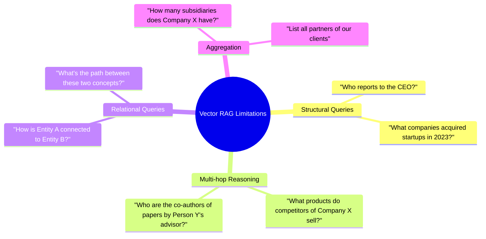
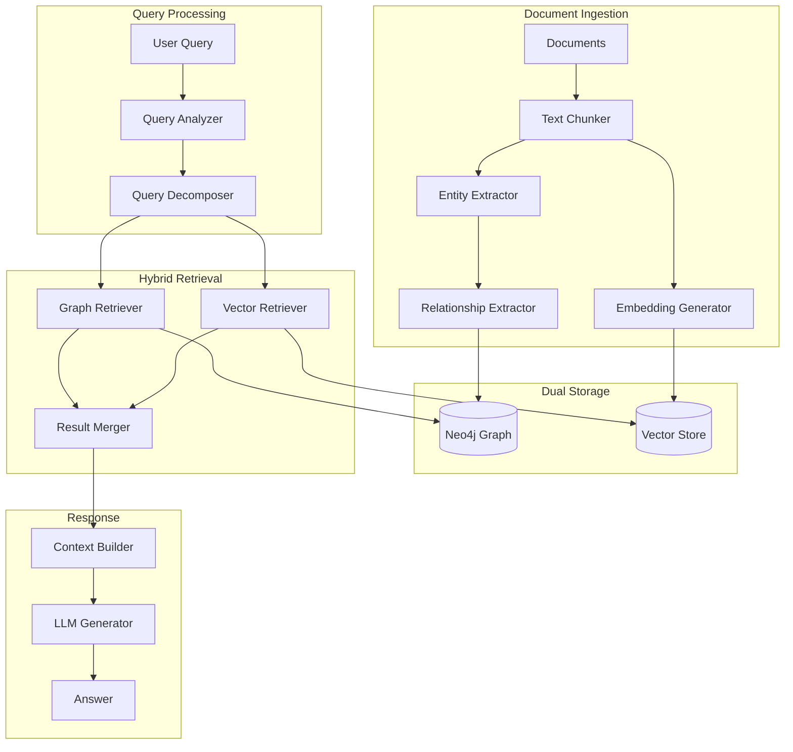
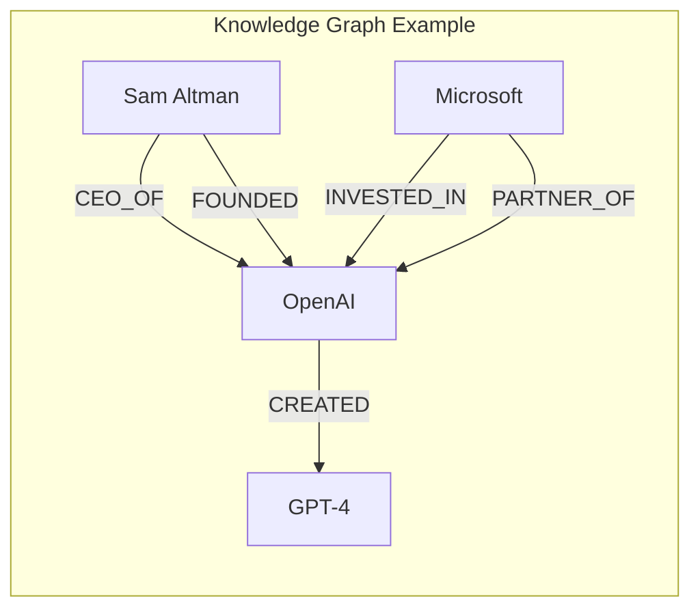
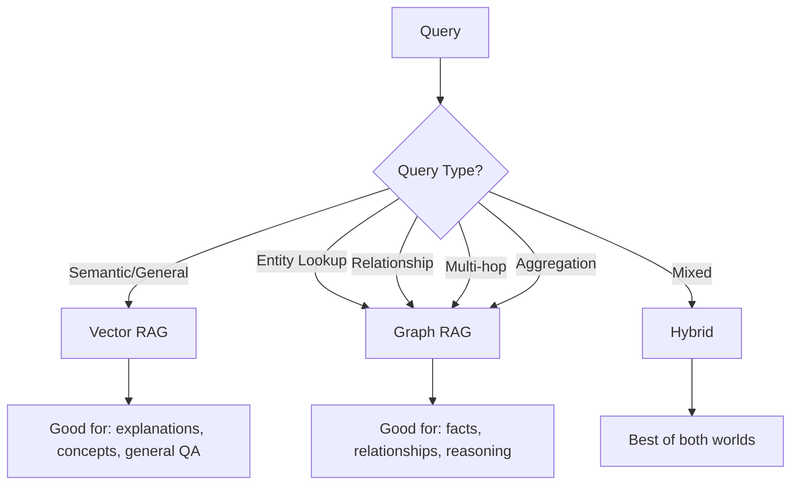

# Graph RAG System

| Property | Value |
|----------|-------|
| **Difficulty** | 🔴 Advanced |
| **Time** | ~4 days |
| **Code Size** | ~900 LOC |
| **Prerequisites** | All intermediate RAG projects |

## Tech Stack

| Technology | Purpose |
|------------|---------|
| LangChain | RAG orchestration |
| OpenAI | GPT-4 for extraction + Embeddings |
| Neo4j | Graph database |
| ChromaDB | Vector storage |
| FastAPI | REST API |
| Pydantic | Data validation |

## Prerequisites

- Completed all intermediate RAG projects
- Python 3.10+ with async/await expertise
- OpenAI API key ([Get one here](https://platform.openai.com))
- Neo4j installed locally or Neo4j Aura account ([Get started](https://neo4j.com/cloud/aura/))
- Basic understanding of graph databases and Cypher queries

## What You'll Learn

- Understand why vector-only RAG fails for complex queries
- Extract entities and relationships from text using LLMs
- Build and query knowledge graphs with Neo4j
- Implement hybrid retrieval combining graphs and vectors
- Enable multi-hop reasoning for complex questions
- Design query decomposition for compound queries

---

## Why Graph RAG?

Vector-based RAG excels at semantic similarity but struggles with:



### The Knowledge Gap

| Query Type | Vector RAG | Graph RAG |
|------------|------------|-----------|
| "What is machine learning?" | ✅ Excellent | ✅ Good |
| "Who founded OpenAI?" | ⚠️ If in chunk | ✅ Direct lookup |
| "What companies has Sam Altman founded?" | ❌ Scattered info | ✅ Graph traversal |
| "Who are the investors in companies founded by Sam Altman?" | ❌ Multi-hop fails | ✅ 2-hop query |
| "How is Elon Musk connected to OpenAI?" | ❌ Cannot reason | ✅ Path finding |

### Graph RAG Architecture



---

## Knowledge Graph Fundamentals

A knowledge graph represents information as:

- **Nodes (Entities)**: People, organizations, concepts, events
- **Edges (Relationships)**: Connections between entities with types
- **Properties**: Attributes on nodes and edges



### Entity Types

| Type | Examples | Properties |
|------|----------|------------|
| **Person** | Sam Altman, Elon Musk | name, role, organization |
| **Organization** | OpenAI, Microsoft | name, type, founded_date |
| **Product** | GPT-4, DALL-E | name, release_date, category |
| **Concept** | Machine Learning, AGI | name, description |
| **Event** | Funding Round, Launch | name, date, participants |
| **Location** | San Francisco, Seattle | name, country, coordinates |

### Relationship Types

| Relationship | Description | Example |
|--------------|-------------|---------|
| `WORKS_AT` | Employment | Person → Organization |
| `FOUNDED` | Founded by | Person → Organization |
| `INVESTED_IN` | Investment | Organization → Organization |
| `CREATED` | Created/built | Organization → Product |
| `PARTNERED_WITH` | Partnership | Organization → Organization |
| `LOCATED_IN` | Location | Organization → Location |
| `RELATED_TO` | General relation | Concept → Concept |

---

## Project Structure

```
graph-rag/
├── src/
│   ├── __init__.py
│   ├── config.py
│   ├── extraction/
│   │   ├── __init__.py
│   │   ├── entities.py         # Entity extraction
│   │   ├── relationships.py    # Relationship extraction
│   │   └── schemas.py          # Pydantic models
│   ├── graph/
│   │   ├── __init__.py
│   │   ├── neo4j_client.py     # Neo4j connection
│   │   ├── operations.py       # Graph CRUD operations
│   │   └── queries.py          # Cypher query templates
│   ├── retrieval/
│   │   ├── __init__.py
│   │   ├── graph_retriever.py  # Graph-based retrieval
│   │   ├── vector_retriever.py # Vector-based retrieval
│   │   └── hybrid.py           # Combined retrieval
│   ├── reasoning/
│   │   ├── __init__.py
│   │   ├── query_analyzer.py   # Query type detection
│   │   ├── decomposer.py       # Query decomposition
│   │   └── multi_hop.py        # Multi-hop reasoning
│   ├── pipeline.py             # Main RAG pipeline
│   └── api.py                  # FastAPI application
├── tests/
│   ├── test_extraction.py
│   ├── test_graph.py
│   └── test_retrieval.py
├── data/
│   └── sample_documents/
├── docker-compose.yml
├── .env
├── pyproject.toml
└── README.md
```

---

## Implementation

### Step 1: Project Setup

```bash
mkdir graph-rag && cd graph-rag
uv init
uv venv && source .venv/bin/activate
```

```bash
uv add langchain langchain-openai langchain-chroma langchain-community
uv add chromadb openai tiktoken
uv add neo4j                           # Graph database
uv add fastapi uvicorn
uv add python-dotenv pydantic-settings
uv add instructor                      # Structured extraction
```

```bash title=".env"
# API Keys
OPENAI_API_KEY=sk-your-key-here

# Neo4j Configuration
NEO4J_URI=bolt://localhost:7687
NEO4J_USER=neo4j
NEO4J_PASSWORD=your-password-here

# Vector Store
CHROMA_PERSIST_DIR=./chroma_db

# Models
LLM_MODEL=gpt-4o-mini
EMBEDDING_MODEL=text-embedding-3-small

# Extraction Settings
EXTRACTION_CHUNK_SIZE=2000
MAX_ENTITIES_PER_CHUNK=20
```

### Step 2: Configuration

```python title="src/config.py"
"""Configuration for Graph RAG system."""
from pydantic_settings import BaseSettings
from pydantic import Field
from functools import lru_cache


class Settings(BaseSettings):
    """Application settings."""

    # API Keys
    openai_api_key: str = Field(..., env="OPENAI_API_KEY")

    # Neo4j
    neo4j_uri: str = Field(default="bolt://localhost:7687", env="NEO4J_URI")
    neo4j_user: str = Field(default="neo4j", env="NEO4J_USER")
    neo4j_password: str = Field(..., env="NEO4J_PASSWORD")

    # Vector Store
    chroma_persist_dir: str = Field(default="./chroma_db", env="CHROMA_PERSIST_DIR")

    # Models
    llm_model: str = Field(default="gpt-4o-mini", env="LLM_MODEL")
    embedding_model: str = Field(default="text-embedding-3-small", env="EMBEDDING_MODEL")

    # Extraction
    extraction_chunk_size: int = Field(default=2000, env="EXTRACTION_CHUNK_SIZE")
    max_entities_per_chunk: int = Field(default=20, env="MAX_ENTITIES_PER_CHUNK")

    # Retrieval
    vector_top_k: int = 5
    graph_max_hops: int = 3
    graph_max_results: int = 20

    class Config:
        env_file = ".env"
        env_file_encoding = "utf-8"


@lru_cache
def get_settings() -> Settings:
    return Settings()


settings = get_settings()
```

### Step 3: Entity and Relationship Schemas

```python title="src/extraction/schemas.py"
"""Pydantic schemas for knowledge graph entities and relationships."""
from typing import List, Optional, Literal
from pydantic import BaseModel, Field
from enum import Enum


class EntityType(str, Enum):
    PERSON = "Person"
    ORGANIZATION = "Organization"
    PRODUCT = "Product"
    CONCEPT = "Concept"
    EVENT = "Event"
    LOCATION = "Location"
    TECHNOLOGY = "Technology"
    DATE = "Date"


class RelationshipType(str, Enum):
    # Person relationships
    WORKS_AT = "WORKS_AT"
    FOUNDED = "FOUNDED"
    CEO_OF = "CEO_OF"
    LEADS = "LEADS"
    COLLABORATES_WITH = "COLLABORATES_WITH"

    # Organization relationships
    INVESTED_IN = "INVESTED_IN"
    ACQUIRED = "ACQUIRED"
    PARTNERED_WITH = "PARTNERED_WITH"
    SUBSIDIARY_OF = "SUBSIDIARY_OF"
    COMPETES_WITH = "COMPETES_WITH"

    # Product relationships
    CREATED = "CREATED"
    USES = "USES"
    BASED_ON = "BASED_ON"
    SUCCEEDED_BY = "SUCCEEDED_BY"

    # General relationships
    LOCATED_IN = "LOCATED_IN"
    RELATED_TO = "RELATED_TO"
    PART_OF = "PART_OF"
    OCCURRED_AT = "OCCURRED_AT"


class Entity(BaseModel):
    """A single entity extracted from text."""

    name: str = Field(description="The canonical name of the entity")
    type: EntityType = Field(description="The type/category of the entity")
    description: Optional[str] = Field(
        default=None,
        description="Brief description of the entity based on context"
    )
    properties: dict = Field(
        default_factory=dict,
        description="Additional properties like dates, roles, etc."
    )

    def to_neo4j_properties(self) -> dict:
        """Convert to Neo4j node properties."""
        props = {
            "name": self.name,
            "type": self.type.value,
            "description": self.description or "",
        }
        props.update(self.properties)
        return props


class Relationship(BaseModel):
    """A relationship between two entities."""

    source: str = Field(description="Name of the source entity")
    target: str = Field(description="Name of the target entity")
    type: RelationshipType = Field(description="The type of relationship")
    properties: dict = Field(
        default_factory=dict,
        description="Additional properties like dates, context, etc."
    )

    def to_neo4j_properties(self) -> dict:
        """Convert to Neo4j relationship properties."""
        return self.properties


class ExtractionResult(BaseModel):
    """Complete extraction result from a text chunk."""

    entities: List[Entity] = Field(default_factory=list)
    relationships: List[Relationship] = Field(default_factory=list)
    source_chunk: Optional[str] = Field(default=None)


class GraphContext(BaseModel):
    """Context retrieved from the knowledge graph."""

    entities: List[Entity] = Field(default_factory=list)
    relationships: List[Relationship] = Field(default_factory=list)
    paths: List[str] = Field(default_factory=list)
    subgraph_description: Optional[str] = Field(default=None)
```

### Step 4: Entity Extraction

```python title="src/extraction/entities.py"
"""Entity extraction using LLMs with structured output."""
from typing import List
import instructor
from openai import OpenAI
from pydantic import BaseModel, Field

from src.config import settings
from src.extraction.schemas import Entity, EntityType


class EntityList(BaseModel):
    """List of entities extracted from text."""

    entities: List[Entity] = Field(
        description="List of entities found in the text"
    )


class EntityExtractor:
    """Extract entities from text using structured LLM output.

    Uses the instructor library for reliable structured extraction
    with automatic retries and validation.
    """

    def __init__(self):
        self.client = instructor.from_openai(
            OpenAI(api_key=settings.openai_api_key)
        )
        self.model = settings.llm_model

        self.system_prompt = """You are an expert entity extractor. Extract all significant entities from the text.

Entity Types to extract:
- Person: Named individuals (executives, researchers, founders)
- Organization: Companies, institutions, teams, governments
- Product: Software, hardware, services, models (e.g., GPT-4, iPhone)
- Technology: Technical concepts, frameworks, methods
- Concept: Abstract ideas, fields of study
- Event: Named events, launches, announcements
- Location: Cities, countries, regions
- Date: Specific dates or time periods

Guidelines:
1. Extract the canonical/full name of each entity
2. Provide a brief description based on context
3. Include relevant properties (dates, roles, etc.)
4. Avoid duplicates - use consistent naming
5. Focus on significant entities mentioned, not every noun
6. Maximum {max_entities} entities per extraction"""

    def extract(self, text: str) -> List[Entity]:
        """Extract entities from a text chunk.

        Args:
            text: The text to extract entities from

        Returns:
            List of extracted entities
        """
        try:
            result = self.client.chat.completions.create(
                model=self.model,
                response_model=EntityList,
                messages=[
                    {
                        "role": "system",
                        "content": self.system_prompt.format(
                            max_entities=settings.max_entities_per_chunk
                        ),
                    },
                    {
                        "role": "user",
                        "content": f"Extract entities from this text:\n\n{text}",
                    },
                ],
                max_retries=2,
            )
            return result.entities

        except Exception as e:
            print(f"Entity extraction failed: {e}")
            return []

    def extract_batch(self, texts: List[str]) -> List[List[Entity]]:
        """Extract entities from multiple text chunks."""
        return [self.extract(text) for text in texts]
```

### Step 5: Relationship Extraction

```python title="src/extraction/relationships.py"
"""Relationship extraction between entities."""
from typing import List
import instructor
from openai import OpenAI
from pydantic import BaseModel, Field

from src.config import settings
from src.extraction.schemas import Entity, Relationship, RelationshipType


class RelationshipList(BaseModel):
    """List of relationships extracted from text."""

    relationships: List[Relationship] = Field(
        description="List of relationships between entities"
    )


class RelationshipExtractor:
    """Extract relationships between entities.

    Given a list of entities and source text, identifies
    relationships and their types.
    """

    def __init__(self):
        self.client = instructor.from_openai(
            OpenAI(api_key=settings.openai_api_key)
        )
        self.model = settings.llm_model

        self.system_prompt = """You are an expert at identifying relationships between entities.

Given entities and source text, extract relationships between them.

Relationship Types:
- WORKS_AT: Person works at Organization
- FOUNDED: Person founded Organization
- CEO_OF: Person is CEO of Organization
- LEADS: Person leads team/project
- INVESTED_IN: Organization invested in Organization
- ACQUIRED: Organization acquired Organization
- PARTNERED_WITH: Organization partnered with Organization
- CREATED: Organization/Person created Product
- USES: Entity uses Technology/Product
- BASED_ON: Product/Technology based on another
- LOCATED_IN: Entity located in Location
- RELATED_TO: General relationship
- PART_OF: Entity is part of another
- COMPETES_WITH: Organizations compete
- SUBSIDIARY_OF: Organization is subsidiary of another

Guidelines:
1. Only extract relationships explicitly stated or strongly implied
2. Use exact entity names as provided
3. Choose the most specific relationship type
4. Include date/context in properties when available
5. Relationships are directional: source → target"""

    def extract(
        self,
        text: str,
        entities: List[Entity],
    ) -> List[Relationship]:
        """Extract relationships given entities and source text.

        Args:
            text: Source text
            entities: List of entities found in the text

        Returns:
            List of relationships between entities
        """
        if len(entities) < 2:
            return []

        entity_list = "\n".join(
            f"- {e.name} ({e.type.value})" for e in entities
        )

        try:
            result = self.client.chat.completions.create(
                model=self.model,
                response_model=RelationshipList,
                messages=[
                    {"role": "system", "content": self.system_prompt},
                    {
                        "role": "user",
                        "content": f"""Entities found:
{entity_list}

Source text:
{text}

Extract all relationships between these entities:""",
                    },
                ],
                max_retries=2,
            )
            return result.relationships

        except Exception as e:
            print(f"Relationship extraction failed: {e}")
            return []

    def extract_with_entities(
        self,
        text: str,
        entity_extractor,
    ) -> tuple[List[Entity], List[Relationship]]:
        """Extract both entities and relationships from text."""
        entities = entity_extractor.extract(text)
        relationships = self.extract(text, entities)
        return entities, relationships
```

### Step 6: Neo4j Client

```python title="src/graph/neo4j_client.py"
"""Neo4j database client for knowledge graph operations."""
from typing import List, Dict, Any, Optional
from contextlib import contextmanager

from neo4j import GraphDatabase, Driver
from neo4j.exceptions import ServiceUnavailable

from src.config import settings


class Neo4jClient:
    """Client for Neo4j graph database operations.

    Handles connection management, CRUD operations,
    and query execution.
    """

    def __init__(self):
        self._driver: Optional[Driver] = None

    def connect(self) -> None:
        """Establish connection to Neo4j."""
        if self._driver is None:
            self._driver = GraphDatabase.driver(
                settings.neo4j_uri,
                auth=(settings.neo4j_user, settings.neo4j_password),
            )
            # Verify connection
            self._driver.verify_connectivity()

    def close(self) -> None:
        """Close the database connection."""
        if self._driver:
            self._driver.close()
            self._driver = None

    @contextmanager
    def session(self):
        """Context manager for database sessions."""
        self.connect()
        session = self._driver.session()
        try:
            yield session
        finally:
            session.close()

    def execute_query(
        self,
        query: str,
        parameters: Dict[str, Any] = None,
    ) -> List[Dict[str, Any]]:
        """Execute a Cypher query and return results."""
        with self.session() as session:
            result = session.run(query, parameters or {})
            return [record.data() for record in result]

    def execute_write(
        self,
        query: str,
        parameters: Dict[str, Any] = None,
    ) -> None:
        """Execute a write query."""
        with self.session() as session:
            session.run(query, parameters or {})

    def create_indexes(self) -> None:
        """Create indexes for better query performance."""
        indexes = [
            "CREATE INDEX entity_name IF NOT EXISTS FOR (n:Entity) ON (n.name)",
            "CREATE INDEX entity_type IF NOT EXISTS FOR (n:Entity) ON (n.type)",
            "CREATE FULLTEXT INDEX entity_search IF NOT EXISTS FOR (n:Entity) ON EACH [n.name, n.description]",
        ]
        for index_query in indexes:
            try:
                self.execute_write(index_query)
            except Exception as e:
                print(f"Index creation warning: {e}")

    def clear_database(self) -> None:
        """Clear all nodes and relationships. Use with caution!"""
        self.execute_write("MATCH (n) DETACH DELETE n")


# Singleton instance
neo4j_client = Neo4jClient()
```

### Step 7: Graph Operations

```python title="src/graph/operations.py"
"""Knowledge graph CRUD operations."""
from typing import List, Dict, Any, Optional

from src.graph.neo4j_client import neo4j_client
from src.extraction.schemas import Entity, Relationship, EntityType


class GraphOperations:
    """High-level operations for the knowledge graph."""

    def __init__(self):
        self.client = neo4j_client

    def add_entity(self, entity: Entity) -> None:
        """Add or merge an entity into the graph."""
        query = """
        MERGE (e:Entity {name: $name})
        SET e += $properties
        SET e.type = $type
        SET e.description = $description
        """
        self.client.execute_write(query, {
            "name": entity.name,
            "type": entity.type.value,
            "description": entity.description or "",
            "properties": entity.properties,
        })

    def add_entities(self, entities: List[Entity]) -> None:
        """Add multiple entities efficiently."""
        for entity in entities:
            self.add_entity(entity)

    def add_relationship(self, relationship: Relationship) -> None:
        """Add a relationship between two entities."""
        # First ensure both entities exist
        query = f"""
        MATCH (source:Entity {{name: $source_name}})
        MATCH (target:Entity {{name: $target_name}})
        MERGE (source)-[r:{relationship.type.value}]->(target)
        SET r += $properties
        """
        self.client.execute_write(query, {
            "source_name": relationship.source,
            "target_name": relationship.target,
            "properties": relationship.properties,
        })

    def add_relationships(self, relationships: List[Relationship]) -> None:
        """Add multiple relationships."""
        for rel in relationships:
            try:
                self.add_relationship(rel)
            except Exception as e:
                print(f"Failed to add relationship {rel}: {e}")

    def get_entity(self, name: str) -> Optional[Dict[str, Any]]:
        """Get an entity by name."""
        query = """
        MATCH (e:Entity {name: $name})
        RETURN e
        """
        results = self.client.execute_query(query, {"name": name})
        if results:
            return results[0]["e"]
        return None

    def search_entities(
        self,
        search_term: str,
        entity_type: Optional[EntityType] = None,
        limit: int = 10,
    ) -> List[Dict[str, Any]]:
        """Search for entities by name or description."""
        if entity_type:
            query = """
            CALL db.index.fulltext.queryNodes('entity_search', $search)
            YIELD node, score
            WHERE node.type = $type
            RETURN node, score
            ORDER BY score DESC
            LIMIT $limit
            """
            params = {
                "search": search_term,
                "type": entity_type.value,
                "limit": limit,
            }
        else:
            query = """
            CALL db.index.fulltext.queryNodes('entity_search', $search)
            YIELD node, score
            RETURN node, score
            ORDER BY score DESC
            LIMIT $limit
            """
            params = {"search": search_term, "limit": limit}

        return self.client.execute_query(query, params)

    def get_neighbors(
        self,
        entity_name: str,
        relationship_types: Optional[List[str]] = None,
        direction: str = "both",
        limit: int = 20,
    ) -> List[Dict[str, Any]]:
        """Get neighboring entities connected to a given entity."""
        rel_filter = ""
        if relationship_types:
            rel_types = "|".join(relationship_types)
            rel_filter = f":{rel_types}"

        if direction == "outgoing":
            pattern = f"-[r{rel_filter}]->"
        elif direction == "incoming":
            pattern = f"<-[r{rel_filter}]-"
        else:
            pattern = f"-[r{rel_filter}]-"

        query = f"""
        MATCH (e:Entity {{name: $name}}){pattern}(neighbor:Entity)
        RETURN neighbor, type(r) as relationship, r as rel_properties
        LIMIT $limit
        """
        return self.client.execute_query(query, {
            "name": entity_name,
            "limit": limit,
        })

    def find_path(
        self,
        source_name: str,
        target_name: str,
        max_hops: int = 3,
    ) -> List[Dict[str, Any]]:
        """Find shortest path between two entities."""
        query = """
        MATCH path = shortestPath(
            (source:Entity {name: $source})-[*1..$max_hops]-(target:Entity {name: $target})
        )
        RETURN path,
               [node in nodes(path) | node.name] as node_names,
               [rel in relationships(path) | type(rel)] as rel_types,
               length(path) as path_length
        """
        return self.client.execute_query(query, {
            "source": source_name,
            "target": target_name,
            "max_hops": max_hops,
        })

    def get_subgraph(
        self,
        entity_names: List[str],
        max_hops: int = 1,
    ) -> Dict[str, Any]:
        """Get a subgraph centered on multiple entities."""
        query = """
        MATCH (e:Entity)
        WHERE e.name IN $names
        CALL {
            WITH e
            MATCH path = (e)-[*1..$max_hops]-(connected:Entity)
            RETURN connected, relationships(path) as rels
        }
        WITH collect(DISTINCT e) + collect(DISTINCT connected) as all_nodes,
             collect(DISTINCT rels) as all_rels
        UNWIND all_nodes as node
        WITH collect(DISTINCT node) as nodes, all_rels
        UNWIND all_rels as rel_list
        UNWIND rel_list as rel
        RETURN nodes,
               collect(DISTINCT rel) as relationships
        """
        results = self.client.execute_query(query, {
            "names": entity_names,
            "max_hops": max_hops,
        })
        if results:
            return results[0]
        return {"nodes": [], "relationships": []}

    def get_entity_context(
        self,
        entity_name: str,
        max_hops: int = 2,
    ) -> str:
        """Get a natural language description of an entity's context."""
        # Get the entity
        entity = self.get_entity(entity_name)
        if not entity:
            return f"No information found about {entity_name}"

        # Get neighbors
        neighbors = self.get_neighbors(entity_name, limit=10)

        # Build description
        lines = [f"{entity_name} ({entity.get('type', 'Entity')}):"]

        if entity.get("description"):
            lines.append(f"  {entity['description']}")

        for neighbor in neighbors:
            rel_type = neighbor["relationship"].replace("_", " ").lower()
            neighbor_name = neighbor["neighbor"]["name"]
            lines.append(f"  - {rel_type}: {neighbor_name}")

        return "\n".join(lines)


# Singleton instance
graph_ops = GraphOperations()
```

### Step 8: Graph Retriever

```python title="src/retrieval/graph_retriever.py"
"""Graph-based retrieval for knowledge graph queries."""
from typing import List, Dict, Any, Optional
from dataclasses import dataclass

from src.graph.operations import graph_ops
from src.extraction.schemas import EntityType


@dataclass
class GraphRetrievalResult:
    """Result from graph retrieval."""
    entities: List[Dict[str, Any]]
    relationships: List[Dict[str, Any]]
    paths: List[str]
    context_text: str
    confidence: float


class GraphRetriever:
    """Retriever that queries the knowledge graph.

    Supports multiple retrieval strategies:
    - Entity lookup: Direct entity search
    - Neighbor expansion: Get related entities
    - Path finding: Find connections between entities
    - Subgraph extraction: Get context around entities
    """

    def __init__(self, max_hops: int = 2, max_results: int = 20):
        self.max_hops = max_hops
        self.max_results = max_results

    def retrieve_by_entities(
        self,
        entity_names: List[str],
    ) -> GraphRetrievalResult:
        """Retrieve context for specified entities."""
        all_entities = []
        all_relationships = []
        context_parts = []

        for name in entity_names[:5]:  # Limit to 5 entities
            # Get entity and its context
            context = graph_ops.get_entity_context(name, self.max_hops)
            context_parts.append(context)

            # Get neighbors
            neighbors = graph_ops.get_neighbors(
                name,
                limit=self.max_results // len(entity_names),
            )

            entity = graph_ops.get_entity(name)
            if entity:
                all_entities.append(entity)

            for neighbor in neighbors:
                all_entities.append(neighbor["neighbor"])
                all_relationships.append({
                    "source": name,
                    "target": neighbor["neighbor"]["name"],
                    "type": neighbor["relationship"],
                })

        return GraphRetrievalResult(
            entities=all_entities,
            relationships=all_relationships,
            paths=[],
            context_text="\n\n".join(context_parts),
            confidence=0.8 if all_entities else 0.0,
        )

    def retrieve_by_search(
        self,
        query: str,
        entity_type: Optional[EntityType] = None,
    ) -> GraphRetrievalResult:
        """Search for entities matching the query."""
        results = graph_ops.search_entities(
            query,
            entity_type=entity_type,
            limit=self.max_results,
        )

        entities = [r["node"] for r in results]
        entity_names = [e["name"] for e in entities]

        # Expand to get relationships
        if entity_names:
            return self.retrieve_by_entities(entity_names[:3])

        return GraphRetrievalResult(
            entities=[],
            relationships=[],
            paths=[],
            context_text="No relevant entities found in knowledge graph.",
            confidence=0.0,
        )

    def find_connection(
        self,
        source: str,
        target: str,
    ) -> GraphRetrievalResult:
        """Find how two entities are connected."""
        paths = graph_ops.find_path(source, target, self.max_hops)

        path_descriptions = []
        all_entities = []
        all_relationships = []

        for path_result in paths:
            node_names = path_result.get("node_names", [])
            rel_types = path_result.get("rel_types", [])

            # Build path description
            path_parts = []
            for i, name in enumerate(node_names):
                path_parts.append(name)
                if i < len(rel_types):
                    path_parts.append(f"-[{rel_types[i]}]->")

            path_descriptions.append(" ".join(path_parts))

        # Get context for source and target
        source_context = graph_ops.get_entity_context(source)
        target_context = graph_ops.get_entity_context(target)

        context_text = f"""Connection between {source} and {target}:

Paths found:
{chr(10).join(path_descriptions) if path_descriptions else "No direct path found"}

{source_context}

{target_context}
"""

        return GraphRetrievalResult(
            entities=all_entities,
            relationships=all_relationships,
            paths=path_descriptions,
            context_text=context_text,
            confidence=0.9 if path_descriptions else 0.3,
        )

    def get_entity_info(self, entity_name: str) -> GraphRetrievalResult:
        """Get comprehensive information about an entity."""
        context = graph_ops.get_entity_context(entity_name, self.max_hops)
        entity = graph_ops.get_entity(entity_name)
        neighbors = graph_ops.get_neighbors(entity_name, limit=self.max_results)

        entities = [entity] if entity else []
        entities.extend([n["neighbor"] for n in neighbors])

        relationships = [
            {
                "source": entity_name,
                "target": n["neighbor"]["name"],
                "type": n["relationship"],
            }
            for n in neighbors
        ]

        return GraphRetrievalResult(
            entities=entities,
            relationships=relationships,
            paths=[],
            context_text=context,
            confidence=0.9 if entity else 0.0,
        )
```

### Step 9: Hybrid Retriever

```python title="src/retrieval/hybrid.py"
"""Hybrid retrieval combining graph and vector search."""
from typing import List, Dict, Any, Optional
from dataclasses import dataclass

from langchain_openai import OpenAIEmbeddings
from langchain_chroma import Chroma

from src.config import settings
from src.retrieval.graph_retriever import GraphRetriever, GraphRetrievalResult


@dataclass
class HybridRetrievalResult:
    """Combined result from graph and vector retrieval."""
    graph_context: str
    vector_context: str
    combined_context: str
    graph_confidence: float
    vector_confidence: float
    entities_found: List[str]


class HybridRetriever:
    """Combines graph traversal with vector similarity search.

    Strategy:
    1. Extract potential entities from query
    2. Search knowledge graph for entity context
    3. Search vector store for semantic matches
    4. Merge results with appropriate weighting
    """

    def __init__(self):
        self.graph_retriever = GraphRetriever(
            max_hops=settings.graph_max_hops,
            max_results=settings.graph_max_results,
        )

        self.embeddings = OpenAIEmbeddings(
            model=settings.embedding_model,
            openai_api_key=settings.openai_api_key,
        )

        self.vectorstore = Chroma(
            persist_directory=settings.chroma_persist_dir,
            embedding_function=self.embeddings,
        )

    def retrieve(
        self,
        query: str,
        entities: Optional[List[str]] = None,
        graph_weight: float = 0.5,
    ) -> HybridRetrievalResult:
        """Perform hybrid retrieval.

        Args:
            query: The user's question
            entities: Pre-extracted entities (optional)
            graph_weight: Weight for graph vs vector (0-1)

        Returns:
            Combined retrieval result
        """
        # Graph retrieval
        if entities:
            graph_result = self.graph_retriever.retrieve_by_entities(entities)
        else:
            graph_result = self.graph_retriever.retrieve_by_search(query)

        # Vector retrieval
        vector_docs = self.vectorstore.similarity_search_with_score(
            query,
            k=settings.vector_top_k,
        )

        vector_context = "\n\n".join([
            f"[Source: {doc.metadata.get('source', 'unknown')}]\n{doc.page_content}"
            for doc, score in vector_docs
        ])

        # Calculate vector confidence based on scores
        if vector_docs:
            avg_score = sum(score for _, score in vector_docs) / len(vector_docs)
            # Chroma returns distance, lower is better
            vector_confidence = max(0, 1 - avg_score)
        else:
            vector_confidence = 0.0

        # Combine contexts based on confidence and weight
        combined_context = self._merge_contexts(
            graph_result.context_text,
            vector_context,
            graph_result.confidence,
            vector_confidence,
            graph_weight,
        )

        return HybridRetrievalResult(
            graph_context=graph_result.context_text,
            vector_context=vector_context,
            combined_context=combined_context,
            graph_confidence=graph_result.confidence,
            vector_confidence=vector_confidence,
            entities_found=[e["name"] for e in graph_result.entities],
        )

    def _merge_contexts(
        self,
        graph_context: str,
        vector_context: str,
        graph_confidence: float,
        vector_confidence: float,
        graph_weight: float,
    ) -> str:
        """Merge graph and vector contexts intelligently."""
        # Adjust weight based on confidence
        effective_graph_weight = graph_weight * graph_confidence
        effective_vector_weight = (1 - graph_weight) * vector_confidence

        total_weight = effective_graph_weight + effective_vector_weight

        if total_weight == 0:
            return "No relevant information found."

        parts = []

        if effective_graph_weight > 0.1:
            parts.append("=== Knowledge Graph Context ===")
            parts.append(graph_context)

        if effective_vector_weight > 0.1:
            parts.append("\n=== Document Context ===")
            parts.append(vector_context)

        return "\n".join(parts)

    def retrieve_for_connection_query(
        self,
        source: str,
        target: str,
    ) -> HybridRetrievalResult:
        """Special retrieval for "how is X connected to Y" queries."""
        graph_result = self.graph_retriever.find_connection(source, target)

        # Also get vector context about both entities
        combined_query = f"{source} {target} relationship connection"
        vector_docs = self.vectorstore.similarity_search(
            combined_query,
            k=3,
        )

        vector_context = "\n\n".join([
            doc.page_content for doc in vector_docs
        ])

        combined = f"""=== Knowledge Graph Paths ===
{graph_result.context_text}

=== Related Documents ===
{vector_context}
"""

        return HybridRetrievalResult(
            graph_context=graph_result.context_text,
            vector_context=vector_context,
            combined_context=combined,
            graph_confidence=graph_result.confidence,
            vector_confidence=0.5,
            entities_found=[source, target],
        )
```

### Step 10: Query Analyzer

```python title="src/reasoning/query_analyzer.py"
"""Analyze queries to determine optimal retrieval strategy."""
from typing import List, Optional, Tuple
from enum import Enum
from dataclasses import dataclass

import instructor
from openai import OpenAI
from pydantic import BaseModel, Field

from src.config import settings


class QueryType(str, Enum):
    FACTUAL = "factual"           # Simple fact lookup
    ENTITY_INFO = "entity_info"   # "Tell me about X"
    RELATIONSHIP = "relationship" # "How is X related to Y"
    MULTI_HOP = "multi_hop"      # Requires traversing relationships
    AGGREGATION = "aggregation"  # "List all X" or "How many X"
    COMPARISON = "comparison"    # "Compare X and Y"
    GENERAL = "general"          # General semantic query


class QueryAnalysis(BaseModel):
    """Analysis of a user query."""

    query_type: QueryType = Field(
        description="The type of query"
    )
    entities: List[str] = Field(
        default_factory=list,
        description="Entities mentioned in the query"
    )
    relationships_needed: List[str] = Field(
        default_factory=list,
        description="Types of relationships to explore"
    )
    requires_graph: bool = Field(
        description="Whether graph retrieval is needed"
    )
    requires_vector: bool = Field(
        description="Whether vector retrieval is needed"
    )
    graph_weight: float = Field(
        default=0.5,
        description="Suggested weight for graph vs vector (0-1)"
    )
    sub_queries: List[str] = Field(
        default_factory=list,
        description="Decomposed sub-queries for complex questions"
    )


class QueryAnalyzer:
    """Analyzes queries to determine retrieval strategy.

    Uses LLM to:
    1. Classify query type
    2. Extract mentioned entities
    3. Determine if graph/vector retrieval is needed
    4. Decompose complex queries
    """

    def __init__(self):
        self.client = instructor.from_openai(
            OpenAI(api_key=settings.openai_api_key)
        )
        self.model = settings.llm_model

        self.system_prompt = """You are a query analyzer for a knowledge graph RAG system.

Analyze the user's query and determine:

1. Query Type:
   - factual: Simple fact ("What year was X founded?")
   - entity_info: Information about an entity ("Tell me about OpenAI")
   - relationship: Connection between entities ("How is X related to Y?")
   - multi_hop: Requires following multiple relationships ("What companies has the CEO of X founded?")
   - aggregation: Lists or counts ("List all products by X", "How many employees?")
   - comparison: Comparing entities ("Compare X and Y")
   - general: General semantic query

2. Entities: Extract named entities (people, companies, products, etc.)

3. Graph vs Vector:
   - Graph is better for: relationships, multi-hop, aggregation, entity lookups
   - Vector is better for: general semantic search, factual questions about content

4. Sub-queries: For complex questions, break into simpler sub-questions

Examples:
- "What is machine learning?" → general, vector-heavy
- "Who founded OpenAI?" → entity_info, graph-heavy
- "What products do Microsoft's partners sell?" → multi_hop, graph-only
- "How is Elon Musk connected to OpenAI?" → relationship, graph-heavy
- "Compare GPT-4 and Claude" → comparison, balanced"""

    def analyze(self, query: str) -> QueryAnalysis:
        """Analyze a query and return retrieval strategy."""
        try:
            result = self.client.chat.completions.create(
                model=self.model,
                response_model=QueryAnalysis,
                messages=[
                    {"role": "system", "content": self.system_prompt},
                    {"role": "user", "content": f"Analyze this query: {query}"},
                ],
                max_retries=2,
            )
            return result

        except Exception as e:
            # Fallback to balanced approach
            return QueryAnalysis(
                query_type=QueryType.GENERAL,
                entities=[],
                relationships_needed=[],
                requires_graph=True,
                requires_vector=True,
                graph_weight=0.5,
                sub_queries=[],
            )
```

### Step 11: Multi-hop Reasoning

```python title="src/reasoning/multi_hop.py"
"""Multi-hop reasoning over knowledge graphs."""
from typing import List, Dict, Any, Optional
from dataclasses import dataclass

from langchain_openai import ChatOpenAI
from langchain_core.prompts import ChatPromptTemplate
from langchain_core.output_parsers import StrOutputParser

from src.config import settings
from src.graph.operations import graph_ops
from src.retrieval.graph_retriever import GraphRetriever


@dataclass
class ReasoningStep:
    """A single step in multi-hop reasoning."""
    question: str
    entities_explored: List[str]
    relationships_followed: List[str]
    intermediate_answer: str
    context_gathered: str


@dataclass
class MultiHopResult:
    """Result of multi-hop reasoning."""
    final_answer: str
    reasoning_steps: List[ReasoningStep]
    total_hops: int
    entities_visited: List[str]
    confidence: float


class MultiHopReasoner:
    """Performs multi-hop reasoning over the knowledge graph.

    For complex queries like "What products do competitors of OpenAI sell?":
    1. Find OpenAI
    2. Find competitors of OpenAI
    3. For each competitor, find their products
    4. Aggregate and answer
    """

    def __init__(self):
        self.graph_retriever = GraphRetriever()
        self.llm = ChatOpenAI(
            model=settings.llm_model,
            openai_api_key=settings.openai_api_key,
            temperature=0,
        )

        self.decompose_prompt = ChatPromptTemplate.from_messages([
            ("system", """You are a query decomposition expert.

Break down complex questions into simple, sequential steps that can be answered
by looking up entities and their relationships in a knowledge graph.

Each step should be a simple question that builds on previous answers.

Format: Return numbered steps, each on a new line.

Example:
Query: "What products do competitors of OpenAI sell?"
Steps:
1. What company is OpenAI?
2. Who are the competitors of OpenAI?
3. What products does each competitor sell?"""),
            ("human", "Decompose this query into steps: {query}"),
        ])

        self.synthesize_prompt = ChatPromptTemplate.from_messages([
            ("system", """You are a synthesis expert. Given a multi-hop question
and the intermediate findings from each reasoning step, provide a comprehensive
final answer.

Be specific and cite the entities and relationships discovered."""),
            ("human", """Original question: {question}

Reasoning steps and findings:
{steps}

Provide a comprehensive answer:"""),
        ])

    async def reason(
        self,
        query: str,
        start_entities: List[str],
        max_hops: int = 3,
    ) -> MultiHopResult:
        """Perform multi-hop reasoning.

        Args:
            query: The complex question
            start_entities: Initial entities to start from
            max_hops: Maximum reasoning hops

        Returns:
            Multi-hop reasoning result
        """
        # Decompose the query
        decompose_chain = self.decompose_prompt | self.llm | StrOutputParser()
        decomposition = await decompose_chain.ainvoke({"query": query})

        steps = [s.strip() for s in decomposition.split("\n") if s.strip()]
        steps = [s.lstrip("0123456789.").strip() for s in steps]

        # Execute each step
        reasoning_steps = []
        current_entities = start_entities
        all_visited = set(start_entities)

        for step_query in steps[:max_hops]:
            step_result = await self._execute_step(
                step_query,
                current_entities,
            )
            reasoning_steps.append(step_result)

            # Update current entities for next hop
            current_entities = step_result.entities_explored
            all_visited.update(current_entities)

        # Synthesize final answer
        steps_text = "\n\n".join([
            f"Step {i+1}: {step.question}\n"
            f"Entities: {', '.join(step.entities_explored)}\n"
            f"Finding: {step.intermediate_answer}"
            for i, step in enumerate(reasoning_steps)
        ])

        synthesize_chain = self.synthesize_prompt | self.llm | StrOutputParser()
        final_answer = await synthesize_chain.ainvoke({
            "question": query,
            "steps": steps_text,
        })

        return MultiHopResult(
            final_answer=final_answer,
            reasoning_steps=reasoning_steps,
            total_hops=len(reasoning_steps),
            entities_visited=list(all_visited),
            confidence=0.8 if reasoning_steps else 0.2,
        )

    async def _execute_step(
        self,
        step_query: str,
        current_entities: List[str],
    ) -> ReasoningStep:
        """Execute a single reasoning step."""
        # Get context for current entities
        context_parts = []
        new_entities = []
        relationships = []

        for entity in current_entities[:5]:
            # Get neighbors
            neighbors = graph_ops.get_neighbors(entity, limit=10)

            for neighbor in neighbors:
                new_entities.append(neighbor["neighbor"]["name"])
                relationships.append(neighbor["relationship"])
                context_parts.append(
                    f"{entity} -[{neighbor['relationship']}]-> {neighbor['neighbor']['name']}"
                )

            # Get entity context
            entity_context = graph_ops.get_entity_context(entity)
            context_parts.append(entity_context)

        context = "\n".join(context_parts)

        # Generate intermediate answer
        answer_prompt = ChatPromptTemplate.from_messages([
            ("system", "Answer the question based on the knowledge graph context."),
            ("human", "Context:\n{context}\n\nQuestion: {question}"),
        ])

        chain = answer_prompt | self.llm | StrOutputParser()
        intermediate_answer = await chain.ainvoke({
            "context": context,
            "question": step_query,
        })

        return ReasoningStep(
            question=step_query,
            entities_explored=list(set(new_entities))[:10],
            relationships_followed=list(set(relationships)),
            intermediate_answer=intermediate_answer,
            context_gathered=context[:1000],
        )
```

### Step 12: Main Pipeline

```python title="src/pipeline.py"
"""Main Graph RAG pipeline."""
from typing import List, Dict, Any, Optional
from dataclasses import dataclass
import asyncio

from langchain_openai import ChatOpenAI
from langchain_core.prompts import ChatPromptTemplate
from langchain_core.output_parsers import StrOutputParser
from langchain.text_splitter import RecursiveCharacterTextSplitter

from src.config import settings
from src.extraction.entities import EntityExtractor
from src.extraction.relationships import RelationshipExtractor
from src.extraction.schemas import Entity, Relationship
from src.graph.operations import graph_ops
from src.graph.neo4j_client import neo4j_client
from src.retrieval.hybrid import HybridRetriever
from src.reasoning.query_analyzer import QueryAnalyzer, QueryType
from src.reasoning.multi_hop import MultiHopReasoner


@dataclass
class GraphRAGResponse:
    """Complete response from Graph RAG."""
    answer: str
    query: str
    query_type: str
    entities_used: List[str]
    reasoning_steps: Optional[List[str]] = None
    graph_context: Optional[str] = None
    vector_context: Optional[str] = None
    confidence: float = 0.0


class GraphRAGPipeline:
    """Complete Graph RAG pipeline.

    Workflow:
    1. Analyze query to determine type and strategy
    2. Extract entities from query
    3. Perform hybrid retrieval (graph + vector)
    4. For multi-hop queries, perform iterative reasoning
    5. Generate answer with combined context
    """

    def __init__(self):
        # Extractors
        self.entity_extractor = EntityExtractor()
        self.relationship_extractor = RelationshipExtractor()

        # Retrieval
        self.hybrid_retriever = HybridRetriever()
        self.query_analyzer = QueryAnalyzer()
        self.multi_hop_reasoner = MultiHopReasoner()

        # Generation
        self.llm = ChatOpenAI(
            model=settings.llm_model,
            openai_api_key=settings.openai_api_key,
            temperature=0.1,
        )

        self.qa_prompt = ChatPromptTemplate.from_messages([
            ("system", """You are a helpful assistant that answers questions using
knowledge graph and document context.

Guidelines:
- Use the graph context for entity relationships and facts
- Use document context for detailed explanations
- Cite specific relationships and sources when possible
- If information is conflicting, prefer the knowledge graph
- If you don't have enough information, say so clearly"""),
            ("human", """Context:
{context}

Question: {question}

Answer:"""),
        ])

        # Text splitter for ingestion
        self.text_splitter = RecursiveCharacterTextSplitter(
            chunk_size=settings.extraction_chunk_size,
            chunk_overlap=200,
        )

    async def ingest_document(
        self,
        text: str,
        source: str = "unknown",
    ) -> Dict[str, int]:
        """Ingest a document into both graph and vector stores.

        Args:
            text: Document text
            source: Source identifier

        Returns:
            Statistics about ingestion
        """
        # Split into chunks
        chunks = self.text_splitter.split_text(text)

        total_entities = 0
        total_relationships = 0

        for i, chunk in enumerate(chunks):
            # Extract entities
            entities = self.entity_extractor.extract(chunk)
            total_entities += len(entities)

            # Add to graph
            graph_ops.add_entities(entities)

            # Extract and add relationships
            relationships = self.relationship_extractor.extract(chunk, entities)
            graph_ops.add_relationships(relationships)
            total_relationships += len(relationships)

            # Add to vector store
            self.hybrid_retriever.vectorstore.add_texts(
                texts=[chunk],
                metadatas=[{"source": source, "chunk_index": i}],
            )

        return {
            "chunks_processed": len(chunks),
            "entities_extracted": total_entities,
            "relationships_extracted": total_relationships,
        }

    async def query(self, query: str) -> GraphRAGResponse:
        """Process a query through the Graph RAG pipeline."""
        # Analyze query
        analysis = self.query_analyzer.analyze(query)

        # Route based on query type
        if analysis.query_type == QueryType.MULTI_HOP and analysis.entities:
            return await self._handle_multi_hop(query, analysis)

        elif analysis.query_type == QueryType.RELATIONSHIP and len(analysis.entities) >= 2:
            return await self._handle_relationship(query, analysis)

        else:
            return await self._handle_standard(query, analysis)

    async def _handle_standard(
        self,
        query: str,
        analysis,
    ) -> GraphRAGResponse:
        """Handle standard queries with hybrid retrieval."""
        # Perform hybrid retrieval
        retrieval = self.hybrid_retriever.retrieve(
            query,
            entities=analysis.entities,
            graph_weight=analysis.graph_weight,
        )

        # Generate answer
        chain = self.qa_prompt | self.llm | StrOutputParser()
        answer = await chain.ainvoke({
            "context": retrieval.combined_context,
            "question": query,
        })

        return GraphRAGResponse(
            answer=answer,
            query=query,
            query_type=analysis.query_type.value,
            entities_used=retrieval.entities_found,
            graph_context=retrieval.graph_context,
            vector_context=retrieval.vector_context,
            confidence=(retrieval.graph_confidence + retrieval.vector_confidence) / 2,
        )

    async def _handle_relationship(
        self,
        query: str,
        analysis,
    ) -> GraphRAGResponse:
        """Handle relationship queries (How is X related to Y?)."""
        source = analysis.entities[0]
        target = analysis.entities[1]

        retrieval = self.hybrid_retriever.retrieve_for_connection_query(
            source,
            target,
        )

        chain = self.qa_prompt | self.llm | StrOutputParser()
        answer = await chain.ainvoke({
            "context": retrieval.combined_context,
            "question": query,
        })

        return GraphRAGResponse(
            answer=answer,
            query=query,
            query_type="relationship",
            entities_used=[source, target],
            graph_context=retrieval.graph_context,
            vector_context=retrieval.vector_context,
            confidence=retrieval.graph_confidence,
        )

    async def _handle_multi_hop(
        self,
        query: str,
        analysis,
    ) -> GraphRAGResponse:
        """Handle multi-hop reasoning queries."""
        result = await self.multi_hop_reasoner.reason(
            query,
            start_entities=analysis.entities,
            max_hops=settings.graph_max_hops,
        )

        reasoning_descriptions = [
            f"Step {i+1}: {step.question} → {step.intermediate_answer[:100]}..."
            for i, step in enumerate(result.reasoning_steps)
        ]

        return GraphRAGResponse(
            answer=result.final_answer,
            query=query,
            query_type="multi_hop",
            entities_used=result.entities_visited,
            reasoning_steps=reasoning_descriptions,
            confidence=result.confidence,
        )

    def initialize(self) -> None:
        """Initialize the pipeline (create indexes, etc.)."""
        neo4j_client.connect()
        neo4j_client.create_indexes()

    def close(self) -> None:
        """Clean up resources."""
        neo4j_client.close()
```

### Step 13: FastAPI Application

```python title="src/api.py"
"""FastAPI application for Graph RAG."""
from typing import Optional, List
from contextlib import asynccontextmanager

from fastapi import FastAPI, HTTPException, UploadFile, File
from fastapi.middleware.cors import CORSMiddleware
from pydantic import BaseModel

from src.pipeline import GraphRAGPipeline
from src.graph.neo4j_client import neo4j_client
from src.graph.operations import graph_ops


# Global pipeline
pipeline: Optional[GraphRAGPipeline] = None


@asynccontextmanager
async def lifespan(app: FastAPI):
    """Initialize resources on startup."""
    global pipeline
    pipeline = GraphRAGPipeline()
    pipeline.initialize()
    yield
    pipeline.close()


app = FastAPI(
    title="Graph RAG API",
    description="Knowledge graph-enhanced RAG for complex queries",
    version="1.0.0",
    lifespan=lifespan,
)

app.add_middleware(
    CORSMiddleware,
    allow_origins=["*"],
    allow_credentials=True,
    allow_methods=["*"],
    allow_headers=["*"],
)


# Request/Response Models
class QueryRequest(BaseModel):
    query: str


class QueryResponse(BaseModel):
    answer: str
    query: str
    query_type: str
    entities_used: List[str]
    reasoning_steps: Optional[List[str]] = None
    confidence: float


class IngestRequest(BaseModel):
    text: str
    source: str = "manual_input"


class IngestResponse(BaseModel):
    chunks_processed: int
    entities_extracted: int
    relationships_extracted: int


class EntityInfo(BaseModel):
    name: str
    type: str
    description: Optional[str] = None


class GraphStatsResponse(BaseModel):
    total_entities: int
    total_relationships: int
    entity_types: dict


# Endpoints
@app.get("/")
async def health():
    """Health check."""
    return {"status": "healthy", "service": "Graph RAG"}


@app.post("/query", response_model=QueryResponse)
async def query(request: QueryRequest):
    """Process a query."""
    try:
        result = await pipeline.query(request.query)
        return QueryResponse(
            answer=result.answer,
            query=result.query,
            query_type=result.query_type,
            entities_used=result.entities_used,
            reasoning_steps=result.reasoning_steps,
            confidence=result.confidence,
        )
    except Exception as e:
        raise HTTPException(status_code=500, detail=str(e))


@app.post("/ingest", response_model=IngestResponse)
async def ingest(request: IngestRequest):
    """Ingest text into the knowledge graph."""
    try:
        result = await pipeline.ingest_document(
            request.text,
            source=request.source,
        )
        return IngestResponse(**result)
    except Exception as e:
        raise HTTPException(status_code=500, detail=str(e))


@app.post("/ingest/file")
async def ingest_file(file: UploadFile = File(...)):
    """Ingest a text file."""
    try:
        content = await file.read()
        text = content.decode("utf-8")
        result = await pipeline.ingest_document(text, source=file.filename)
        return IngestResponse(**result)
    except Exception as e:
        raise HTTPException(status_code=500, detail=str(e))


@app.get("/entity/{name}", response_model=EntityInfo)
async def get_entity(name: str):
    """Get information about an entity."""
    entity = graph_ops.get_entity(name)
    if not entity:
        raise HTTPException(status_code=404, detail=f"Entity '{name}' not found")

    return EntityInfo(
        name=entity["name"],
        type=entity.get("type", "Unknown"),
        description=entity.get("description"),
    )


@app.get("/entity/{name}/neighbors")
async def get_entity_neighbors(name: str, limit: int = 10):
    """Get neighbors of an entity."""
    neighbors = graph_ops.get_neighbors(name, limit=limit)
    return {
        "entity": name,
        "neighbors": [
            {
                "name": n["neighbor"]["name"],
                "type": n["neighbor"].get("type"),
                "relationship": n["relationship"],
            }
            for n in neighbors
        ],
    }


@app.get("/path")
async def find_path(source: str, target: str, max_hops: int = 3):
    """Find path between two entities."""
    paths = graph_ops.find_path(source, target, max_hops)
    return {
        "source": source,
        "target": target,
        "paths": [
            {
                "nodes": p.get("node_names", []),
                "relationships": p.get("rel_types", []),
                "length": p.get("path_length"),
            }
            for p in paths
        ],
    }


@app.get("/stats", response_model=GraphStatsResponse)
async def get_stats():
    """Get knowledge graph statistics."""
    entity_count = neo4j_client.execute_query(
        "MATCH (n:Entity) RETURN count(n) as count"
    )
    rel_count = neo4j_client.execute_query(
        "MATCH ()-[r]->() RETURN count(r) as count"
    )
    type_counts = neo4j_client.execute_query(
        "MATCH (n:Entity) RETURN n.type as type, count(*) as count"
    )

    return GraphStatsResponse(
        total_entities=entity_count[0]["count"] if entity_count else 0,
        total_relationships=rel_count[0]["count"] if rel_count else 0,
        entity_types={t["type"]: t["count"] for t in type_counts},
    )


@app.delete("/graph")
async def clear_graph():
    """Clear the entire knowledge graph. Use with caution!"""
    neo4j_client.clear_database()
    return {"message": "Knowledge graph cleared"}


# Run with: uvicorn src.api:app --reload
if __name__ == "__main__":
    import uvicorn
    uvicorn.run(app, host="0.0.0.0", port=8000)
```

---

## Docker Compose Setup

```yaml title="docker-compose.yml"
version: '3.8'

services:
  neo4j:
    image: neo4j:5-community
    ports:
      - "7474:7474"  # HTTP
      - "7687:7687"  # Bolt
    environment:
      NEO4J_AUTH: neo4j/your-password-here
      NEO4J_PLUGINS: '["apoc"]'
    volumes:
      - neo4j_data:/data
      - neo4j_logs:/logs

  graph-rag-api:
    build: .
    ports:
      - "8000:8000"
    environment:
      - NEO4J_URI=bolt://neo4j:7687
      - NEO4J_USER=neo4j
      - NEO4J_PASSWORD=your-password-here
    depends_on:
      - neo4j

volumes:
  neo4j_data:
  neo4j_logs:
```

---

## Testing

```python title="tests/test_extraction.py"
"""Tests for entity and relationship extraction."""
import pytest
from src.extraction.schemas import Entity, Relationship, EntityType, RelationshipType


class TestEntity:
    """Tests for Entity schema."""

    def test_entity_creation(self):
        """Test creating an entity."""
        entity = Entity(
            name="OpenAI",
            type=EntityType.ORGANIZATION,
            description="AI research company",
        )
        assert entity.name == "OpenAI"
        assert entity.type == EntityType.ORGANIZATION

    def test_to_neo4j_properties(self):
        """Test converting to Neo4j properties."""
        entity = Entity(
            name="Sam Altman",
            type=EntityType.PERSON,
            description="CEO of OpenAI",
            properties={"role": "CEO"},
        )
        props = entity.to_neo4j_properties()
        assert props["name"] == "Sam Altman"
        assert props["role"] == "CEO"


class TestRelationship:
    """Tests for Relationship schema."""

    def test_relationship_creation(self):
        """Test creating a relationship."""
        rel = Relationship(
            source="Sam Altman",
            target="OpenAI",
            type=RelationshipType.CEO_OF,
        )
        assert rel.source == "Sam Altman"
        assert rel.target == "OpenAI"
        assert rel.type == RelationshipType.CEO_OF
```

```python title="tests/test_graph.py"
"""Tests for graph operations."""
import pytest
from unittest.mock import Mock, patch

from src.graph.operations import GraphOperations
from src.extraction.schemas import Entity, EntityType


class TestGraphOperations:
    """Tests for GraphOperations."""

    @pytest.fixture
    def mock_client(self):
        """Create mock Neo4j client."""
        with patch("src.graph.operations.neo4j_client") as mock:
            yield mock

    def test_search_entities_returns_results(self, mock_client):
        """Test entity search."""
        mock_client.execute_query.return_value = [
            {"node": {"name": "OpenAI", "type": "Organization"}, "score": 0.9}
        ]

        ops = GraphOperations()
        results = ops.search_entities("OpenAI")

        assert len(results) == 1
        assert results[0]["node"]["name"] == "OpenAI"
```

---

## Running the Application

### Start Neo4j

```bash
# Using Docker
docker-compose up -d neo4j

# Wait for Neo4j to start, then access:
# Browser: http://localhost:7474
# Default credentials: neo4j/neo4j (change on first login)
```

### Start the API

```bash
uvicorn src.api:app --reload
```

### Test the System

```bash
# Ingest some text
curl -X POST http://localhost:8000/ingest \
  -H "Content-Type: application/json" \
  -d '{
    "text": "OpenAI was founded by Sam Altman and others. Microsoft invested $10 billion in OpenAI. OpenAI created GPT-4, which is used by many companies.",
    "source": "example"
  }'

# Query the knowledge graph
curl -X POST http://localhost:8000/query \
  -H "Content-Type: application/json" \
  -d '{"query": "Who founded OpenAI?"}'

# Multi-hop query
curl -X POST http://localhost:8000/query \
  -H "Content-Type: application/json" \
  -d '{"query": "What products were created by companies that Microsoft invested in?"}'

# Find connection
curl "http://localhost:8000/path?source=Sam%20Altman&target=GPT-4"

# Get graph stats
curl http://localhost:8000/stats
```

---

## Query Examples

| Query | Type | Strategy |
|-------|------|----------|
| "What is machine learning?" | General | Vector-heavy |
| "Who is Sam Altman?" | Entity Info | Graph lookup |
| "Who founded OpenAI?" | Factual | Graph traversal |
| "How is Microsoft connected to GPT-4?" | Relationship | Path finding |
| "What products do OpenAI's partners use?" | Multi-hop | Iterative graph traversal |
| "Compare GPT-4 and Claude" | Comparison | Hybrid retrieval |

---

## Debugging Tips

**Entities not being extracted**
- Check if text is too short (< 100 characters)
- Verify OpenAI API key is valid
- Review extraction prompts for your domain

**Neo4j connection errors**
- Verify Neo4j is running: `docker ps`
- Check credentials in `.env`
- Ensure Bolt port (7687) is accessible

**Multi-hop queries returning poor results**
- Verify entities exist in graph: `/entity/{name}`
- Check relationship density: `/stats`
- Increase `max_hops` if needed

**Slow ingestion**
- Reduce `EXTRACTION_CHUNK_SIZE`
- Lower `MAX_ENTITIES_PER_CHUNK`
- Consider batch processing

---

## Key Concepts

### When to Use Graph RAG



### Graph vs Vector Trade-offs

| Aspect | Graph RAG | Vector RAG |
|--------|-----------|------------|
| **Setup complexity** | Higher | Lower |
| **Maintenance** | Schema updates needed | Just re-embed |
| **Structured queries** | Excellent | Poor |
| **Semantic similarity** | Poor | Excellent |
| **Explainability** | High (paths visible) | Low (embeddings opaque) |
| **Multi-hop reasoning** | Native support | Requires chunking luck |

---

## Extensions

| Level | Ideas |
|-------|-------|
| **Easy** | Add entity type filtering, implement caching, add batch ingestion |
| **Medium** | Build graph visualization UI, add temporal reasoning, implement entity resolution |
| **Advanced** | Add graph neural networks for embedding, implement federated graphs, build automated schema evolution |

---

## Resources

- [Neo4j Documentation](https://neo4j.com/docs/)
- [Knowledge Graphs for RAG](https://neo4j.com/developer-blog/knowledge-graphs-llms/)
- [Microsoft GraphRAG Paper](https://arxiv.org/abs/2404.16130)
- [LangChain Graph Integration](https://python.langchain.com/docs/integrations/graphs/)
- [Instructor Library](https://python.useinstructor.com/)

---

## Summary

You've built a comprehensive Graph RAG system that:

- **Extracts knowledge** - Entities and relationships from documents
- **Builds graphs** - Structured knowledge in Neo4j
- **Enables reasoning** - Multi-hop queries over relationships
- **Combines approaches** - Hybrid graph + vector retrieval
- **Analyzes queries** - Routes to optimal retrieval strategy

This system excels at queries that require understanding relationships, following chains of connections, and aggregating information across entities.

**Next:** [Multi-Modal RAG](/docs/rag/advanced/multimodal-rag) - Handle images, PDFs, and mixed content
