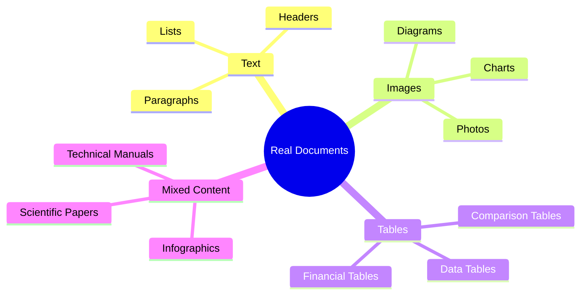
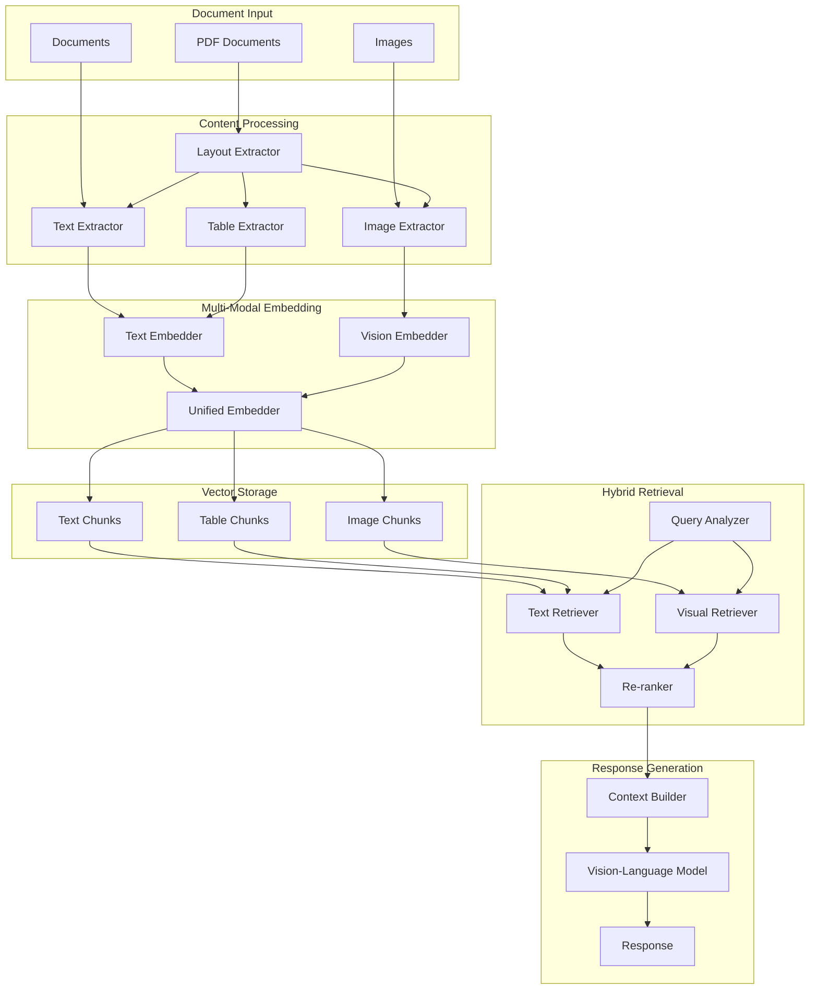

# Multi-Modal RAG

Build a production-ready RAG system that processes and retrieves information from text, images, tables, and complex document layouts using vision-language models.

| Property | Value |
|----------|-------|
| **Difficulty** | 🔴 Advanced |
| **Category** | RAG |
| **Time Estimate** | ~4 days |
| **Code Size** | ~750 lines |
| **Prerequisites** | Intermediate RAG, Vision Models basics |

## Tech Stack

| Component | Technology |
|-----------|------------|
| **Vision Models** | GPT-4 Vision, Claude Vision |
| **PDF Processing** | PyMuPDF (fitz), pdf2image |
| **Image Processing** | Pillow, OpenCV |
| **Table Extraction** | Camelot, pdfplumber |
| **Multi-modal Embeddings** | OpenCLIP, sentence-transformers |
| **Vector Store** | ChromaDB with multi-modal support |
| **Framework** | FastAPI |
| **Orchestration** | LangChain |

## Prerequisites

Before starting this project, you should:

- Complete the intermediate RAG projects
- Understand vector embeddings and similarity search
- Have basic familiarity with computer vision concepts
- Know how to work with APIs (OpenAI/Anthropic)

## What You'll Learn

- Process complex PDFs with mixed content (text, images, tables)
- Extract and embed visual elements using vision-language models
- Create unified embeddings for multi-modal content
- Build a retrieval system that handles different content types
- Generate responses that reference visual elements accurately
- Handle layout-aware document chunking

## Why Multi-Modal RAG?

Traditional RAG systems only handle text, but real-world documents are richer:



**Key challenges Multi-Modal RAG solves:**

1. **Information Loss**: Standard text extraction misses visual insights
2. **Context Understanding**: Charts and diagrams convey relationships that text can't
3. **Table Semantics**: Tabular data requires structure-aware processing
4. **Cross-modal Retrieval**: Users may ask questions that span text and images

## System Architecture



## Project Structure

```
multimodal-rag/
├── app/
│   ├── __init__.py
│   ├── main.py                 # FastAPI application
│   ├── config.py               # Configuration settings
│   ├── models.py               # Pydantic models
│   ├── processors/
│   │   ├── __init__.py
│   │   ├── pdf_processor.py    # PDF extraction
│   │   ├── image_processor.py  # Image analysis
│   │   └── table_processor.py  # Table extraction
│   ├── embeddings/
│   │   ├── __init__.py
│   │   ├── text_embedder.py    # Text embeddings
│   │   ├── vision_embedder.py  # Image embeddings
│   │   └── unified_embedder.py # Combined embeddings
│   ├── retrieval/
│   │   ├── __init__.py
│   │   ├── query_analyzer.py   # Query understanding
│   │   ├── hybrid_retriever.py # Multi-modal retrieval
│   │   └── reranker.py         # Cross-modal reranking
│   └── generation/
│       ├── __init__.py
│       └── vlm_generator.py    # Vision-language generation
├── tests/
│   ├── __init__.py
│   ├── test_processors.py
│   ├── test_embeddings.py
│   └── test_retrieval.py
├── documents/                  # Sample documents
├── docker-compose.yml
├── Dockerfile
├── requirements.txt
└── README.md
```

## Step 1: Configuration and Models

Start by defining the configuration and data models for the multi-modal system.

```python
# app/config.py
from pydantic_settings import BaseSettings
from functools import lru_cache
from typing import Optional


class Settings(BaseSettings):
    # API Keys
    openai_api_key: str
    anthropic_api_key: Optional[str] = None

    # Vision Model Settings
    vision_model: str = "gpt-4o"
    vision_max_tokens: int = 1024

    # Embedding Settings
    text_embedding_model: str = "text-embedding-3-small"
    vision_embedding_model: str = "ViT-B-32"  # OpenCLIP model
    embedding_dimension: int = 512

    # Processing Settings
    max_image_size: int = 1024
    pdf_dpi: int = 200
    chunk_size: int = 1000
    chunk_overlap: int = 200

    # Vector Store
    chroma_persist_dir: str = "./chroma_multimodal"
    collection_name: str = "multimodal_docs"

    # Retrieval Settings
    top_k_text: int = 5
    top_k_images: int = 3
    top_k_tables: int = 3

    class Config:
        env_file = ".env"


@lru_cache()
def get_settings() -> Settings:
    return Settings()
```

```python
# app/models.py
from pydantic import BaseModel, Field
from typing import Optional, List, Dict, Any
from enum import Enum
from datetime import datetime
import base64


class ContentType(str, Enum):
    TEXT = "text"
    IMAGE = "image"
    TABLE = "table"
    MIXED = "mixed"


class BoundingBox(BaseModel):
    """Coordinates for content location in document"""
    x0: float
    y0: float
    x1: float
    y1: float
    page: int


class ExtractedContent(BaseModel):
    """Base model for extracted content"""
    id: str
    content_type: ContentType
    source_document: str
    page_number: int
    bounding_box: Optional[BoundingBox] = None
    metadata: Dict[str, Any] = Field(default_factory=dict)
    created_at: datetime = Field(default_factory=datetime.utcnow)


class TextContent(ExtractedContent):
    """Extracted text content"""
    content_type: ContentType = ContentType.TEXT
    text: str
    section_title: Optional[str] = None
    is_header: bool = False
    is_list: bool = False


class ImageContent(ExtractedContent):
    """Extracted image content"""
    content_type: ContentType = ContentType.IMAGE
    image_base64: str
    caption: Optional[str] = None
    description: Optional[str] = None  # Generated by vision model
    image_type: str = "unknown"  # diagram, chart, photo, etc.

    @property
    def image_bytes(self) -> bytes:
        return base64.b64decode(self.image_base64)


class TableContent(ExtractedContent):
    """Extracted table content"""
    content_type: ContentType = ContentType.TABLE
    headers: List[str]
    rows: List[List[str]]
    caption: Optional[str] = None
    summary: Optional[str] = None  # Generated description

    def to_markdown(self) -> str:
        """Convert table to markdown format"""
        lines = []
        lines.append("| " + " | ".join(self.headers) + " |")
        lines.append("| " + " | ".join(["---"] * len(self.headers)) + " |")
        for row in self.rows:
            lines.append("| " + " | ".join(row) + " |")
        return "\n".join(lines)


class DocumentChunk(BaseModel):
    """Unified chunk for vector storage"""
    id: str
    content_type: ContentType
    text_representation: str  # Always have text for retrieval
    embedding: Optional[List[float]] = None
    source_content_id: str
    source_document: str
    page_number: int
    metadata: Dict[str, Any] = Field(default_factory=dict)


class QueryAnalysis(BaseModel):
    """Analysis of user query"""
    original_query: str
    intent: str  # what user wants to know
    required_modalities: List[ContentType]
    entities: List[str]
    is_visual_query: bool  # Does query require visual content?
    reformulated_query: Optional[str] = None


class RetrievedContext(BaseModel):
    """Retrieved content for generation"""
    chunk: DocumentChunk
    score: float
    content_type: ContentType
    preview: str  # Short preview for display


class QueryRequest(BaseModel):
    """API request model"""
    query: str
    top_k: int = 10
    include_images: bool = True
    include_tables: bool = True
    filters: Optional[Dict[str, Any]] = None


class QueryResponse(BaseModel):
    """API response model"""
    query: str
    answer: str
    sources: List[Dict[str, Any]]
    images_referenced: List[str]  # Base64 images used
    processing_time_ms: float
```

## Step 2: Document Processors

Build specialized processors for different content types.

### PDF Processor

```python
# app/processors/pdf_processor.py
import fitz  # PyMuPDF
import base64
from io import BytesIO
from PIL import Image
from typing import List, Tuple, Optional, Dict, Any
import uuid
import logging

from ..models import (
    TextContent, ImageContent, TableContent,
    BoundingBox, ExtractedContent
)
from ..config import get_settings

logger = logging.getLogger(__name__)
settings = get_settings()


class PDFProcessor:
    """Extract structured content from PDF documents"""

    def __init__(self):
        self.min_image_size = 100  # Minimum pixels to consider
        self.min_text_length = 20  # Minimum chars for text block

    def process(self, pdf_path: str) -> List[ExtractedContent]:
        """Process PDF and extract all content types"""
        doc = fitz.open(pdf_path)
        all_content: List[ExtractedContent] = []

        for page_num in range(len(doc)):
            page = doc[page_num]

            # Extract text blocks
            text_content = self._extract_text_blocks(page, pdf_path, page_num)
            all_content.extend(text_content)

            # Extract images
            images = self._extract_images(page, pdf_path, page_num)
            all_content.extend(images)

            # Detect tables (basic heuristic)
            tables = self._detect_tables(page, pdf_path, page_num)
            all_content.extend(tables)

        doc.close()
        return all_content

    def _extract_text_blocks(
        self,
        page: fitz.Page,
        source: str,
        page_num: int
    ) -> List[TextContent]:
        """Extract text with layout awareness"""
        blocks = page.get_text("dict", flags=fitz.TEXT_PRESERVE_WHITESPACE)["blocks"]
        text_contents = []

        for block in blocks:
            if block["type"] != 0:  # Skip non-text blocks
                continue

            # Combine lines in block
            text_lines = []
            for line in block.get("lines", []):
                line_text = "".join(
                    span["text"] for span in line.get("spans", [])
                )
                text_lines.append(line_text)

            full_text = " ".join(text_lines).strip()

            if len(full_text) < self.min_text_length:
                continue

            # Detect if header based on font size
            is_header = self._is_header(block)

            bbox = BoundingBox(
                x0=block["bbox"][0],
                y0=block["bbox"][1],
                x1=block["bbox"][2],
                y1=block["bbox"][3],
                page=page_num
            )

            text_contents.append(TextContent(
                id=str(uuid.uuid4()),
                source_document=source,
                page_number=page_num,
                bounding_box=bbox,
                text=full_text,
                is_header=is_header,
                metadata={
                    "font_size": self._get_primary_font_size(block),
                    "block_index": len(text_contents)
                }
            ))

        return text_contents

    def _is_header(self, block: Dict[str, Any]) -> bool:
        """Detect if text block is a header"""
        font_size = self._get_primary_font_size(block)
        return font_size > 14  # Simple heuristic

    def _get_primary_font_size(self, block: Dict[str, Any]) -> float:
        """Get the most common font size in block"""
        sizes = []
        for line in block.get("lines", []):
            for span in line.get("spans", []):
                sizes.append(span.get("size", 12))
        return max(set(sizes), key=sizes.count) if sizes else 12

    def _extract_images(
        self,
        page: fitz.Page,
        source: str,
        page_num: int
    ) -> List[ImageContent]:
        """Extract images from page"""
        images = []
        image_list = page.get_images(full=True)

        for img_index, img_info in enumerate(image_list):
            try:
                xref = img_info[0]
                base_image = page.parent.extract_image(xref)

                if not base_image:
                    continue

                image_bytes = base_image["image"]

                # Check minimum size
                img = Image.open(BytesIO(image_bytes))
                if img.width < self.min_image_size or img.height < self.min_image_size:
                    continue

                # Convert to standard format and resize if needed
                processed_bytes = self._process_image(img)
                image_b64 = base64.b64encode(processed_bytes).decode()

                # Get image position
                bbox = self._get_image_bbox(page, xref)

                images.append(ImageContent(
                    id=str(uuid.uuid4()),
                    source_document=source,
                    page_number=page_num,
                    bounding_box=bbox,
                    image_base64=image_b64,
                    image_type="unknown",  # Will be classified later
                    metadata={
                        "original_width": img.width,
                        "original_height": img.height,
                        "format": base_image.get("ext", "unknown")
                    }
                ))

            except Exception as e:
                logger.warning(f"Failed to extract image {img_index}: {e}")
                continue

        return images

    def _process_image(self, img: Image.Image) -> bytes:
        """Resize and convert image to standard format"""
        max_size = settings.max_image_size

        # Resize if needed
        if img.width > max_size or img.height > max_size:
            img.thumbnail((max_size, max_size), Image.Resampling.LANCZOS)

        # Convert to RGB if needed
        if img.mode in ('RGBA', 'P'):
            img = img.convert('RGB')

        # Save as JPEG
        buffer = BytesIO()
        img.save(buffer, format='JPEG', quality=85)
        return buffer.getvalue()

    def _get_image_bbox(
        self,
        page: fitz.Page,
        xref: int
    ) -> Optional[BoundingBox]:
        """Get bounding box for image on page"""
        for item in page.get_images():
            if item[0] == xref:
                # Get image rectangle
                rects = page.get_image_rects(item)
                if rects:
                    r = rects[0]
                    return BoundingBox(
                        x0=r.x0, y0=r.y0, x1=r.x1, y1=r.y1,
                        page=page.number
                    )
        return None

    def _detect_tables(
        self,
        page: fitz.Page,
        source: str,
        page_num: int
    ) -> List[TableContent]:
        """Basic table detection using PyMuPDF"""
        tables = []

        try:
            # Use PyMuPDF's table detection
            tab = page.find_tables()

            for table in tab:
                extracted = table.extract()
                if not extracted or len(extracted) < 2:
                    continue

                headers = [str(cell) if cell else "" for cell in extracted[0]]
                rows = [
                    [str(cell) if cell else "" for cell in row]
                    for row in extracted[1:]
                ]

                bbox = BoundingBox(
                    x0=table.bbox[0],
                    y0=table.bbox[1],
                    x1=table.bbox[2],
                    y1=table.bbox[3],
                    page=page_num
                )

                tables.append(TableContent(
                    id=str(uuid.uuid4()),
                    source_document=source,
                    page_number=page_num,
                    bounding_box=bbox,
                    headers=headers,
                    rows=rows,
                    metadata={
                        "row_count": len(rows),
                        "column_count": len(headers)
                    }
                ))

        except Exception as e:
            logger.warning(f"Table detection failed on page {page_num}: {e}")

        return tables
```

### Image Processor

```python
# app/processors/image_processor.py
import base64
from io import BytesIO
from PIL import Image
import openai
from typing import Optional, Dict, Any
import logging

from ..models import ImageContent
from ..config import get_settings

logger = logging.getLogger(__name__)
settings = get_settings()


class ImageProcessor:
    """Process and analyze images using vision models"""

    def __init__(self):
        self.client = openai.OpenAI(api_key=settings.openai_api_key)
        self.model = settings.vision_model

    def analyze_image(self, image: ImageContent) -> ImageContent:
        """Analyze image content using vision model"""
        try:
            # Classify image type and generate description
            analysis = self._call_vision_model(image.image_base64)

            image.image_type = analysis.get("type", "unknown")
            image.description = analysis.get("description", "")
            image.caption = analysis.get("caption", "")

            return image

        except Exception as e:
            logger.error(f"Image analysis failed: {e}")
            image.description = "Image analysis failed"
            return image

    def _call_vision_model(self, image_b64: str) -> Dict[str, Any]:
        """Call vision model for image analysis"""
        prompt = """Analyze this image and provide:
1. type: One of [diagram, chart, graph, photo, screenshot, table, infographic, illustration, other]
2. description: Detailed description of what the image shows (2-3 sentences)
3. caption: A short one-line caption summarizing the image

Respond in JSON format:
{"type": "...", "description": "...", "caption": "..."}"""

        response = self.client.chat.completions.create(
            model=self.model,
            messages=[
                {
                    "role": "user",
                    "content": [
                        {"type": "text", "text": prompt},
                        {
                            "type": "image_url",
                            "image_url": {
                                "url": f"data:image/jpeg;base64,{image_b64}",
                                "detail": "auto"
                            }
                        }
                    ]
                }
            ],
            max_tokens=500,
            response_format={"type": "json_object"}
        )

        import json
        return json.loads(response.choices[0].message.content)

    def extract_text_from_image(self, image: ImageContent) -> str:
        """Extract any text visible in the image using OCR via vision model"""
        prompt = """Extract ALL text visible in this image.
Return the text exactly as it appears, preserving structure.
If there's no text, return "NO_TEXT_FOUND"."""

        response = self.client.chat.completions.create(
            model=self.model,
            messages=[
                {
                    "role": "user",
                    "content": [
                        {"type": "text", "text": prompt},
                        {
                            "type": "image_url",
                            "image_url": {
                                "url": f"data:image/jpeg;base64,{image.image_base64}",
                                "detail": "high"
                            }
                        }
                    ]
                }
            ],
            max_tokens=1000
        )

        text = response.choices[0].message.content.strip()
        return "" if text == "NO_TEXT_FOUND" else text

    def answer_question_about_image(
        self,
        image: ImageContent,
        question: str
    ) -> str:
        """Answer a specific question about an image"""
        prompt = f"""Based on this image, answer the following question:

Question: {question}

Provide a detailed, accurate answer based only on what you can see in the image."""

        response = self.client.chat.completions.create(
            model=self.model,
            messages=[
                {
                    "role": "user",
                    "content": [
                        {"type": "text", "text": prompt},
                        {
                            "type": "image_url",
                            "image_url": {
                                "url": f"data:image/jpeg;base64,{image.image_base64}",
                                "detail": "high"
                            }
                        }
                    ]
                }
            ],
            max_tokens=settings.vision_max_tokens
        )

        return response.choices[0].message.content
```

### Table Processor

```python
# app/processors/table_processor.py
import openai
from typing import List, Optional
import logging

from ..models import TableContent
from ..config import get_settings

logger = logging.getLogger(__name__)
settings = get_settings()


class TableProcessor:
    """Process and enhance table content"""

    def __init__(self):
        self.client = openai.OpenAI(api_key=settings.openai_api_key)

    def enhance_table(self, table: TableContent) -> TableContent:
        """Generate summary and improve table understanding"""
        try:
            markdown_table = table.to_markdown()

            prompt = f"""Analyze this table and provide a clear summary:

{markdown_table}

Describe:
1. What information this table contains
2. Key insights or patterns
3. The main purpose of this table

Keep the summary to 2-3 sentences."""

            response = self.client.chat.completions.create(
                model="gpt-4o-mini",
                messages=[
                    {"role": "user", "content": prompt}
                ],
                max_tokens=300
            )

            table.summary = response.choices[0].message.content.strip()
            return table

        except Exception as e:
            logger.error(f"Table enhancement failed: {e}")
            table.summary = f"Table with {len(table.headers)} columns and {len(table.rows)} rows"
            return table

    def query_table(self, table: TableContent, question: str) -> str:
        """Answer a question about a specific table"""
        markdown_table = table.to_markdown()

        prompt = f"""Given this table:

{markdown_table}

Answer this question: {question}

Provide a specific, accurate answer based on the table data."""

        response = self.client.chat.completions.create(
            model="gpt-4o-mini",
            messages=[
                {"role": "user", "content": prompt}
            ],
            max_tokens=300
        )

        return response.choices[0].message.content.strip()

    def find_relevant_rows(
        self,
        table: TableContent,
        query: str,
        max_rows: int = 5
    ) -> List[List[str]]:
        """Find rows most relevant to a query"""
        markdown_table = table.to_markdown()

        prompt = f"""Given this table:

{markdown_table}

Find the {max_rows} most relevant rows for this query: "{query}"

Return ONLY the row numbers (0-indexed) as a comma-separated list.
Example: 0, 3, 7"""

        response = self.client.chat.completions.create(
            model="gpt-4o-mini",
            messages=[
                {"role": "user", "content": prompt}
            ],
            max_tokens=50
        )

        try:
            indices = [
                int(i.strip())
                for i in response.choices[0].message.content.split(",")
            ]
            return [
                table.rows[i] for i in indices
                if i < len(table.rows)
            ]
        except:
            return table.rows[:max_rows]
```

## Step 3: Multi-Modal Embeddings

Create embeddings that work across different content types.

```python
# app/embeddings/text_embedder.py
import openai
from typing import List
import logging

from ..config import get_settings

logger = logging.getLogger(__name__)
settings = get_settings()


class TextEmbedder:
    """Generate embeddings for text content"""

    def __init__(self):
        self.client = openai.OpenAI(api_key=settings.openai_api_key)
        self.model = settings.text_embedding_model

    def embed(self, text: str) -> List[float]:
        """Generate embedding for single text"""
        response = self.client.embeddings.create(
            model=self.model,
            input=text
        )
        return response.data[0].embedding

    def embed_batch(self, texts: List[str]) -> List[List[float]]:
        """Generate embeddings for multiple texts"""
        # OpenAI supports batch embedding
        response = self.client.embeddings.create(
            model=self.model,
            input=texts
        )
        return [d.embedding for d in response.data]
```

```python
# app/embeddings/vision_embedder.py
import torch
import open_clip
from PIL import Image
from io import BytesIO
import base64
from typing import List, Optional
import logging
import numpy as np

from ..config import get_settings

logger = logging.getLogger(__name__)
settings = get_settings()


class VisionEmbedder:
    """Generate embeddings for images using OpenCLIP"""

    def __init__(self):
        self.device = "cuda" if torch.cuda.is_available() else "cpu"
        self.model, _, self.preprocess = open_clip.create_model_and_transforms(
            settings.vision_embedding_model,
            pretrained='laion2b_s34b_b79k'
        )
        self.model = self.model.to(self.device)
        self.model.eval()

        # Also load tokenizer for text-to-image matching
        self.tokenizer = open_clip.get_tokenizer(settings.vision_embedding_model)

    def embed_image(self, image_b64: str) -> List[float]:
        """Generate embedding for single image"""
        image_bytes = base64.b64decode(image_b64)
        image = Image.open(BytesIO(image_bytes)).convert('RGB')

        image_tensor = self.preprocess(image).unsqueeze(0).to(self.device)

        with torch.no_grad():
            features = self.model.encode_image(image_tensor)
            features = features / features.norm(dim=-1, keepdim=True)

        return features.squeeze().cpu().numpy().tolist()

    def embed_images_batch(self, images_b64: List[str]) -> List[List[float]]:
        """Generate embeddings for multiple images"""
        images = []
        for img_b64 in images_b64:
            img_bytes = base64.b64decode(img_b64)
            img = Image.open(BytesIO(img_bytes)).convert('RGB')
            images.append(self.preprocess(img))

        image_tensor = torch.stack(images).to(self.device)

        with torch.no_grad():
            features = self.model.encode_image(image_tensor)
            features = features / features.norm(dim=-1, keepdim=True)

        return features.cpu().numpy().tolist()

    def embed_text_for_image_search(self, text: str) -> List[float]:
        """Embed text query for image similarity search"""
        tokens = self.tokenizer([text]).to(self.device)

        with torch.no_grad():
            features = self.model.encode_text(tokens)
            features = features / features.norm(dim=-1, keepdim=True)

        return features.squeeze().cpu().numpy().tolist()
```

```python
# app/embeddings/unified_embedder.py
from typing import List, Optional, Dict, Any
import numpy as np
import logging

from .text_embedder import TextEmbedder
from .vision_embedder import VisionEmbedder
from ..models import (
    DocumentChunk, TextContent, ImageContent, TableContent,
    ContentType, ExtractedContent
)
from ..config import get_settings

logger = logging.getLogger(__name__)
settings = get_settings()


class UnifiedEmbedder:
    """Create unified embeddings for all content types"""

    def __init__(self):
        self.text_embedder = TextEmbedder()
        self.vision_embedder = VisionEmbedder()
        self.embedding_dim = settings.embedding_dimension

    def create_chunks(
        self,
        contents: List[ExtractedContent]
    ) -> List[DocumentChunk]:
        """Convert extracted content to unified chunks with embeddings"""
        chunks = []

        for content in contents:
            if isinstance(content, TextContent):
                chunk = self._create_text_chunk(content)
            elif isinstance(content, ImageContent):
                chunk = self._create_image_chunk(content)
            elif isinstance(content, TableContent):
                chunk = self._create_table_chunk(content)
            else:
                continue

            if chunk:
                chunks.append(chunk)

        return chunks

    def _create_text_chunk(self, content: TextContent) -> DocumentChunk:
        """Create chunk from text content"""
        embedding = self.text_embedder.embed(content.text)

        return DocumentChunk(
            id=content.id,
            content_type=ContentType.TEXT,
            text_representation=content.text,
            embedding=embedding,
            source_content_id=content.id,
            source_document=content.source_document,
            page_number=content.page_number,
            metadata={
                "is_header": content.is_header,
                "section_title": content.section_title,
                **content.metadata
            }
        )

    def _create_image_chunk(self, content: ImageContent) -> DocumentChunk:
        """Create chunk from image content"""
        # Create text representation for hybrid search
        text_repr = self._create_image_text_representation(content)

        # Get both embeddings
        text_embedding = self.text_embedder.embed(text_repr)
        vision_embedding = self.vision_embedder.embed_image(content.image_base64)

        # Combine embeddings (weighted average)
        # Adjust dimensions if needed
        combined = self._combine_embeddings(text_embedding, vision_embedding)

        return DocumentChunk(
            id=content.id,
            content_type=ContentType.IMAGE,
            text_representation=text_repr,
            embedding=combined,
            source_content_id=content.id,
            source_document=content.source_document,
            page_number=content.page_number,
            metadata={
                "image_type": content.image_type,
                "caption": content.caption,
                "has_image": True,
                "image_base64": content.image_base64,  # Store for retrieval
                **content.metadata
            }
        )

    def _create_table_chunk(self, content: TableContent) -> DocumentChunk:
        """Create chunk from table content"""
        # Create text representation
        text_repr = self._create_table_text_representation(content)
        embedding = self.text_embedder.embed(text_repr)

        return DocumentChunk(
            id=content.id,
            content_type=ContentType.TABLE,
            text_representation=text_repr,
            embedding=embedding,
            source_content_id=content.id,
            source_document=content.source_document,
            page_number=content.page_number,
            metadata={
                "headers": content.headers,
                "row_count": len(content.rows),
                "markdown": content.to_markdown(),
                "summary": content.summary,
                **content.metadata
            }
        )

    def _create_image_text_representation(self, content: ImageContent) -> str:
        """Create searchable text representation for image"""
        parts = []

        if content.caption:
            parts.append(f"Image: {content.caption}")

        if content.description:
            parts.append(content.description)

        if content.image_type and content.image_type != "unknown":
            parts.append(f"Type: {content.image_type}")

        if not parts:
            parts.append(f"Image from page {content.page_number}")

        return " ".join(parts)

    def _create_table_text_representation(self, content: TableContent) -> str:
        """Create searchable text representation for table"""
        parts = []

        if content.caption:
            parts.append(f"Table: {content.caption}")

        if content.summary:
            parts.append(content.summary)

        # Include headers
        parts.append(f"Columns: {', '.join(content.headers)}")

        # Include sample data
        sample_rows = content.rows[:3]
        for row in sample_rows:
            parts.append(" | ".join(row))

        return " ".join(parts)

    def _combine_embeddings(
        self,
        text_emb: List[float],
        vision_emb: List[float],
        text_weight: float = 0.5
    ) -> List[float]:
        """Combine text and vision embeddings"""
        text_arr = np.array(text_emb)
        vision_arr = np.array(vision_emb)

        # Normalize to same dimension if needed
        if len(text_arr) != len(vision_arr):
            # Project to common dimension
            min_dim = min(len(text_arr), len(vision_arr))
            text_arr = text_arr[:min_dim]
            vision_arr = vision_arr[:min_dim]

        # Weighted combination
        combined = text_weight * text_arr + (1 - text_weight) * vision_arr

        # Normalize
        combined = combined / np.linalg.norm(combined)

        return combined.tolist()

    def embed_query(
        self,
        query: str,
        include_vision: bool = True
    ) -> Dict[str, List[float]]:
        """Embed query for multi-modal retrieval"""
        embeddings = {
            "text": self.text_embedder.embed(query)
        }

        if include_vision:
            embeddings["vision"] = self.vision_embedder.embed_text_for_image_search(query)

        return embeddings
```

## Step 4: Hybrid Retrieval System

Build a retrieval system that searches across all content types.

```python
# app/retrieval/query_analyzer.py
import openai
from typing import List
import json
import logging

from ..models import QueryAnalysis, ContentType
from ..config import get_settings

logger = logging.getLogger(__name__)
settings = get_settings()


class QueryAnalyzer:
    """Analyze queries to determine retrieval strategy"""

    def __init__(self):
        self.client = openai.OpenAI(api_key=settings.openai_api_key)

    def analyze(self, query: str) -> QueryAnalysis:
        """Analyze query to determine what content types to retrieve"""
        prompt = f"""Analyze this query and determine what information is needed:

Query: "{query}"

Respond in JSON format:
{{
    "intent": "Brief description of what user wants to know",
    "required_modalities": ["text", "image", "table"],  // Which content types are needed
    "entities": ["entity1", "entity2"],  // Key entities mentioned
    "is_visual_query": true/false,  // Does this specifically ask about visual content?
    "reformulated_query": "Improved search query if needed, or null"
}}

Guidelines:
- Include "image" if query asks about diagrams, charts, figures, or visual elements
- Include "table" if query asks about data, comparisons, or statistics
- Always include "text" unless query is purely visual
- is_visual_query is true for questions like "show me the diagram" or "what does the chart show" """

        response = self.client.chat.completions.create(
            model="gpt-4o-mini",
            messages=[
                {"role": "user", "content": prompt}
            ],
            response_format={"type": "json_object"},
            max_tokens=300
        )

        result = json.loads(response.choices[0].message.content)

        # Map string modalities to enum
        modalities = [
            ContentType(m) for m in result.get("required_modalities", ["text"])
            if m in ["text", "image", "table"]
        ]

        return QueryAnalysis(
            original_query=query,
            intent=result.get("intent", ""),
            required_modalities=modalities,
            entities=result.get("entities", []),
            is_visual_query=result.get("is_visual_query", False),
            reformulated_query=result.get("reformulated_query")
        )
```

```python
# app/retrieval/hybrid_retriever.py
import chromadb
from chromadb.config import Settings as ChromaSettings
from typing import List, Dict, Any, Optional
import logging
import numpy as np

from ..models import (
    DocumentChunk, RetrievedContext, ContentType, QueryAnalysis
)
from ..embeddings.unified_embedder import UnifiedEmbedder
from ..config import get_settings

logger = logging.getLogger(__name__)
settings = get_settings()


class HybridRetriever:
    """Multi-modal retrieval across text, images, and tables"""

    def __init__(self):
        self.embedder = UnifiedEmbedder()

        # Initialize ChromaDB
        self.chroma_client = chromadb.Client(ChromaSettings(
            chroma_db_impl="duckdb+parquet",
            persist_directory=settings.chroma_persist_dir,
            anonymized_telemetry=False
        ))

        # Create/get collection
        self.collection = self.chroma_client.get_or_create_collection(
            name=settings.collection_name,
            metadata={"hnsw:space": "cosine"}
        )

    def index_chunks(self, chunks: List[DocumentChunk]) -> int:
        """Add chunks to vector store"""
        if not chunks:
            return 0

        ids = [chunk.id for chunk in chunks]
        embeddings = [chunk.embedding for chunk in chunks]
        metadatas = [
            {
                "content_type": chunk.content_type.value,
                "source_document": chunk.source_document,
                "page_number": chunk.page_number,
                "text_representation": chunk.text_representation[:1000],  # Truncate for metadata
                **{k: str(v) if not isinstance(v, (str, int, float, bool)) else v
                   for k, v in chunk.metadata.items()
                   if k != "image_base64"}  # Don't store large base64 in metadata
            }
            for chunk in chunks
        ]
        documents = [chunk.text_representation for chunk in chunks]

        # Store image data separately if present
        self._store_image_data(chunks)

        self.collection.add(
            ids=ids,
            embeddings=embeddings,
            metadatas=metadatas,
            documents=documents
        )

        return len(chunks)

    def _store_image_data(self, chunks: List[DocumentChunk]):
        """Store image base64 data separately (would use blob storage in production)"""
        # In production, use S3/GCS/Azure Blob Storage
        # For this example, we store in metadata separately
        self.image_store = getattr(self, 'image_store', {})
        for chunk in chunks:
            if chunk.content_type == ContentType.IMAGE:
                img_b64 = chunk.metadata.get("image_base64")
                if img_b64:
                    self.image_store[chunk.id] = img_b64

    def retrieve(
        self,
        query: str,
        analysis: QueryAnalysis,
        top_k: int = 10
    ) -> List[RetrievedContext]:
        """Retrieve relevant content based on query analysis"""
        # Get query embeddings
        query_embeddings = self.embedder.embed_query(
            analysis.reformulated_query or query,
            include_vision=analysis.is_visual_query
        )

        # Determine which content types to search
        content_types = [ct.value for ct in analysis.required_modalities]

        # Search with content type filter
        results = self.collection.query(
            query_embeddings=[query_embeddings["text"]],
            n_results=top_k * 2,  # Get more to filter
            where={"content_type": {"$in": content_types}} if len(content_types) < 3 else None,
            include=["embeddings", "metadatas", "documents", "distances"]
        )

        # Convert to RetrievedContext
        contexts = []

        for i, doc_id in enumerate(results["ids"][0]):
            metadata = results["metadatas"][0][i]
            distance = results["distances"][0][i]
            document = results["documents"][0][i]

            content_type = ContentType(metadata["content_type"])

            # Get image data if applicable
            image_b64 = None
            if content_type == ContentType.IMAGE:
                image_b64 = self.image_store.get(doc_id)

            chunk = DocumentChunk(
                id=doc_id,
                content_type=content_type,
                text_representation=document,
                source_content_id=doc_id,
                source_document=metadata["source_document"],
                page_number=metadata["page_number"],
                metadata={**metadata, "image_base64": image_b64} if image_b64 else metadata
            )

            # Convert distance to similarity score
            score = 1 - distance

            contexts.append(RetrievedContext(
                chunk=chunk,
                score=score,
                content_type=content_type,
                preview=document[:200] + "..." if len(document) > 200 else document
            ))

        # Sort by score and apply content type balancing
        contexts = self._balance_content_types(contexts, analysis, top_k)

        return contexts

    def _balance_content_types(
        self,
        contexts: List[RetrievedContext],
        analysis: QueryAnalysis,
        top_k: int
    ) -> List[RetrievedContext]:
        """Balance results across content types"""
        # Group by content type
        by_type: Dict[ContentType, List[RetrievedContext]] = {}
        for ctx in contexts:
            if ctx.content_type not in by_type:
                by_type[ctx.content_type] = []
            by_type[ctx.content_type].append(ctx)

        # Allocate slots based on query analysis
        balanced = []

        if analysis.is_visual_query:
            # Prioritize images/tables for visual queries
            slots = {
                ContentType.IMAGE: min(settings.top_k_images, top_k // 2),
                ContentType.TABLE: min(settings.top_k_tables, top_k // 4),
                ContentType.TEXT: top_k // 4
            }
        else:
            # Default allocation
            slots = {
                ContentType.TEXT: settings.top_k_text,
                ContentType.IMAGE: settings.top_k_images,
                ContentType.TABLE: settings.top_k_tables
            }

        # Fill slots
        for content_type, count in slots.items():
            type_contexts = by_type.get(content_type, [])
            balanced.extend(type_contexts[:count])

        # Sort by score
        balanced.sort(key=lambda x: x.score, reverse=True)

        return balanced[:top_k]

    def search_images(
        self,
        query: str,
        top_k: int = 5
    ) -> List[RetrievedContext]:
        """Search specifically for images"""
        # Use vision embedding for image search
        vision_embedding = self.embedder.vision_embedder.embed_text_for_image_search(query)

        results = self.collection.query(
            query_embeddings=[vision_embedding],
            n_results=top_k,
            where={"content_type": "image"},
            include=["metadatas", "documents", "distances"]
        )

        contexts = []
        for i, doc_id in enumerate(results["ids"][0]):
            metadata = results["metadatas"][0][i]

            image_b64 = self.image_store.get(doc_id)

            chunk = DocumentChunk(
                id=doc_id,
                content_type=ContentType.IMAGE,
                text_representation=results["documents"][0][i],
                source_content_id=doc_id,
                source_document=metadata["source_document"],
                page_number=metadata["page_number"],
                metadata={**metadata, "image_base64": image_b64}
            )

            contexts.append(RetrievedContext(
                chunk=chunk,
                score=1 - results["distances"][0][i],
                content_type=ContentType.IMAGE,
                preview=metadata.get("caption", "Image")
            ))

        return contexts
```

```python
# app/retrieval/reranker.py
import openai
from typing import List, Dict, Any
import json
import logging

from ..models import RetrievedContext, QueryAnalysis, ContentType
from ..config import get_settings

logger = logging.getLogger(__name__)
settings = get_settings()


class MultiModalReranker:
    """Rerank results considering multi-modal relevance"""

    def __init__(self):
        self.client = openai.OpenAI(api_key=settings.openai_api_key)

    def rerank(
        self,
        query: str,
        contexts: List[RetrievedContext],
        analysis: QueryAnalysis,
        top_k: int = 5
    ) -> List[RetrievedContext]:
        """Rerank contexts using LLM judgment"""
        if len(contexts) <= top_k:
            return contexts

        # Prepare context summaries for reranking
        context_summaries = []
        for i, ctx in enumerate(contexts):
            summary = {
                "index": i,
                "type": ctx.content_type.value,
                "content": ctx.preview,
                "page": ctx.chunk.page_number
            }

            if ctx.content_type == ContentType.IMAGE:
                summary["caption"] = ctx.chunk.metadata.get("caption", "")
            elif ctx.content_type == ContentType.TABLE:
                summary["headers"] = ctx.chunk.metadata.get("headers", [])

            context_summaries.append(summary)

        prompt = f"""Given this query: "{query}"

And these retrieved contexts:
{json.dumps(context_summaries, indent=2)}

Rank the top {top_k} most relevant contexts for answering the query.
Consider:
1. Direct relevance to the question
2. Information completeness
3. For visual queries, prioritize images/diagrams that answer the question
4. For data queries, prioritize tables with relevant data

Return a JSON array of indices in order of relevance:
{{"ranked_indices": [0, 3, 1, ...]}}"""

        try:
            response = self.client.chat.completions.create(
                model="gpt-4o-mini",
                messages=[
                    {"role": "user", "content": prompt}
                ],
                response_format={"type": "json_object"},
                max_tokens=200
            )

            result = json.loads(response.choices[0].message.content)
            ranked_indices = result.get("ranked_indices", list(range(top_k)))

            # Reorder contexts
            reranked = [contexts[i] for i in ranked_indices if i < len(contexts)]

            # Update scores based on new ranking
            for i, ctx in enumerate(reranked):
                ctx.score = 1.0 - (i * 0.1)  # Assign decreasing scores

            return reranked[:top_k]

        except Exception as e:
            logger.error(f"Reranking failed: {e}")
            return contexts[:top_k]
```

## Step 5: Response Generation

Generate responses that incorporate visual and tabular content.

```python
# app/generation/vlm_generator.py
import openai
from typing import List, Dict, Any, Optional
import base64
import logging

from ..models import RetrievedContext, ContentType, QueryAnalysis
from ..config import get_settings

logger = logging.getLogger(__name__)
settings = get_settings()


class VLMGenerator:
    """Generate responses using vision-language model"""

    def __init__(self):
        self.client = openai.OpenAI(api_key=settings.openai_api_key)
        self.model = settings.vision_model

    def generate(
        self,
        query: str,
        contexts: List[RetrievedContext],
        analysis: QueryAnalysis
    ) -> Dict[str, Any]:
        """Generate response incorporating all relevant content"""
        # Build message content
        content_parts = self._build_content_parts(query, contexts)

        # Generate response
        response = self.client.chat.completions.create(
            model=self.model,
            messages=[
                {
                    "role": "system",
                    "content": """You are a helpful assistant that answers questions based on provided context.

When referring to images, describe what they show and reference them as [Image N].
When referring to tables, cite specific data and reference them as [Table N].
Always cite your sources using [Source: page X] format.

If the provided context doesn't contain enough information to answer the question fully, say so clearly."""
                },
                {
                    "role": "user",
                    "content": content_parts
                }
            ],
            max_tokens=settings.vision_max_tokens
        )

        answer = response.choices[0].message.content

        # Extract referenced images
        images_used = self._get_referenced_images(contexts, answer)

        return {
            "answer": answer,
            "images_referenced": images_used,
            "sources": self._format_sources(contexts)
        }

    def _build_content_parts(
        self,
        query: str,
        contexts: List[RetrievedContext]
    ) -> List[Dict[str, Any]]:
        """Build multi-modal message content"""
        parts = []

        # Add text instruction
        parts.append({
            "type": "text",
            "text": f"Please answer this question based on the following context:\n\nQuestion: {query}\n\nContext:"
        })

        # Track counters for references
        image_count = 0
        table_count = 0

        for ctx in contexts:
            if ctx.content_type == ContentType.TEXT:
                parts.append({
                    "type": "text",
                    "text": f"\n[Text from page {ctx.chunk.page_number}]:\n{ctx.chunk.text_representation}"
                })

            elif ctx.content_type == ContentType.IMAGE:
                image_count += 1
                image_b64 = ctx.chunk.metadata.get("image_base64")

                if image_b64:
                    parts.append({
                        "type": "text",
                        "text": f"\n[Image {image_count} from page {ctx.chunk.page_number}]:"
                    })

                    if ctx.chunk.metadata.get("caption"):
                        parts.append({
                            "type": "text",
                            "text": f"Caption: {ctx.chunk.metadata['caption']}"
                        })

                    parts.append({
                        "type": "image_url",
                        "image_url": {
                            "url": f"data:image/jpeg;base64,{image_b64}",
                            "detail": "auto"
                        }
                    })

            elif ctx.content_type == ContentType.TABLE:
                table_count += 1
                markdown = ctx.chunk.metadata.get("markdown", ctx.chunk.text_representation)

                parts.append({
                    "type": "text",
                    "text": f"\n[Table {table_count} from page {ctx.chunk.page_number}]:\n{markdown}"
                })

                if ctx.chunk.metadata.get("summary"):
                    parts.append({
                        "type": "text",
                        "text": f"Summary: {ctx.chunk.metadata['summary']}"
                    })

        return parts

    def _get_referenced_images(
        self,
        contexts: List[RetrievedContext],
        answer: str
    ) -> List[str]:
        """Extract base64 images that were referenced in the answer"""
        images = []

        image_contexts = [
            ctx for ctx in contexts
            if ctx.content_type == ContentType.IMAGE
        ]

        for i, ctx in enumerate(image_contexts, 1):
            # Check if this image was referenced
            if f"[Image {i}]" in answer or f"Image {i}" in answer:
                img_b64 = ctx.chunk.metadata.get("image_base64")
                if img_b64:
                    images.append(img_b64)

        return images

    def _format_sources(
        self,
        contexts: List[RetrievedContext]
    ) -> List[Dict[str, Any]]:
        """Format sources for response"""
        sources = []

        for ctx in contexts:
            source = {
                "type": ctx.content_type.value,
                "document": ctx.chunk.source_document,
                "page": ctx.chunk.page_number,
                "relevance_score": round(ctx.score, 3)
            }

            if ctx.content_type == ContentType.TEXT:
                source["preview"] = ctx.preview
            elif ctx.content_type == ContentType.IMAGE:
                source["caption"] = ctx.chunk.metadata.get("caption", "")
            elif ctx.content_type == ContentType.TABLE:
                source["headers"] = ctx.chunk.metadata.get("headers", [])

            sources.append(source)

        return sources

    def answer_about_image(
        self,
        image_b64: str,
        question: str,
        additional_context: str = ""
    ) -> str:
        """Answer a specific question about a single image"""
        content = [
            {
                "type": "text",
                "text": f"Question: {question}"
            },
            {
                "type": "image_url",
                "image_url": {
                    "url": f"data:image/jpeg;base64,{image_b64}",
                    "detail": "high"
                }
            }
        ]

        if additional_context:
            content.insert(0, {
                "type": "text",
                "text": f"Context: {additional_context}"
            })

        response = self.client.chat.completions.create(
            model=self.model,
            messages=[
                {
                    "role": "user",
                    "content": content
                }
            ],
            max_tokens=settings.vision_max_tokens
        )

        return response.choices[0].message.content
```

## Step 6: FastAPI Application

Create the API to expose the multi-modal RAG system.

```python
# app/main.py
from fastapi import FastAPI, UploadFile, File, HTTPException, BackgroundTasks
from fastapi.responses import JSONResponse
from contextlib import asynccontextmanager
import tempfile
import os
import time
import logging
from typing import List, Optional
import uuid

from .config import get_settings
from .models import QueryRequest, QueryResponse, ContentType
from .processors.pdf_processor import PDFProcessor
from .processors.image_processor import ImageProcessor
from .processors.table_processor import TableProcessor
from .embeddings.unified_embedder import UnifiedEmbedder
from .retrieval.query_analyzer import QueryAnalyzer
from .retrieval.hybrid_retriever import HybridRetriever
from .retrieval.reranker import MultiModalReranker
from .generation.vlm_generator import VLMGenerator

logging.basicConfig(level=logging.INFO)
logger = logging.getLogger(__name__)

settings = get_settings()

# Global components
pdf_processor: PDFProcessor
image_processor: ImageProcessor
table_processor: TableProcessor
embedder: UnifiedEmbedder
query_analyzer: QueryAnalyzer
retriever: HybridRetriever
reranker: MultiModalReranker
generator: VLMGenerator


@asynccontextmanager
async def lifespan(app: FastAPI):
    """Initialize components on startup"""
    global pdf_processor, image_processor, table_processor
    global embedder, query_analyzer, retriever, reranker, generator

    logger.info("Initializing Multi-Modal RAG components...")

    pdf_processor = PDFProcessor()
    image_processor = ImageProcessor()
    table_processor = TableProcessor()
    embedder = UnifiedEmbedder()
    query_analyzer = QueryAnalyzer()
    retriever = HybridRetriever()
    reranker = MultiModalReranker()
    generator = VLMGenerator()

    logger.info("Components initialized successfully")

    yield

    logger.info("Shutting down...")


app = FastAPI(
    title="Multi-Modal RAG API",
    description="RAG system for text, images, and tables",
    version="1.0.0",
    lifespan=lifespan
)


@app.post("/ingest/pdf")
async def ingest_pdf(
    file: UploadFile = File(...),
    background_tasks: BackgroundTasks = None,
    analyze_images: bool = True,
    extract_tables: bool = True
):
    """Ingest a PDF document with full multi-modal processing"""
    if not file.filename.endswith('.pdf'):
        raise HTTPException(400, "Only PDF files are supported")

    start_time = time.time()

    # Save uploaded file
    with tempfile.NamedTemporaryFile(delete=False, suffix='.pdf') as tmp:
        content = await file.read()
        tmp.write(content)
        tmp_path = tmp.name

    try:
        # Process PDF
        logger.info(f"Processing PDF: {file.filename}")
        contents = pdf_processor.process(tmp_path)

        stats = {
            "text_blocks": 0,
            "images": 0,
            "tables": 0
        }

        # Enhance content
        for content in contents:
            if content.content_type == ContentType.TEXT:
                stats["text_blocks"] += 1

            elif content.content_type == ContentType.IMAGE:
                stats["images"] += 1
                if analyze_images:
                    content = image_processor.analyze_image(content)

            elif content.content_type == ContentType.TABLE:
                stats["tables"] += 1
                if extract_tables:
                    content = table_processor.enhance_table(content)

        # Create unified chunks
        logger.info("Creating embeddings...")
        chunks = embedder.create_chunks(contents)

        # Index chunks
        indexed_count = retriever.index_chunks(chunks)

        processing_time = (time.time() - start_time) * 1000

        return {
            "status": "success",
            "document": file.filename,
            "stats": stats,
            "chunks_indexed": indexed_count,
            "processing_time_ms": round(processing_time, 2)
        }

    finally:
        os.unlink(tmp_path)


@app.post("/query", response_model=QueryResponse)
async def query(request: QueryRequest):
    """Query the multi-modal knowledge base"""
    start_time = time.time()

    # Analyze query
    analysis = query_analyzer.analyze(request.query)
    logger.info(f"Query analysis: {analysis.intent}, modalities: {analysis.required_modalities}")

    # Adjust modalities based on request
    if not request.include_images:
        analysis.required_modalities = [
            m for m in analysis.required_modalities
            if m != ContentType.IMAGE
        ]
    if not request.include_tables:
        analysis.required_modalities = [
            m for m in analysis.required_modalities
            if m != ContentType.TABLE
        ]

    # Retrieve relevant content
    contexts = retriever.retrieve(
        request.query,
        analysis,
        top_k=request.top_k * 2  # Get extra for reranking
    )

    if not contexts:
        return QueryResponse(
            query=request.query,
            answer="I couldn't find any relevant information in the knowledge base.",
            sources=[],
            images_referenced=[],
            processing_time_ms=round((time.time() - start_time) * 1000, 2)
        )

    # Rerank
    contexts = reranker.rerank(
        request.query,
        contexts,
        analysis,
        top_k=request.top_k
    )

    # Generate response
    result = generator.generate(request.query, contexts, analysis)

    processing_time = (time.time() - start_time) * 1000

    return QueryResponse(
        query=request.query,
        answer=result["answer"],
        sources=result["sources"],
        images_referenced=result["images_referenced"],
        processing_time_ms=round(processing_time, 2)
    )


@app.post("/search/images")
async def search_images(query: str, top_k: int = 5):
    """Search specifically for relevant images"""
    contexts = retriever.search_images(query, top_k)

    results = []
    for ctx in contexts:
        results.append({
            "id": ctx.chunk.id,
            "caption": ctx.chunk.metadata.get("caption", ""),
            "description": ctx.chunk.metadata.get("description", ""),
            "image_type": ctx.chunk.metadata.get("image_type", "unknown"),
            "page": ctx.chunk.page_number,
            "document": ctx.chunk.source_document,
            "score": round(ctx.score, 3),
            "image_base64": ctx.chunk.metadata.get("image_base64", "")
        })

    return {"query": query, "results": results}


@app.post("/ask-about-image/{image_id}")
async def ask_about_image(image_id: str, question: str):
    """Ask a specific question about an indexed image"""
    # Get image from store
    image_b64 = retriever.image_store.get(image_id)

    if not image_b64:
        raise HTTPException(404, f"Image {image_id} not found")

    answer = generator.answer_about_image(image_b64, question)

    return {
        "image_id": image_id,
        "question": question,
        "answer": answer
    }


@app.get("/stats")
async def get_stats():
    """Get knowledge base statistics"""
    collection = retriever.collection

    # Count by type
    type_counts = {}
    for content_type in ContentType:
        results = collection.get(
            where={"content_type": content_type.value},
            include=[]
        )
        type_counts[content_type.value] = len(results["ids"])

    return {
        "total_chunks": collection.count(),
        "by_type": type_counts,
        "images_stored": len(retriever.image_store)
    }


@app.delete("/clear")
async def clear_knowledge_base():
    """Clear all indexed content"""
    retriever.chroma_client.delete_collection(settings.collection_name)
    retriever.collection = retriever.chroma_client.create_collection(
        name=settings.collection_name,
        metadata={"hnsw:space": "cosine"}
    )
    retriever.image_store.clear()

    return {"status": "cleared"}


@app.get("/health")
async def health_check():
    """Health check endpoint"""
    return {"status": "healthy", "model": settings.vision_model}
```

## Step 7: Docker Setup

```yaml
# docker-compose.yml
version: '3.8'

services:
  multimodal-rag:
    build:
      context: .
      dockerfile: Dockerfile
    ports:
      - "8000:8000"
    environment:
      - OPENAI_API_KEY=${OPENAI_API_KEY}
      - ANTHROPIC_API_KEY=${ANTHROPIC_API_KEY:-}
      - VISION_MODEL=gpt-4o
      - CHROMA_PERSIST_DIR=/app/data/chroma
    volumes:
      - ./data:/app/data
      - ./documents:/app/documents
    deploy:
      resources:
        reservations:
          devices:
            - driver: nvidia
              count: all
              capabilities: [gpu]
    healthcheck:
      test: ["CMD", "curl", "-f", "http://localhost:8000/health"]
      interval: 30s
      timeout: 10s
      retries: 3

volumes:
  chroma_data:
```

```dockerfile
# Dockerfile
FROM python:3.11-slim

WORKDIR /app

# Install system dependencies for PDF and image processing
RUN apt-get update && apt-get install -y \
    libgl1-mesa-glx \
    libglib2.0-0 \
    libsm6 \
    libxext6 \
    libxrender-dev \
    libgomp1 \
    poppler-utils \
    tesseract-ocr \
    curl \
    && rm -rf /var/lib/apt/lists/*

# Install Python dependencies
COPY requirements.txt .
RUN pip install --no-cache-dir -r requirements.txt

# Copy application
COPY app/ ./app/

# Create data directories
RUN mkdir -p /app/data/chroma /app/documents

EXPOSE 8000

CMD ["uvicorn", "app.main:app", "--host", "0.0.0.0", "--port", "8000"]
```

```text
# requirements.txt
fastapi==0.109.0
uvicorn[standard]==0.27.0
pydantic==2.5.3
pydantic-settings==2.1.0
python-multipart==0.0.6

# AI/ML
openai==1.12.0
anthropic==0.18.0
langchain==0.1.5
langchain-openai==0.0.5

# Embeddings
sentence-transformers==2.3.1
open-clip-torch==2.24.0
torch>=2.0.0

# Document Processing
PyMuPDF==1.23.8
pdf2image==1.17.0
Pillow==10.2.0
opencv-python-headless==4.9.0.80
camelot-py[base]==0.11.0
pdfplumber==0.10.4

# Vector Store
chromadb==0.4.22

# Utilities
numpy>=1.24.0
python-dotenv==1.0.0
```

## Running the Application

### 1. Environment Setup

```bash
# Create .env file
cat > .env << EOF
OPENAI_API_KEY=your-openai-key
ANTHROPIC_API_KEY=your-anthropic-key  # Optional
VISION_MODEL=gpt-4o
EOF
```

### 2. Start with Docker

```bash
# Build and start
docker-compose up --build

# Or run locally
pip install -r requirements.txt
uvicorn app.main:app --reload
```

### 3. Test the System

```bash
# Ingest a PDF document
curl -X POST "http://localhost:8000/ingest/pdf" \
  -F "file=@sample_document.pdf" \
  -F "analyze_images=true"

# Query with multi-modal retrieval
curl -X POST "http://localhost:8000/query" \
  -H "Content-Type: application/json" \
  -d '{
    "query": "What does the architecture diagram show?",
    "top_k": 5,
    "include_images": true
  }'

# Search for specific images
curl -X POST "http://localhost:8000/search/images?query=system%20architecture&top_k=3"

# Get statistics
curl http://localhost:8000/stats
```

## Testing

```python
# tests/test_processors.py
import pytest
from app.processors.pdf_processor import PDFProcessor
from app.processors.image_processor import ImageProcessor
from app.models import ContentType


class TestPDFProcessor:
    def test_extract_text_blocks(self, sample_pdf_path):
        processor = PDFProcessor()
        contents = processor.process(sample_pdf_path)

        text_contents = [c for c in contents if c.content_type == ContentType.TEXT]
        assert len(text_contents) > 0
        assert all(len(c.text) >= processor.min_text_length for c in text_contents)

    def test_extract_images(self, sample_pdf_with_images):
        processor = PDFProcessor()
        contents = processor.process(sample_pdf_with_images)

        images = [c for c in contents if c.content_type == ContentType.IMAGE]
        assert len(images) > 0
        assert all(c.image_base64 for c in images)

    def test_detect_tables(self, sample_pdf_with_tables):
        processor = PDFProcessor()
        contents = processor.process(sample_pdf_with_tables)

        tables = [c for c in contents if c.content_type == ContentType.TABLE]
        assert len(tables) > 0
        assert all(len(c.headers) > 0 for c in tables)


class TestImageProcessor:
    def test_analyze_image(self, sample_image_content):
        processor = ImageProcessor()
        analyzed = processor.analyze_image(sample_image_content)

        assert analyzed.image_type != "unknown"
        assert analyzed.description
        assert analyzed.caption
```

```python
# tests/test_retrieval.py
import pytest
from app.retrieval.hybrid_retriever import HybridRetriever
from app.retrieval.query_analyzer import QueryAnalyzer
from app.models import ContentType, QueryAnalysis


class TestQueryAnalyzer:
    def test_visual_query_detection(self):
        analyzer = QueryAnalyzer()

        analysis = analyzer.analyze("What does the diagram show?")
        assert analysis.is_visual_query
        assert ContentType.IMAGE in analysis.required_modalities

    def test_data_query_detection(self):
        analyzer = QueryAnalyzer()

        analysis = analyzer.analyze("What are the sales figures for Q4?")
        assert ContentType.TABLE in analysis.required_modalities


class TestHybridRetriever:
    def test_multimodal_retrieval(self, indexed_multimodal_content):
        retriever = HybridRetriever()
        analyzer = QueryAnalyzer()

        analysis = analyzer.analyze("Show me the system architecture")
        contexts = retriever.retrieve("system architecture", analysis, top_k=5)

        # Should return mixed content types
        types = set(ctx.content_type for ctx in contexts)
        assert len(types) > 1  # Multiple content types

    def test_image_only_search(self, indexed_multimodal_content):
        retriever = HybridRetriever()

        contexts = retriever.search_images("architecture diagram", top_k=3)

        assert all(ctx.content_type == ContentType.IMAGE for ctx in contexts)
```

## Debugging Tips

### Common Issues

1. **Image extraction fails**: Ensure PyMuPDF is correctly installed and PDF contains embedded images (not scanned)

2. **Vision model errors**: Check API key permissions and rate limits for GPT-4V

3. **Embedding dimension mismatch**: Ensure OpenCLIP model matches configured embedding dimension

4. **Table detection misses tables**: Some complex tables may need specialized libraries like Camelot

5. **Memory issues with large documents**: Process documents page-by-page and implement batching

### Debug Logging

```python
# Enable detailed logging
import logging
logging.getLogger("app").setLevel(logging.DEBUG)

# Log embedding dimensions
logger.debug(f"Text embedding dim: {len(text_emb)}")
logger.debug(f"Vision embedding dim: {len(vision_emb)}")
```

## Extensions

| Extension | Description | Complexity |
|-----------|-------------|------------|
| **OCR Integration** | Add Tesseract OCR for scanned documents | Medium |
| **Video Support** | Extract frames and transcripts from videos | High |
| **Layout Analysis** | Use LayoutLM for better document understanding | High |
| **Cross-modal Learning** | Fine-tune CLIP for domain-specific content | High |
| **Streaming Responses** | Stream generation for long answers | Medium |

## Resources

- [OpenAI Vision API](https://platform.openai.com/docs/guides/vision)
- [OpenCLIP Documentation](https://github.com/mlfoundations/open_clip)
- [PyMuPDF Documentation](https://pymupdf.readthedocs.io/)
- [ChromaDB Multi-Modal](https://docs.trychroma.com/)
- [Camelot Table Extraction](https://camelot-py.readthedocs.io/)

## Summary

You've built a production-ready Multi-Modal RAG system that:

- **Processes complex documents** with text, images, and tables
- **Creates unified embeddings** for cross-modal retrieval
- **Intelligently routes queries** to appropriate content types
- **Generates responses** that reference visual elements accurately
- **Provides a complete API** for document ingestion and querying

This foundation enables building sophisticated document understanding applications for technical manuals, research papers, financial reports, and more.

Next, explore [Agentic RAG](/docs/rag/advanced/agentic-rag) to add autonomous decision-making and tool use to your RAG systems.
