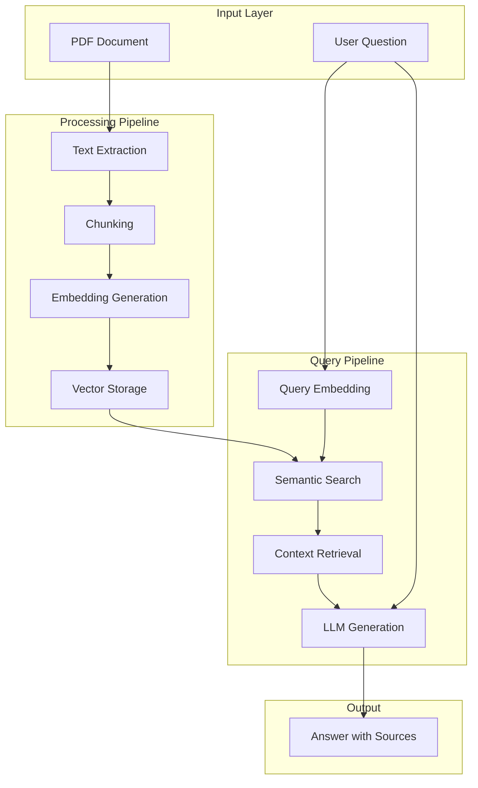
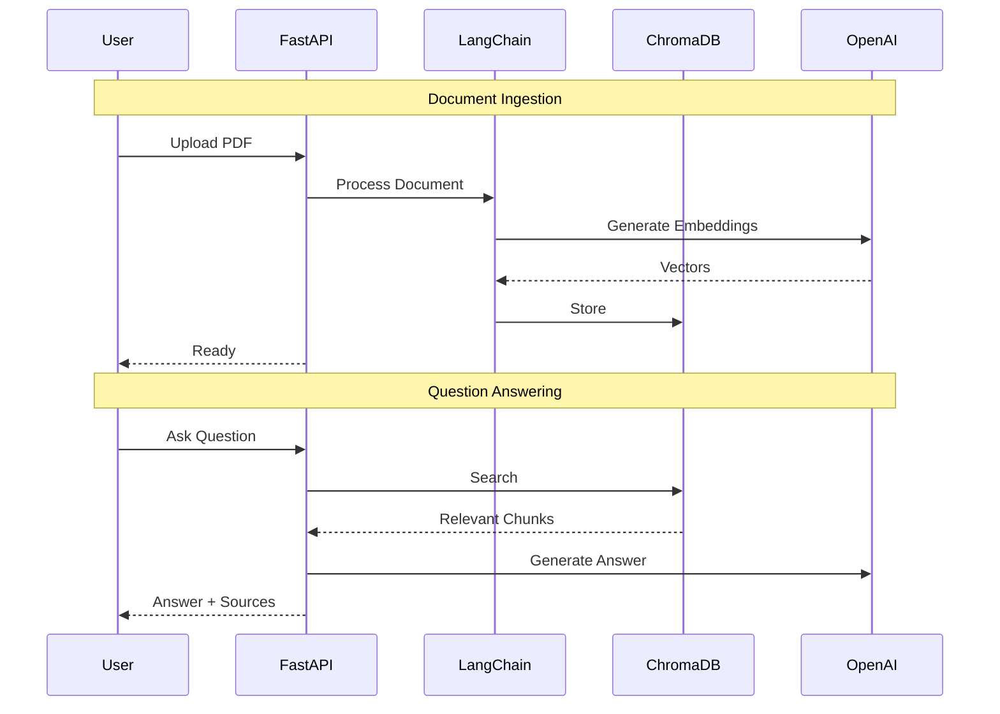

# Intelligent Document Q&A System

| Property | Value |
|----------|-------|
| **Difficulty** | Beginner |
| **Time** | ~2 hours |
| **Code Size** | ~150 LOC |

## Tech Stack

| Technology | Purpose |
|------------|---------|
| LangChain | RAG orchestration |
| OpenAI | Embeddings + GPT-4 |
| ChromaDB | Vector database |
| PyPDF | PDF extraction |
| FastAPI | REST API |

## Prerequisites

- Basic Python knowledge
- Understanding of APIs
- OpenAI API key ([Get one here](https://platform.openai.com))

## What You'll Learn

- Understand the RAG architecture pattern
- Extract and chunk text from PDF documents
- Create embeddings and store them in a vector database
- Implement semantic search retrieval
- Build a complete question-answering pipeline
- Create a REST API for your RAG system

---

## System Architecture



## Data Flow



---

## Project Structure

```
intelligent-doc-qa/
├── src/
│   ├── __init__.py
│   ├── config.py
│   ├── document_processor.py
│   ├── rag_engine.py
│   └── api.py
├── tests/
│   └── test_rag.py
├── data/
│   └── sample.pdf
├── .env
├── pyproject.toml
└── README.md
```

---

## Implementation

### Step 1: Project Setup

Create your project directory and set up the environment:

```bash
mkdir intelligent-doc-qa && cd intelligent-doc-qa
uv init
uv venv && source .venv/bin/activate
```

Install dependencies:

```bash
uv add langchain langchain-openai langchain-chroma
uv add chromadb pypdf python-dotenv
uv add fastapi uvicorn python-multipart
```

Create your `.env` file:

```bash title=".env"
OPENAI_API_KEY=sk-your-key-here
CHROMA_PERSIST_DIR=./chroma_db
CHUNK_SIZE=1000
CHUNK_OVERLAP=200
```

### Step 2: Configuration Module

Create `src/config.py` to manage environment variables:

```python title="src/config.py"
"""Configuration management for the RAG system."""
import os
from dotenv import load_dotenv

load_dotenv()

class Config:
    """Application configuration from environment variables."""

    OPENAI_API_KEY: str = os.getenv("OPENAI_API_KEY", "")
    CHROMA_PERSIST_DIR: str = os.getenv("CHROMA_PERSIST_DIR", "./chroma_db")
    CHUNK_SIZE: int = int(os.getenv("CHUNK_SIZE", "1000"))
    CHUNK_OVERLAP: int = int(os.getenv("CHUNK_OVERLAP", "200"))

    # Model settings
    EMBEDDING_MODEL: str = "text-embedding-3-small"
    LLM_MODEL: str = "gpt-4o-mini"
    TEMPERATURE: float = 0.1

    # Retrieval settings
    TOP_K: int = 4

    @classmethod
    def validate(cls) -> None:
        """Validate required configuration."""
        if not cls.OPENAI_API_KEY:
            raise ValueError("OPENAI_API_KEY is required")

config = Config()
```

> **Configuration notes:**
> - `CHUNK_SIZE=1000`: Balances context length with relevance
> - `CHUNK_OVERLAP=200`: Prevents losing context at chunk boundaries
> - `TOP_K=4`: Returns enough context without overwhelming the LLM

### Step 3: Document Processor

Create `src/document_processor.py` to handle PDF processing:

```python title="src/document_processor.py"
"""Document processing: extraction, chunking, and embedding."""
from pathlib import Path
from typing import List

from langchain_community.document_loaders import PyPDFLoader
from langchain.text_splitter import RecursiveCharacterTextSplitter
from langchain_core.documents import Document

from src.config import config


class DocumentProcessor:
    """Handles PDF loading, text extraction, and chunking."""

    def __init__(self):
        self.text_splitter = RecursiveCharacterTextSplitter(
            chunk_size=config.CHUNK_SIZE,
            chunk_overlap=config.CHUNK_OVERLAP,
            length_function=len,
            separators=["\n\n", "\n", ". ", " ", ""]
        )

    def load_pdf(self, file_path: str | Path) -> List[Document]:
        """Load a PDF and return raw documents."""
        loader = PyPDFLoader(str(file_path))
        return loader.load()

    def chunk_documents(self, documents: List[Document]) -> List[Document]:
        """Split documents into smaller chunks for embedding."""
        chunks = self.text_splitter.split_documents(documents)

        # Add chunk metadata
        for i, chunk in enumerate(chunks):
            chunk.metadata["chunk_id"] = i
            chunk.metadata["chunk_total"] = len(chunks)

        return chunks

    def process(self, file_path: str | Path) -> List[Document]:
        """Full pipeline: load PDF and chunk it."""
        documents = self.load_pdf(file_path)
        return self.chunk_documents(documents)
```

> **Chunking trade-offs:**
> - Too small: Loses context, fragments meaning
> - Too large: Dilutes relevance, wastes tokens
> - Sweet spot: 500-1500 characters with 10-20% overlap

### Step 4: RAG Engine

Create `src/rag_engine.py` - the core of the system:

```python title="src/rag_engine.py"
"""RAG Engine: Vector store management and question answering."""
from pathlib import Path
from typing import List, Optional

from langchain_openai import OpenAIEmbeddings, ChatOpenAI
from langchain_chroma import Chroma
from langchain_core.documents import Document
from langchain_core.prompts import ChatPromptTemplate
from langchain_core.output_parsers import StrOutputParser
from langchain_core.runnables import RunnablePassthrough

from src.config import config
from src.document_processor import DocumentProcessor


class RAGEngine:
    """Manages vector storage and RAG-based question answering."""

    def __init__(self):
        config.validate()

        self.embeddings = OpenAIEmbeddings(
            model=config.EMBEDDING_MODEL,
            openai_api_key=config.OPENAI_API_KEY
        )

        self.llm = ChatOpenAI(
            model=config.LLM_MODEL,
            temperature=config.TEMPERATURE,
            openai_api_key=config.OPENAI_API_KEY
        )

        self.processor = DocumentProcessor()
        self.vectorstore: Optional[Chroma] = None
        self._load_or_create_vectorstore()

    def _load_or_create_vectorstore(self) -> None:
        """Initialize or load existing vector store."""
        persist_dir = Path(config.CHROMA_PERSIST_DIR)

        self.vectorstore = Chroma(
            persist_directory=str(persist_dir),
            embedding_function=self.embeddings
        )

    def ingest_document(self, file_path: str | Path) -> int:
        """Process and store a document in the vector store."""
        chunks = self.processor.process(file_path)
        self.vectorstore.add_documents(chunks)
        return len(chunks)

    def _format_docs(self, docs: List[Document]) -> str:
        """Format retrieved documents for the prompt."""
        formatted = []
        for i, doc in enumerate(docs, 1):
            source = doc.metadata.get("source", "Unknown")
            page = doc.metadata.get("page", "?")
            formatted.append(
                f"[Source {i}: {Path(source).name}, Page {page}]\n{doc.page_content}"
            )
        return "\n\n---\n\n".join(formatted)

    def query(self, question: str) -> dict:
        """Answer a question using RAG."""
        if not self.vectorstore:
            raise ValueError("No documents ingested yet")

        # Retrieve relevant chunks
        retriever = self.vectorstore.as_retriever(
            search_type="similarity",
            search_kwargs={"k": config.TOP_K}
        )

        # RAG prompt template
        prompt = ChatPromptTemplate.from_messages([
            ("system", """You are a helpful assistant that answers questions based on the provided context.

Instructions:
- Answer ONLY based on the context provided
- If the answer is not in the context, say "I cannot find this information in the document"
- Cite the source numbers when possible
- Be concise but thorough"""),
            ("human", """Context:
{context}

Question: {question}

Answer:""")
        ])

        # Build the RAG chain
        chain = (
            {"context": retriever | self._format_docs, "question": RunnablePassthrough()}
            | prompt
            | self.llm
            | StrOutputParser()
        )

        # Execute and get results
        answer = chain.invoke(question)
        source_docs = retriever.invoke(question)

        return {
            "answer": answer,
            "sources": [
                {
                    "content": doc.page_content[:200] + "...",
                    "page": doc.metadata.get("page"),
                    "source": doc.metadata.get("source")
                }
                for doc in source_docs
            ]
        }

    def clear_vectorstore(self) -> None:
        """Clear all documents from the vector store."""
        if self.vectorstore:
            self.vectorstore.delete_collection()
            self._load_or_create_vectorstore()
```

### Step 5: FastAPI Application

Create `src/api.py` for the REST API:

```python title="src/api.py"
"""FastAPI application for the RAG system."""
import tempfile
from pathlib import Path

from fastapi import FastAPI, UploadFile, File, HTTPException
from fastapi.middleware.cors import CORSMiddleware
from pydantic import BaseModel

from src.rag_engine import RAGEngine


app = FastAPI(
    title="Intelligent Document Q&A API",
    description="RAG-powered document question answering system",
    version="1.0.0"
)

app.add_middleware(
    CORSMiddleware,
    allow_origins=["*"],
    allow_credentials=True,
    allow_methods=["*"],
    allow_headers=["*"],
)

# Initialize RAG engine
rag_engine = RAGEngine()


class QuestionRequest(BaseModel):
    question: str


class AnswerResponse(BaseModel):
    answer: str
    sources: list


class IngestResponse(BaseModel):
    message: str
    chunks_created: int


@app.get("/")
async def root():
    """Health check endpoint."""
    return {"status": "healthy", "service": "Intelligent Document Q&A"}


@app.post("/ingest", response_model=IngestResponse)
async def ingest_document(file: UploadFile = File(...)):
    """Upload and process a PDF document."""
    if not file.filename.endswith(".pdf"):
        raise HTTPException(status_code=400, detail="Only PDF files are supported")

    try:
        with tempfile.NamedTemporaryFile(delete=False, suffix=".pdf") as tmp:
            content = await file.read()
            tmp.write(content)
            tmp_path = tmp.name

        chunks_count = rag_engine.ingest_document(tmp_path)
        Path(tmp_path).unlink()

        return IngestResponse(
            message=f"Successfully processed {file.filename}",
            chunks_created=chunks_count
        )

    except Exception as e:
        raise HTTPException(status_code=500, detail=str(e))


@app.post("/query", response_model=AnswerResponse)
async def query_document(request: QuestionRequest):
    """Ask a question about the ingested documents."""
    if not request.question.strip():
        raise HTTPException(status_code=400, detail="Question cannot be empty")

    try:
        result = rag_engine.query(request.question)
        return AnswerResponse(**result)

    except ValueError as e:
        raise HTTPException(status_code=400, detail=str(e))
    except Exception as e:
        raise HTTPException(status_code=500, detail=str(e))


@app.delete("/clear")
async def clear_documents():
    """Clear all ingested documents."""
    rag_engine.clear_vectorstore()
    return {"message": "Vector store cleared successfully"}


if __name__ == "__main__":
    import uvicorn
    uvicorn.run(app, host="0.0.0.0", port=8000)
```

### Step 6: Run and Test

Start the server:

```bash
python -m uvicorn src.api:app --reload
```

Test with curl:

```bash
# Upload a PDF
curl -X POST "http://localhost:8000/ingest" \
  -H "accept: application/json" \
  -F "file=@your-document.pdf"

# Ask a question
curl -X POST "http://localhost:8000/query" \
  -H "Content-Type: application/json" \
  -d '{"question": "What is the main topic of this document?"}'
```

Or visit `http://localhost:8000/docs` for the interactive Swagger UI.

---

## Testing

Create `tests/test_rag.py`:

```python title="tests/test_rag.py"
"""Tests for the RAG system."""
import pytest
from src.document_processor import DocumentProcessor
from langchain_core.documents import Document


class TestDocumentProcessor:
    """Tests for document processing."""

    def test_chunking_preserves_content(self):
        """Verify chunking doesn't lose content."""
        processor = DocumentProcessor()

        test_doc = Document(
            page_content="A" * 2500,
            metadata={"source": "test.pdf", "page": 0}
        )

        chunks = processor.chunk_documents([test_doc])

        # Should create multiple chunks
        assert len(chunks) > 1

        # Total content should be preserved
        total_content = sum(len(c.page_content) for c in chunks)
        assert total_content >= 2500


# Run with: pytest tests/test_rag.py -v
```

---

## Debugging Tips

**No documents ingested yet**
- Ensure you've uploaded a PDF before querying
- Check that the vector store path is writable

**OpenAI API key invalid**
- Verify your `.env` file has the correct key
- Check for extra whitespace in the key

**PDF processing failed**
- Ensure the PDF isn't password-protected
- Some scanned PDFs need OCR preprocessing

---

## Extensions

| Level | Ideas |
|-------|-------|
| Easy | Add conversation history, support multiple file formats, add streaming |
| Medium | Add reranking with Cohere, implement hybrid search, citation highlighting |
| Advanced | RAG evaluation pipeline, async processing queue, multi-tenancy support |

---

## Resources

- [LangChain Docs](https://python.langchain.com/docs/)
- [ChromaDB Docs](https://docs.trychroma.com/)
- [OpenAI API Reference](https://platform.openai.com/docs/)
- [RAG Paper](https://arxiv.org/abs/2005.11401)

---

## Summary

You've built a complete RAG system that:
- Processes PDF documents into searchable chunks
- Creates and stores vector embeddings
- Performs semantic similarity search
- Generates contextual answers with sources
- Exposes a REST API for integration

**Next:** [Multi-Document RAG](/docs/rag/intermediate/multi-document-rag)
