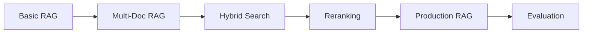

# RAG Projects

Retrieval-Augmented Generation combines the power of search with LLM generation for accurate, grounded responses. RAG is one of the most practical AI patterns in production today.

## Learning Path

## Projects

### Beginner

| Project | Description | Time |
|---------|-------------|------|
| [Intelligent Document Q&A](/docs/rag/basic/intelligent-document-qa) | Build a complete RAG system for PDF documents | ~2 hours |

### Intermediate

| Project | Description | Time |
|---------|-------------|------|
| [Multi-Document RAG](/docs/rag/intermediate/multi-document-rag) | Handle multiple documents with context management | ~4 hours |
| [RAG with Reranking](/docs/rag/intermediate/rag-with-reranking) | Improve retrieval accuracy with reranking | ~4 hours |
| [Hybrid Search](/docs/rag/intermediate/hybrid-search) | Combine keyword and semantic search | ~4 hours |
| [Conversational RAG](/docs/rag/intermediate/conversational-rag) | Add memory and context to your RAG system | ~4 hours |

### Advanced

| Project | Description | Time |
|---------|-------------|------|
| [Production RAG Pipeline](/docs/rag/advanced/production-pipeline) | End-to-end production system with evaluation | ~3 days |
| [Graph RAG](/docs/rag/advanced/graph-rag) | Knowledge graph enhanced retrieval | ~3 days |
| [Multi-Modal RAG](/docs/rag/advanced/multi-modal-rag) | Handle images, tables, and text together | ~4 days |
| [Agentic RAG](/docs/rag/advanced/agentic-rag) | Self-correcting RAG with agents | ~4 days |

## Why Learn RAG?

| Benefit | Description |
|---------|-------------|
| **Accuracy** | Grounds LLM responses in your data |
| **Control** | Limits hallucinations with source attribution |
| **Scalability** | Works with any document corpus size |
| **Privacy** | Keep your data in your infrastructure |

## Key Concepts

Start with the [Intelligent Document Q&A](/docs/rag/basic/intelligent-document-qa) project to learn the fundamentals.
