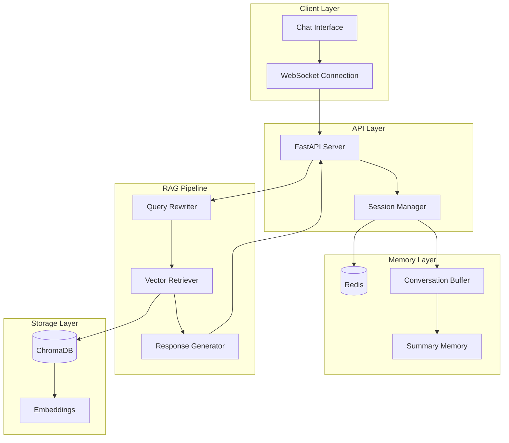
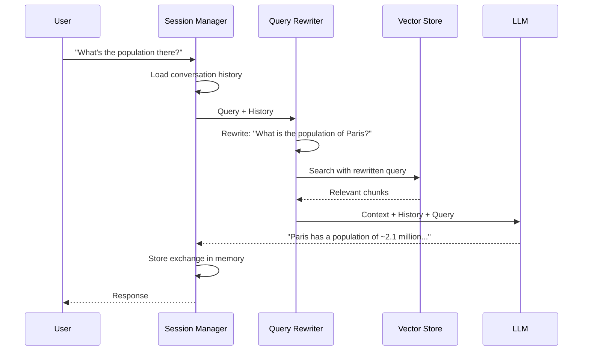

# Conversational RAG

| Property | Value |
|----------|-------|
| **Difficulty** | Intermediate |
| **Time** | ~4 hours |
| **Code Size** | ~250 LOC |

## Tech Stack

| Technology | Purpose |
|------------|---------|
| LangChain | Conversation chain orchestration |
| OpenAI | GPT-4 + Embeddings |
| ChromaDB | Vector storage |
| Redis | Session/memory storage (optional) |
| FastAPI | REST API with WebSocket support |

## Prerequisites

- Completed [Intelligent Document Q&A](/docs/rag/basic/intelligent-document-qa) tutorial
- Python 3.10+ with async/await understanding
- OpenAI API key ([Get one here](https://platform.openai.com))
- Basic understanding of REST APIs and WebSockets
- Docker (optional, for Redis)

## What You'll Learn

- Understand why basic RAG fails at conversations
- Implement conversation memory with multiple strategies
- Build query rewriting for context-aware retrieval
- Create session management for multi-user support
- Handle follow-up questions and coreference resolution
- Design a production-ready conversational interface

---

## The Problem with Basic RAG

Basic RAG treats each query independently. Consider this conversation:

```
User: What is the capital of France?
Bot:  The capital of France is Paris.

User: What's the population there?
Bot:  ❌ I cannot find information about population in the document.
```

The system fails because "there" refers to Paris, but the RAG system doesn't maintain context. **Conversational RAG** solves this by:

1. **Maintaining chat history** - Remembering previous exchanges
2. **Rewriting queries** - Transforming "there" → "Paris"
3. **Managing context windows** - Keeping relevant history without overwhelming the LLM

---

## System Architecture



## Conversation Flow



---

## Project Structure

```
conversational-rag/
├── src/
│   ├── __init__.py
│   ├── config.py
│   ├── memory/
│   │   ├── __init__.py
│   │   ├── base.py
│   │   ├── buffer.py
│   │   └── summary.py
│   ├── conversation/
│   │   ├── __init__.py
│   │   ├── rewriter.py
│   │   └── chain.py
│   ├── session.py
│   └── api.py
├── tests/
│   ├── test_memory.py
│   └── test_conversation.py
├── .env
├── pyproject.toml
└── README.md
```

---

## Implementation

### Step 1: Project Setup

Create your project and install dependencies:

```bash
mkdir conversational-rag && cd conversational-rag
uv init
uv venv && source .venv/bin/activate
```

```bash
uv add langchain langchain-openai langchain-chroma
uv add chromadb redis python-dotenv
uv add fastapi uvicorn websockets python-multipart
```

Configure environment variables:

```bash title=".env"
OPENAI_API_KEY=sk-your-key-here
CHROMA_PERSIST_DIR=./chroma_db
REDIS_URL=redis://localhost:6379

# Memory settings
MAX_HISTORY_LENGTH=10
SUMMARY_THRESHOLD=6

# Model settings
LLM_MODEL=gpt-4o-mini
EMBEDDING_MODEL=text-embedding-3-small
```

### Step 2: Configuration Module

```python title="src/config.py"
"""Configuration for Conversational RAG system."""
import os
from dotenv import load_dotenv

load_dotenv()


class Config:
    """Application configuration."""

    # API Keys
    OPENAI_API_KEY: str = os.getenv("OPENAI_API_KEY", "")

    # Storage
    CHROMA_PERSIST_DIR: str = os.getenv("CHROMA_PERSIST_DIR", "./chroma_db")
    REDIS_URL: str = os.getenv("REDIS_URL", "redis://localhost:6379")

    # Memory settings
    MAX_HISTORY_LENGTH: int = int(os.getenv("MAX_HISTORY_LENGTH", "10"))
    SUMMARY_THRESHOLD: int = int(os.getenv("SUMMARY_THRESHOLD", "6"))

    # Model settings
    LLM_MODEL: str = os.getenv("LLM_MODEL", "gpt-4o-mini")
    EMBEDDING_MODEL: str = os.getenv("EMBEDDING_MODEL", "text-embedding-3-small")
    TEMPERATURE: float = 0.1

    # Retrieval
    TOP_K: int = 4

    @classmethod
    def validate(cls) -> None:
        """Validate required configuration."""
        if not cls.OPENAI_API_KEY:
            raise ValueError("OPENAI_API_KEY is required")


config = Config()
```

### Step 3: Memory Base Class

The memory system is the heart of conversational RAG. We'll implement multiple strategies:

```python title="src/memory/base.py"
"""Base memory interface for conversation history."""
from abc import ABC, abstractmethod
from dataclasses import dataclass, field
from typing import List, Optional
from datetime import datetime


@dataclass
class Message:
    """A single conversation message."""

    role: str  # "human" or "assistant"
    content: str
    timestamp: datetime = field(default_factory=datetime.now)

    def to_dict(self) -> dict:
        return {
            "role": self.role,
            "content": self.content,
            "timestamp": self.timestamp.isoformat(),
        }

    @classmethod
    def from_dict(cls, data: dict) -> "Message":
        return cls(
            role=data["role"],
            content=data["content"],
            timestamp=datetime.fromisoformat(data["timestamp"]),
        )


@dataclass
class ConversationHistory:
    """Container for conversation history with metadata."""

    session_id: str
    messages: List[Message] = field(default_factory=list)
    summary: Optional[str] = None
    created_at: datetime = field(default_factory=datetime.now)

    def add_exchange(self, human_msg: str, ai_msg: str) -> None:
        """Add a human-AI exchange to history."""
        self.messages.append(Message(role="human", content=human_msg))
        self.messages.append(Message(role="assistant", content=ai_msg))

    def get_recent(self, n: int) -> List[Message]:
        """Get the n most recent messages."""
        return self.messages[-n:] if n > 0 else []

    def format_for_prompt(self, max_messages: int = 10) -> str:
        """Format history for inclusion in prompts."""
        recent = self.get_recent(max_messages)
        formatted = []

        for msg in recent:
            prefix = "Human" if msg.role == "human" else "Assistant"
            formatted.append(f"{prefix}: {msg.content}")

        return "\n".join(formatted)


class BaseMemory(ABC):
    """Abstract base class for memory implementations."""

    @abstractmethod
    def load(self, session_id: str) -> ConversationHistory:
        """Load conversation history for a session."""
        pass

    @abstractmethod
    def save(self, history: ConversationHistory) -> None:
        """Save conversation history."""
        pass

    @abstractmethod
    def clear(self, session_id: str) -> None:
        """Clear history for a session."""
        pass
```

> **Design Decision**: We separate `Message` and `ConversationHistory` to allow flexible serialization and future extensions like message metadata (tokens used, retrieval scores, etc.).

### Step 4: Buffer Memory Implementation

Buffer memory keeps the last N messages in memory:

```python title="src/memory/buffer.py"
"""Buffer memory - keeps last N messages."""
from typing import Dict
from src.memory.base import BaseMemory, ConversationHistory


class BufferMemory(BaseMemory):
    """In-memory buffer for conversation history.

    Simple and fast, but loses data on restart.
    Best for: Development, single-server deployments, short sessions.
    """

    def __init__(self, max_messages: int = 20):
        self.max_messages = max_messages
        self._store: Dict[str, ConversationHistory] = {}

    def load(self, session_id: str) -> ConversationHistory:
        """Load or create conversation history."""
        if session_id not in self._store:
            self._store[session_id] = ConversationHistory(session_id=session_id)
        return self._store[session_id]

    def save(self, history: ConversationHistory) -> None:
        """Save history, trimming if needed."""
        # Trim to max messages
        if len(history.messages) > self.max_messages:
            history.messages = history.messages[-self.max_messages :]

        self._store[history.session_id] = history

    def clear(self, session_id: str) -> None:
        """Clear session history."""
        if session_id in self._store:
            del self._store[session_id]

    def get_all_sessions(self) -> list:
        """Get all active session IDs."""
        return list(self._store.keys())
```

### Step 5: Summary Memory Implementation

For long conversations, we compress old messages into summaries:

```python title="src/memory/summary.py"
"""Summary memory - compresses old messages into summaries."""
from langchain_openai import ChatOpenAI
from langchain_core.prompts import ChatPromptTemplate

from src.config import config
from src.memory.base import BaseMemory, ConversationHistory, Message


class SummaryMemory(BaseMemory):
    """Memory that summarizes old conversations.

    Keeps recent messages verbatim, summarizes older ones.
    Best for: Long conversations, token optimization.
    """

    def __init__(
        self,
        recent_messages: int = 6,
        summary_threshold: int = 10,
    ):
        self.recent_messages = recent_messages
        self.summary_threshold = summary_threshold
        self._store: dict = {}

        self.llm = ChatOpenAI(
            model=config.LLM_MODEL,
            temperature=0,
            openai_api_key=config.OPENAI_API_KEY,
        )

        self.summary_prompt = ChatPromptTemplate.from_messages([
            ("system", """You are a conversation summarizer. Create a concise summary
of the conversation that captures:
- Key topics discussed
- Important facts or decisions
- Any unresolved questions

Be concise but preserve critical context."""),
            ("human", """Previous summary (if any):
{previous_summary}

New messages to incorporate:
{new_messages}

Create an updated summary:"""),
        ])

    def load(self, session_id: str) -> ConversationHistory:
        """Load conversation history."""
        if session_id not in self._store:
            self._store[session_id] = ConversationHistory(session_id=session_id)
        return self._store[session_id]

    def save(self, history: ConversationHistory) -> None:
        """Save history, creating summary if needed."""
        if len(history.messages) >= self.summary_threshold:
            history = self._create_summary(history)

        self._store[history.session_id] = history

    def _create_summary(self, history: ConversationHistory) -> ConversationHistory:
        """Summarize older messages."""
        # Split into messages to summarize and recent to keep
        to_summarize = history.messages[: -self.recent_messages]
        to_keep = history.messages[-self.recent_messages :]

        if not to_summarize:
            return history

        # Format messages for summarization
        messages_text = "\n".join(
            f"{m.role.title()}: {m.content}" for m in to_summarize
        )

        # Generate summary
        chain = self.summary_prompt | self.llm
        result = chain.invoke({
            "previous_summary": history.summary or "No previous summary.",
            "new_messages": messages_text,
        })

        # Update history
        history.summary = result.content
        history.messages = to_keep

        return history

    def clear(self, session_id: str) -> None:
        """Clear session history."""
        if session_id in self._store:
            del self._store[session_id]

    def format_with_summary(self, history: ConversationHistory) -> str:
        """Format history including summary for prompts."""
        parts = []

        if history.summary:
            parts.append(f"[Previous conversation summary]\n{history.summary}\n")

        if history.messages:
            parts.append("[Recent messages]")
            parts.append(history.format_for_prompt())

        return "\n".join(parts)
```

> **Memory Trade-offs**:
> - **Buffer**: Fast, simple, but limited context window
> - **Summary**: Longer context, but loses detail and adds latency
> - **Hybrid**: Best of both - use summary for old, buffer for recent

### Step 6: Query Rewriter

The query rewriter transforms ambiguous queries using conversation context:

```python title="src/conversation/rewriter.py"
"""Query rewriter for context-aware search."""
from langchain_openai import ChatOpenAI
from langchain_core.prompts import ChatPromptTemplate
from langchain_core.output_parsers import StrOutputParser

from src.config import config
from src.memory.base import ConversationHistory


class QueryRewriter:
    """Rewrites queries to be self-contained using conversation context.

    Handles:
    - Pronouns: "it", "they", "there" → actual entities
    - Implicit references: "the same thing" → specific topic
    - Follow-ups: "tell me more" → expand on specific subject
    """

    def __init__(self):
        self.llm = ChatOpenAI(
            model=config.LLM_MODEL,
            temperature=0,
            openai_api_key=config.OPENAI_API_KEY,
        )

        self.rewrite_prompt = ChatPromptTemplate.from_messages([
            ("system", """You are a query rewriter for a RAG system. Your job is to
rewrite user queries to be self-contained and searchable.

Rules:
1. Replace pronouns with their referents from conversation history
2. Expand implicit references to be explicit
3. Keep the rewritten query concise and search-friendly
4. If the query is already self-contained, return it unchanged
5. ONLY output the rewritten query, nothing else

Examples:
- "What about its population?" → "What is the population of Paris?"
- "Tell me more" → "Tell me more about the RAG architecture we discussed"
- "How does that work?" → "How does vector similarity search work?"
"""),
            ("human", """Conversation history:
{history}

Current query: {query}

Rewritten query:"""),
        ])

        self.chain = self.rewrite_prompt | self.llm | StrOutputParser()

    def rewrite(self, query: str, history: ConversationHistory) -> str:
        """Rewrite query using conversation context.

        Args:
            query: The user's current query
            history: Conversation history for context

        Returns:
            Rewritten, self-contained query
        """
        # If no history, return as-is
        if not history.messages:
            return query

        # Get recent history for context
        history_text = history.format_for_prompt(max_messages=6)

        # Rewrite
        rewritten = self.chain.invoke({
            "history": history_text,
            "query": query,
        })

        return rewritten.strip()

    def needs_rewriting(self, query: str) -> bool:
        """Quick check if query likely needs rewriting.

        Uses heuristics to avoid unnecessary LLM calls.
        """
        # Pronouns that often need resolution
        pronouns = {"it", "its", "they", "them", "their", "there", "this", "that", "these", "those"}

        # Vague references
        vague = {"the same", "more about", "tell me more", "what about", "how about"}

        query_lower = query.lower()
        words = set(query_lower.split())

        # Check for pronouns
        if words & pronouns:
            return True

        # Check for vague phrases
        for phrase in vague:
            if phrase in query_lower:
                return True

        return False
```

### Step 7: Conversation Chain

The main chain that orchestrates the entire conversation:

```python title="src/conversation/chain.py"
"""Main conversation chain combining all components."""
from typing import Optional
from pathlib import Path

from langchain_openai import OpenAIEmbeddings, ChatOpenAI
from langchain_chroma import Chroma
from langchain_core.prompts import ChatPromptTemplate
from langchain_core.output_parsers import StrOutputParser
from langchain_core.documents import Document

from src.config import config
from src.memory.base import ConversationHistory
from src.memory.summary import SummaryMemory
from src.conversation.rewriter import QueryRewriter


class ConversationalRAG:
    """Complete conversational RAG system.

    Combines:
    - Memory management (buffer + summary)
    - Query rewriting
    - Vector retrieval
    - Context-aware generation
    """

    def __init__(self):
        config.validate()

        # Initialize components
        self.memory = SummaryMemory(
            recent_messages=config.MAX_HISTORY_LENGTH,
            summary_threshold=config.SUMMARY_THRESHOLD,
        )
        self.rewriter = QueryRewriter()

        # Embeddings and vector store
        self.embeddings = OpenAIEmbeddings(
            model=config.EMBEDDING_MODEL,
            openai_api_key=config.OPENAI_API_KEY,
        )

        self.vectorstore = Chroma(
            persist_directory=config.CHROMA_PERSIST_DIR,
            embedding_function=self.embeddings,
        )

        # LLM for generation
        self.llm = ChatOpenAI(
            model=config.LLM_MODEL,
            temperature=config.TEMPERATURE,
            openai_api_key=config.OPENAI_API_KEY,
        )

        # Response prompt
        self.response_prompt = ChatPromptTemplate.from_messages([
            ("system", """You are a helpful assistant engaged in a conversation.
Use the provided context and conversation history to answer questions.

Guidelines:
- Answer based on the context provided
- Reference previous conversation when relevant
- If you don't know, say so clearly
- Be conversational but accurate
- Cite sources when possible"""),
            ("human", """Conversation Context:
{conversation_context}

Retrieved Information:
{retrieved_context}

Current Question: {question}

Please provide a helpful response:"""),
        ])

    def ingest_documents(self, file_path: str | Path) -> int:
        """Ingest documents into vector store."""
        from langchain_community.document_loaders import PyPDFLoader
        from langchain.text_splitter import RecursiveCharacterTextSplitter

        loader = PyPDFLoader(str(file_path))
        documents = loader.load()

        splitter = RecursiveCharacterTextSplitter(
            chunk_size=1000,
            chunk_overlap=200,
        )
        chunks = splitter.split_documents(documents)

        self.vectorstore.add_documents(chunks)
        return len(chunks)

    def _retrieve(self, query: str, k: int = 4) -> list[Document]:
        """Retrieve relevant documents."""
        retriever = self.vectorstore.as_retriever(
            search_type="similarity",
            search_kwargs={"k": k},
        )
        return retriever.invoke(query)

    def _format_docs(self, docs: list[Document]) -> str:
        """Format retrieved documents for the prompt."""
        formatted = []
        for i, doc in enumerate(docs, 1):
            source = doc.metadata.get("source", "Unknown")
            page = doc.metadata.get("page", "?")
            formatted.append(
                f"[{i}] (Source: {Path(source).name}, Page {page})\n{doc.page_content}"
            )
        return "\n\n".join(formatted)

    def chat(
        self,
        session_id: str,
        query: str,
        use_rewriting: bool = True,
    ) -> dict:
        """Process a chat message.

        Args:
            session_id: Unique session identifier
            query: User's question
            use_rewriting: Whether to rewrite ambiguous queries

        Returns:
            Dict with answer, sources, and metadata
        """
        # Load conversation history
        history = self.memory.load(session_id)

        # Rewrite query if needed
        search_query = query
        was_rewritten = False

        if use_rewriting and self.rewriter.needs_rewriting(query):
            search_query = self.rewriter.rewrite(query, history)
            was_rewritten = search_query != query

        # Retrieve relevant documents
        docs = self._retrieve(search_query, k=config.TOP_K)
        retrieved_context = self._format_docs(docs)

        # Format conversation context
        conversation_context = self.memory.format_with_summary(history)

        # Generate response
        chain = self.response_prompt | self.llm | StrOutputParser()
        response = chain.invoke({
            "conversation_context": conversation_context or "No previous conversation.",
            "retrieved_context": retrieved_context or "No relevant documents found.",
            "question": query,
        })

        # Update history
        history.add_exchange(query, response)
        self.memory.save(history)

        return {
            "answer": response,
            "original_query": query,
            "rewritten_query": search_query if was_rewritten else None,
            "sources": [
                {
                    "content": doc.page_content[:200] + "...",
                    "source": doc.metadata.get("source"),
                    "page": doc.metadata.get("page"),
                }
                for doc in docs
            ],
            "session_id": session_id,
            "message_count": len(history.messages),
        }

    def get_history(self, session_id: str) -> ConversationHistory:
        """Get conversation history for a session."""
        return self.memory.load(session_id)

    def clear_session(self, session_id: str) -> None:
        """Clear a conversation session."""
        self.memory.clear(session_id)
```

### Step 8: Session Manager

Handles multi-user sessions with Redis for production:

```python title="src/session.py"
"""Session management for multi-user support."""
import json
import uuid
from typing import Optional
from datetime import datetime, timedelta

try:
    import redis
    REDIS_AVAILABLE = True
except ImportError:
    REDIS_AVAILABLE = False

from src.config import config
from src.memory.base import ConversationHistory, Message


class SessionManager:
    """Manages user sessions with optional Redis backing.

    Features:
    - Session creation and validation
    - TTL-based expiration
    - Fallback to in-memory storage
    """

    def __init__(self, ttl_hours: int = 24):
        self.ttl = timedelta(hours=ttl_hours)
        self._local_store: dict = {}

        # Try to connect to Redis
        self.redis_client = None
        if REDIS_AVAILABLE:
            try:
                self.redis_client = redis.from_url(config.REDIS_URL)
                self.redis_client.ping()
            except (redis.ConnectionError, redis.RedisError):
                self.redis_client = None

    @property
    def using_redis(self) -> bool:
        """Check if Redis is being used."""
        return self.redis_client is not None

    def create_session(self) -> str:
        """Create a new session."""
        session_id = str(uuid.uuid4())

        session_data = {
            "created_at": datetime.now().isoformat(),
            "last_active": datetime.now().isoformat(),
        }

        if self.redis_client:
            self.redis_client.setex(
                f"session:{session_id}",
                self.ttl,
                json.dumps(session_data),
            )
        else:
            self._local_store[session_id] = session_data

        return session_id

    def validate_session(self, session_id: str) -> bool:
        """Check if a session is valid."""
        if self.redis_client:
            return self.redis_client.exists(f"session:{session_id}") > 0
        return session_id in self._local_store

    def touch_session(self, session_id: str) -> None:
        """Update session last active time."""
        if self.redis_client:
            data = self.redis_client.get(f"session:{session_id}")
            if data:
                session_data = json.loads(data)
                session_data["last_active"] = datetime.now().isoformat()
                self.redis_client.setex(
                    f"session:{session_id}",
                    self.ttl,
                    json.dumps(session_data),
                )
        elif session_id in self._local_store:
            self._local_store[session_id]["last_active"] = datetime.now().isoformat()

    def delete_session(self, session_id: str) -> None:
        """Delete a session."""
        if self.redis_client:
            self.redis_client.delete(f"session:{session_id}")
        elif session_id in self._local_store:
            del self._local_store[session_id]

    def save_history(self, session_id: str, history: ConversationHistory) -> None:
        """Save conversation history to session store."""
        history_data = {
            "session_id": history.session_id,
            "messages": [m.to_dict() for m in history.messages],
            "summary": history.summary,
            "created_at": history.created_at.isoformat(),
        }

        if self.redis_client:
            self.redis_client.setex(
                f"history:{session_id}",
                self.ttl,
                json.dumps(history_data),
            )
        else:
            self._local_store[f"history:{session_id}"] = history_data

    def load_history(self, session_id: str) -> Optional[ConversationHistory]:
        """Load conversation history from session store."""
        data = None

        if self.redis_client:
            raw = self.redis_client.get(f"history:{session_id}")
            if raw:
                data = json.loads(raw)
        else:
            data = self._local_store.get(f"history:{session_id}")

        if not data:
            return None

        history = ConversationHistory(
            session_id=data["session_id"],
            messages=[Message.from_dict(m) for m in data["messages"]],
            summary=data.get("summary"),
            created_at=datetime.fromisoformat(data["created_at"]),
        )

        return history
```

### Step 9: FastAPI Application

The API with both REST and WebSocket support:

```python title="src/api.py"
"""FastAPI application with REST and WebSocket endpoints."""
import asyncio
from typing import Optional
from contextlib import asynccontextmanager

from fastapi import FastAPI, HTTPException, WebSocket, WebSocketDisconnect, UploadFile, File
from fastapi.middleware.cors import CORSMiddleware
from pydantic import BaseModel
import tempfile
from pathlib import Path

from src.conversation.chain import ConversationalRAG
from src.session import SessionManager


# Global instances
rag_engine: Optional[ConversationalRAG] = None
session_manager: Optional[SessionManager] = None


@asynccontextmanager
async def lifespan(app: FastAPI):
    """Initialize resources on startup."""
    global rag_engine, session_manager
    rag_engine = ConversationalRAG()
    session_manager = SessionManager()
    yield
    # Cleanup if needed


app = FastAPI(
    title="Conversational RAG API",
    description="Multi-turn conversational document Q&A system",
    version="1.0.0",
    lifespan=lifespan,
)

app.add_middleware(
    CORSMiddleware,
    allow_origins=["*"],
    allow_credentials=True,
    allow_methods=["*"],
    allow_headers=["*"],
)


# Request/Response Models
class ChatRequest(BaseModel):
    query: str
    session_id: Optional[str] = None


class ChatResponse(BaseModel):
    answer: str
    session_id: str
    original_query: str
    rewritten_query: Optional[str] = None
    sources: list
    message_count: int


class SessionResponse(BaseModel):
    session_id: str
    message: str


# REST Endpoints
@app.get("/")
async def health():
    """Health check."""
    return {
        "status": "healthy",
        "service": "Conversational RAG",
        "redis_connected": session_manager.using_redis if session_manager else False,
    }


@app.post("/session", response_model=SessionResponse)
async def create_session():
    """Create a new conversation session."""
    session_id = session_manager.create_session()
    return SessionResponse(
        session_id=session_id,
        message="Session created successfully",
    )


@app.delete("/session/{session_id}")
async def delete_session(session_id: str):
    """Delete a conversation session."""
    if not session_manager.validate_session(session_id):
        raise HTTPException(status_code=404, detail="Session not found")

    session_manager.delete_session(session_id)
    rag_engine.clear_session(session_id)

    return {"message": "Session deleted successfully"}


@app.post("/ingest")
async def ingest_document(file: UploadFile = File(...)):
    """Upload and process a PDF document."""
    if not file.filename.endswith(".pdf"):
        raise HTTPException(status_code=400, detail="Only PDF files supported")

    try:
        with tempfile.NamedTemporaryFile(delete=False, suffix=".pdf") as tmp:
            content = await file.read()
            tmp.write(content)
            tmp_path = tmp.name

        chunks = rag_engine.ingest_documents(tmp_path)
        Path(tmp_path).unlink()

        return {
            "message": f"Successfully processed {file.filename}",
            "chunks_created": chunks,
        }
    except Exception as e:
        raise HTTPException(status_code=500, detail=str(e))


@app.post("/chat", response_model=ChatResponse)
async def chat(request: ChatRequest):
    """Send a chat message."""
    # Create session if not provided
    session_id = request.session_id
    if not session_id:
        session_id = session_manager.create_session()
    elif not session_manager.validate_session(session_id):
        raise HTTPException(status_code=404, detail="Invalid session")

    # Update session activity
    session_manager.touch_session(session_id)

    try:
        result = rag_engine.chat(session_id, request.query)
        return ChatResponse(**result)
    except Exception as e:
        raise HTTPException(status_code=500, detail=str(e))


@app.get("/history/{session_id}")
async def get_history(session_id: str):
    """Get conversation history for a session."""
    if not session_manager.validate_session(session_id):
        raise HTTPException(status_code=404, detail="Session not found")

    history = rag_engine.get_history(session_id)

    return {
        "session_id": session_id,
        "message_count": len(history.messages),
        "has_summary": history.summary is not None,
        "messages": [
            {"role": m.role, "content": m.content}
            for m in history.messages
        ],
    }


# WebSocket for real-time chat
@app.websocket("/ws/{session_id}")
async def websocket_chat(websocket: WebSocket, session_id: str):
    """WebSocket endpoint for real-time conversation."""
    await websocket.accept()

    # Validate or create session
    if not session_manager.validate_session(session_id):
        session_manager.create_session()

    try:
        while True:
            # Receive message
            data = await websocket.receive_json()
            query = data.get("query", "")

            if not query:
                await websocket.send_json({"error": "Empty query"})
                continue

            # Process message
            try:
                result = rag_engine.chat(session_id, query)
                await websocket.send_json({
                    "type": "response",
                    "data": result,
                })
            except Exception as e:
                await websocket.send_json({
                    "type": "error",
                    "message": str(e),
                })

    except WebSocketDisconnect:
        pass  # Client disconnected


# Run with: uvicorn src.api:app --reload
if __name__ == "__main__":
    import uvicorn
    uvicorn.run(app, host="0.0.0.0", port=8000)
```

---

## Testing

```python title="tests/test_conversation.py"
"""Tests for conversational RAG components."""
import pytest
from src.memory.base import Message, ConversationHistory
from src.memory.buffer import BufferMemory
from src.conversation.rewriter import QueryRewriter


class TestConversationHistory:
    """Tests for ConversationHistory."""

    def test_add_exchange(self):
        """Test adding a conversation exchange."""
        history = ConversationHistory(session_id="test")
        history.add_exchange("Hello", "Hi there!")

        assert len(history.messages) == 2
        assert history.messages[0].role == "human"
        assert history.messages[1].role == "assistant"

    def test_format_for_prompt(self):
        """Test formatting history for prompts."""
        history = ConversationHistory(session_id="test")
        history.add_exchange("What is RAG?", "RAG stands for...")
        history.add_exchange("How does it work?", "It works by...")

        formatted = history.format_for_prompt()

        assert "Human: What is RAG?" in formatted
        assert "Assistant: RAG stands for..." in formatted


class TestBufferMemory:
    """Tests for BufferMemory."""

    def test_load_creates_new_session(self):
        """Test that load creates new session if not exists."""
        memory = BufferMemory()
        history = memory.load("new-session")

        assert history.session_id == "new-session"
        assert len(history.messages) == 0

    def test_max_messages_trimming(self):
        """Test that old messages are trimmed."""
        memory = BufferMemory(max_messages=4)
        history = memory.load("test")

        # Add more than max
        for i in range(5):
            history.add_exchange(f"Q{i}", f"A{i}")

        memory.save(history)
        loaded = memory.load("test")

        assert len(loaded.messages) == 4


class TestQueryRewriter:
    """Tests for QueryRewriter."""

    def test_needs_rewriting_with_pronouns(self):
        """Test detection of queries needing rewriting."""
        rewriter = QueryRewriter()

        assert rewriter.needs_rewriting("What is it?") is True
        assert rewriter.needs_rewriting("Tell me more") is True
        assert rewriter.needs_rewriting("What is machine learning?") is False


# Run with: pytest tests/test_conversation.py -v
```

---

## Running the Application

### Start Redis (optional, for production)

```bash
# Using Docker
docker run -d --name redis -p 6379:6379 redis:alpine

# Or install locally
brew install redis && brew services start redis
```

### Start the API

```bash
uvicorn src.api:app --reload
```

### Test the Conversation

```bash
# Create a session
curl -X POST http://localhost:8000/session

# Upload a document
curl -X POST http://localhost:8000/ingest \
  -F "file=@your-document.pdf"

# Start chatting
curl -X POST http://localhost:8000/chat \
  -H "Content-Type: application/json" \
  -d '{"session_id": "YOUR_SESSION_ID", "query": "What is this document about?"}'

# Follow-up question (uses context!)
curl -X POST http://localhost:8000/chat \
  -H "Content-Type: application/json" \
  -d '{"session_id": "YOUR_SESSION_ID", "query": "Tell me more about that"}'
```

Visit `http://localhost:8000/docs` for interactive Swagger documentation.

---

## Debugging Tips

**Query not being rewritten correctly**
- Check the conversation history: `GET /history/{session_id}`
- The rewriter needs sufficient context (at least 2-3 exchanges)
- Adjust the rewrite prompt for your domain

**Memory growing too large**
- Lower `SUMMARY_THRESHOLD` to summarize more frequently
- Reduce `MAX_HISTORY_LENGTH` for shorter context

**Sessions expiring too quickly**
- Increase `ttl_hours` in SessionManager
- Check Redis connection if using distributed sessions

**Slow responses**
- Query rewriting adds ~500ms latency
- Consider caching frequent rewrites
- Use `needs_rewriting()` to skip unnecessary rewrites

---

## Key Concepts

### Why Query Rewriting Matters

Without rewriting, the retriever searches for "it" or "there" literally. With rewriting:

| Original Query | Context | Rewritten Query |
|---------------|---------|-----------------|
| "What about its price?" | Discussing iPhone | "What is the price of iPhone?" |
| "How does that compare?" | Comparing Python vs Java | "How does Python compare to Java?" |
| "Tell me more" | Discussing RAG architecture | "Tell me more about RAG architecture" |

### Memory Strategy Selection

| Strategy | Best For | Trade-off |
|----------|----------|-----------|
| **Buffer** | Short conversations, low latency | Limited context |
| **Summary** | Long conversations | Loses detail |
| **Hybrid** | Production systems | More complexity |

---

## Extensions

| Level | Ideas |
|-------|-------|
| Easy | Add typing indicators, message timestamps, export chat history |
| Medium | Implement streaming responses, add user authentication, multi-language support |
| Advanced | Add retrieval feedback loop, implement RAG fusion, A/B test rewriting strategies |

---

## Resources

- [LangChain Memory](https://python.langchain.com/docs/modules/memory/)
- [Conversation Design Patterns](https://arxiv.org/abs/2305.14283)
- [Query Rewriting for RAG](https://arxiv.org/abs/2401.10225)
- [Redis for Session Management](https://redis.io/docs/manual/patterns/)

---

## Summary

You've built a production-ready conversational RAG system that:

- **Maintains context** across multiple conversation turns
- **Rewrites queries** to resolve pronouns and references
- **Manages sessions** for multi-user support
- **Scales** with Redis-backed session storage
- **Provides** both REST and WebSocket interfaces

**Next:** [Multi-Document RAG](/docs/rag/intermediate/multi-document-rag) - Handle multiple documents with source attribution
