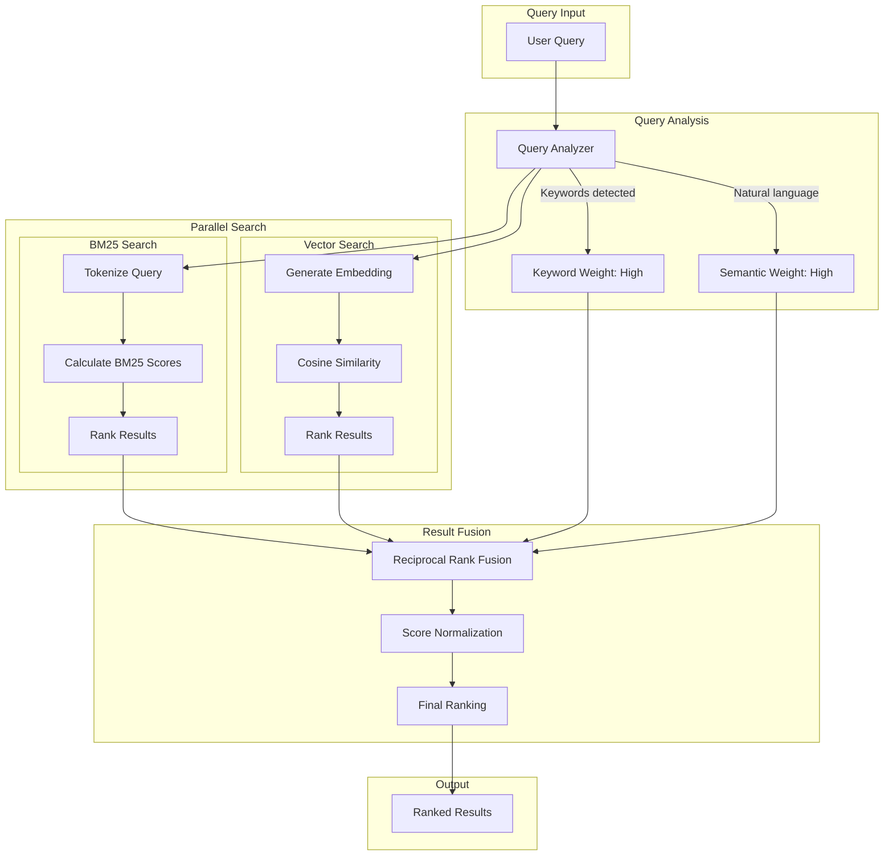
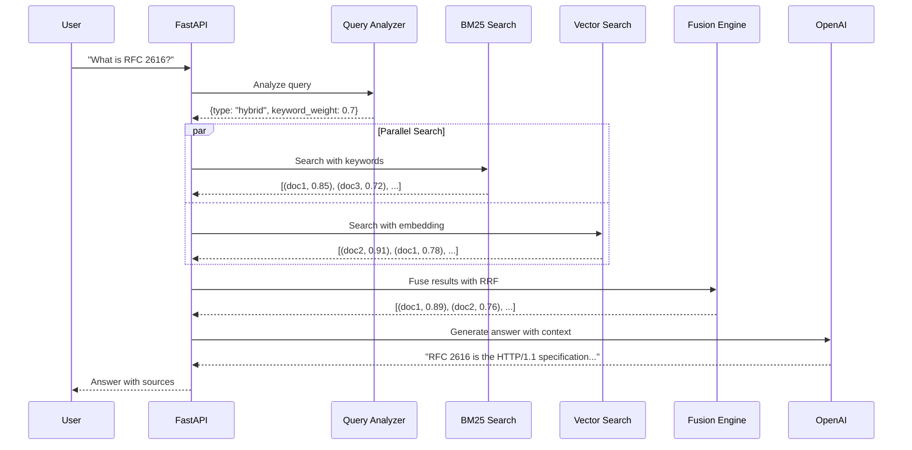

# Hybrid Search Implementation

| Property | Value |
|----------|-------|
| **Difficulty** | Intermediate |
| **Time** | ~4 hours |
| **Code Size** | ~300 LOC |
| **Prerequisites** | [Intelligent Document Q&A](/docs/rag/basic/intelligent-document-qa) |

## Tech Stack

| Technology | Purpose |
|------------|---------|
| LangChain | RAG orchestration |
| OpenAI | Embeddings + GPT-4 |
| ChromaDB | Vector storage |
| rank-bm25 | BM25 keyword search |
| FastAPI | REST API |

## Prerequisites

- Completed [Intelligent Document Q&A](/docs/rag/basic/intelligent-document-qa) tutorial
- Python 3.10+ with understanding of search algorithms
- OpenAI API key ([Get one here](https://platform.openai.com))
- Basic understanding of information retrieval concepts

## What You'll Learn

- Understand why pure semantic search fails in certain scenarios
- Implement BM25 keyword search from scratch
- Combine multiple search strategies using Reciprocal Rank Fusion (RRF)
- Build adaptive search that automatically balances keyword vs semantic
- Handle exact match requirements and technical terms
- Create a production-ready hybrid retrieval system

---

## The Problem with Pure Semantic Search

Pure vector search excels at understanding meaning but struggles with:

| Scenario | Problem | Example |
|----------|---------|---------|
| **Exact terms** | Semantic search finds similar meanings, not exact matches | Searching "RFC 2616" returns HTTP-related content but not the specific RFC |
| **Technical IDs** | Embeddings don't preserve exact identifiers | "Error code E1234" might match any error discussion |
| **Rare words** | Out-of-vocabulary terms get poor embeddings | Domain-specific jargon or new terminology |
| **Keyword-heavy queries** | Users often search with keywords, not questions | "python async timeout" vs "How do I set a timeout for async operations in Python?" |

**Hybrid search solves this** by combining the semantic understanding of vector search with the precision of keyword matching.

---

## System Architecture



## Search Flow



---

## Understanding the Algorithms

### BM25 (Best Matching 25)

BM25 is a probabilistic ranking function that scores documents based on term frequency and document length:

```
BM25(D, Q) = Σ IDF(qi) × (f(qi, D) × (k1 + 1)) / (f(qi, D) + k1 × (1 - b + b × |D|/avgdl))
```

Where:
- **IDF(qi)**: Inverse Document Frequency - rare terms score higher
- **f(qi, D)**: Term frequency in document D
- **k1**: Term frequency saturation (typically 1.2-2.0)
- **b**: Length normalization (typically 0.75)
- **|D|/avgdl**: Document length relative to average

### Reciprocal Rank Fusion (RRF)

RRF combines rankings from multiple sources without requiring score calibration:

```
RRF(d) = Σ 1 / (k + rank_i(d))
```

Where:
- **k**: Constant (typically 60) to prevent high-ranked items from dominating
- **rank_i(d)**: Rank of document d in result list i

**Why RRF works**: It focuses on rank positions rather than raw scores, making it robust to different scoring scales.

---

## Project Structure

```
hybrid-search/
├── src/
│   ├── __init__.py
│   ├── config.py
│   ├── bm25_search.py
│   ├── vector_search.py
│   ├── hybrid_retriever.py
│   ├── query_analyzer.py
│   ├── fusion.py
│   └── api.py
├── tests/
│   ├── test_bm25.py
│   ├── test_fusion.py
│   └── test_hybrid.py
├── data/
│   └── sample_docs/
├── .env
├── pyproject.toml
└── README.md
```

---

## Implementation

### Step 1: Project Setup

Create your project directory and set up the environment:

```bash
mkdir hybrid-search && cd hybrid-search
uv init
uv venv && source .venv/bin/activate
```

Install dependencies:

```bash
uv add langchain langchain-openai langchain-chroma
uv add chromadb python-dotenv
uv add fastapi uvicorn
uv add rank-bm25 nltk numpy
```

Create your `.env` file:

```bash title=".env"
OPENAI_API_KEY=sk-your-key-here
CHROMA_PERSIST_DIR=./chroma_db
CHUNK_SIZE=500
CHUNK_OVERLAP=50

# Hybrid search settings
BM25_WEIGHT=0.5
VECTOR_WEIGHT=0.5
RRF_K=60
TOP_K=10
```

### Step 2: Configuration Module

Create `src/config.py`:

```python title="src/config.py"
"""Configuration management for hybrid search system."""
import os
from dataclasses import dataclass
from dotenv import load_dotenv

load_dotenv()


@dataclass
class Config:
    """Application configuration from environment variables."""

    # API Keys
    OPENAI_API_KEY: str = os.getenv("OPENAI_API_KEY", "")

    # Storage
    CHROMA_PERSIST_DIR: str = os.getenv("CHROMA_PERSIST_DIR", "./chroma_db")

    # Chunking
    CHUNK_SIZE: int = int(os.getenv("CHUNK_SIZE", "500"))
    CHUNK_OVERLAP: int = int(os.getenv("CHUNK_OVERLAP", "50"))

    # Model settings
    EMBEDDING_MODEL: str = "text-embedding-3-small"
    LLM_MODEL: str = "gpt-4o-mini"

    # Hybrid search weights
    BM25_WEIGHT: float = float(os.getenv("BM25_WEIGHT", "0.5"))
    VECTOR_WEIGHT: float = float(os.getenv("VECTOR_WEIGHT", "0.5"))

    # RRF constant
    RRF_K: int = int(os.getenv("RRF_K", "60"))

    # Retrieval
    TOP_K: int = int(os.getenv("TOP_K", "10"))

    def validate(self) -> None:
        """Validate required configuration."""
        if not self.OPENAI_API_KEY:
            raise ValueError("OPENAI_API_KEY is required")

        # Ensure weights sum to 1
        total_weight = self.BM25_WEIGHT + self.VECTOR_WEIGHT
        if abs(total_weight - 1.0) > 0.01:
            raise ValueError(f"Weights must sum to 1.0, got {total_weight}")


config = Config()
```

### Step 3: BM25 Search Engine

Create `src/bm25_search.py`:

```python title="src/bm25_search.py"
"""BM25 keyword search implementation."""
import re
from typing import List, Tuple, Optional
from dataclasses import dataclass, field

import nltk
from rank_bm25 import BM25Okapi
from langchain_core.documents import Document

# Download required NLTK data
try:
    nltk.data.find('tokenizers/punkt')
except LookupError:
    nltk.download('punkt', quiet=True)

try:
    nltk.data.find('corpora/stopwords')
except LookupError:
    nltk.download('stopwords', quiet=True)

from nltk.corpus import stopwords
from nltk.tokenize import word_tokenize


@dataclass
class BM25Index:
    """BM25 search index for documents."""

    documents: List[Document] = field(default_factory=list)
    bm25: Optional[BM25Okapi] = None
    tokenized_corpus: List[List[str]] = field(default_factory=list)
    stop_words: set = field(default_factory=lambda: set(stopwords.words('english')))

    def _tokenize(self, text: str) -> List[str]:
        """Tokenize and preprocess text for BM25."""
        # Lowercase and extract words
        text = text.lower()

        # Keep alphanumeric tokens (preserves technical terms like "RFC2616")
        tokens = re.findall(r'\b[a-z0-9]+\b', text)

        # Remove stopwords but keep short technical terms
        tokens = [t for t in tokens if t not in self.stop_words or len(t) <= 2]

        return tokens

    def add_documents(self, documents: List[Document]) -> None:
        """Add documents to the BM25 index."""
        self.documents.extend(documents)

        # Tokenize all documents
        self.tokenized_corpus = [
            self._tokenize(doc.page_content)
            for doc in self.documents
        ]

        # Rebuild BM25 index
        self.bm25 = BM25Okapi(self.tokenized_corpus)

    def search(
        self,
        query: str,
        top_k: int = 10
    ) -> List[Tuple[Document, float]]:
        """Search documents using BM25."""
        if not self.bm25 or not self.documents:
            return []

        # Tokenize query
        query_tokens = self._tokenize(query)

        if not query_tokens:
            return []

        # Get BM25 scores
        scores = self.bm25.get_scores(query_tokens)

        # Get top-k indices sorted by score
        top_indices = sorted(
            range(len(scores)),
            key=lambda i: scores[i],
            reverse=True
        )[:top_k]

        # Return documents with scores
        results = [
            (self.documents[i], float(scores[i]))
            for i in top_indices
            if scores[i] > 0  # Only return docs with positive scores
        ]

        return results

    def clear(self) -> None:
        """Clear the index."""
        self.documents = []
        self.tokenized_corpus = []
        self.bm25 = None


class BM25SearchEngine:
    """BM25 search engine with document management."""

    def __init__(self):
        self.index = BM25Index()

    def index_documents(self, documents: List[Document]) -> int:
        """Index a list of documents."""
        self.index.add_documents(documents)
        return len(documents)

    def search(
        self,
        query: str,
        top_k: int = 10
    ) -> List[Tuple[Document, float]]:
        """Search for documents matching the query."""
        return self.index.search(query, top_k)

    def clear(self) -> None:
        """Clear all indexed documents."""
        self.index.clear()
```

> **BM25 Tuning Tips:**
> - `k1=1.2`: Default works well for most cases; increase for longer documents
> - `b=0.75`: Reduce for collections with uniform document lengths
> - Keep stopwords for phrase queries, remove for keyword queries

### Step 4: Vector Search Engine

Create `src/vector_search.py`:

```python title="src/vector_search.py"
"""Vector similarity search using ChromaDB and OpenAI embeddings."""
from pathlib import Path
from typing import List, Tuple, Optional

from langchain_openai import OpenAIEmbeddings
from langchain_chroma import Chroma
from langchain_core.documents import Document

from src.config import config


class VectorSearchEngine:
    """Vector similarity search engine using embeddings."""

    def __init__(self):
        config.validate()

        self.embeddings = OpenAIEmbeddings(
            model=config.EMBEDDING_MODEL,
            openai_api_key=config.OPENAI_API_KEY
        )

        self.vectorstore: Optional[Chroma] = None
        self._initialize_vectorstore()

    def _initialize_vectorstore(self) -> None:
        """Initialize or load existing vector store."""
        persist_dir = Path(config.CHROMA_PERSIST_DIR)
        persist_dir.mkdir(parents=True, exist_ok=True)

        self.vectorstore = Chroma(
            persist_directory=str(persist_dir),
            embedding_function=self.embeddings,
            collection_name="hybrid_search"
        )

    def index_documents(self, documents: List[Document]) -> int:
        """Add documents to the vector store."""
        if not documents:
            return 0

        self.vectorstore.add_documents(documents)
        return len(documents)

    def search(
        self,
        query: str,
        top_k: int = 10
    ) -> List[Tuple[Document, float]]:
        """Search for similar documents using vector similarity."""
        if not self.vectorstore:
            return []

        # Search with scores
        results = self.vectorstore.similarity_search_with_relevance_scores(
            query,
            k=top_k
        )

        # Convert to (Document, score) tuples
        return [(doc, score) for doc, score in results]

    def clear(self) -> None:
        """Clear all documents from the vector store."""
        if self.vectorstore:
            self.vectorstore.delete_collection()
            self._initialize_vectorstore()
```

### Step 5: Query Analyzer

Create `src/query_analyzer.py`:

```python title="src/query_analyzer.py"
"""Analyze queries to determine optimal search strategy."""
import re
from dataclasses import dataclass
from enum import Enum
from typing import Tuple


class QueryType(Enum):
    """Types of search queries."""
    KEYWORD = "keyword"      # Technical terms, IDs, exact matches
    SEMANTIC = "semantic"    # Natural language questions
    HYBRID = "hybrid"        # Mixed - use both strategies


@dataclass
class QueryAnalysis:
    """Result of query analysis."""
    query_type: QueryType
    bm25_weight: float
    vector_weight: float
    keywords: list[str]
    is_question: bool
    has_technical_terms: bool


class QueryAnalyzer:
    """Analyze queries to determine search strategy weights."""

    # Patterns indicating keyword-heavy queries
    TECHNICAL_PATTERNS = [
        r'\b[A-Z]{2,}[-_]?\d+\b',      # RFC2616, ISO-9001, ERROR_404
        r'\b[a-z]+_[a-z]+\b',           # snake_case identifiers
        r'\b[a-z]+[A-Z][a-z]+\b',       # camelCase identifiers
        r'\b\d+\.\d+\.\d+\b',           # version numbers
        r'\b0x[0-9a-fA-F]+\b',          # hex values
        r'"[^"]+"|\'[^\']+\'',          # quoted strings (exact match)
    ]

    # Question indicators
    QUESTION_WORDS = {'what', 'why', 'how', 'when', 'where', 'which', 'who', 'whom'}

    def __init__(
        self,
        default_bm25_weight: float = 0.5,
        default_vector_weight: float = 0.5
    ):
        self.default_bm25_weight = default_bm25_weight
        self.default_vector_weight = default_vector_weight

    def _extract_technical_terms(self, query: str) -> list[str]:
        """Extract technical terms and identifiers from query."""
        terms = []
        for pattern in self.TECHNICAL_PATTERNS:
            matches = re.findall(pattern, query)
            terms.extend(matches)
        return terms

    def _is_question(self, query: str) -> bool:
        """Check if query is a natural language question."""
        query_lower = query.lower().strip()

        # Ends with question mark
        if query.endswith('?'):
            return True

        # Starts with question word
        first_word = query_lower.split()[0] if query_lower else ""
        if first_word in self.QUESTION_WORDS:
            return True

        return False

    def _calculate_keyword_density(self, query: str) -> float:
        """Calculate the density of keyword-like terms in the query."""
        words = query.split()
        if not words:
            return 0.0

        # Count words that look like keywords (short, no stopwords)
        keyword_like = sum(
            1 for w in words
            if len(w) <= 15 and not w.lower() in {
                'the', 'a', 'an', 'is', 'are', 'was', 'were',
                'be', 'been', 'being', 'have', 'has', 'had',
                'do', 'does', 'did', 'will', 'would', 'could',
                'should', 'may', 'might', 'must', 'shall',
                'to', 'of', 'in', 'for', 'on', 'with', 'at',
                'by', 'from', 'as', 'into', 'through', 'during',
                'before', 'after', 'above', 'below', 'between',
                'and', 'but', 'or', 'nor', 'so', 'yet',
                'this', 'that', 'these', 'those', 'it', 'its'
            }
        )

        return keyword_like / len(words)

    def analyze(self, query: str) -> QueryAnalysis:
        """Analyze a query and determine optimal search weights."""
        technical_terms = self._extract_technical_terms(query)
        is_question = self._is_question(query)
        keyword_density = self._calculate_keyword_density(query)

        has_technical = len(technical_terms) > 0

        # Determine query type and weights
        if has_technical and not is_question:
            # Pure keyword query (e.g., "RFC 2616 HTTP headers")
            query_type = QueryType.KEYWORD
            bm25_weight = 0.8
            vector_weight = 0.2

        elif is_question and not has_technical:
            # Pure semantic query (e.g., "How does authentication work?")
            query_type = QueryType.SEMANTIC
            bm25_weight = 0.2
            vector_weight = 0.8

        elif has_technical and is_question:
            # Hybrid query (e.g., "What is RFC 2616?")
            query_type = QueryType.HYBRID
            bm25_weight = 0.6
            vector_weight = 0.4

        elif keyword_density > 0.7:
            # Keyword-heavy but no technical terms
            query_type = QueryType.KEYWORD
            bm25_weight = 0.7
            vector_weight = 0.3

        else:
            # Default hybrid
            query_type = QueryType.HYBRID
            bm25_weight = self.default_bm25_weight
            vector_weight = self.default_vector_weight

        return QueryAnalysis(
            query_type=query_type,
            bm25_weight=bm25_weight,
            vector_weight=vector_weight,
            keywords=technical_terms,
            is_question=is_question,
            has_technical_terms=has_technical
        )
```

> **Query Analysis Strategy:**
> - Technical terms → Boost BM25 (exact matching matters)
> - Natural questions → Boost vectors (semantic understanding matters)
> - Mixed queries → Balanced hybrid approach

### Step 6: Fusion Engine

Create `src/fusion.py`:

```python title="src/fusion.py"
"""Result fusion strategies for combining search results."""
from typing import List, Tuple, Dict
from dataclasses import dataclass
from abc import ABC, abstractmethod

from langchain_core.documents import Document

from src.config import config


@dataclass
class FusedResult:
    """A document with its fused score and component scores."""
    document: Document
    final_score: float
    bm25_score: float
    vector_score: float
    bm25_rank: int
    vector_rank: int


class FusionStrategy(ABC):
    """Abstract base class for fusion strategies."""

    @abstractmethod
    def fuse(
        self,
        bm25_results: List[Tuple[Document, float]],
        vector_results: List[Tuple[Document, float]],
        bm25_weight: float,
        vector_weight: float
    ) -> List[FusedResult]:
        """Fuse results from multiple search methods."""
        pass


class ReciprocalRankFusion(FusionStrategy):
    """Reciprocal Rank Fusion (RRF) strategy."""

    def __init__(self, k: int = 60):
        """
        Initialize RRF.

        Args:
            k: Constant to prevent high ranks from dominating.
               Higher k = more equal weight across ranks.
        """
        self.k = k

    def fuse(
        self,
        bm25_results: List[Tuple[Document, float]],
        vector_results: List[Tuple[Document, float]],
        bm25_weight: float = 0.5,
        vector_weight: float = 0.5
    ) -> List[FusedResult]:
        """
        Fuse results using Reciprocal Rank Fusion.

        RRF Score = Σ weight_i / (k + rank_i)
        """
        # Build doc_id -> info mapping
        doc_scores: Dict[str, Dict] = {}

        # Process BM25 results
        for rank, (doc, score) in enumerate(bm25_results, 1):
            doc_id = self._get_doc_id(doc)

            if doc_id not in doc_scores:
                doc_scores[doc_id] = {
                    'document': doc,
                    'bm25_score': 0.0,
                    'vector_score': 0.0,
                    'bm25_rank': len(bm25_results) + 1,
                    'vector_rank': len(vector_results) + 1,
                    'rrf_score': 0.0
                }

            doc_scores[doc_id]['bm25_score'] = score
            doc_scores[doc_id]['bm25_rank'] = rank
            doc_scores[doc_id]['rrf_score'] += bm25_weight / (self.k + rank)

        # Process vector results
        for rank, (doc, score) in enumerate(vector_results, 1):
            doc_id = self._get_doc_id(doc)

            if doc_id not in doc_scores:
                doc_scores[doc_id] = {
                    'document': doc,
                    'bm25_score': 0.0,
                    'vector_score': 0.0,
                    'bm25_rank': len(bm25_results) + 1,
                    'vector_rank': len(vector_results) + 1,
                    'rrf_score': 0.0
                }

            doc_scores[doc_id]['vector_score'] = score
            doc_scores[doc_id]['vector_rank'] = rank
            doc_scores[doc_id]['rrf_score'] += vector_weight / (self.k + rank)

        # Convert to FusedResult and sort by RRF score
        results = [
            FusedResult(
                document=info['document'],
                final_score=info['rrf_score'],
                bm25_score=info['bm25_score'],
                vector_score=info['vector_score'],
                bm25_rank=info['bm25_rank'],
                vector_rank=info['vector_rank']
            )
            for info in doc_scores.values()
        ]

        # Sort by final score descending
        results.sort(key=lambda x: x.final_score, reverse=True)

        return results

    def _get_doc_id(self, doc: Document) -> str:
        """Generate a unique identifier for a document."""
        # Use content hash as ID
        return str(hash(doc.page_content))


class WeightedScoreFusion(FusionStrategy):
    """Simple weighted score fusion with normalization."""

    def fuse(
        self,
        bm25_results: List[Tuple[Document, float]],
        vector_results: List[Tuple[Document, float]],
        bm25_weight: float = 0.5,
        vector_weight: float = 0.5
    ) -> List[FusedResult]:
        """
        Fuse results using normalized weighted scores.

        Final Score = bm25_weight * norm(bm25_score) + vector_weight * norm(vector_score)
        """
        # Normalize scores to [0, 1]
        bm25_normalized = self._normalize_scores(bm25_results)
        vector_normalized = self._normalize_scores(vector_results)

        # Build doc_id -> info mapping
        doc_scores: Dict[str, Dict] = {}

        for doc, score in bm25_normalized:
            doc_id = str(hash(doc.page_content))
            doc_scores[doc_id] = {
                'document': doc,
                'bm25_score': score,
                'vector_score': 0.0,
                'bm25_rank': 0,
                'vector_rank': 0
            }

        for doc, score in vector_normalized:
            doc_id = str(hash(doc.page_content))
            if doc_id in doc_scores:
                doc_scores[doc_id]['vector_score'] = score
            else:
                doc_scores[doc_id] = {
                    'document': doc,
                    'bm25_score': 0.0,
                    'vector_score': score,
                    'bm25_rank': 0,
                    'vector_rank': 0
                }

        # Calculate weighted scores
        results = []
        for info in doc_scores.values():
            final_score = (
                bm25_weight * info['bm25_score'] +
                vector_weight * info['vector_score']
            )
            results.append(FusedResult(
                document=info['document'],
                final_score=final_score,
                bm25_score=info['bm25_score'],
                vector_score=info['vector_score'],
                bm25_rank=info['bm25_rank'],
                vector_rank=info['vector_rank']
            ))

        results.sort(key=lambda x: x.final_score, reverse=True)
        return results

    def _normalize_scores(
        self,
        results: List[Tuple[Document, float]]
    ) -> List[Tuple[Document, float]]:
        """Normalize scores to [0, 1] range using min-max normalization."""
        if not results:
            return []

        scores = [score for _, score in results]
        min_score = min(scores)
        max_score = max(scores)

        if max_score == min_score:
            return [(doc, 1.0) for doc, _ in results]

        return [
            (doc, (score - min_score) / (max_score - min_score))
            for doc, score in results
        ]


class FusionEngine:
    """Engine for fusing search results."""

    def __init__(self, strategy: str = "rrf"):
        """
        Initialize fusion engine.

        Args:
            strategy: "rrf" for Reciprocal Rank Fusion,
                     "weighted" for weighted score fusion
        """
        if strategy == "rrf":
            self.strategy = ReciprocalRankFusion(k=config.RRF_K)
        elif strategy == "weighted":
            self.strategy = WeightedScoreFusion()
        else:
            raise ValueError(f"Unknown fusion strategy: {strategy}")

    def fuse(
        self,
        bm25_results: List[Tuple[Document, float]],
        vector_results: List[Tuple[Document, float]],
        bm25_weight: float = 0.5,
        vector_weight: float = 0.5,
        top_k: int = 10
    ) -> List[FusedResult]:
        """Fuse results and return top-k."""
        fused = self.strategy.fuse(
            bm25_results,
            vector_results,
            bm25_weight,
            vector_weight
        )
        return fused[:top_k]
```

### Step 7: Hybrid Retriever

Create `src/hybrid_retriever.py`:

```python title="src/hybrid_retriever.py"
"""Hybrid retriever combining BM25 and vector search."""
from typing import List, Optional
from pathlib import Path

from langchain_openai import ChatOpenAI
from langchain_core.documents import Document
from langchain_core.prompts import ChatPromptTemplate
from langchain_core.output_parsers import StrOutputParser
from langchain.text_splitter import RecursiveCharacterTextSplitter

from src.config import config
from src.bm25_search import BM25SearchEngine
from src.vector_search import VectorSearchEngine
from src.query_analyzer import QueryAnalyzer, QueryAnalysis
from src.fusion import FusionEngine, FusedResult


class HybridRetriever:
    """
    Hybrid retriever that combines BM25 keyword search
    with vector similarity search.
    """

    def __init__(self, fusion_strategy: str = "rrf"):
        """
        Initialize the hybrid retriever.

        Args:
            fusion_strategy: "rrf" or "weighted"
        """
        config.validate()

        self.bm25_engine = BM25SearchEngine()
        self.vector_engine = VectorSearchEngine()
        self.query_analyzer = QueryAnalyzer(
            default_bm25_weight=config.BM25_WEIGHT,
            default_vector_weight=config.VECTOR_WEIGHT
        )
        self.fusion_engine = FusionEngine(strategy=fusion_strategy)

        self.llm = ChatOpenAI(
            model=config.LLM_MODEL,
            temperature=0.1,
            openai_api_key=config.OPENAI_API_KEY
        )

        self.text_splitter = RecursiveCharacterTextSplitter(
            chunk_size=config.CHUNK_SIZE,
            chunk_overlap=config.CHUNK_OVERLAP,
            separators=["\n\n", "\n", ". ", " ", ""]
        )

    def index_documents(self, documents: List[Document]) -> dict:
        """
        Index documents in both search engines.

        Returns:
            Statistics about indexed documents.
        """
        # Chunk documents
        chunks = self.text_splitter.split_documents(documents)

        # Add chunk metadata
        for i, chunk in enumerate(chunks):
            chunk.metadata["chunk_id"] = i

        # Index in both engines
        bm25_count = self.bm25_engine.index_documents(chunks)
        vector_count = self.vector_engine.index_documents(chunks)

        return {
            "total_documents": len(documents),
            "total_chunks": len(chunks),
            "bm25_indexed": bm25_count,
            "vector_indexed": vector_count
        }

    def index_texts(self, texts: List[str], metadatas: Optional[List[dict]] = None) -> dict:
        """Index plain text strings."""
        if metadatas is None:
            metadatas = [{"source": f"text_{i}"} for i in range(len(texts))]

        documents = [
            Document(page_content=text, metadata=meta)
            for text, meta in zip(texts, metadatas)
        ]

        return self.index_documents(documents)

    def search(
        self,
        query: str,
        top_k: Optional[int] = None,
        adaptive_weights: bool = True
    ) -> tuple[List[FusedResult], QueryAnalysis]:
        """
        Search using hybrid retrieval.

        Args:
            query: Search query
            top_k: Number of results to return
            adaptive_weights: If True, analyze query to determine weights

        Returns:
            Tuple of (fused results, query analysis)
        """
        top_k = top_k or config.TOP_K

        # Analyze query for optimal weights
        analysis = self.query_analyzer.analyze(query)

        if adaptive_weights:
            bm25_weight = analysis.bm25_weight
            vector_weight = analysis.vector_weight
        else:
            bm25_weight = config.BM25_WEIGHT
            vector_weight = config.VECTOR_WEIGHT

        # Search both engines
        bm25_results = self.bm25_engine.search(query, top_k=top_k * 2)
        vector_results = self.vector_engine.search(query, top_k=top_k * 2)

        # Fuse results
        fused = self.fusion_engine.fuse(
            bm25_results=bm25_results,
            vector_results=vector_results,
            bm25_weight=bm25_weight,
            vector_weight=vector_weight,
            top_k=top_k
        )

        return fused, analysis

    def _format_context(self, results: List[FusedResult]) -> str:
        """Format search results as context for LLM."""
        formatted = []
        for i, result in enumerate(results, 1):
            source = result.document.metadata.get("source", "Unknown")
            formatted.append(
                f"[{i}] (Score: {result.final_score:.3f})\n"
                f"Source: {source}\n"
                f"{result.document.page_content}"
            )
        return "\n\n---\n\n".join(formatted)

    def query(
        self,
        question: str,
        top_k: Optional[int] = None
    ) -> dict:
        """
        Answer a question using hybrid RAG.

        Returns:
            Dictionary with answer, sources, and search metadata.
        """
        # Search
        results, analysis = self.search(question, top_k)

        if not results:
            return {
                "answer": "No relevant documents found.",
                "sources": [],
                "search_metadata": {
                    "query_type": analysis.query_type.value,
                    "weights": {
                        "bm25": analysis.bm25_weight,
                        "vector": analysis.vector_weight
                    }
                }
            }

        # Format context
        context = self._format_context(results)

        # Generate answer
        prompt = ChatPromptTemplate.from_messages([
            ("system", """You are a helpful assistant answering questions based on the provided context.

Instructions:
- Answer based ONLY on the context provided
- Cite sources using [1], [2], etc. when referencing specific information
- If the answer isn't in the context, say so clearly
- Be concise but thorough"""),
            ("human", """Context:
{context}

Question: {question}

Answer:""")
        ])

        chain = prompt | self.llm | StrOutputParser()
        answer = chain.invoke({"context": context, "question": question})

        return {
            "answer": answer,
            "sources": [
                {
                    "content": r.document.page_content[:300] + "...",
                    "source": r.document.metadata.get("source"),
                    "scores": {
                        "final": round(r.final_score, 4),
                        "bm25": round(r.bm25_score, 4),
                        "vector": round(r.vector_score, 4)
                    },
                    "ranks": {
                        "bm25": r.bm25_rank,
                        "vector": r.vector_rank
                    }
                }
                for r in results
            ],
            "search_metadata": {
                "query_type": analysis.query_type.value,
                "weights": {
                    "bm25": analysis.bm25_weight,
                    "vector": analysis.vector_weight
                },
                "technical_terms": analysis.keywords,
                "is_question": analysis.is_question
            }
        }

    def clear(self) -> None:
        """Clear all indexed documents."""
        self.bm25_engine.clear()
        self.vector_engine.clear()
```

### Step 8: FastAPI Application

Create `src/api.py`:

```python title="src/api.py"
"""FastAPI application for hybrid search system."""
from typing import List, Optional
from pathlib import Path
import tempfile

from fastapi import FastAPI, HTTPException, UploadFile, File
from fastapi.middleware.cors import CORSMiddleware
from pydantic import BaseModel, Field

from langchain_community.document_loaders import (
    PyPDFLoader,
    TextLoader,
    UnstructuredMarkdownLoader
)

from src.hybrid_retriever import HybridRetriever


# Initialize app
app = FastAPI(
    title="Hybrid Search API",
    description="Combines BM25 keyword search with vector similarity for superior retrieval",
    version="1.0.0"
)

app.add_middleware(
    CORSMiddleware,
    allow_origins=["*"],
    allow_credentials=True,
    allow_methods=["*"],
    allow_headers=["*"],
)

# Initialize retriever
retriever = HybridRetriever(fusion_strategy="rrf")


# Request/Response models
class TextInput(BaseModel):
    texts: List[str] = Field(..., min_length=1)
    metadatas: Optional[List[dict]] = None


class SearchRequest(BaseModel):
    query: str = Field(..., min_length=1)
    top_k: int = Field(default=5, ge=1, le=50)
    adaptive_weights: bool = Field(default=True)


class QuestionRequest(BaseModel):
    question: str = Field(..., min_length=1)
    top_k: int = Field(default=5, ge=1, le=20)


class SourceInfo(BaseModel):
    content: str
    source: Optional[str]
    scores: dict
    ranks: dict


class SearchResponse(BaseModel):
    results: List[dict]
    query_analysis: dict


class AnswerResponse(BaseModel):
    answer: str
    sources: List[SourceInfo]
    search_metadata: dict


class IndexResponse(BaseModel):
    message: str
    stats: dict


# Endpoints
@app.get("/")
async def root():
    """Health check endpoint."""
    return {
        "status": "healthy",
        "service": "Hybrid Search API",
        "features": ["BM25", "Vector Search", "RRF Fusion", "Adaptive Weights"]
    }


@app.post("/index/texts", response_model=IndexResponse)
async def index_texts(input_data: TextInput):
    """Index plain text documents."""
    try:
        stats = retriever.index_texts(
            texts=input_data.texts,
            metadatas=input_data.metadatas
        )
        return IndexResponse(
            message=f"Successfully indexed {len(input_data.texts)} texts",
            stats=stats
        )
    except Exception as e:
        raise HTTPException(status_code=500, detail=str(e))


@app.post("/index/file", response_model=IndexResponse)
async def index_file(file: UploadFile = File(...)):
    """Index a document file (PDF, TXT, MD)."""
    suffix = Path(file.filename).suffix.lower()

    if suffix not in ['.pdf', '.txt', '.md']:
        raise HTTPException(
            status_code=400,
            detail="Supported formats: PDF, TXT, MD"
        )

    try:
        # Save to temp file
        with tempfile.NamedTemporaryFile(delete=False, suffix=suffix) as tmp:
            content = await file.read()
            tmp.write(content)
            tmp_path = tmp.name

        # Load document
        if suffix == '.pdf':
            loader = PyPDFLoader(tmp_path)
        elif suffix == '.md':
            loader = UnstructuredMarkdownLoader(tmp_path)
        else:
            loader = TextLoader(tmp_path)

        documents = loader.load()

        # Add filename to metadata
        for doc in documents:
            doc.metadata["source"] = file.filename

        # Index
        stats = retriever.index_documents(documents)

        # Cleanup
        Path(tmp_path).unlink()

        return IndexResponse(
            message=f"Successfully indexed {file.filename}",
            stats=stats
        )

    except Exception as e:
        raise HTTPException(status_code=500, detail=str(e))


@app.post("/search", response_model=SearchResponse)
async def search(request: SearchRequest):
    """Search documents using hybrid retrieval."""
    try:
        results, analysis = retriever.search(
            query=request.query,
            top_k=request.top_k,
            adaptive_weights=request.adaptive_weights
        )

        return SearchResponse(
            results=[
                {
                    "content": r.document.page_content,
                    "source": r.document.metadata.get("source"),
                    "final_score": r.final_score,
                    "bm25_score": r.bm25_score,
                    "vector_score": r.vector_score,
                    "bm25_rank": r.bm25_rank,
                    "vector_rank": r.vector_rank
                }
                for r in results
            ],
            query_analysis={
                "query_type": analysis.query_type.value,
                "bm25_weight": analysis.bm25_weight,
                "vector_weight": analysis.vector_weight,
                "technical_terms": analysis.keywords,
                "is_question": analysis.is_question
            }
        )

    except Exception as e:
        raise HTTPException(status_code=500, detail=str(e))


@app.post("/query", response_model=AnswerResponse)
async def query(request: QuestionRequest):
    """Ask a question using hybrid RAG."""
    try:
        result = retriever.query(
            question=request.question,
            top_k=request.top_k
        )
        return AnswerResponse(**result)

    except Exception as e:
        raise HTTPException(status_code=500, detail=str(e))


@app.delete("/clear")
async def clear_index():
    """Clear all indexed documents."""
    retriever.clear()
    return {"message": "Index cleared successfully"}


@app.get("/stats")
async def get_stats():
    """Get index statistics."""
    return {
        "bm25_documents": len(retriever.bm25_engine.index.documents),
        "fusion_strategy": "rrf",
        "default_weights": {
            "bm25": retriever.query_analyzer.default_bm25_weight,
            "vector": retriever.query_analyzer.default_vector_weight
        }
    }


if __name__ == "__main__":
    import uvicorn
    uvicorn.run(app, host="0.0.0.0", port=8000)
```

---

## Testing

Create `tests/test_hybrid.py`:

```python title="tests/test_hybrid.py"
"""Tests for hybrid search system."""
import pytest
from src.bm25_search import BM25SearchEngine
from src.query_analyzer import QueryAnalyzer, QueryType
from src.fusion import ReciprocalRankFusion, FusedResult
from langchain_core.documents import Document


class TestBM25Search:
    """Tests for BM25 search engine."""

    def test_basic_search(self):
        """Test basic keyword search."""
        engine = BM25SearchEngine()

        docs = [
            Document(page_content="Python is a programming language"),
            Document(page_content="Java is also a programming language"),
            Document(page_content="The weather is nice today"),
        ]

        engine.index_documents(docs)
        results = engine.search("Python programming", top_k=2)

        assert len(results) > 0
        assert "Python" in results[0][0].page_content

    def test_technical_term_matching(self):
        """Test that technical terms are matched exactly."""
        engine = BM25SearchEngine()

        docs = [
            Document(page_content="RFC 2616 defines HTTP/1.1 protocol"),
            Document(page_content="HTTP is used for web communication"),
            Document(page_content="The protocol is important"),
        ]

        engine.index_documents(docs)
        results = engine.search("RFC 2616", top_k=1)

        assert len(results) > 0
        assert "RFC 2616" in results[0][0].page_content


class TestQueryAnalyzer:
    """Tests for query analyzer."""

    def test_keyword_query(self):
        """Test keyword query detection."""
        analyzer = QueryAnalyzer()

        analysis = analyzer.analyze("RFC2616 HTTP headers")

        assert analysis.query_type == QueryType.KEYWORD
        assert analysis.bm25_weight > analysis.vector_weight
        assert analysis.has_technical_terms

    def test_semantic_query(self):
        """Test semantic query detection."""
        analyzer = QueryAnalyzer()

        analysis = analyzer.analyze("How does authentication work in web applications?")

        assert analysis.query_type == QueryType.SEMANTIC
        assert analysis.vector_weight > analysis.bm25_weight
        assert analysis.is_question

    def test_hybrid_query(self):
        """Test hybrid query detection."""
        analyzer = QueryAnalyzer()

        analysis = analyzer.analyze("What is RFC 2616?")

        assert analysis.query_type == QueryType.HYBRID
        assert analysis.is_question
        assert analysis.has_technical_terms


class TestRRFFusion:
    """Tests for Reciprocal Rank Fusion."""

    def test_basic_fusion(self):
        """Test basic RRF fusion."""
        fusion = ReciprocalRankFusion(k=60)

        doc1 = Document(page_content="Document 1")
        doc2 = Document(page_content="Document 2")
        doc3 = Document(page_content="Document 3")

        bm25_results = [(doc1, 0.9), (doc2, 0.7), (doc3, 0.5)]
        vector_results = [(doc2, 0.95), (doc1, 0.8), (doc3, 0.6)]

        fused = fusion.fuse(bm25_results, vector_results, 0.5, 0.5)

        assert len(fused) == 3
        # Doc1 and Doc2 should be top ranked (appear highly in both)
        top_contents = [r.document.page_content for r in fused[:2]]
        assert "Document 1" in top_contents or "Document 2" in top_contents

    def test_unique_documents(self):
        """Test fusion with documents appearing in only one result set."""
        fusion = ReciprocalRankFusion(k=60)

        doc1 = Document(page_content="Only in BM25")
        doc2 = Document(page_content="Only in Vector")

        bm25_results = [(doc1, 0.9)]
        vector_results = [(doc2, 0.95)]

        fused = fusion.fuse(bm25_results, vector_results, 0.5, 0.5)

        assert len(fused) == 2


# Run with: pytest tests/test_hybrid.py -v
```

---

## Running the Application

### Start the API

```bash
python -m uvicorn src.api:app --reload
```

### Index Documents

```bash
# Index a PDF
curl -X POST "http://localhost:8000/index/file" \
  -F "file=@document.pdf"

# Index text
curl -X POST "http://localhost:8000/index/texts" \
  -H "Content-Type: application/json" \
  -d '{
    "texts": [
      "RFC 2616 defines the HTTP/1.1 protocol specification.",
      "HTTP is the foundation of data communication on the web.",
      "The protocol uses request-response pattern for communication."
    ]
  }'
```

### Search Documents

```bash
# Keyword-heavy search (will boost BM25)
curl -X POST "http://localhost:8000/search" \
  -H "Content-Type: application/json" \
  -d '{"query": "RFC 2616 HTTP"}'

# Semantic search (will boost vectors)
curl -X POST "http://localhost:8000/search" \
  -H "Content-Type: application/json" \
  -d '{"query": "How does web communication work?"}'
```

### Ask Questions

```bash
curl -X POST "http://localhost:8000/query" \
  -H "Content-Type: application/json" \
  -d '{"question": "What is RFC 2616?"}'
```

Visit `http://localhost:8000/docs` for the interactive Swagger UI.

---

## Debugging Tips

| Issue | Cause | Solution |
|-------|-------|----------|
| BM25 returns empty | No tokens after preprocessing | Check stopword list, ensure query has searchable terms |
| Vector search dominates | BM25 scores too low | Increase BM25 weight, check tokenization |
| Wrong documents ranked high | Weight imbalance | Tune RRF k parameter (higher = more equal weighting) |
| Technical terms not found | Tokenization splitting terms | Adjust regex patterns in BM25 tokenizer |
| Slow search | Large index | Add caching, reduce top_k for initial search |

---

## Key Concepts

### When to Use Hybrid Search

| Use Case | Recommended Approach |
|----------|---------------------|
| Technical documentation | Hybrid (BM25: 0.6, Vector: 0.4) |
| FAQ/Support content | Hybrid (BM25: 0.4, Vector: 0.6) |
| Code search | BM25-heavy (0.8, 0.2) |
| Conversational queries | Vector-heavy (0.2, 0.8) |
| Mixed queries | Adaptive weights |

### RRF vs Weighted Fusion

| Aspect | RRF | Weighted Score |
|--------|-----|----------------|
| **Pros** | No score calibration needed | Simple, interpretable |
| **Cons** | Ignores score magnitude | Requires normalized scores |
| **Best for** | Different scoring systems | Calibrated retrievers |

---

## Extensions

| Level | Ideas |
|-------|-------|
| Easy | Add query caching, implement search filters, add document deletion |
| Medium | Cross-encoder reranking, query expansion, field-specific boosting |
| Advanced | Learned fusion weights, multi-lingual hybrid search, streaming results |

---

## Resources

- [BM25 Paper](https://www.staff.city.ac.uk/~sbrr143/papers/okapi_trec3.pdf) - Original Okapi BM25
- [RRF Paper](https://plg.uwaterloo.ca/~gvcormac/cormacksigir09-rrf.pdf) - Reciprocal Rank Fusion
- [Hybrid Search in Practice](https://www.pinecone.io/learn/hybrid-search-intro/) - Pinecone guide
- [LangChain Retrievers](https://python.langchain.com/docs/modules/data_connection/retrievers/)

---

## Summary

You've built a production-ready hybrid search system that:

- Implements BM25 keyword search with proper tokenization
- Combines results using Reciprocal Rank Fusion (RRF)
- Adaptively adjusts weights based on query analysis
- Handles technical terms, exact matches, and semantic queries
- Provides detailed scoring transparency for debugging

**Key Takeaways:**
1. **No single search method is perfect** - Hybrid approaches cover each other's weaknesses
2. **Query analysis matters** - Different queries need different strategies
3. **RRF is robust** - Works without score calibration across different retrievers
4. **Transparency helps** - Exposing component scores aids debugging and tuning

**Next:** [Multi-Document RAG](/docs/rag/intermediate/multi-document-rag) - Handle multiple document sources with metadata filtering
