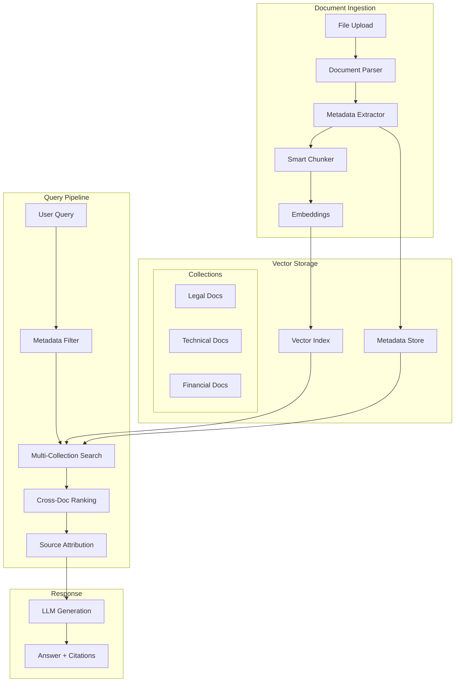
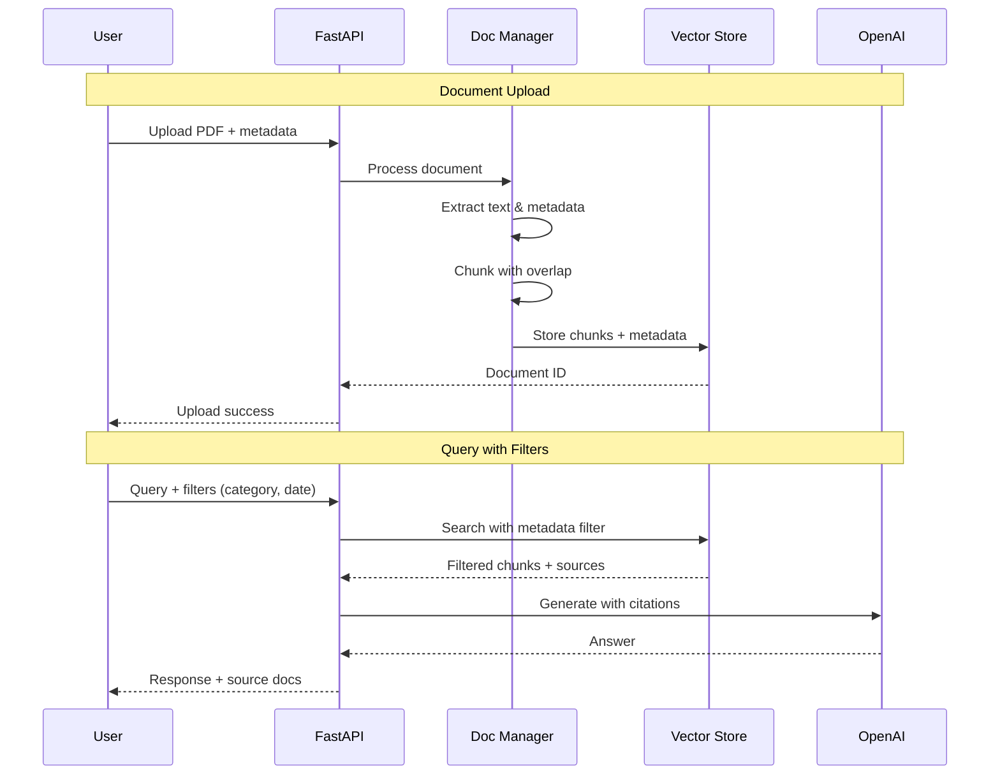

# Multi-Document RAG System

| Property | Value |
|----------|-------|
| **Difficulty** | Intermediate |
| **Time** | ~5 hours |
| **Code Size** | ~350 LOC |
| **Prerequisites** | [Intelligent Document Q&A](/docs/rag/basic/intelligent-document-qa) |

## Tech Stack

| Technology | Purpose |
|------------|---------|
| LangChain | RAG orchestration |
| OpenAI | Embeddings + GPT-4 |
| ChromaDB | Vector storage with metadata |
| FastAPI | REST API |
| PyPDF / Unstructured | Document loaders |

## Prerequisites

- Completed [Intelligent Document Q&A](/docs/rag/basic/intelligent-document-qa) tutorial
- Python 3.10+ with async understanding
- OpenAI API key ([Get one here](https://platform.openai.com))
- Basic understanding of metadata filtering

## What You'll Learn

- Design document collections with rich metadata schemas
- Implement multi-document ingestion with automatic categorization
- Build cross-document retrieval with source attribution
- Create metadata filters for precise document targeting
- Handle document updates and versioning
- Manage large document collections efficiently

---

## The Challenge of Multiple Documents

Single-document RAG is straightforward, but real-world applications need to handle:

| Challenge | Problem | Solution |
|-----------|---------|----------|
| **Source confusion** | LLM mixes information from different docs | Metadata-based source tracking |
| **Irrelevant results** | Search returns docs outside user's scope | Collection filtering |
| **Stale content** | Old document versions pollute results | Version management |
| **Scale issues** | Performance degrades with more docs | Efficient indexing strategies |
| **Context limits** | Can't fit all relevant docs in context | Smart chunk selection |

---

## System Architecture



## Document Flow



---

## Metadata Schema Design

A well-designed metadata schema is crucial for multi-document RAG:

```python
# Example metadata schema
{
    "document_id": "doc_abc123",
    "filename": "annual_report_2024.pdf",
    "title": "Annual Financial Report 2024",
    "category": "financial",
    "subcategory": "annual_reports",
    "author": "Finance Team",
    "created_date": "2024-01-15",
    "version": "1.0",
    "tags": ["finance", "annual", "2024"],
    "page_count": 45,
    "chunk_index": 12,
    "total_chunks": 89
}
```

**Key metadata fields:**
- **Categorical**: category, subcategory, document_type
- **Temporal**: created_date, updated_date, version
- **Structural**: chunk_index, page_number, section
- **Custom**: tags, author, department

---

## Project Structure

```
multi-doc-rag/
├── src/
│   ├── __init__.py
│   ├── config.py
│   ├── models.py
│   ├── document_manager.py
│   ├── chunking.py
│   ├── vector_store.py
│   ├── retriever.py
│   ├── rag_engine.py
│   └── api.py
├── tests/
│   ├── test_document_manager.py
│   └── test_retriever.py
├── data/
│   └── documents/
├── .env
├── pyproject.toml
└── README.md
```

---

## Implementation

### Step 1: Project Setup

```bash
mkdir multi-doc-rag && cd multi-doc-rag
uv init
uv venv && source .venv/bin/activate
```

Install dependencies:

```bash
uv add langchain langchain-openai langchain-chroma
uv add chromadb python-dotenv
uv add fastapi uvicorn python-multipart
uv add pypdf unstructured
```

Create `.env` file:

```bash title=".env"
OPENAI_API_KEY=sk-your-key-here
CHROMA_PERSIST_DIR=./chroma_db
CHUNK_SIZE=800
CHUNK_OVERLAP=100
TOP_K=6
```

### Step 2: Configuration and Models

Create `src/config.py`:

```python title="src/config.py"
"""Configuration management."""
import os
from dataclasses import dataclass
from dotenv import load_dotenv

load_dotenv()


@dataclass
class Config:
    """Application configuration."""

    OPENAI_API_KEY: str = os.getenv("OPENAI_API_KEY", "")
    CHROMA_PERSIST_DIR: str = os.getenv("CHROMA_PERSIST_DIR", "./chroma_db")
    CHUNK_SIZE: int = int(os.getenv("CHUNK_SIZE", "800"))
    CHUNK_OVERLAP: int = int(os.getenv("CHUNK_OVERLAP", "100"))
    TOP_K: int = int(os.getenv("TOP_K", "6"))

    EMBEDDING_MODEL: str = "text-embedding-3-small"
    LLM_MODEL: str = "gpt-4o-mini"

    def validate(self) -> None:
        if not self.OPENAI_API_KEY:
            raise ValueError("OPENAI_API_KEY is required")


config = Config()
```

Create `src/models.py`:

```python title="src/models.py"
"""Data models for multi-document RAG."""
from datetime import datetime
from typing import Optional, List
from pydantic import BaseModel, Field
from enum import Enum


class DocumentCategory(str, Enum):
    """Document categories for filtering."""
    TECHNICAL = "technical"
    LEGAL = "legal"
    FINANCIAL = "financial"
    RESEARCH = "research"
    GENERAL = "general"


class DocumentMetadata(BaseModel):
    """Metadata for a document."""
    document_id: str
    filename: str
    title: Optional[str] = None
    category: DocumentCategory = DocumentCategory.GENERAL
    subcategory: Optional[str] = None
    author: Optional[str] = None
    created_date: datetime = Field(default_factory=datetime.now)
    version: str = "1.0"
    tags: List[str] = Field(default_factory=list)
    page_count: int = 0


class ChunkMetadata(DocumentMetadata):
    """Metadata for a document chunk."""
    chunk_index: int
    total_chunks: int
    page_number: Optional[int] = None
    section: Optional[str] = None


class DocumentFilter(BaseModel):
    """Filters for document retrieval."""
    categories: Optional[List[DocumentCategory]] = None
    tags: Optional[List[str]] = None
    date_from: Optional[datetime] = None
    date_to: Optional[datetime] = None
    document_ids: Optional[List[str]] = None


class SearchResult(BaseModel):
    """A search result with source attribution."""
    content: str
    score: float
    document_id: str
    filename: str
    category: str
    page_number: Optional[int]
    chunk_index: int


class QueryResponse(BaseModel):
    """Response to a query with citations."""
    answer: str
    sources: List[SearchResult]
    query: str
    filters_applied: Optional[DocumentFilter] = None
```

### Step 3: Smart Document Chunking

Create `src/chunking.py`:

```python title="src/chunking.py"
"""Intelligent document chunking with metadata preservation."""
from typing import List, Optional
import re

from langchain.text_splitter import RecursiveCharacterTextSplitter
from langchain_core.documents import Document

from src.config import config
from src.models import DocumentMetadata, ChunkMetadata


class SmartChunker:
    """
    Chunks documents while preserving structure and metadata.
    """

    def __init__(
        self,
        chunk_size: int = None,
        chunk_overlap: int = None
    ):
        self.chunk_size = chunk_size or config.CHUNK_SIZE
        self.chunk_overlap = chunk_overlap or config.CHUNK_OVERLAP

        self.text_splitter = RecursiveCharacterTextSplitter(
            chunk_size=self.chunk_size,
            chunk_overlap=self.chunk_overlap,
            length_function=len,
            separators=[
                "\n\n\n",  # Major section breaks
                "\n\n",    # Paragraphs
                "\n",      # Lines
                ". ",      # Sentences
                ", ",      # Clauses
                " ",       # Words
                ""
            ]
        )

    def _detect_section(self, text: str) -> Optional[str]:
        """Detect section header from text."""
        # Common section patterns
        patterns = [
            r'^#{1,3}\s+(.+)$',           # Markdown headers
            r'^([A-Z][A-Z\s]+)$',          # ALL CAPS headers
            r'^\d+\.\s+([A-Z].+)$',        # Numbered sections
            r'^(Chapter|Section)\s+\d+',   # Chapter/Section
        ]

        first_line = text.split('\n')[0].strip()
        for pattern in patterns:
            match = re.match(pattern, first_line, re.MULTILINE)
            if match:
                return match.group(1) if match.groups() else first_line

        return None

    def _estimate_page(
        self,
        chunk_index: int,
        total_chunks: int,
        total_pages: int
    ) -> int:
        """Estimate page number based on chunk position."""
        if total_pages == 0:
            return 1

        ratio = chunk_index / max(total_chunks, 1)
        return max(1, int(ratio * total_pages) + 1)

    def chunk_document(
        self,
        text: str,
        metadata: DocumentMetadata
    ) -> List[Document]:
        """
        Chunk a document with rich metadata.

        Returns LangChain Documents with ChunkMetadata.
        """
        # Split into chunks
        chunks = self.text_splitter.split_text(text)
        total_chunks = len(chunks)

        documents = []
        for i, chunk_text in enumerate(chunks):
            # Detect section if possible
            section = self._detect_section(chunk_text)

            # Estimate page number
            page_num = self._estimate_page(
                i, total_chunks, metadata.page_count
            )

            # Create chunk metadata
            chunk_meta = ChunkMetadata(
                **metadata.model_dump(),
                chunk_index=i,
                total_chunks=total_chunks,
                page_number=page_num,
                section=section
            )

            # Create LangChain Document
            doc = Document(
                page_content=chunk_text,
                metadata=chunk_meta.model_dump()
            )
            documents.append(doc)

        return documents
```

### Step 4: Document Manager

Create `src/document_manager.py`:

```python title="src/document_manager.py"
"""Document ingestion and management."""
import hashlib
from pathlib import Path
from typing import List, Optional, Dict
from datetime import datetime

from langchain_community.document_loaders import (
    PyPDFLoader,
    TextLoader,
    UnstructuredMarkdownLoader
)

from src.models import DocumentMetadata, DocumentCategory
from src.chunking import SmartChunker


class DocumentManager:
    """Manages document ingestion and metadata."""

    SUPPORTED_EXTENSIONS = {'.pdf', '.txt', '.md'}

    def __init__(self):
        self.chunker = SmartChunker()
        self._documents: Dict[str, DocumentMetadata] = {}

    def _generate_doc_id(self, content: str, filename: str) -> str:
        """Generate unique document ID from content hash."""
        hash_input = f"{filename}:{content[:1000]}"
        return hashlib.sha256(hash_input.encode()).hexdigest()[:12]

    def _detect_category(self, filename: str, text: str) -> DocumentCategory:
        """Auto-detect document category from content."""
        filename_lower = filename.lower()
        text_lower = text[:5000].lower()

        # Simple keyword-based detection
        if any(kw in filename_lower or kw in text_lower
               for kw in ['legal', 'contract', 'agreement', 'terms']):
            return DocumentCategory.LEGAL

        if any(kw in filename_lower or kw in text_lower
               for kw in ['financial', 'revenue', 'profit', 'budget']):
            return DocumentCategory.FINANCIAL

        if any(kw in filename_lower or kw in text_lower
               for kw in ['technical', 'api', 'documentation', 'code']):
            return DocumentCategory.TECHNICAL

        if any(kw in filename_lower or kw in text_lower
               for kw in ['research', 'study', 'analysis', 'paper']):
            return DocumentCategory.RESEARCH

        return DocumentCategory.GENERAL

    def _load_file(self, file_path: Path) -> tuple[str, int]:
        """Load file content and return text with page count."""
        suffix = file_path.suffix.lower()

        if suffix == '.pdf':
            loader = PyPDFLoader(str(file_path))
            pages = loader.load()
            text = "\n\n".join(page.page_content for page in pages)
            return text, len(pages)

        elif suffix == '.md':
            loader = UnstructuredMarkdownLoader(str(file_path))
            docs = loader.load()
            text = "\n\n".join(doc.page_content for doc in docs)
            return text, 1

        else:  # .txt
            loader = TextLoader(str(file_path))
            docs = loader.load()
            text = docs[0].page_content if docs else ""
            return text, 1

    def ingest_document(
        self,
        file_path: str | Path,
        title: Optional[str] = None,
        category: Optional[DocumentCategory] = None,
        tags: Optional[List[str]] = None,
        author: Optional[str] = None
    ) -> tuple[str, List]:
        """
        Ingest a document and return its ID and chunks.

        Args:
            file_path: Path to the document
            title: Optional document title
            category: Optional category (auto-detected if not provided)
            tags: Optional tags for filtering
            author: Optional author name

        Returns:
            Tuple of (document_id, list of chunked Documents)
        """
        file_path = Path(file_path)

        if not file_path.exists():
            raise FileNotFoundError(f"File not found: {file_path}")

        if file_path.suffix.lower() not in self.SUPPORTED_EXTENSIONS:
            raise ValueError(
                f"Unsupported file type: {file_path.suffix}. "
                f"Supported: {self.SUPPORTED_EXTENSIONS}"
            )

        # Load document
        text, page_count = self._load_file(file_path)

        if not text.strip():
            raise ValueError(f"Document is empty: {file_path}")

        # Generate document ID
        doc_id = self._generate_doc_id(text, file_path.name)

        # Auto-detect category if not provided
        if category is None:
            category = self._detect_category(file_path.name, text)

        # Create metadata
        metadata = DocumentMetadata(
            document_id=doc_id,
            filename=file_path.name,
            title=title or file_path.stem.replace('_', ' ').title(),
            category=category,
            author=author,
            tags=tags or [],
            page_count=page_count,
            created_date=datetime.now()
        )

        # Store document reference
        self._documents[doc_id] = metadata

        # Chunk document
        chunks = self.chunker.chunk_document(text, metadata)

        return doc_id, chunks

    def get_document(self, doc_id: str) -> Optional[DocumentMetadata]:
        """Get document metadata by ID."""
        return self._documents.get(doc_id)

    def list_documents(self) -> List[DocumentMetadata]:
        """List all ingested documents."""
        return list(self._documents.values())

    def delete_document(self, doc_id: str) -> bool:
        """Remove document from manager."""
        if doc_id in self._documents:
            del self._documents[doc_id]
            return True
        return False
```

### Step 5: Vector Store with Metadata Filtering

Create `src/vector_store.py`:

```python title="src/vector_store.py"
"""Vector store with metadata filtering support."""
from pathlib import Path
from typing import List, Optional, Dict, Any

from langchain_openai import OpenAIEmbeddings
from langchain_chroma import Chroma
from langchain_core.documents import Document

from src.config import config
from src.models import DocumentFilter, SearchResult


class MultiDocVectorStore:
    """Vector store optimized for multi-document RAG."""

    def __init__(self, collection_name: str = "multi_doc_rag"):
        config.validate()

        self.embeddings = OpenAIEmbeddings(
            model=config.EMBEDDING_MODEL,
            openai_api_key=config.OPENAI_API_KEY
        )

        persist_dir = Path(config.CHROMA_PERSIST_DIR)
        persist_dir.mkdir(parents=True, exist_ok=True)

        self.vectorstore = Chroma(
            collection_name=collection_name,
            persist_directory=str(persist_dir),
            embedding_function=self.embeddings
        )

    def add_documents(self, documents: List[Document]) -> int:
        """Add documents to the vector store."""
        if not documents:
            return 0

        self.vectorstore.add_documents(documents)
        return len(documents)

    def _build_filter(self, doc_filter: DocumentFilter) -> Optional[Dict[str, Any]]:
        """Build ChromaDB filter from DocumentFilter."""
        conditions = []

        if doc_filter.categories:
            categories = [c.value for c in doc_filter.categories]
            if len(categories) == 1:
                conditions.append({"category": categories[0]})
            else:
                conditions.append({"category": {"$in": categories}})

        if doc_filter.document_ids:
            if len(doc_filter.document_ids) == 1:
                conditions.append({"document_id": doc_filter.document_ids[0]})
            else:
                conditions.append({"document_id": {"$in": doc_filter.document_ids}})

        if doc_filter.tags:
            # Tags stored as comma-separated string
            for tag in doc_filter.tags:
                conditions.append({"tags": {"$contains": tag}})

        if not conditions:
            return None

        if len(conditions) == 1:
            return conditions[0]

        return {"$and": conditions}

    def search(
        self,
        query: str,
        doc_filter: Optional[DocumentFilter] = None,
        top_k: int = None
    ) -> List[SearchResult]:
        """
        Search with optional metadata filtering.

        Args:
            query: Search query
            doc_filter: Optional filters to apply
            top_k: Number of results to return

        Returns:
            List of SearchResult with source attribution
        """
        top_k = top_k or config.TOP_K

        # Build filter
        where_filter = None
        if doc_filter:
            where_filter = self._build_filter(doc_filter)

        # Search
        if where_filter:
            results = self.vectorstore.similarity_search_with_relevance_scores(
                query,
                k=top_k,
                filter=where_filter
            )
        else:
            results = self.vectorstore.similarity_search_with_relevance_scores(
                query,
                k=top_k
            )

        # Convert to SearchResult
        search_results = []
        for doc, score in results:
            meta = doc.metadata
            search_results.append(SearchResult(
                content=doc.page_content,
                score=score,
                document_id=meta.get("document_id", "unknown"),
                filename=meta.get("filename", "unknown"),
                category=meta.get("category", "general"),
                page_number=meta.get("page_number"),
                chunk_index=meta.get("chunk_index", 0)
            ))

        return search_results

    def delete_document(self, document_id: str) -> bool:
        """Delete all chunks for a document."""
        try:
            self.vectorstore.delete(
                filter={"document_id": document_id}
            )
            return True
        except Exception:
            return False

    def get_document_ids(self) -> List[str]:
        """Get all unique document IDs in the store."""
        # Query all documents and extract unique IDs
        results = self.vectorstore.get()
        if not results or not results.get('metadatas'):
            return []

        doc_ids = set()
        for meta in results['metadatas']:
            if meta and 'document_id' in meta:
                doc_ids.add(meta['document_id'])

        return list(doc_ids)

    def clear(self) -> None:
        """Clear all documents from the store."""
        self.vectorstore.delete_collection()
        self.vectorstore = Chroma(
            collection_name="multi_doc_rag",
            persist_directory=str(config.CHROMA_PERSIST_DIR),
            embedding_function=self.embeddings
        )
```

### Step 6: RAG Engine with Citations

Create `src/rag_engine.py`:

```python title="src/rag_engine.py"
"""Multi-document RAG engine with source attribution."""
from typing import Optional, List

from langchain_openai import ChatOpenAI
from langchain_core.prompts import ChatPromptTemplate
from langchain_core.output_parsers import StrOutputParser

from src.config import config
from src.models import (
    DocumentFilter,
    DocumentCategory,
    QueryResponse,
    SearchResult
)
from src.document_manager import DocumentManager
from src.vector_store import MultiDocVectorStore


class MultiDocRAGEngine:
    """RAG engine for multi-document question answering."""

    def __init__(self):
        config.validate()

        self.doc_manager = DocumentManager()
        self.vector_store = MultiDocVectorStore()

        self.llm = ChatOpenAI(
            model=config.LLM_MODEL,
            temperature=0.1,
            openai_api_key=config.OPENAI_API_KEY
        )

        self.prompt = ChatPromptTemplate.from_messages([
            ("system", """You are a helpful assistant that answers questions based on multiple documents.

IMPORTANT INSTRUCTIONS:
1. Answer ONLY based on the provided context
2. ALWAYS cite your sources using [Source N] format
3. If information comes from multiple documents, cite all relevant sources
4. If the answer is not in the context, say "I cannot find this information in the provided documents"
5. Be precise and thorough

Each source is labeled with its document name and page number for reference."""),
            ("human", """Context from multiple documents:

{context}

---

Question: {question}

Provide a comprehensive answer with citations:""")
        ])

    def _format_context(self, results: List[SearchResult]) -> str:
        """Format search results as numbered context."""
        formatted = []
        for i, result in enumerate(results, 1):
            source_info = f"[Source {i}] {result.filename}"
            if result.page_number:
                source_info += f", Page {result.page_number}"
            source_info += f" (Category: {result.category})"

            formatted.append(f"{source_info}\n{result.content}")

        return "\n\n---\n\n".join(formatted)

    def ingest_document(
        self,
        file_path: str,
        title: Optional[str] = None,
        category: Optional[DocumentCategory] = None,
        tags: Optional[List[str]] = None,
        author: Optional[str] = None
    ) -> dict:
        """
        Ingest a document into the RAG system.

        Returns:
            Dict with document_id, filename, chunks_created
        """
        doc_id, chunks = self.doc_manager.ingest_document(
            file_path=file_path,
            title=title,
            category=category,
            tags=tags,
            author=author
        )

        # Add to vector store
        chunks_added = self.vector_store.add_documents(chunks)

        doc_meta = self.doc_manager.get_document(doc_id)

        return {
            "document_id": doc_id,
            "filename": doc_meta.filename if doc_meta else "unknown",
            "title": doc_meta.title if doc_meta else None,
            "category": doc_meta.category.value if doc_meta else "general",
            "chunks_created": chunks_added
        }

    def query(
        self,
        question: str,
        categories: Optional[List[DocumentCategory]] = None,
        tags: Optional[List[str]] = None,
        document_ids: Optional[List[str]] = None,
        top_k: Optional[int] = None
    ) -> QueryResponse:
        """
        Query across multiple documents with optional filtering.

        Args:
            question: The question to answer
            categories: Filter by document categories
            tags: Filter by tags
            document_ids: Filter to specific documents
            top_k: Number of chunks to retrieve

        Returns:
            QueryResponse with answer and cited sources
        """
        # Build filter
        doc_filter = None
        if categories or tags or document_ids:
            doc_filter = DocumentFilter(
                categories=categories,
                tags=tags,
                document_ids=document_ids
            )

        # Search
        results = self.vector_store.search(
            query=question,
            doc_filter=doc_filter,
            top_k=top_k
        )

        if not results:
            return QueryResponse(
                answer="No relevant documents found for your query.",
                sources=[],
                query=question,
                filters_applied=doc_filter
            )

        # Format context
        context = self._format_context(results)

        # Generate answer
        chain = self.prompt | self.llm | StrOutputParser()
        answer = chain.invoke({
            "context": context,
            "question": question
        })

        return QueryResponse(
            answer=answer,
            sources=results,
            query=question,
            filters_applied=doc_filter
        )

    def list_documents(self) -> List[dict]:
        """List all documents in the system."""
        return [
            {
                "document_id": doc.document_id,
                "filename": doc.filename,
                "title": doc.title,
                "category": doc.category.value,
                "tags": doc.tags,
                "created_date": doc.created_date.isoformat()
            }
            for doc in self.doc_manager.list_documents()
        ]

    def delete_document(self, document_id: str) -> bool:
        """Delete a document from the system."""
        # Remove from vector store
        vs_deleted = self.vector_store.delete_document(document_id)

        # Remove from document manager
        dm_deleted = self.doc_manager.delete_document(document_id)

        return vs_deleted or dm_deleted

    def clear_all(self) -> None:
        """Clear all documents from the system."""
        self.vector_store.clear()
        for doc_id in list(self.doc_manager._documents.keys()):
            self.doc_manager.delete_document(doc_id)
```

### Step 7: FastAPI Application

Create `src/api.py`:

```python title="src/api.py"
"""FastAPI application for multi-document RAG."""
import tempfile
from pathlib import Path
from typing import List, Optional

from fastapi import FastAPI, HTTPException, UploadFile, File, Query
from fastapi.middleware.cors import CORSMiddleware
from pydantic import BaseModel, Field

from src.models import DocumentCategory, QueryResponse
from src.rag_engine import MultiDocRAGEngine


app = FastAPI(
    title="Multi-Document RAG API",
    description="RAG system for querying across multiple documents with filtering",
    version="1.0.0"
)

app.add_middleware(
    CORSMiddleware,
    allow_origins=["*"],
    allow_credentials=True,
    allow_methods=["*"],
    allow_headers=["*"],
)

# Initialize engine
engine = MultiDocRAGEngine()


# Request/Response Models
class UploadMetadata(BaseModel):
    title: Optional[str] = None
    category: Optional[DocumentCategory] = None
    tags: Optional[List[str]] = Field(default_factory=list)
    author: Optional[str] = None


class UploadResponse(BaseModel):
    document_id: str
    filename: str
    title: Optional[str]
    category: str
    chunks_created: int


class QueryRequest(BaseModel):
    question: str = Field(..., min_length=1)
    categories: Optional[List[DocumentCategory]] = None
    tags: Optional[List[str]] = None
    document_ids: Optional[List[str]] = None
    top_k: int = Field(default=6, ge=1, le=20)


class DocumentInfo(BaseModel):
    document_id: str
    filename: str
    title: Optional[str]
    category: str
    tags: List[str]
    created_date: str


# Endpoints
@app.get("/")
async def root():
    """Health check."""
    return {
        "status": "healthy",
        "service": "Multi-Document RAG API",
        "features": [
            "Multi-document ingestion",
            "Category filtering",
            "Tag-based search",
            "Source attribution"
        ]
    }


@app.post("/documents/upload", response_model=UploadResponse)
async def upload_document(
    file: UploadFile = File(...),
    title: Optional[str] = None,
    category: Optional[DocumentCategory] = None,
    tags: str = "",  # Comma-separated
    author: Optional[str] = None
):
    """Upload and ingest a document."""
    # Validate file type
    suffix = Path(file.filename).suffix.lower()
    if suffix not in {'.pdf', '.txt', '.md'}:
        raise HTTPException(
            status_code=400,
            detail=f"Unsupported file type: {suffix}. Supported: .pdf, .txt, .md"
        )

    try:
        # Save to temp file
        with tempfile.NamedTemporaryFile(delete=False, suffix=suffix) as tmp:
            content = await file.read()
            tmp.write(content)
            tmp_path = tmp.name

        # Parse tags
        tag_list = [t.strip() for t in tags.split(",") if t.strip()]

        # Ingest
        result = engine.ingest_document(
            file_path=tmp_path,
            title=title,
            category=category,
            tags=tag_list,
            author=author
        )

        # Cleanup
        Path(tmp_path).unlink()

        return UploadResponse(**result)

    except Exception as e:
        raise HTTPException(status_code=500, detail=str(e))


@app.post("/query", response_model=QueryResponse)
async def query_documents(request: QueryRequest):
    """Query across documents with optional filters."""
    try:
        response = engine.query(
            question=request.question,
            categories=request.categories,
            tags=request.tags,
            document_ids=request.document_ids,
            top_k=request.top_k
        )
        return response

    except Exception as e:
        raise HTTPException(status_code=500, detail=str(e))


@app.get("/documents", response_model=List[DocumentInfo])
async def list_documents():
    """List all documents in the system."""
    docs = engine.list_documents()
    return [DocumentInfo(**doc) for doc in docs]


@app.get("/documents/{document_id}")
async def get_document(document_id: str):
    """Get document details by ID."""
    doc = engine.doc_manager.get_document(document_id)
    if not doc:
        raise HTTPException(status_code=404, detail="Document not found")

    return {
        "document_id": doc.document_id,
        "filename": doc.filename,
        "title": doc.title,
        "category": doc.category.value,
        "tags": doc.tags,
        "author": doc.author,
        "page_count": doc.page_count,
        "created_date": doc.created_date.isoformat()
    }


@app.delete("/documents/{document_id}")
async def delete_document(document_id: str):
    """Delete a document from the system."""
    success = engine.delete_document(document_id)
    if not success:
        raise HTTPException(status_code=404, detail="Document not found")

    return {"message": f"Document {document_id} deleted successfully"}


@app.delete("/documents")
async def clear_all_documents():
    """Clear all documents from the system."""
    engine.clear_all()
    return {"message": "All documents cleared"}


@app.get("/categories")
async def list_categories():
    """List available document categories."""
    return {
        "categories": [
            {"value": c.value, "name": c.name}
            for c in DocumentCategory
        ]
    }


if __name__ == "__main__":
    import uvicorn
    uvicorn.run(app, host="0.0.0.0", port=8000)
```

---

## Testing

Create `tests/test_multi_doc.py`:

```python title="tests/test_multi_doc.py"
"""Tests for multi-document RAG system."""
import pytest
from datetime import datetime

from src.models import (
    DocumentMetadata,
    DocumentCategory,
    DocumentFilter,
    ChunkMetadata
)
from src.chunking import SmartChunker


class TestDocumentModels:
    """Tests for data models."""

    def test_document_metadata_defaults(self):
        """Test default values for metadata."""
        meta = DocumentMetadata(
            document_id="test123",
            filename="test.pdf"
        )

        assert meta.category == DocumentCategory.GENERAL
        assert meta.version == "1.0"
        assert meta.tags == []
        assert isinstance(meta.created_date, datetime)

    def test_chunk_metadata_inherits(self):
        """Test chunk metadata includes parent fields."""
        meta = ChunkMetadata(
            document_id="test123",
            filename="test.pdf",
            chunk_index=5,
            total_chunks=10,
            page_number=2
        )

        assert meta.document_id == "test123"
        assert meta.chunk_index == 5
        assert meta.page_number == 2


class TestSmartChunker:
    """Tests for document chunking."""

    def test_basic_chunking(self):
        """Test basic document chunking."""
        chunker = SmartChunker(chunk_size=100, chunk_overlap=20)

        meta = DocumentMetadata(
            document_id="test123",
            filename="test.pdf",
            page_count=5
        )

        text = "A" * 250  # Will create multiple chunks
        chunks = chunker.chunk_document(text, meta)

        assert len(chunks) > 1
        assert all(c.metadata["document_id"] == "test123" for c in chunks)
        assert chunks[0].metadata["chunk_index"] == 0

    def test_metadata_preservation(self):
        """Test that metadata is preserved in chunks."""
        chunker = SmartChunker()

        meta = DocumentMetadata(
            document_id="doc456",
            filename="report.pdf",
            category=DocumentCategory.FINANCIAL,
            tags=["q1", "2024"],
            page_count=10
        )

        text = "Financial report content. " * 100
        chunks = chunker.chunk_document(text, meta)

        for chunk in chunks:
            assert chunk.metadata["category"] == "financial"
            assert "q1" in chunk.metadata["tags"]
            assert chunk.metadata["total_chunks"] == len(chunks)


class TestDocumentFilter:
    """Tests for document filtering."""

    def test_filter_by_category(self):
        """Test category filter creation."""
        filter = DocumentFilter(
            categories=[DocumentCategory.TECHNICAL, DocumentCategory.RESEARCH]
        )

        assert len(filter.categories) == 2
        assert DocumentCategory.TECHNICAL in filter.categories

    def test_empty_filter(self):
        """Test empty filter."""
        filter = DocumentFilter()

        assert filter.categories is None
        assert filter.tags is None
        assert filter.document_ids is None


# Run with: pytest tests/test_multi_doc.py -v
```

---

## Running the Application

### Start the API

```bash
python -m uvicorn src.api:app --reload
```

### Upload Documents

```bash
# Upload a PDF
curl -X POST "http://localhost:8000/documents/upload" \
  -F "file=@financial_report.pdf" \
  -F "title=Q1 Financial Report" \
  -F "category=financial" \
  -F "tags=q1,2024,revenue"

# Upload another document
curl -X POST "http://localhost:8000/documents/upload" \
  -F "file=@technical_spec.pdf" \
  -F "category=technical" \
  -F "tags=api,documentation"
```

### Query with Filters

```bash
# Query all documents
curl -X POST "http://localhost:8000/query" \
  -H "Content-Type: application/json" \
  -d '{"question": "What was the revenue in Q1?"}'

# Query only financial documents
curl -X POST "http://localhost:8000/query" \
  -H "Content-Type: application/json" \
  -d '{
    "question": "What was the revenue in Q1?",
    "categories": ["financial"]
  }'

# Query with multiple filters
curl -X POST "http://localhost:8000/query" \
  -H "Content-Type: application/json" \
  -d '{
    "question": "Explain the API authentication",
    "categories": ["technical"],
    "tags": ["api"]
  }'
```

### List and Manage Documents

```bash
# List all documents
curl "http://localhost:8000/documents"

# Get document details
curl "http://localhost:8000/documents/abc123"

# Delete a document
curl -X DELETE "http://localhost:8000/documents/abc123"
```

Visit `http://localhost:8000/docs` for the interactive Swagger UI.

---

## Debugging Tips

| Issue | Cause | Solution |
|-------|-------|----------|
| Wrong documents returned | Missing or incorrect filters | Check filter syntax, verify categories match |
| Duplicate results | Same content in multiple docs | Use document_id filter, implement deduplication |
| Citations don't match | Chunk boundaries split info | Increase chunk overlap, adjust chunk size |
| Slow queries | Large collection without filters | Always use relevant filters, index optimization |
| Category detection wrong | Auto-detection limitations | Explicitly set category on upload |

---

## Key Concepts

### When to Use Multi-Document RAG

| Use Case | Single Doc | Multi Doc |
|----------|------------|-----------|
| **FAQ bot** | If small KB | When many topics |
| **Legal assistant** | Single contract | Multiple contracts |
| **Research tool** | One paper | Paper collection |
| **Knowledge base** | Small team | Enterprise scale |

### Metadata Design Principles

1. **Be consistent** - Use same field names across documents
2. **Be specific** - Granular categories enable precise filtering
3. **Be temporal** - Track versions and dates for freshness
4. **Be searchable** - Include tags for flexible queries

---

## Extensions

| Level | Ideas |
|-------|-------|
| Easy | Add document preview, implement search history, add export |
| Medium | Hierarchical categories, document relationships, batch upload |
| Advanced | Auto-categorization with ML, cross-document entity linking, version diff |

---

## Resources

- [ChromaDB Filtering](https://docs.trychroma.com/guides#filtering-by-metadata)
- [LangChain Multi-Retrieval](https://python.langchain.com/docs/modules/data_connection/retrievers/)
- [Metadata Schema Design](https://www.pinecone.io/learn/metadata-filtering/)

---

## Summary

You've built a production-ready multi-document RAG system that:

- Ingests documents with rich metadata schemas
- Provides precise filtering by category, tags, and document ID
- Attributes answers to specific source documents
- Manages document lifecycle (add, update, delete)
- Scales efficiently with metadata-based retrieval

**Key Takeaways:**
1. **Metadata is crucial** - Good schema design enables powerful filtering
2. **Source attribution builds trust** - Users need to verify AI answers
3. **Filters improve relevance** - Narrow scope = better results
4. **Lifecycle management matters** - Handle updates and deletions

**Next:** [RAG with Reranking](/docs/rag/intermediate/rag-with-reranking) - Improve retrieval quality with cross-encoder reranking
