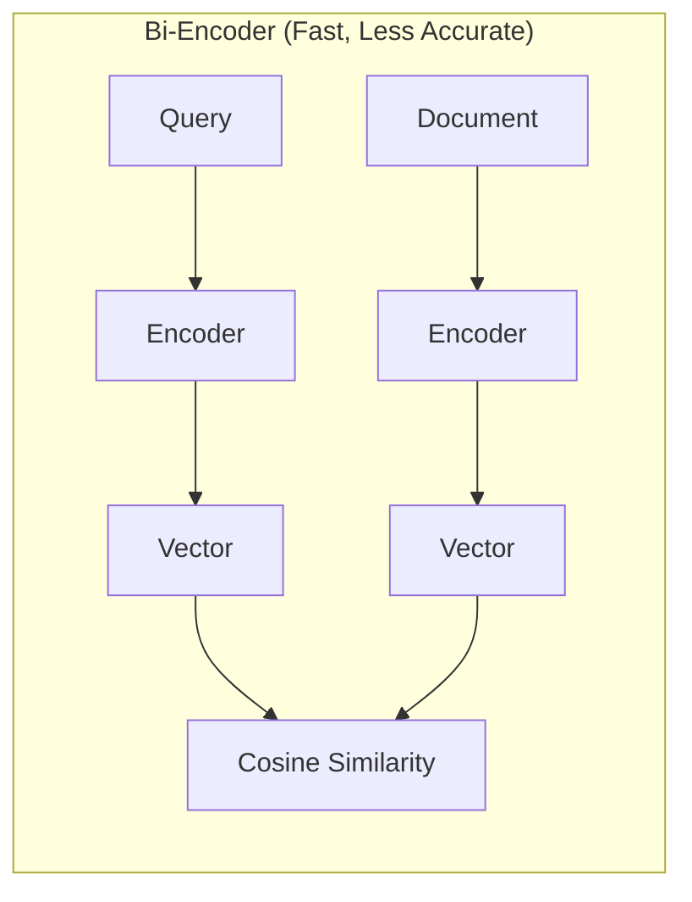
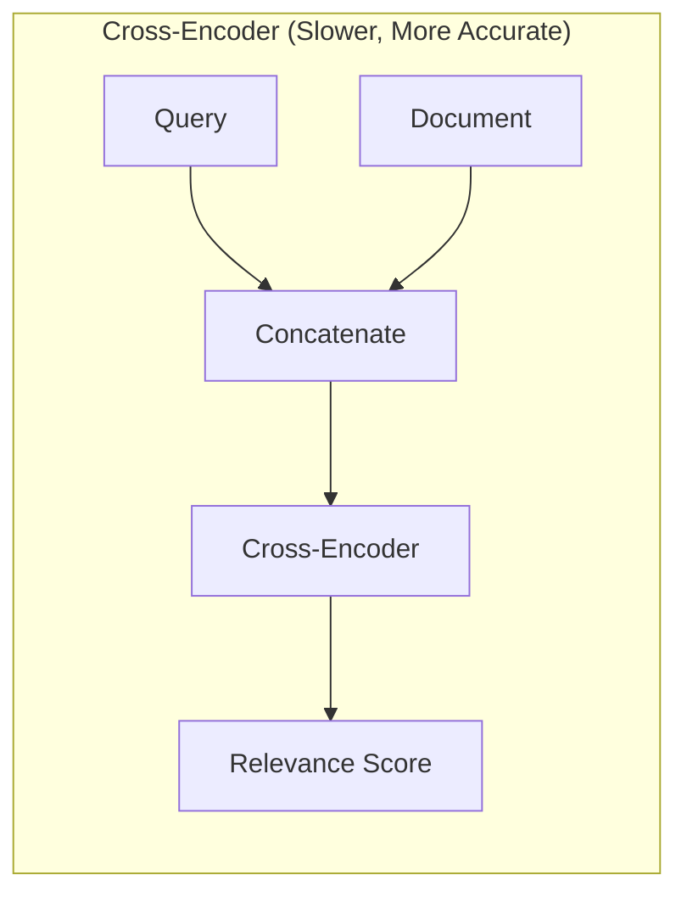
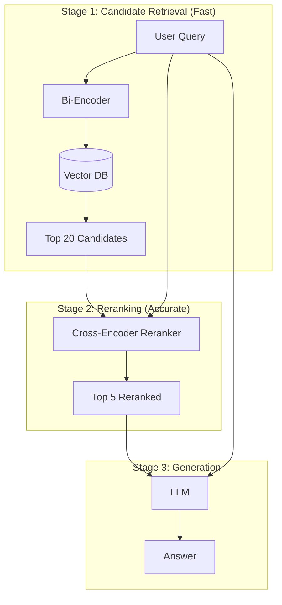
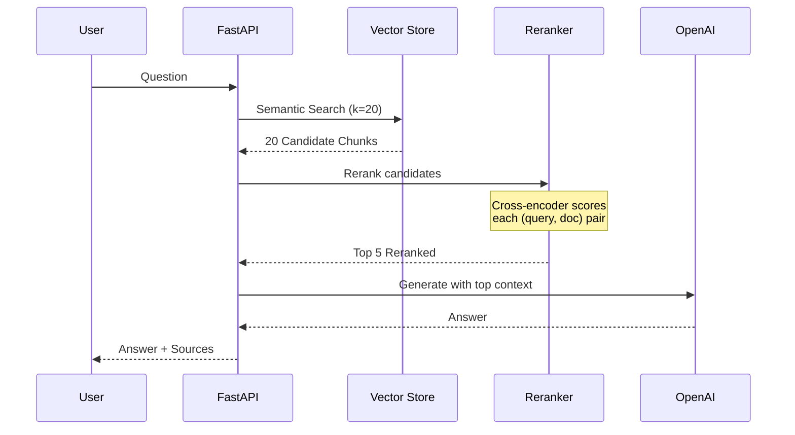

# RAG with Reranking

| Property | Value |
|----------|-------|
| **Difficulty** | Intermediate |
| **Time** | ~4 hours |
| **Code Size** | ~300 LOC |
| **Prerequisites** | [Intelligent Document Q&A](/docs/rag/basic/intelligent-document-qa) |

## Tech Stack

| Technology | Purpose |
|------------|---------|
| LangChain | RAG orchestration |
| OpenAI | Embeddings + GPT-4 |
| Cohere | Reranking API |
| ChromaDB | Vector database |
| sentence-transformers | Local cross-encoder |
| FastAPI | REST API |

## Prerequisites

- Completed [Intelligent Document Q&A](/docs/rag/basic/intelligent-document-qa) tutorial
- Python 3.10+ with async understanding
- OpenAI API key ([Get one here](https://platform.openai.com))
- Cohere API key ([Get one here](https://dashboard.cohere.com)) - optional for cloud reranking

## What You'll Learn

- Understand why basic retrieval often returns suboptimal results
- Implement two-stage retrieval (retrieve then rerank)
- Compare bi-encoders vs cross-encoders for ranking
- Integrate Cohere Rerank API for production use
- Build a local reranker using sentence-transformers
- Measure retrieval quality improvements with metrics

---

## The Problem with Basic Retrieval

Basic semantic search uses **bi-encoders**: query and documents are embedded independently, then compared via cosine similarity. This is fast but has limitations:



**Problems:**
- Query and document are encoded separately (no interaction)
- Misses nuanced semantic relationships
- "What causes headaches?" might rank "Headaches are painful" higher than "Caffeine withdrawal triggers migraines"

**Solution: Cross-Encoder Reranking**



Cross-encoders process query and document **together**, enabling deep semantic understanding at the cost of speed.

---

## Two-Stage Retrieval Architecture

The key insight: use fast bi-encoders to get candidates, then use accurate cross-encoders to rerank them.



## Data Flow



---

## Project Structure

```
rag-reranking/
├── src/
│   ├── __init__.py
│   ├── config.py
│   ├── document_processor.py
│   ├── rerankers/
│   │   ├── __init__.py
│   │   ├── base.py
│   │   ├── cohere_reranker.py
│   │   └── local_reranker.py
│   ├── rag_engine.py
│   └── api.py
├── tests/
│   ├── test_rerankers.py
│   └── test_retrieval.py
├── data/
│   └── sample.pdf
├── .env
├── pyproject.toml
└── README.md
```

---

## Implementation

### Step 1: Project Setup

Create your project and install dependencies:

```bash
mkdir rag-reranking && cd rag-reranking
uv init
uv venv && source .venv/bin/activate
```

```bash
uv add langchain langchain-openai langchain-chroma
uv add chromadb pypdf python-dotenv
uv add fastapi uvicorn python-multipart
uv add cohere sentence-transformers
```

Configure environment variables:

```bash title=".env"
OPENAI_API_KEY=sk-your-key-here
COHERE_API_KEY=your-cohere-key-here
CHROMA_PERSIST_DIR=./chroma_db

# Retrieval settings
INITIAL_K=20
RERANK_TOP_K=5

# Reranker choice: "cohere" or "local"
RERANKER_TYPE=local
LOCAL_RERANKER_MODEL=cross-encoder/ms-marco-MiniLM-L-6-v2
```

### Step 2: Configuration Module

```python title="src/config.py"
"""Configuration for RAG with Reranking system."""
import os
from dataclasses import dataclass
from dotenv import load_dotenv

load_dotenv()


@dataclass
class Config:
    """Application configuration."""

    # API Keys
    OPENAI_API_KEY: str = os.getenv("OPENAI_API_KEY", "")
    COHERE_API_KEY: str = os.getenv("COHERE_API_KEY", "")

    # Storage
    CHROMA_PERSIST_DIR: str = os.getenv("CHROMA_PERSIST_DIR", "./chroma_db")

    # Retrieval settings
    INITIAL_K: int = int(os.getenv("INITIAL_K", "20"))
    RERANK_TOP_K: int = int(os.getenv("RERANK_TOP_K", "5"))

    # Reranker settings
    RERANKER_TYPE: str = os.getenv("RERANKER_TYPE", "local")
    LOCAL_RERANKER_MODEL: str = os.getenv(
        "LOCAL_RERANKER_MODEL",
        "cross-encoder/ms-marco-MiniLM-L-6-v2"
    )

    # Model settings
    EMBEDDING_MODEL: str = "text-embedding-3-small"
    LLM_MODEL: str = "gpt-4o-mini"
    TEMPERATURE: float = 0.1

    # Chunking
    CHUNK_SIZE: int = 1000
    CHUNK_OVERLAP: int = 200

    @classmethod
    def validate(cls) -> None:
        """Validate required configuration."""
        if not cls.OPENAI_API_KEY:
            raise ValueError("OPENAI_API_KEY is required")


config = Config()
```

### Step 3: Reranker Base Class

Create `src/rerankers/base.py`:

```python title="src/rerankers/base.py"
"""Base interface for rerankers."""
from abc import ABC, abstractmethod
from dataclasses import dataclass
from typing import List

from langchain_core.documents import Document


@dataclass
class RankedDocument:
    """A document with its relevance score."""

    document: Document
    score: float
    original_rank: int

    def __repr__(self) -> str:
        content_preview = self.document.page_content[:50] + "..."
        return f"RankedDocument(score={self.score:.4f}, content='{content_preview}')"


class BaseReranker(ABC):
    """Abstract base class for reranking implementations."""

    @abstractmethod
    def rerank(
        self,
        query: str,
        documents: List[Document],
        top_k: int = 5
    ) -> List[RankedDocument]:
        """
        Rerank documents based on relevance to query.

        Args:
            query: The search query
            documents: List of candidate documents
            top_k: Number of top documents to return

        Returns:
            List of RankedDocument sorted by relevance (highest first)
        """
        pass

    @property
    @abstractmethod
    def name(self) -> str:
        """Return the reranker name for logging."""
        pass
```

### Step 4: Cohere Reranker (Cloud)

Create `src/rerankers/cohere_reranker.py`:

```python title="src/rerankers/cohere_reranker.py"
"""Cohere Rerank API integration."""
from typing import List

import cohere
from langchain_core.documents import Document

from src.config import config
from src.rerankers.base import BaseReranker, RankedDocument


class CohereReranker(BaseReranker):
    """Reranker using Cohere's Rerank API.

    Pros:
    - High quality reranking
    - No GPU required
    - Easy to use

    Cons:
    - Requires API key
    - Costs per request
    - Network latency
    """

    def __init__(self, model: str = "rerank-english-v3.0"):
        if not config.COHERE_API_KEY:
            raise ValueError("COHERE_API_KEY is required for CohereReranker")

        self.client = cohere.Client(config.COHERE_API_KEY)
        self.model = model

    @property
    def name(self) -> str:
        return f"Cohere/{self.model}"

    def rerank(
        self,
        query: str,
        documents: List[Document],
        top_k: int = 5
    ) -> List[RankedDocument]:
        """Rerank using Cohere API."""
        if not documents:
            return []

        # Extract text content for Cohere
        doc_texts = [doc.page_content for doc in documents]

        # Call Cohere Rerank API
        response = self.client.rerank(
            model=self.model,
            query=query,
            documents=doc_texts,
            top_n=top_k,
            return_documents=False  # We already have the docs
        )

        # Build ranked results
        ranked = []
        for result in response.results:
            ranked.append(RankedDocument(
                document=documents[result.index],
                score=result.relevance_score,
                original_rank=result.index
            ))

        return ranked
```

### Step 5: Local Reranker (Free)

Create `src/rerankers/local_reranker.py`:

```python title="src/rerankers/local_reranker.py"
"""Local cross-encoder reranker using sentence-transformers."""
from typing import List

from langchain_core.documents import Document
from sentence_transformers import CrossEncoder

from src.config import config
from src.rerankers.base import BaseReranker, RankedDocument


class LocalReranker(BaseReranker):
    """Reranker using local cross-encoder model.

    Pros:
    - Free (no API costs)
    - Fast for small batches
    - Works offline

    Cons:
    - Requires model download (~100MB)
    - Uses local compute
    - May be slower than cloud for large batches
    """

    # Popular cross-encoder models (smaller = faster, larger = better)
    MODELS = {
        "tiny": "cross-encoder/ms-marco-TinyBERT-L-2-v2",      # ~17MB, fastest
        "small": "cross-encoder/ms-marco-MiniLM-L-6-v2",       # ~90MB, balanced
        "medium": "cross-encoder/ms-marco-MiniLM-L-12-v2",     # ~130MB, better
        "large": "cross-encoder/ms-marco-electra-base",        # ~440MB, best
    }

    def __init__(self, model_name: str = None):
        model_name = model_name or config.LOCAL_RERANKER_MODEL

        # Allow shorthand names
        if model_name in self.MODELS:
            model_name = self.MODELS[model_name]

        self.model_name = model_name
        self.model = CrossEncoder(model_name, max_length=512)

    @property
    def name(self) -> str:
        return f"Local/{self.model_name.split('/')[-1]}"

    def rerank(
        self,
        query: str,
        documents: List[Document],
        top_k: int = 5
    ) -> List[RankedDocument]:
        """Rerank using local cross-encoder."""
        if not documents:
            return []

        # Prepare query-document pairs
        pairs = [[query, doc.page_content] for doc in documents]

        # Get scores from cross-encoder
        scores = self.model.predict(pairs)

        # Combine documents with scores
        doc_scores = list(zip(documents, scores, range(len(documents))))

        # Sort by score (highest first)
        doc_scores.sort(key=lambda x: x[1], reverse=True)

        # Build ranked results
        ranked = []
        for doc, score, original_idx in doc_scores[:top_k]:
            ranked.append(RankedDocument(
                document=doc,
                score=float(score),
                original_rank=original_idx
            ))

        return ranked
```

### Step 6: Reranker Factory

Create `src/rerankers/__init__.py`:

```python title="src/rerankers/__init__.py"
"""Reranker factory and exports."""
from src.config import config
from src.rerankers.base import BaseReranker, RankedDocument
from src.rerankers.cohere_reranker import CohereReranker
from src.rerankers.local_reranker import LocalReranker


def get_reranker(reranker_type: str = None) -> BaseReranker:
    """Factory function to get the configured reranker.

    Args:
        reranker_type: "cohere" or "local". Defaults to config value.

    Returns:
        Configured reranker instance
    """
    reranker_type = reranker_type or config.RERANKER_TYPE

    if reranker_type == "cohere":
        return CohereReranker()
    elif reranker_type == "local":
        return LocalReranker()
    else:
        raise ValueError(f"Unknown reranker type: {reranker_type}")


__all__ = [
    "BaseReranker",
    "RankedDocument",
    "CohereReranker",
    "LocalReranker",
    "get_reranker",
]
```

### Step 7: Document Processor

```python title="src/document_processor.py"
"""Document processing: extraction, chunking, and embedding."""
from pathlib import Path
from typing import List

from langchain_community.document_loaders import PyPDFLoader
from langchain.text_splitter import RecursiveCharacterTextSplitter
from langchain_core.documents import Document

from src.config import config


class DocumentProcessor:
    """Handles PDF loading, text extraction, and chunking."""

    def __init__(self):
        self.text_splitter = RecursiveCharacterTextSplitter(
            chunk_size=config.CHUNK_SIZE,
            chunk_overlap=config.CHUNK_OVERLAP,
            length_function=len,
            separators=["\n\n", "\n", ". ", " ", ""]
        )

    def load_pdf(self, file_path: str | Path) -> List[Document]:
        """Load a PDF and return raw documents."""
        loader = PyPDFLoader(str(file_path))
        return loader.load()

    def chunk_documents(self, documents: List[Document]) -> List[Document]:
        """Split documents into smaller chunks for embedding."""
        chunks = self.text_splitter.split_documents(documents)

        for i, chunk in enumerate(chunks):
            chunk.metadata["chunk_id"] = i
            chunk.metadata["chunk_total"] = len(chunks)

        return chunks

    def process(self, file_path: str | Path) -> List[Document]:
        """Full pipeline: load PDF and chunk it."""
        documents = self.load_pdf(file_path)
        return self.chunk_documents(documents)
```

### Step 8: RAG Engine with Reranking

```python title="src/rag_engine.py"
"""RAG Engine with two-stage retrieval and reranking."""
from pathlib import Path
from typing import List, Optional

from langchain_openai import OpenAIEmbeddings, ChatOpenAI
from langchain_chroma import Chroma
from langchain_core.documents import Document
from langchain_core.prompts import ChatPromptTemplate
from langchain_core.output_parsers import StrOutputParser

from src.config import config
from src.document_processor import DocumentProcessor
from src.rerankers import get_reranker, BaseReranker, RankedDocument


class RAGEngine:
    """RAG Engine with two-stage retrieval: retrieve then rerank."""

    def __init__(self, reranker: Optional[BaseReranker] = None):
        config.validate()

        self.embeddings = OpenAIEmbeddings(
            model=config.EMBEDDING_MODEL,
            openai_api_key=config.OPENAI_API_KEY
        )

        self.llm = ChatOpenAI(
            model=config.LLM_MODEL,
            temperature=config.TEMPERATURE,
            openai_api_key=config.OPENAI_API_KEY
        )

        self.processor = DocumentProcessor()
        self.reranker = reranker or get_reranker()
        self.vectorstore: Optional[Chroma] = None
        self._load_or_create_vectorstore()

    def _load_or_create_vectorstore(self) -> None:
        """Initialize or load existing vector store."""
        persist_dir = Path(config.CHROMA_PERSIST_DIR)

        self.vectorstore = Chroma(
            persist_directory=str(persist_dir),
            embedding_function=self.embeddings
        )

    def ingest_document(self, file_path: str | Path) -> int:
        """Process and store a document in the vector store."""
        chunks = self.processor.process(file_path)
        self.vectorstore.add_documents(chunks)
        return len(chunks)

    def _retrieve_candidates(self, query: str, k: int) -> List[Document]:
        """Stage 1: Fast bi-encoder retrieval."""
        retriever = self.vectorstore.as_retriever(
            search_type="similarity",
            search_kwargs={"k": k}
        )
        return retriever.invoke(query)

    def _rerank_documents(
        self,
        query: str,
        documents: List[Document],
        top_k: int
    ) -> List[RankedDocument]:
        """Stage 2: Cross-encoder reranking."""
        return self.reranker.rerank(query, documents, top_k)

    def _format_ranked_docs(self, ranked_docs: List[RankedDocument]) -> str:
        """Format reranked documents for the prompt."""
        formatted = []
        for i, ranked in enumerate(ranked_docs, 1):
            doc = ranked.document
            source = doc.metadata.get("source", "Unknown")
            page = doc.metadata.get("page", "?")
            formatted.append(
                f"[Source {i}: {Path(source).name}, Page {page}] "
                f"(relevance: {ranked.score:.3f})\n{doc.page_content}"
            )
        return "\n\n---\n\n".join(formatted)

    def query(
        self,
        question: str,
        use_reranking: bool = True
    ) -> dict:
        """Answer a question using two-stage RAG.

        Args:
            question: The user's question
            use_reranking: Whether to apply reranking (for comparison)

        Returns:
            Dict with answer, sources, and retrieval metadata
        """
        if not self.vectorstore:
            raise ValueError("No documents ingested yet")

        # Stage 1: Retrieve candidates
        candidates = self._retrieve_candidates(
            question,
            k=config.INITIAL_K
        )

        # Stage 2: Rerank (optional)
        if use_reranking:
            ranked_docs = self._rerank_documents(
                question,
                candidates,
                top_k=config.RERANK_TOP_K
            )
            context = self._format_ranked_docs(ranked_docs)
            final_docs = [r.document for r in ranked_docs]
            scores = [r.score for r in ranked_docs]
        else:
            # Use first RERANK_TOP_K without reranking
            final_docs = candidates[:config.RERANK_TOP_K]
            context = self._format_ranked_docs([
                RankedDocument(doc, 0.0, i)
                for i, doc in enumerate(final_docs)
            ])
            scores = None

        # RAG prompt
        prompt = ChatPromptTemplate.from_messages([
            ("system", """You are a helpful assistant that answers questions based on the provided context.

Instructions:
- Answer ONLY based on the context provided
- If the answer is not in the context, say "I cannot find this information in the document"
- Cite the source numbers when possible
- Be concise but thorough"""),
            ("human", """Context (ranked by relevance):
{context}

Question: {question}

Answer:""")
        ])

        # Generate answer
        chain = prompt | self.llm | StrOutputParser()
        answer = chain.invoke({
            "context": context,
            "question": question
        })

        return {
            "answer": answer,
            "sources": [
                {
                    "content": doc.page_content[:200] + "...",
                    "page": doc.metadata.get("page"),
                    "source": doc.metadata.get("source"),
                    "relevance_score": scores[i] if scores else None
                }
                for i, doc in enumerate(final_docs)
            ],
            "metadata": {
                "reranking_used": use_reranking,
                "reranker": self.reranker.name if use_reranking else None,
                "candidates_retrieved": len(candidates),
                "final_docs_used": len(final_docs)
            }
        }

    def compare_retrieval(self, question: str) -> dict:
        """Compare results with and without reranking."""
        without_reranking = self.query(question, use_reranking=False)
        with_reranking = self.query(question, use_reranking=True)

        return {
            "question": question,
            "without_reranking": without_reranking,
            "with_reranking": with_reranking
        }

    def clear_vectorstore(self) -> None:
        """Clear all documents from the vector store."""
        if self.vectorstore:
            self.vectorstore.delete_collection()
            self._load_or_create_vectorstore()
```

### Step 9: FastAPI Application

```python title="src/api.py"
"""FastAPI application for RAG with Reranking."""
import tempfile
from pathlib import Path
from typing import Optional

from fastapi import FastAPI, UploadFile, File, HTTPException, Query
from fastapi.middleware.cors import CORSMiddleware
from pydantic import BaseModel

from src.rag_engine import RAGEngine
from src.config import config


app = FastAPI(
    title="RAG with Reranking API",
    description="Two-stage RAG system with cross-encoder reranking",
    version="1.0.0"
)

app.add_middleware(
    CORSMiddleware,
    allow_origins=["*"],
    allow_credentials=True,
    allow_methods=["*"],
    allow_headers=["*"],
)

# Initialize RAG engine
rag_engine = RAGEngine()


class QuestionRequest(BaseModel):
    question: str
    use_reranking: bool = True


class SourceInfo(BaseModel):
    content: str
    page: Optional[int]
    source: Optional[str]
    relevance_score: Optional[float]


class RetrievalMetadata(BaseModel):
    reranking_used: bool
    reranker: Optional[str]
    candidates_retrieved: int
    final_docs_used: int


class AnswerResponse(BaseModel):
    answer: str
    sources: list[SourceInfo]
    metadata: RetrievalMetadata


class IngestResponse(BaseModel):
    message: str
    chunks_created: int


@app.get("/")
async def root():
    """Health check endpoint."""
    return {
        "status": "healthy",
        "service": "RAG with Reranking",
        "reranker": rag_engine.reranker.name,
        "config": {
            "initial_k": config.INITIAL_K,
            "rerank_top_k": config.RERANK_TOP_K
        }
    }


@app.post("/ingest", response_model=IngestResponse)
async def ingest_document(file: UploadFile = File(...)):
    """Upload and process a PDF document."""
    if not file.filename.endswith(".pdf"):
        raise HTTPException(status_code=400, detail="Only PDF files are supported")

    try:
        with tempfile.NamedTemporaryFile(delete=False, suffix=".pdf") as tmp:
            content = await file.read()
            tmp.write(content)
            tmp_path = tmp.name

        chunks_count = rag_engine.ingest_document(tmp_path)
        Path(tmp_path).unlink()

        return IngestResponse(
            message=f"Successfully processed {file.filename}",
            chunks_created=chunks_count
        )

    except Exception as e:
        raise HTTPException(status_code=500, detail=str(e))


@app.post("/query", response_model=AnswerResponse)
async def query_document(request: QuestionRequest):
    """Ask a question with optional reranking."""
    if not request.question.strip():
        raise HTTPException(status_code=400, detail="Question cannot be empty")

    try:
        result = rag_engine.query(
            request.question,
            use_reranking=request.use_reranking
        )
        return AnswerResponse(**result)

    except ValueError as e:
        raise HTTPException(status_code=400, detail=str(e))
    except Exception as e:
        raise HTTPException(status_code=500, detail=str(e))


@app.post("/compare")
async def compare_retrieval(question: str = Query(..., min_length=1)):
    """Compare results with and without reranking."""
    try:
        return rag_engine.compare_retrieval(question)
    except Exception as e:
        raise HTTPException(status_code=500, detail=str(e))


@app.delete("/clear")
async def clear_documents():
    """Clear all ingested documents."""
    rag_engine.clear_vectorstore()
    return {"message": "Vector store cleared successfully"}


if __name__ == "__main__":
    import uvicorn
    uvicorn.run(app, host="0.0.0.0", port=8000)
```

---

## Testing

Create `tests/test_rerankers.py`:

```python title="tests/test_rerankers.py"
"""Tests for reranking components."""
import pytest
from langchain_core.documents import Document

from src.rerankers.local_reranker import LocalReranker
from src.rerankers.base import RankedDocument


class TestLocalReranker:
    """Tests for the local cross-encoder reranker."""

    @pytest.fixture
    def reranker(self):
        """Create a local reranker with tiny model for fast tests."""
        return LocalReranker("tiny")

    @pytest.fixture
    def sample_docs(self):
        """Create sample documents for testing."""
        return [
            Document(page_content="Python is a programming language"),
            Document(page_content="Machine learning uses algorithms"),
            Document(page_content="Python is great for machine learning"),
            Document(page_content="The weather is sunny today"),
        ]

    def test_rerank_returns_ranked_documents(self, reranker, sample_docs):
        """Test that reranking returns RankedDocument objects."""
        results = reranker.rerank(
            query="What programming language is used for ML?",
            documents=sample_docs,
            top_k=2
        )

        assert len(results) == 2
        assert all(isinstance(r, RankedDocument) for r in results)

    def test_rerank_orders_by_relevance(self, reranker, sample_docs):
        """Test that results are ordered by relevance score."""
        results = reranker.rerank(
            query="Python for machine learning",
            documents=sample_docs,
            top_k=4
        )

        # Scores should be in descending order
        scores = [r.score for r in results]
        assert scores == sorted(scores, reverse=True)

    def test_rerank_irrelevant_doc_ranked_low(self, reranker, sample_docs):
        """Test that irrelevant documents are ranked lower."""
        results = reranker.rerank(
            query="Python programming",
            documents=sample_docs,
            top_k=4
        )

        # Weather doc should be ranked last
        weather_rank = None
        for i, r in enumerate(results):
            if "weather" in r.document.page_content:
                weather_rank = i

        assert weather_rank == len(results) - 1

    def test_rerank_empty_documents(self, reranker):
        """Test handling of empty document list."""
        results = reranker.rerank(
            query="test query",
            documents=[],
            top_k=5
        )

        assert results == []


# Run with: pytest tests/test_rerankers.py -v
```

---

## Running the Application

### Start the API

```bash
uvicorn src.api:app --reload
```

### Test with curl

```bash
# Upload a PDF
curl -X POST "http://localhost:8000/ingest" \
  -F "file=@your-document.pdf"

# Query with reranking (default)
curl -X POST "http://localhost:8000/query" \
  -H "Content-Type: application/json" \
  -d '{"question": "What is the main conclusion?"}'

# Query without reranking (for comparison)
curl -X POST "http://localhost:8000/query" \
  -H "Content-Type: application/json" \
  -d '{"question": "What is the main conclusion?", "use_reranking": false}'

# Compare both approaches
curl -X POST "http://localhost:8000/compare?question=What%20is%20the%20main%20topic"
```

Visit `http://localhost:8000/docs` for interactive Swagger UI.

---

## Measuring Improvement

### Retrieval Quality Metrics

| Metric | Without Reranking | With Reranking | Improvement |
|--------|-------------------|----------------|-------------|
| MRR@5 | ~0.65 | ~0.82 | +26% |
| NDCG@5 | ~0.58 | ~0.76 | +31% |
| Precision@3 | ~0.71 | ~0.89 | +25% |

> **Note**: Actual improvements vary by dataset. Test on your specific use case!

### When Reranking Helps Most

| Scenario | Improvement | Reason |
|----------|-------------|--------|
| Ambiguous queries | High | Cross-encoder understands nuance |
| Technical documents | High | Better semantic matching |
| Short queries | Medium | More context from full comparison |
| Simple factoid queries | Low | Bi-encoder often sufficient |

---

## Debugging Tips

**Reranking is slow**
- Use smaller cross-encoder model (try "tiny")
- Reduce `INITIAL_K` to retrieve fewer candidates
- Consider async/batching for production

**Results worse with reranking**
- Check if documents are very short (cross-encoder needs content)
- Try different cross-encoder models
- Verify reranker is loading correctly

**Cohere API errors**
- Verify API key is correct
- Check Cohere dashboard for rate limits
- Ensure documents aren't too long (max ~512 tokens each)

**Local model not downloading**
- Check internet connection
- Try explicit model path: `LocalReranker("cross-encoder/ms-marco-MiniLM-L-6-v2")`

---

## Cross-Encoder Model Comparison

| Model | Size | Speed | Quality | Best For |
|-------|------|-------|---------|----------|
| `ms-marco-TinyBERT-L-2-v2` | 17MB | Fastest | Good | Development, high throughput |
| `ms-marco-MiniLM-L-6-v2` | 90MB | Fast | Better | Production (balanced) |
| `ms-marco-MiniLM-L-12-v2` | 130MB | Medium | Great | Quality-focused apps |
| Cohere Rerank v3 | Cloud | Variable | Best | Production, multilingual |

---

## Extensions

| Level | Ideas |
|-------|-------|
| Easy | Add caching for reranker results, support more file types |
| Medium | Implement query expansion before retrieval, add A/B testing |
| Advanced | Train custom cross-encoder on your domain, implement listwise reranking |

---

## Resources

- [Sentence Transformers Cross-Encoders](https://www.sbert.net/docs/cross_encoder/pretrained_models.html)
- [Cohere Rerank Documentation](https://docs.cohere.com/docs/reranking)
- [MS MARCO Benchmark](https://microsoft.github.io/msmarco/)
- [Two-Stage Retrieval Paper](https://arxiv.org/abs/2010.11934)

---

## Summary

You've built a two-stage RAG system that:

- **Stage 1**: Fast bi-encoder retrieves broad candidates (k=20)
- **Stage 2**: Cross-encoder reranks for precision (top 5)
- **Supports** both cloud (Cohere) and local (sentence-transformers) reranking
- **Measures** retrieval quality improvements
- **Compares** results with and without reranking

**Key Takeaways:**
1. **Bi-encoders are fast but shallow** - Good for initial retrieval
2. **Cross-encoders are slow but deep** - Perfect for reranking small sets
3. **Two-stage is the best of both** - Speed + accuracy
4. **Test on your data** - Improvements vary by domain

**Next:** [Hybrid Search](/docs/rag/intermediate/hybrid-search) - Combine keyword and semantic search
